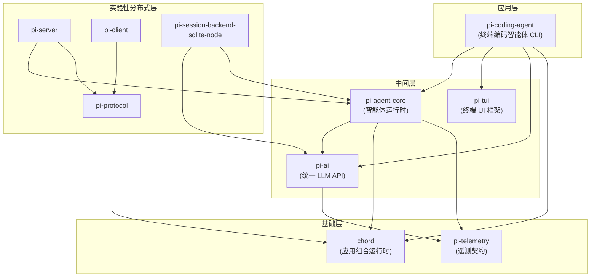

欢迎来到 Pi。这份概览面向第一次接触本仓库的开发者：你会了解 Pi 是什么、它为什么"与众不同"、整个单仓库中有哪些包、它们如何分层协作，以及如何从源码跑起来。读完本页，你就可以顺着目录继续深入任何一个子系统。

Sources: [README.md](README.md#L15-L19)

## Pi 是什么：智能体支架与自我可扩展的编码智能体

Pi 是一个**智能体支架**项目，其核心产品是一个"自我可扩展"的终端编码智能体。所谓自我可扩展，意思是智能体自身就能借助仓库里的扩展机制（Extensions、Skills、提示模板、主题）来定制自己的能力——你不需要 fork 源码、修改内部实现，就能让 Pi 适配你的工作流。

Sources: [README.md](README.md#L15-L19)

Pi 官方版图中有三个"门面"包：`@earendil-works/pi-coding-agent`（交互式编码智能体 CLI）、`@earendil-works/pi-agent-core`（带工具调用与状态管理的智能体运行时）、`@earendil-works/pi-ai`（统一多供应商 LLM API）。它们构成了从"用户敲命令"到"模型生成代码"的完整链路。

Sources: [README.md](README.md#L17-L19)

## 设计哲学：极简内核，扩展至上

Pi 非常克事：它有强大的默认配置，但**刻意不做**那些其他工具内置的功能。官方哲学章节列出了六个"No"：不做 MCP（用带 README 的 CLI 工具或扩展替代）、不做子智能体（用 tmux 或扩展实现）、不做权限弹窗（用容器或扩展）、不做计划模式（写计划到文件）、不做内置待办（用 TODO.md）、不做后台 bash（用 tmux）。这些能力都可以通过扩展机制自己构建，或安装第三方 Pi 包获得。

Sources: [packages/coding-agent/README.md](packages/coding-agent/README.md#L495-L511)

这一哲学的直接体现是：默认情况下，Pi 只给模型 **四个内置工具**——`read`、`write`、`edit` 和 `bash`，其余能力通过 Skills、提示模板、扩展或 Pi 包按需添加。内核保持最小，扩展性承担一切。

Sources: [packages/coding-agent/README.md](packages/coding-agent/README.md#L91-L91)

Pi 运行在**四种模式**下：交互式（TUI）、打印/JSON 输出（管道场景）、RPC（进程集成，基于 stdin/stdout 的 JSON 协议）、SDK（把智能体嵌入你自己的应用）。同一条命令行 `pi`，四种消费方式。

Sources: [packages/coding-agent/README.md](packages/coding-agent/README.md#L9-L19)

关于权限边界，Pi 明确声明**不内置**文件系统/进程/网络/凭据的权限限制——默认继承启动用户的权限。需要更强隔离时，官方提供三种容器化模式：Gondolin 扩展（保留宿主机认证，把工具调用路由进 Linux 微虚拟机）、Plain Docker（整个进程跑在容器里）、OpenShell（策略化沙箱）。

Sources: [README.md](README.md#L39-L47)

## 单仓库分层架构

仓库是一个 npm workspaces 单仓库，构建脚本揭示了清晰的拓扑顺序：chord → tui → telemetry → ai → agent → sqlite 后端 → protocol → client → server → coding-agent。**依赖图呈现严格的四层结构**，下层包对上层一无所知——这是理解所有包设计决策的钥匙。

Sources: [package.json](package.json#L3-L14)

下面的架构图基于各包 `package.json` 中声明的依赖关系绘制，箭头表示"依赖"：



（读图提示：chord 和 pi-telemetry 是零内部依赖的地基；pi-tui 也完全独立，谁都可以用；pi-protocol/pi-server/pi-client 构成实验性的远程会话栈。）

Sources: [packages/coding-agent/package.json](packages/coding-agent/package.json#L52-L55)

### 各包一览表

| 包名 | 定位 | 内部依赖 |
|------|------|----------|
| `@earendil-works/chord` | 插件/服务/复制状态/RPC 的应用组合运行时，可用于任何项目 | 无 |
| `@earendil-works/pi-telemetry` | 供应商无关的遥测契约与类型化 schema | 无 |
| `@earendil-works/pi-ai` | 统一多供应商 LLM API，自动认证解析与成本追踪 | pi-telemetry |
| `@earendil-works/pi-agent-core` | 智能体运行时：工具调用、事件流、状态管理 | chord、pi-ai、pi-telemetry |
| `@earendil-works/pi-tui` | 差分渲染的终端 UI 框架 | 无 |
| `@earendil-works/pi-coding-agent` | 交互式编码智能体 CLI（四个内置工具 + 会话管理） | chord、pi-agent-core、pi-ai、pi-tui |

Sources: [README.md](README.md#L26-L35)

## 核心三件套：从模型调用到终端体验

**pi-ai：统一 LLM 接口。** 它提供带集合的 provider 抽象、自动认证解析、token 与成本追踪，以及跨模型的上下文交接（mid-session handoff）。一个关键约束：该库**只收录支持工具调用**的模型，因为这是智能体工作流的硬前提。内置供应商覆盖 OpenAI、Anthropic、Google、DeepSeek、Mistral、Groq、Cerebras、Bedrock 等主流选择。

Sources: [packages/ai/README.md](packages/ai/README.md#L3-L5)

**pi-agent-core：智能体运行时。** 在 pi-ai 之上提供带状态的 Agent：工具执行、事件流订阅、状态管理。核心概念之一是 `AgentMessage` 与 LLM 消息的区分——智能体内部使用可扩展的富消息类型，而 `convertToLlm` 在每次调用前把它过滤/转换为 LLM 能理解的 `user`/`assistant`/`toolResult` 三元组。SQLite 会话后端被拆分到独立包，让核心不携带原生依赖。

Sources: [packages/agent/README.md](packages/agent/README.md#L3-L9)

**pi-tui：终端 UI 框架。** 最小化、无闪烁的 TUI 库：差分渲染只更新变化的行、CSI 2026 同步输出保证原子屏幕刷新、组件化接口（编辑器、选择列表、布局栈、Markdown 渲染等），并支持 Kitty/iTerm2 图形协议的内联图片。

Sources: [packages/tui/README.md](packages/tui/README.md#L3-L15)

**pi-coding-agent：把它们串起来。** CLI 层实现交互模式（编辑器、命令、快捷键、消息队列）、会话管理（树形分支、上下文压缩）、四种运行模式，以及完整的定制体系（提示模板、Skills、扩展、主题、Pi 包管理）。

Sources: [packages/coding-agent/README.md](packages/coding-agent/README.md#L461-L494)

## 供应商接入：订阅登录与 API Key 双轨

Pi 支持两种认证方式，这决定了模型目录的接入路径：

| 认证方式 | 支持的订阅/供应商 | 说明 |
|----------|------------------|------|
| 订阅登录 | Anthropic Claude Pro/Max、OpenAI ChatGPT Plus/Pro (Codex)、GitHub Copilot | 在交互模式中执行 `/login` 完成 OAuth |
| API Key | Anthropic、OpenAI、Azure OpenAI、DeepSeek、Google Gemini/Vertex、Amazon Bedrock、Mistral、Groq、Cerebras、NVIDIA NIM 等 | 环境变量导出后直接使用 |

每个内置供应商维护一份工具调用模型目录，配置过的目录会自动刷新，也可以用 `pi update --models` 强制刷新，再用 `/model`（或 Ctrl+L）切换。

Sources: [packages/coding-agent/README.md](packages/coding-agent/README.md#L97-L120)

## 开发者入口：源码构建与工程化护栏

如果你要改代码，先装依赖再走标准流水线。注意安装必须带 `--ignore-scripts`（供应链安全策略的一部分），模型数据刷新和测试都被拆成了独立命令：

| 命令 | 用途 |
|------|------|
| `npm install --ignore-scripts` | 安装全部依赖，不执行生命周期脚本 |
| `npm run build` | 刷新模型数据后构建所有包 |
| `npm run build:offline` | 用已有模型数据离线重建 |
| `npm run check` | Lint、格式化、类型检查与一系列依赖审计 |
| `./test.sh` | 运行测试（无 API Key 时自动跳过 LLM 相关测试） |
| `./pi-test.sh` | 从源码运行 pi（可在任意目录执行） |

Sources: [README.md](README.md#L53-L62)

仓库对 **npm 依赖视同代码变更**来审查：直接外部依赖锁定精确版本、`package-lock.json` 是唯一事实来源、发布包内置 `npm-shrinkwrap.json` 钉住传递依赖、带生命周期脚本的依赖需要显式白名单评审，CI 还会定期跑 `npm audit`。这套护栏在 AGENTS.md 中有对应的开发守则（包括锁步版本发布流程：所有包共享一个版本号，patch = 修复与新增，minor = 破坏性变更）。

Sources: [README.md](README.md#L77-L90)

## 仓库目录速览

```
pi/
├── packages/
│   ├── chord/           # 应用组合运行时（独立于 Pi 可用）
│   ├── tui/             # 终端 UI 框架（含 darwin/win32 原生模块）
│   ├── telemetry/       # 供应商无关遥测契约
│   ├── ai/              # 统一多供应商 LLM API
│   ├── agent/           # 智能体运行时（含 benchmark/）
│   ├── session-backends/ # SQLite 会话后端（sqlite-node）
│   ├── protocol/        # CBOR 帧协议（实验性）
│   ├── client/          # 传输无关客户端（实验性）
│   ├── server/          # 持久会话服务器（实验性）
│   ├── coding-agent/    # pi CLI（含 docs/、examples/）
│   └── evals/           # 基于真实会话的模型行为评测（私有包）
├── scripts/             # 构建、发布、检查脚本
├── .pi/                 # 仓库自身的扩展、提示模板与技能示例
├── .github/workflows/   # CI、发布、贡献者门禁流水线
└── AGENTS.md / CONTRIBUTING.md  # 开发守则
```

值得注意的一点：根目录的 [.pi/](.pi/extensions) 目录本身就是"自我可扩展"的活例子——仓库用它自己的扩展系统加载 `tps.ts`、`redraws.ts` 等开发辅助扩展，以及 `pr.md`、`cl.md` 等项目工作流提示模板。评测包 `pi-evals` 则用真实 `AgentSession` 在隔离临时目录里跑行为级检查，产出会话 JSONL 附件用于对比提示词、工具与模型配置。

Sources: [packages/evals/README.md](packages/evals/README.md#L3-L6)

## 推荐阅读路径

本页是入门指南的起点。对初学者，建议按"先会用、再理解、最后动手"的顺序推进：

**第一阶段——上手使用：**

1. [快速上手：安装、认证与首次运行](2-kuai-su-shang-shou-an-zhuang-ren-zheng-yu-shou-ci-yun-xing)——装好 pi，完成首次对话
2. [供应商与模型接入：订阅登录与 API Key](3-gong-ying-shang-yu-mo-xing-jie-ru-ding-yue-deng-lu-yu-api-key)——配好你的模型来源
3. [交互模式使用指南：编辑器、命令与快捷键](4-jiao-hu-mo-shi-shi-yong-zhi-nan-bian-ji-qi-ming-ling-yu-kuai-jie-jian)——熟悉 TUI 里的日常操作
4. [会话管理：树形分支、上下文压缩与导出](5-hui-hua-guan-li-shu-xing-fen-zhi-shang-xia-wen-ya-suo-yu-dao-chu)——掌握长任务的会话技能
5. [四种运行模式：交互、打印、JSON、RPC 与 SDK](6-si-chong-yun-xing-mo-shi-jiao-hu-da-yin-json-rpc-yu-sdk)——把 pi 当作可编程工具

**第二阶段——深入内核与框架：**

6. [Agent 运行时：事件流、工具调用与状态管理](7-agent-yun-xing-shi-shi-jian-liu-gong-ju-diao-yong-yu-zhuang-tai-guan-li) 与 [AgentMessage 与上下文转换管线](8-agentmessage-yu-shang-xia-wen-zhuan-huan-guan-xian-transformcontext-converttollm)——读懂 pi-agent-core
7. [pi-ai：统一多供应商 API 与跨模型切换](10-pi-ai-tong-duo-gong-ying-shang-api-yu-kua-mo-xing-qie-huan)——理解模型抽象层
8. [pi-tui：差分渲染、同步输出与主/备屏渲染器](14-pi-tui-chai-fen-xuan-ran-tong-bu-shu-chu-yu-zhu-bei-ping-xuan-ran-qi)——吃透终端渲染

**第三阶段——定制与扩展：**

9. [扩展系统：事件拦截、自定义工具与自定义 UI](19-kuo-zhan-xi-tong-shi-jian-lan-jie-zi-ding-yi-gong-ju-yu-zi-ding-yi-ui) 与 [Skills、提示模板、主题与 Pi 包](20-skills-ti-shi-mo-ban-zhu-ti-yu-pi-bao)——写出你自己的 Pi 能力
10. 实验性分布式栈（[chord](22-chord-cha-jian-fu-wu-fu-zhi-zhuang-tai-yu-zeng-liang-zhui-zong)、[pi-protocol](23-pi-protocol-cbor-zheng-bian-ma-yu-lu-you-xin-feng)、[pi-server 与 pi-client](24-pi-server-yu-pi-client-chi-jiu-hui-hua-yu-duo-fu-jian-lu-you)）以及工程化部分（[开发环境与测试工作流](27-kai-fa-huan-jing-yu-ce-shi-gong-zuo-liu-test-sh-vitest-check)、[贡献规范](29-gong-xian-gui-fan-contributing-md-yu-agents-md-kai-fa-shou-ze)）适合准备向仓库贡献代码时再读。