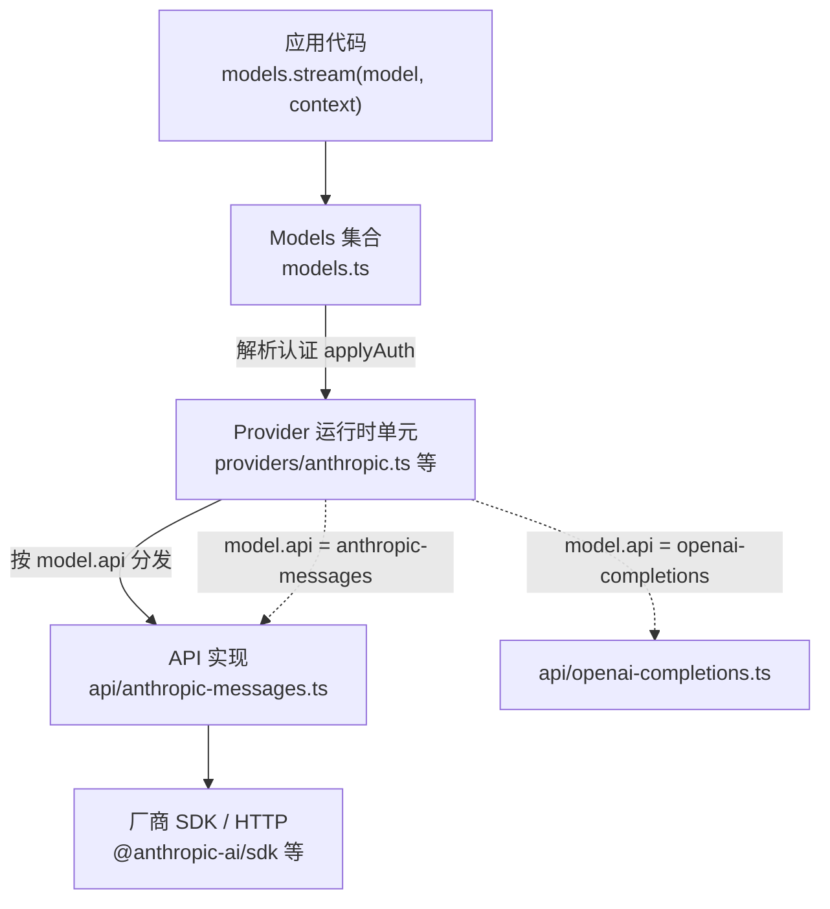
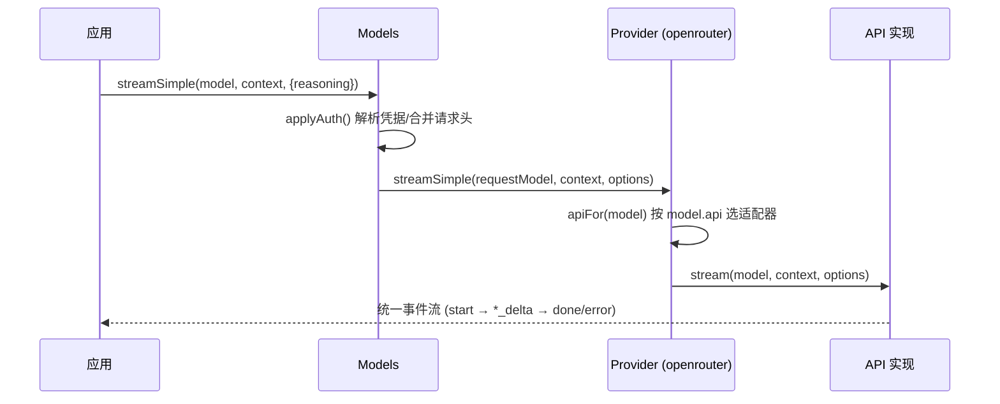
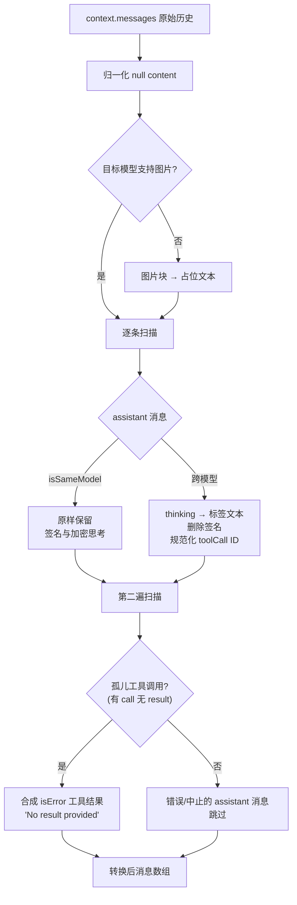

`pi-ai`（包名 `@earendil-works/pi-ai`）是整个 pi 套件的 LLM 统一接口层：它把 OpenAI、Anthropic、Google、Bedrock 等数十家供应商收敛到一套 `Context`/`Message` 数据模型、一个流式事件协议和两条 API 入口之上，并让一段对话可以在不同供应商的模型之间无损移交。本页面向中级开发者，解释它的分层架构、统一契约，以及跨模型切换背后的消息转换管线。认证细节、工具定义与模型目录生成分别在专门页面展开。

## 三层架构：Models 集合 → Provider → API 实现

理解 pi-ai 的关键是区分三个角色。**API 实现**（`src/api/*.ts`）是线协议适配器，负责把统一的 `Context` 编码为特定厂商的请求格式、把厂商的流式响应解码为统一事件；**Provider**（`src/providers/*.ts`）是运行时单元，持有模型目录、认证逻辑和流行为；**Models 集合**（`src/models.ts`）是用户面对的门面，负责解析认证并把每个请求路由给拥有该模型的 Provider。三者单向依赖：Models 持有 Provider，Provider 引用 API 实现，API 实现不感知任何上游。

Sources: [models.ts](packages/ai/src/models.ts#L97-L156)、[README.md](packages/ai/README.md#L148-L158)

`Provider` 接口的契约非常紧凑：`id`/`name`/`baseUrl` 元数据、一个必需的 `auth` 块、同步的 `getModels()`，以及 `stream()`/`streamSimple()` 两个流入口（可选的 `refreshModels()` 支持动态模型列表，`fetchDeferred`/`cancelDeferred` 支持异步延迟响应）。`Models` 集合在此基础上提供 `getModel()`、`refresh()`、`getAuth()`、`login()`/`logout()` 和四个请求方法，其实现类 `ModelsImpl` 用一个 `Map<string, Provider>` 存储注册的供应商。

Sources: [models.ts](packages/ai/src/models.ts#L97-L228)、[models.ts](packages/ai/src/models.ts#L259-L289)

## 十种线协议适配器

`KnownApi` 枚举了内置支持的十种线协议，每种对应 `src/api/` 下的一个实现模块。大多数供应商共享少数几个适配器——这是 pi-ai 能以有限代码覆盖数十家供应商的原因；`pi-messages` 是个例外，它定义了 pi 自己的后端线协议，供 Radius 网关或任何自建后端复用。

| KnownApi | 协议形态 | 典型使用者 |
|---|---|---|
| `anthropic-messages` | Anthropic Messages | Anthropic、GitHub Copilot（Anthropic 通道）、Kimi For Coding、Fireworks |
| `openai-completions` | Chat Completions | xAI、Groq、Cerebras、OpenRouter、DeepSeek、Moonshot、Together 等 |
| `openai-responses` | Responses | OpenAI |
| `azure-openai-responses` | Responses（Azure 变体） | Azure OpenAI |
| `openai-codex-responses` | Responses（Codex 订阅） | OpenAI Codex（ChatGPT 订阅） |
| `google-generative-ai` | Gemini API | Google |
| `google-vertex` | Vertex AI | Vertex AI（Gemini） |
| `bedrock-converse-stream` | Converse Stream | Amazon Bedrock |
| `mistral-conversations` | Mistral Conversations | Mistral |
| `pi-messages` | pi 自有 POST + SSE 协议 | Radius 网关 / 自建后端 |

Sources: [types.ts](packages/ai/src/types.ts#L17-L29)、[pi-messages.ts](packages/ai/src/api/pi-messages.ts#L1-L7)、[README.md](packages/ai/README.md#L148-L158)

所有 API 实现模块导出统一的 `ProviderStreams` 形状——`stream(model, context, options)` 与 `streamSimple(model, context, options)`，都返回 `AssistantMessageEventStream`。这个"每模块同形"的约定使得适配器可以被当作值传递，也是后面懒加载分发的基础。

Sources: [types.ts](packages/ai/src/types.ts#L264-L281)

## 统一上下文：一切皆可序列化的纯数据

pi-ai 的第一个统一层是数据模型。一次对话被表示为 `Context = { systemPrompt?, messages, tools? }`，其中 `messages` 是三种角色的联合：`UserMessage`（文本或文本/图片块数组）、`AssistantMessage`（文本、thinking、工具调用块的数组，附带 `usage`、`stopReason`、产生它的 `api`/`provider`/`model` 溯源信息）和 `ToolResultMessage`。没有任何回调、类实例或厂商专属结构——`JSON.stringify(context)` 即可持久化整段对话，模型本身也是纯数据，所以"这段对话用的是哪个模型"同样可以序列化。

Sources: [types.ts](packages/ai/src/types.ts#L422-L470)、[types.ts](packages/ai/src/types.ts#L524-L528)、[README.md](packages/ai/README.md#L1372-L1391)

`AssistantMessage` 中与跨模型切换直接相关的字段值得逐个留意：`api` 与 `provider` 记录消息的出身，转换管线据此判断"这条消息是否来自目标模型"；`thinkingSignature` 承载厂商专有的推理重放凭据（如 Anthropic 的签名、OpenAI 的加密推理），离开原模型后必须被剥离；`stopReason` 区分正常结束、长度截断、工具调用、错误、中止与延迟六种情形。内容块层面，`TextContent`、`ThinkingContent`（含 `redacted` 标记）与 `ToolCall`（含 Google 特有的 `thoughtSignature`）构成完整的助手输出词汇表。

Sources: [types.ts](packages/ai/src/types.ts#L351-L406)、[types.ts](packages/ai/src/types.ts#L428-L450)

`Model<Api>` 同样是纯数据：`id`、`api`、`provider`、上下文窗口、最大输出、输入模态（`input: ("text" | "image")[]`）、定价 `cost`，以及一个可选的 `thinkingLevelMap`（把 pi 的思考强度映射到厂商专有值）和 `compat` 块（OpenAI 兼容服务器的行为开关）。模型目录由生成脚本从 models.dev 等来源产出，这部分机制在[模型目录：生成脚本与自动刷新机制](13-mo-xing-mu-lu-sheng-cheng-jiao-ben-yu-zi-dong-shua-xin-ji-zhi)专门展开。

Sources: [types.ts](packages/ai/src/types.ts#L843-L872)、[model-catalog.ts](packages/ai/src/model-catalog.ts#L14-L28)

## 流式事件协议：AssistantMessageEventStream

第二个统一层是事件协议。所有供应商的流都收敛为同一个 `AssistantMessageEvent` 联合类型：`start` 打头，随后是文本、思考、工具调用三类块各自的 `*_start`/`*_delta`/`*_end` 序列（事件携带 `contentIndex` 与不断增长的 `partial` 快照），最终以 `done`（携带终态 `AssistantMessage`）或 `error` 收束。无论底层是 Anthropic SSE、Google SDK 事件还是 WebSocket，消费方代码完全一致。

Sources: [types.ts](packages/ai/src/types.ts#L530-L562)

实现上，`EventStream<T, R>` 是一个通用的异步可迭代队列：`push()` 投递事件、`end()` 封口，`result()` 返回一个在终结事件出现时兑现的 `Promise<R>`。`AssistantMessageEventStream` 把 `R` 特化为 `AssistantMessage`，因此 `await s.result()` 总能拿到终态消息——即便流以错误收场，`result()` 也会交付一个 `stopReason === "error"` 的消息。这正是 pi-ai 的错误处理哲学：**流一旦返回，后续的请求失败不抛异常，而是编码进事件流**。

Sources: [event-stream.ts](packages/ai/src/utils/event-stream.ts#L3-L61)、[types.ts](packages/ai/src/types.ts#L530-L545)、[README.md](packages/ai/README.md#L893-L913)

## 双入口设计：类型化 stream 与统一 streamSimple

pi-ai 对外暴露两套平行的入口，对应两种使用姿态。`models.stream()/complete()` 接收该模型所属 API 的**完整原生选项集**（如 Anthropic 的 `thinkingBudgetTokens`、OpenAI 的 `reasoningEffort`），配合 `hasApi()` 类型守卫可以获得精确的类型收窄；`models.streamSimple()/completeSimple()` 则接收**供应商无关**的统一选项——最核心的是 `reasoning?: ThinkingLevel`，取值为 `minimal | low | medium | high | xhigh | max`。

| 维度 | `stream` / `complete` | `streamSimple` / `completeSimple` |
|---|---|---|
| 选项类型 | `ApiStreamOptions<TApi>`（每 API 专属） | `SimpleStreamOptions`（统一子集） |
| 思考控制 | 厂商原生字段 | `reasoning: ThinkingLevel` 六级 |
| 类型收窄 | 配合 `hasApi()` 使用 | 无需，`Model<Api>` 即可 |
| 典型场景 | 深度调优单一厂商 | 同一调用点切换任意模型 |

Sources: [types.ts](packages/ai/src/types.ts#L313-L322)、[models.ts](packages/ai/src/models.ts#L203-L228)、[models.ts](packages/ai/src/models.ts#L887-L889)

`streamSimple` 的价值在于把"思考强度"这个各厂商表达迥异的概念归一化。以 Anthropic 为例，其 `streamSimple` 实现把 `reasoning` 映射为两条路径：支持自适应思考的模型映射为 `effort` 等级，传统模型则通过 `adjustMaxTokensForThinking` 换算出 `thinkingBudgetTokens` 并预留至少 1024 个 token 给正文；不传 `reasoning` 则显式关闭思考。模型目录中的 `thinkingLevelMap` 允许逐模型覆写各级别的厂商值，`getSupportedThinkingLevels()`/`clampThinkingLevel()` 提供运行时的支持级别查询与降级钳制（`xhigh`/`max` 是仅部分模型开放的选择性级别）。

Sources: [anthropic-messages.ts](packages/ai/src/api/anthropic-messages.ts#L849-L895)、[models.ts](packages/ai/src/models.ts#L913-L945)、[api/simple-options.ts](packages/ai/src/api/simple-options.ts#L57-L69)

## Provider 工厂与混合 API 分发

每个内置 Provider 由 `src/providers/<id>.ts` 中的一个工厂函数构建，全部经由 `createProvider()` 汇装。以 Anthropic 为例：工厂声明 `id: "anthropic"`、基础 URL、由生成目录展开的静态模型列表、API key 认证（从存储凭据到 `ANTHROPIC_AUTH_TOKEN_ENV`/`ANTHROPIC_API_KEY_ENV` 环境变量的解析链），以及懒加载的 OAuth 流程。

Sources: [providers/anthropic.ts](packages/ai/src/providers/anthropic.ts#L40-L60)

`createProvider()` 有一个精巧的设计点：`api` 字段既可以是单个 `ProviderStreams` 实现，也可以是**按 `model.api` 索引的映射表**。后者服务混合 API 供应商——OpenRouter 同时挂载了 `anthropic-messages` 和 `openai-completions` 两个适配器，请求时按模型声明的 `api` 字段分发；映射中缺失的 API 会产生一个描述性的流错误而非崩溃。这层分发逻辑（`apiFor` + `dispatch`）是 Provider 内部唯一的路由复杂度所在。

Sources: [models.ts](packages/ai/src/models.ts#L775-L845)、[providers/openrouter.ts](packages/ai/src/providers/openrouter.ts#L9-L28)

按需注册与全量注册由两个入口承担：`createModels()` 创建空集合后逐个 `setProvider()`；`builtinModels()`（位于子路径导出 `providers/all`）一次注册全部内置供应商。前者配合打包器的代码拆分可以把 SDK 留在懒加载分块里，是控制包体积的正道。

Sources: [models.ts](packages/ai/src/models.ts#L748-L750)、[providers/all.ts](packages/ai/src/providers/all.ts#L89-L141)

## 跨模型切换：transformMessages 管线

现在来到本页的核心问题：**为什么同一段 `Context` 可以在不同厂商的模型之间无缝移交？** 答案位于 `src/api/transform-messages.ts` 的 `transformMessages()` 函数——每个 API 实现在构建请求前都会先经过它。它在两个维度上工作：跨供应商（把 A 家的消息翻译成 B 家能接受的形态）与跨请求健壮性（修复任何历史消息中的结构缺陷）。

转换的判定基准是 `isSameModel`：一条助手消息只有在 `provider`、`api`、`model.id` 三者与目标模型全等时才被视为"同源"。同源消息保持原样（签名、加密推理等重放凭据原封不动）；异源消息则按一套明确的降级规则处理。对用户与工具结果消息不做事——它们的形态本就是供应商中立的。

| 消息块 | 同模型（isSameModel） | 跨模型 |
|---|---|---|
| `text` | 保留（含 `textSignature`） | 剥离签名，保留纯文本 |
| `thinking`（有签名/重放凭据） | 保留，供多轮重放 | 转为 `<thinking>` 标签包裹的普通文本 |
| `thinking`（`redacted` 加密块） | 保留 | **整体丢弃**（加密载荷只对原模型有效） |
| `thinking`（空文本） | 保留带签名的空块 | 跳过 |
| `toolCall`（`thoughtSignature`） | 保留 | 删除 Google 特有签名 |
| `toolCall`（ID 格式） | 保留原 ID | 经 `normalizeToolCallId` 规范化并同步改写对应 toolResult |
| 图片块（目标非视觉模型） | 保留 | 替换为 `(image omitted…)` 占位文本 |

Sources: [transform-messages.ts](packages/ai/src/api/transform-messages.ts#L64-L160)、[README.md](packages/ai/README.md#L1330-L1346)

工具调用 ID 规范化是最容易被低估的一条规则：OpenAI Responses API 生成的工具调用 ID 长达 450+ 字符且含 `|` 等特殊字符，而 Anthropic 要求 ID 匹配 `^[a-zA-Z0-9_-]+$` 且不超过 64 字符。管线第一遍扫描时为每个被改写的 ID 建立 `原始 ID → 规范 ID` 映射，第二遍据此同步修正对应的 `toolResult.toolCallId`——两处不同步会直接导致 API 拒绝请求。

Sources: [transform-messages.ts](packages/ai/src/api/transform-messages.ts#L164-L223)

第二遍扫描还处理两类防御性修复。其一，**孤儿工具调用**：如果历史中存在没有对应工具结果的 `toolCall`（例如会话被中断），管线合成一个 `isError: true`、内容为 "No result provided" 的工具结果——这既满足各家 API 的消息配对要求，又保留了思考签名。其二，**跳过错误与中止的助手消息**：这些残缺轮次的重放会触发上游报错（如 OpenAI 的 "reasoning without following item"），从最后一个有效状态重试才是正确语义。

Sources: [transform-messages.ts](packages/ai/src/api/transform-messages.ts#L178-L223)

这套规则不是拍脑袋的产物：`test/cross-provider-handoff.test.ts` 实现了一个N×N 交叉验证——为每个供应商/模型对生成含思考块、工具调用与工具结果的真实上下文，再把所有其他上下文拼接喂给目标模型，任何兼容性缺陷（工具 ID 格式、思考块转换、消息格式）都会在测试中暴露。

Sources: [cross-provider-handoff.test.ts](packages/ai/test/cross-provider-handoff.test.ts#L1-L23)

值得一提的是跨模型切换的成本侧收益：因为 `Context` 中的消息自带 `provider`/`api`/`model` 溯源，同一个集合里 Claude 与 GPT-5 交替出现时无需任何额外的适配代码——调用方只是换一个 `Model` 对象再调 `streamSimple()`。pi 编码智能体正是靠这个能力在会话中即时切换模型，相关交互层面的内容见[Agent 运行时：事件流、工具调用与状态管理](7-agent-yun-xing-shi-jian-liu-gong-ju-diao-yong-yu-zhuang-tai-guan-li)。

Sources: [README.md](packages/ai/README.md#L1330-L1370)

## 请求装配与认证挂载点

`Models` 层在分发请求前做一次 `applyAuth()`：先解析供应商认证（显式传入的 `apiKey` 永远优先，其次存储凭据、OAuth 令牌、环境变量），然后按固定顺序合并请求头——`provider auth headers → model.headers → 显式 options.headers → transformHeaders 回调`——最后把认证得到的 `baseUrl` 覆盖进请求模型。若供应商未配置，这里直接抛出 `ModelsError`；配置了但 OAuth 刷新失败也在此层报错。完整的凭据解析链、OAuth 流程与 `auth.json` 存储格式在[认证解析、OAuth 与凭据存储](12-ren-zheng-jie-xi-oauth-yu-ping-ju-cun-chu)详解。

Sources: [models.ts](packages/ai/src/models.ts#L641-L670)、[README.md](packages/ai/README.md#L342-L365)

## 用量统计与成本核算

每次请求产出的 `Usage` 包含 `input`/`output`/`cacheRead`/`cacheWrite` 四类 token 计数（Anthropic 额外拆分 1 小时保留期的 `cacheWrite1h`，可选项 `reasoning` 记录思考 token 子集）以及逐项的 `cost`。成本由 `calculateCost()` 在流式过程中增量计算：模型定价支持按输入 token 量分层的费率表（`cost.tiers`，超过阈值整体切换档位），缓存写入则区分短保留与 1 小时保留（后者按两倍输入价计费）。这使上层应用无需理解任何一家供应商的计费细节即可展示真实开销。

Sources: [types.ts](packages/ai/src/types.ts#L383-L404)、[models.ts](packages/ai/src/models.ts#L891-L911)、[anthropic-messages.ts](packages/ai/src/api/anthropic-messages.ts#L606-L616)

## 懒加载与打包策略

pi-ai 的包体积策略建立在三层惰性之上。第一层是模块边界：核心入口 `@earendil-works/pi-ai` 无副作用、不导入任何目录或 SDK；每个供应商经由 `@earendil-works/pi-ai/providers/<id>` 子路径单独引入；API 实现可经 `@earendil-works/pi-ai/api/<api-id>` 直接引入。第二层是 `lazyApi()` 包装器——工厂注册的不是实现本身，而是一个动态 `import()` 的包装，SDK 只在首次请求该 API 的模型时才被加载，加载失败转化为流上的错误事件。第三层是 `lazyStream()`：它同步返回流对象，把认证解析、模块加载等异步 setup 藏在流后面，setup 失败同样以 `error` 事件收场，而非让调用方处理同步异常。

Sources: [index.ts](packages/ai/src/index.ts#L1-L8)、[package.json](packages/ai/package.json#L1-L30)、[lazy.ts](packages/ai/src/api/lazy.ts#L47-L99)

这套设计对消费者意味着清晰的决策树：只用于家就注册 `openaiProvider()`；要全部内置供应商就 `builtinModels()`；希望在构建期就加载实现则直接 import 对应的 `api/<id>` 模块。README 中对打包行为（代码拆分下 SDK 留在懒分块、Bedrock 的 AWS SDK 通过打包器不透明导入强制运行时加载等）有完整的行为说明。

Sources: [README.md](packages/ai/README.md#L1418-L1452)、[providers/all.ts](packages/ai/src/providers/all.ts#L89-L141)

## 兼容层与演进状态

`src/compat.ts` 保留了旧版全局 API 面——无需构建 `Models` 集合、直接按 API 分发调用的 `stream()`/`complete()` 与目录读取函数——供存量应用把 import 从 `@earendil-works/pi-ai` 换成 `@earendil-works/pi-ai/compat` 即可继续运行。模块头注释明确标注：该层将随 coding-agent 的 ModelManager 迁移完成而删除，新代码一律使用 `createModels()` + Provider 工厂。这解释了为什么新代码应当避免 `compat` 子路径——它会把整个内置目录面拉进 bundle。

Sources: [compat.ts](packages/ai/src/compat.ts#L1-L11)、[README.md](packages/ai/README.md#L1454-L1456)

## 小结与阅读路线

pi-ai 的架构可以压缩成三句话：**数据统一**（`Context`/`Message`/`Model` 全部是可序列化纯数据）、**协议统一**（十个线协议适配器收敛到同一个事件流形状）、**切换统一**（`transformMessages` 让任何历史上下文在任何目标模型上重放）。掌握了这三点，就掌握了 pi 生态所有上层——agent 运行时、TUI、编码智能体——与模型世界交互的方式。

建议的后续阅读按依赖顺序展开：先看[工具定义、流式工具调用与参数校验](11-gong-ju-ding-yi-liu-shi-gong-ju-diao-yong-yu-can-shu-xiao-yan)了解 `Tool` 的 TypeBox 模式与流式参数校验如何架在本页的 `toolcall_*` 事件之上；再读[认证解析、OAuth 与凭据存储](12-ren-zheng-jie-xi-oauth-yu-ping-ju-cun-chu)与[模型目录：生成脚本与自动刷新机制](13-mo-xing-mu-lu-sheng-cheng-ji-zhi)（[目录页](13-mo-xing-mu-lu-sheng-cheng-jiao-ben-yu-zi-dong-shua-xin-ji-zhi)）补全 Provider 的两大支撑面；最后进入[AgentMessage 与上下文转换管线](8-agentmessage-yu-shang-xia-wen-zhuan-huan-guan-xian-transformcontext-converttollm)，看 agent 内核如何在本页接口之上再做一层上下文整形。若想理解这套接口在终端产品中的完整应用，[AgentSession 与 SDK：将智能体嵌入自有应用](16-agentsession-yu-sdk-jiang-zhi-neng-ti-qian-ru-zi-you-ying-yong)是自然的下一步。