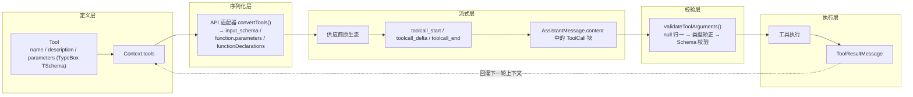
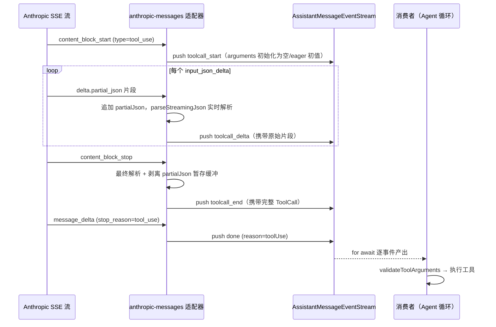
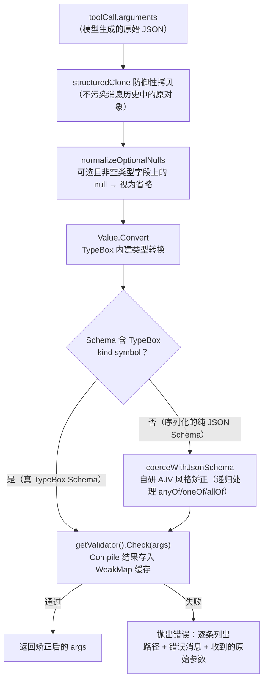

在 pi 的分层架构中，`pi-ai`（`packages/ai`）承担"LLM 统一接口"的职责：把几十家供应商、近十种 API 协议（Anthropic Messages、OpenAI Completions/Responses、Google Generative AI、Bedrock Converse 等）收敛为一套中立契约。工具（Tool）是这套契约中最核心的横切面——工具如何定义、工具调用如何以流式事件形式抵达、以及模型的参数输出如何被矫正与校验，三者共同构成了从"模型意图"到"本地执行"的完整通路。本页聚焦这三件事在 `packages/ai` 中的实现；Agent 侧如何调度执行见 [Agent 运行时：事件流、工具调用与状态管理](7-agent-yun-xing-shi-jian-liu-gong-ju-diao-yong-yu-zhuang-tai-guan-li)。

Sources: [index.ts](packages/ai/src/index.ts#L1-L48)

## 设计总览：一条工具调用的生命周期

从第一性原理看，一次工具调用要跨越五个抽象层：**定义层**（`Tool` 接口与 TypeBox Schema）→ **序列化层**（各 API 适配器把中立 Schema 翻译为供应商格式）→ **流式层**（供应商增量流被归一化为 `toolcall_start/delta/end` 事件）→ **校验层**（`validateToolArguments` 把不可信的模型输出矫正为可执行参数）→ **执行层**（工具函数运行并产出 `ToolResultMessage` 回灌上下文）。每一层只依赖相邻层的契约，这使得新增供应商只需实现归一化逻辑，而工具作者始终只面对一个 TypeScript Schema。



Sources: [types.ts](packages/ai/src/types.ts#L517-L528), [types.ts](packages/ai/src/types.ts#L373-L381), [types.ts](packages/ai/src/types.ts#L452-L468)

校验层是这条通路的**安全闸门**：模型生成的 `arguments` 本质是不可信输入——字段可能缺失、类型可能漂移（如把数字序列化成字符串）、可选字段可能带着 `null`。`validateToolArguments` 在工具执行前统一处理这些问题，矫正失败则抛出带路径定位的错误。值得注意的是，pi 把"流式增量解析"与"最终校验"严格分开：前者追求**永不中断**（半成品 JSON 也要能解析出可用的部分对象），后者追求**严格性**（不匹配即失败并给出可诊断信息）。

Sources: [validation.ts](packages/ai/src/utils/validation.ts#L295-L350), [json-parse.ts](packages/ai/src/utils/json-parse.ts#L97-L124)

## 工具定义：Tool 接口与 TypeBox Schema

工具的中立契约只有四个字段：`name`、`description`、`parameters`（一个 TypeBox `TSchema`）以及可选的 `constrainedSampling` 配置。`Context.tools` 携带工具数组随请求发送，`toolChoice`（`"auto" | "none"`）控制模型是否强制调用。TypeBox 的选择是刻意为之——Schema 既是**运行时校验器**（可编译为校验函数），又是**序列化目标**（可原样作为 JSON Schema 发给供应商），还支持 `Static<typeof schema>` 导出静态类型，一份定义三处复用。

Sources: [types.ts](packages/ai/src/types.ts#L517-L522), [types.ts](packages/ai/src/types.ts#L524-L528), [types.ts](packages/ai/src/types.ts#L82-L82)

`pi-ai` 的入口直接再导出 TypeBox 的 `Type`、`TSchema` 与 `Static`，工具作者无需显式依赖 TypeBox 即可定义参数；针对 Google 等**不支持 `anyOf`/`const` 组合**的 API，`StringEnum` 辅助函数把字符串枚举降级为 `{ type: "string", enum: [...] }` 形式，保证 Schema 的最大兼容性。

```ts
const OperationSchema = StringEnum(["add", "subtract", "multiply"], {
  description: "The operation to perform",
});
```

Sources: [index.ts](packages/ai/src/index.ts#L1-L2), [typebox-helpers.ts](packages/ai/src/utils/typebox-helpers.ts#L14-L24)

### 约束采样：strict JSON Schema 与语法文法

`constrainedSampling` 字段把"参数 Schema"从**提示性描述**升级为**采样期硬约束**，支持两种形态：`json_schema`（对应各家的 structured output / strict 模式，`strict: "prefer" | "require"` 表达期望强度）与 `grammar`（OpenAI custom tools 的 Lark/regex 文法，见 `GrammarFormat`）。是否真正启用取决于模型的兼容性开关：`OpenAICompletionsCompat.supportsStrictMode` 与 `supportsOpenAIGrammarTools` 由生成的模型目录逐模型声明，不支持的供应商自动回退为普通 function tool。

Sources: [types.ts](packages/ai/src/types.ts#L496-L515), [types.ts](packages/ai/src/types.ts#L622-L625)

strict 化由 `makeStrictJsonSchema` 完成，其规则直接对应 OpenAI strict 模式的限制：拒绝 `$ref`/`allOf`/`patternProperties` 等不支持的关键字；把所有属性强制加入 `required`；`additionalProperties` 置为 `false`；对可选属性，若其 Schema 不允许 null，则自动包装为 `anyOf: [原属性, { type: "null" }]`——这样"模型不提供可选字段"仍能通过校验。文法工具（grammar）则要求参数 Schema **恰好只有一个必填字符串属性**，因为流式增量会以该属性为载体被逐步包裹成 JSON。

Sources: [constrained-sampling.ts](packages/ai/src/api/constrained-sampling.ts#L12-L29), [constrained-sampling.ts](packages/ai/src/api/constrained-sampling.ts#L53-L127), [constrained-sampling.ts](packages/ai/src/api/constrained-sampling.ts#L189-L200)

### 跨供应商序列化对照

各适配器的 `convertTools` 展示了同一份中立 Schema 如何映射到不同协议（下表均已在源码验证）：

| 适配器 | 序列化目标 | 附加能力 |
| --- | --- | --- |
| `anthropic-messages` | `tools[].input_schema`（`type/properties/required` 骨架） | `eager_input_streaming`（入参边流边出）、`defer_loading`（延迟加载）、最后一个工具挂 `cache_control`、OAuth 模式下工具名规范化 |
| `openai-completions` | `tools[].function.parameters` | 可选 `strict` 字段、grammar 工具转为 `type: "custom"`、z.ai 专属 `tool_stream: true` |
| `openai-responses` | `function` tool + `strict` | grammar 与 strict 同样经 `resolveJsonSchemaStrictSampling` 解析 |

Sources: [anthropic-messages.ts](packages/ai/src/api/anthropic-messages.ts#L1424-L1461), [openai-completions.ts](packages/ai/src/api/openai-completions.ts#L1470-L1505), [openai-completions.ts](packages/ai/src/api/openai-completions.ts#L838-L849), [openai-responses-shared.ts](packages/ai/src/api/openai-responses-shared.ts#L360-L392)

其中 `eager_input_streaming` 是 Anthropic 家族的关键细节：开启后模型会在工具调用的同时**提前流式输出入参 JSON**，`AnthropicMessagesCompat.supportsEagerToolInputStreaming` 允许兼容代理关闭它（关闭时回退发送 `fine-grained-tool-streaming-2025-05-14` beta 头）。另一个横切机制是**延迟工具加载**：`splitDeferredTools` 扫描会话中 `toolResult.addedToolNames`，把"结果后才变得可用"的工具从首轮请求中拆出，避免把全部工具定义都压进每个请求——这对上下文成本与提示缓存命中率都有直接影响。

Sources: [types.ts](packages/ai/src/types.ts#L667-L677), [deferred-tools.ts](packages/ai/src/utils/deferred-tools.ts#L7-L39)

## 流式事件协议：AssistantMessageEventStream

所有适配器统一返回 `AssistantMessageEventStream`，这是一个泛型 `EventStream` 的特化：生产者通过 `push()` 投递事件、`end()` 收尾；消费者既可用 `for await` 异步迭代，也可通过 `result()` 直接等待最终 `AssistantMessage`。`EventStream` 内部用队列 + 等待者列表实现了"背压无关"的投递——事件到达时若有等待中的消费者则立即交付，否则入队，这保证了流式消费不丢事件也不会阻塞生产者。

Sources: [event-stream.ts](packages/ai/src/utils/event-stream.ts#L4-L67), [event-stream.ts](packages/ai/src/utils/event-stream.ts#L69-L88)

事件类型目录如下（与源码中的联合类型一一对应）：

| 事件 | 关键载荷 | 语义 |
| --- | --- | --- |
| `start` | `partial` | 流正式开始，此后才允许出现更新与结束事件 |
| `text_start / text_delta / text_end` | `contentIndex`、`delta`、`content` | 文本块的生命周期，`*_end` 携带权威全文 |
| `thinking_start / thinking_delta / thinking_end` | 同上 | 思考块；被安全过滤的部分在 start 时即完整、无 delta |
| `toolcall_start` | `contentIndex` | 新工具调用块出现；**此块上的 `arguments` 是否已有内容取决于供应商** |
| `toolcall_delta` | `delta`（JSON 片段字符串） | 工具入参 JSON 的增量更新 |
| `toolcall_end` | `toolCall`（完整 ToolCall） | 权威收尾，附带解析完成的参数对象 |
| `done` | `reason`（`stop/length/toolUse/deferred`）、`message` | 成功终止，`reason: "toolUse"` 表示回合以工具调用结束 |
| `error` | `reason`（`aborted/error`）、`error` | 失败终止 |

Sources: [types.ts](packages/ai/src/types.ts#L546-L562), [types.ts](packages/ai/src/types.ts#L406-L406)

协议注释中写明的几条**不变式**值得强调：`partial` 是对同一份"进行中响应"的**活跃引用**而非事件时刻快照，文本/思考块在 `*_start` 时为空、仅靠 `*_delta` 生长；工具调用块在 `toolcall_start` 时的参数内容是供应商特定的（Anthropic eager streaming 可能已带初值，Google 则是空对象），后续 JSON 统一通过 `toolcall_delta` 传递。这意味着消费者若在 `toolcall_start` 与 `toolcall_end` 之间读取 `partial.content[index].arguments`，拿到的是"持续变化的半成品"。

Sources: [types.ts](packages/ai/src/types.ts#L530-L545)

下图描述了以 Anthropic 为例的流式工具调用全流程（消费者侧即 Agent 循环的订阅点）：



Sources: [anthropic-messages.ts](packages/ai/src/api/anthropic-messages.ts#L651-L664), [anthropic-messages.ts](packages/ai/src/api/anthropic-messages.ts#L690-L702), [anthropic-messages.ts](packages/ai/src/api/anthropic-messages.ts#L730-L741), [anthropic-messages.ts](packages/ai/src/api/anthropic-messages.ts#L1472-L1473)

## 适配器实现：流式工具调用的归一化对照

各供应商流式协议差异极大，适配器的职责就是把它们全部"压平"为上述事件协议。下表总结已验证的实现模式：

| 适配器 | 增量定位方式 | 暂存缓冲 | 收尾触发 | 特殊处理 |
| --- | --- | --- | --- | --- |
| Anthropic | `event.index` 匹配内容块 | 块内 `partialJson` | `content_block_stop` | eager 入参流式；OAuth 工具名映射 |
| OpenAI Completions | `tool_call.index`（辅以 `id` 兜底） | 块内 `partialArgs` | 流结束统一 `finishBlock` | `finish_reason` 可能缺失需推断；grammar 工具入参走 `custom.input` 通道 |
| OpenAI Responses | `output_index` 槽位 | 块内 `partialJson` | `output_item.done` | `*.done` 事件携带权威全量参数，做单调前缀校验后补发差额 delta |
| Google | 非 function 独立流 | 无（一次性到达） | 到达即收尾 | 缺失/重复 id 时合成 `${name}_${Date.now()}_n`；`thoughtSignature` 透传 |

Sources: [anthropic-messages.ts](packages/ai/src/api/anthropic-messages.ts#L651-L741), [openai-completions.ts](packages/ai/src/api/openai-completions.ts#L490-L547), [openai-completions.ts](packages/ai/src/api/openai-completions.ts#L443-L468), [openai-responses-shared.ts](packages/ai/src/api/openai-responses-shared.ts#L653-L669), [openai-responses-shared.ts](packages/ai/src/api/openai-responses-shared.ts#L709-L725), [google-generative-ai.ts](packages/ai/src/api/google-generative-ai.ts#L187-L211)

两个细节体现了适配器层的**防御性设计**。其一，OpenAI Completions 的 `ensureToolCallBlock` 同时维护按 `index` 与按 `id` 的两张索引表，并把"模型编造了未知工具"的情况也纳入处理——块仍会创建，入参至少有处可放。其二，OpenAI Responses 的 `function_call_arguments.done` 事件中，适配器会检查权威全量参数是否以先前累积的 `partialJson` 为前缀：是则只补发差额 delta（保证 `toolcall_delta` 序列单调且无缝），并把权威值整体替换后再解析。

Sources: [openai-completions.ts](packages/ai/src/api/openai-completions.ts#L490-L547), [openai-responses-shared.ts](packages/ai/src/api/openai-responses-shared.ts#L659-L669)

### 半成品 JSON 解析：parseStreamingJson 的三级降级

流式增量本身**不是合法 JSON**——`{"path": "/tmp/x", "offset": 12` 可能永远差一个右括号。`parseStreamingJson` 用三级降级策略保证任何时刻都能返回可用对象：先尝试标准 `JSON.parse`（走 `parseJsonWithRepair`，失败时用 `repairJson` 修复裸控制字符与非法转义再解析）；仍失败则用 `partial-json` 库解析半成品；再失败则对修复后的字符串做最后一次 partial 解析；全部失败才返回空对象 `{}`。这套策略配合 `repairJson` 的逐字符状态机（区分字符串内外、校验 `\uXXXX` 转义），让"模型输出中嵌着真实换行符"这类真实世界的脏数据也能被解析。

Sources: [json-parse.ts](packages/ai/src/utils/json-parse.ts#L104-L124), [json-parse.ts](packages/ai/src/utils/json-parse.ts#L32-L95)

收尾阶段的处理同样讲究：Anthropic 与 OpenAI 两个适配器在 `toolcall_end` 前都会**就地剥离 `partialJson`/`partialArgs` 暂存缓冲**，只保留解析后的 `arguments`——注释明确说明这是为了"replay 时只携带已解析的参数"，即助手消息被序列化回会话历史（JSONL）时不带实现细节的临时字段。

Sources: [anthropic-messages.ts](packages/ai/src/api/anthropic-messages.ts#L730-L741), [openai-completions.ts](packages/ai/src/api/openai-completions.ts#L455-L467)

## 参数校验管线：validateToolArguments

校验是工具调用的最后一道闸门，其完整管线如下：



Sources: [validation.ts](packages/ai/src/utils/validation.ts#L317-L350)

管线中有三个值得拆解的设计决策。**第一，类型 symbol 区分两条矫正路径**：TypeBox Schema 对象上带有 `TypeBox.Kind` symbol，此时 `Value.Convert` 的内建转换已足够，跳过自研矫正；而工具定义若经 JSON 序列化传播（例如从服务端下发、或扩展系统跨进程传递），symbol 丢失，则启用 `coerceWithJsonSchema` 的手写矫正器。测试中"Function 构造器被禁用（CSP 环境）时仍能完成校验"与"序列化纯 JSON Schema 的 AJV 兼容矫正"两个用例正是针对这条路径的回归保障。

Sources: [validation.ts](packages/ai/src/utils/validation.ts#L321-L335), [validation.test.ts](packages/ai/test/validation.test.ts#L37-L105)

**第二，null 的语义归一**：`normalizeOptionalNulls` 递归遍历参数树，把"可选且非可空"字段上的 `null` 直接删除（视为省略），但保留可空联合类型（`Type.Union([Type.String(), Type.Null()])`）中的合法 null，也跳过 `$ref` 引用。这消除了模型最常见的输出毛病之一——给可选参数填 `null` 而非省略，同时不破坏"显式传 null"的合法语义。测试用例分别覆盖了删除、保留、oneOf/anyOf 可空分支等情形。

Sources: [validation.ts](packages/ai/src/utils/validation.ts#L240-L269), [validation.test.ts](packages/ai/test/validation.test.ts#L101-L193)

**第三，矫正规则按目标类型逐条降级**（自研路径），下表为 `coercePrimitiveByType` 的完整行为：

| 目标类型 | 接受的输入 → 矫正结果 |
| --- | --- |
| `number` | `null`→`0`；数字字符串→`Number()`（须有限）；布尔→`1`/`0` |
| `integer` | `null`→`0`；整数字符串→`Number()`（须为整数）；布尔→`1`/`0` |
| `boolean` | `null`→`false`；`"true"`/`"false"` 字符串→对应布尔；`1`/`0` 数字→对应布尔 |
| `string` | `null`→`""`；数字/布尔→`String()` |
| `null` | `""`/`0`/`false`→`null` |

联合类型（`anyOf`/`oneOf`）的处理是**先尝试原值匹配任一分支，再逐分支克隆-矫正-复检**；对象与数组则按 `properties`/`items` 递归矫正，`additionalProperties` 为 Schema 时对未声明键同样生效。

Sources: [validation.ts](packages/ai/src/utils/validation.ts#L59-L131), [validation.ts](packages/ai/src/utils/validation.ts#L175-L238), [validation.test.ts](packages/ai/test/validation.test.ts#L64-L99)

### 校验失败与消费侧集成

校验失败抛出的错误消息经过精心格式化：`formatValidationPath` 把 JSON Pointer（`/path/offset`）转为点号路径，`required` 类错误会被展开为 `父路径.缺失字段名`，最终消息还附上**收到的原始参数** JSON，让模型在下一轮自我修正时有据可依。`validateToolCall` 是便捷包装——按名称在工具数组中查找（找不到即抛 `Tool not found`）再委托给 `validateToolArguments`。

Sources: [validation.ts](packages/ai/src/utils/validation.ts#L271-L308), [validation.ts](packages/ai/src/utils/validation.ts#L341-L350)

消费侧（`packages/agent`）在两处调用校验器，形成**双重保障**：`prepareToolCall` 在解析出 `ToolCall` 后先执行 `tool.prepareArguments`（工具自带的确定性参数预处理）再 `validateToolArguments`；`beforeToolCall` 钩子若改写参数（`decision.args`），改写值会经 `applyBeforeToolDecision` **重新校验**后才会进入执行。任何一步失败都会降级为 `isError: true` 的即时错误工具结果，而不是让异常中断整个 Agent 循环——模型会看到结构化的错误输出，从而有机会在下一轮修正调用方式。

Sources: [agent-loop.ts](packages/agent/src/agent-loop.ts#L607-L660), [tools.ts](packages/agent/src/harness/execution/tools.ts#L77-L122)

## 小结与下一步阅读

把三个子系统串起来看，`pi-ai` 的工具通路呈现清晰的关注点分离：**TypeBox Schema 一处定义**驱动"供应商序列化 + 运行时校验 + 静态类型"三件事；**事件协议一处归一**让消费者的流式代码与供应商解耦；**校验器一处收口**让"模型输出的不可信 JSON"变成"可执行、可诊断的强类型参数"。理解了这条通路，你就能解释为什么自定义工具只需要写 Schema 和执行函数，其余一切（strict 化、流式、矫正、错误回传）都由框架兜底。

Sources: [types.ts](packages/ai/src/types.ts#L517-L528), [validation.ts](packages/ai/src/utils/validation.ts#L295-L350)

建议按以下顺序继续深入：

- [pi-ai：统一多供应商 API 与跨模型切换](10-pi-ai-tong-duo-gong-ying-shang-api-yu-kua-mo-xing-qie-huan) —— 本页的上游：模型目录与 Provider 抽象全景。
- [AgentMessage 与上下文转换管线（transformContext / convertToLlm）](8-agentmessage-yu-shang-xia-wen-zhuan-huan-guan-xian-transformcontext-converttollm) —— 工具调用块与工具结果如何被回灌为下一轮请求。
- [Agent 运行时：事件流、工具调用与状态管理](7-agent-yun-xing-shi-jian-liu-gong-ju-diao-yong-yu-zhuang-tai-guan-li) —— 消费本页事件协议的调度方。
- [系统提示词组装与内置工具（read/write/edit/bash）](18-xi-tong-ti-shi-ci-zu-zhuang-yu-nei-zhi-gong-ju-read-write-edit-bash) —— 用本页契约实现的真实工具范例。
- [扩展系统：事件拦截、自定义工具与自定义 UI](19-kuo-zhan-xi-tong-shi-jian-lie-jie-zi-ding-yi-gong-ju-yu-zi-ding-yi-ui) —— 第三方如何注册自定义工具。