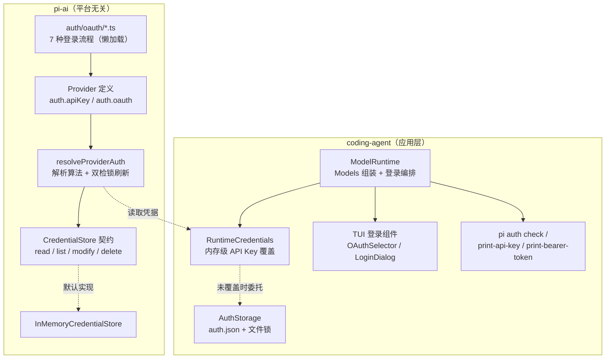
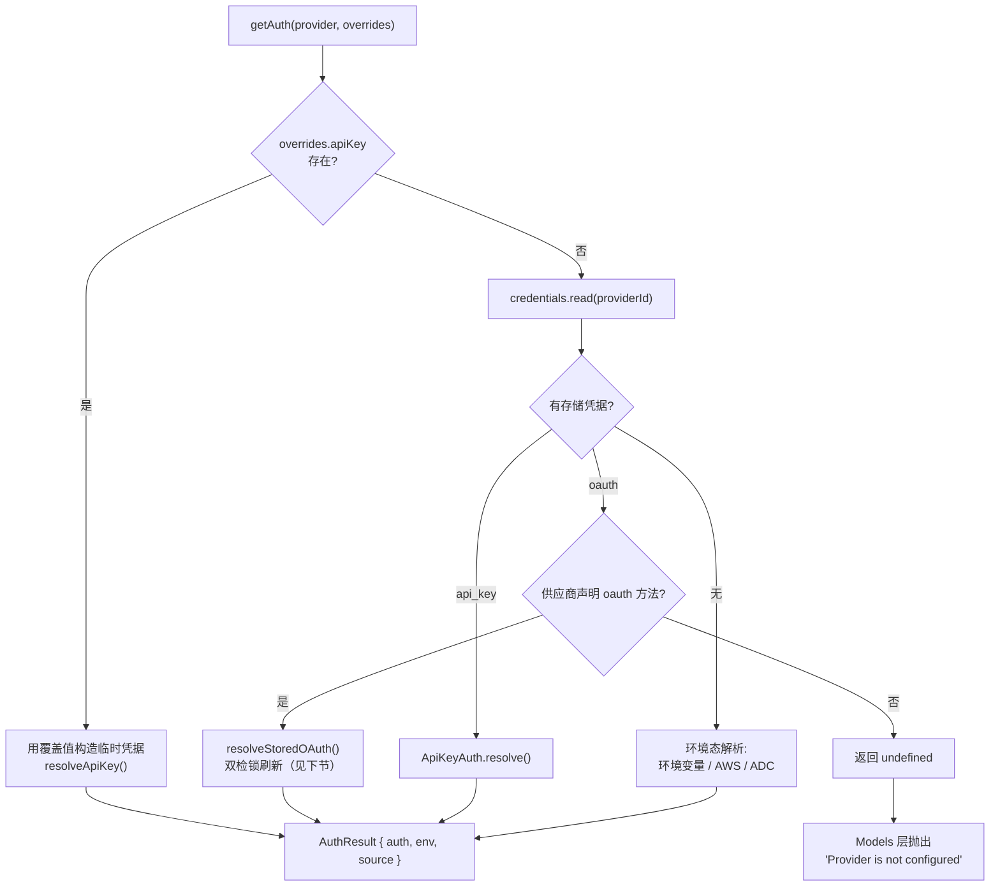
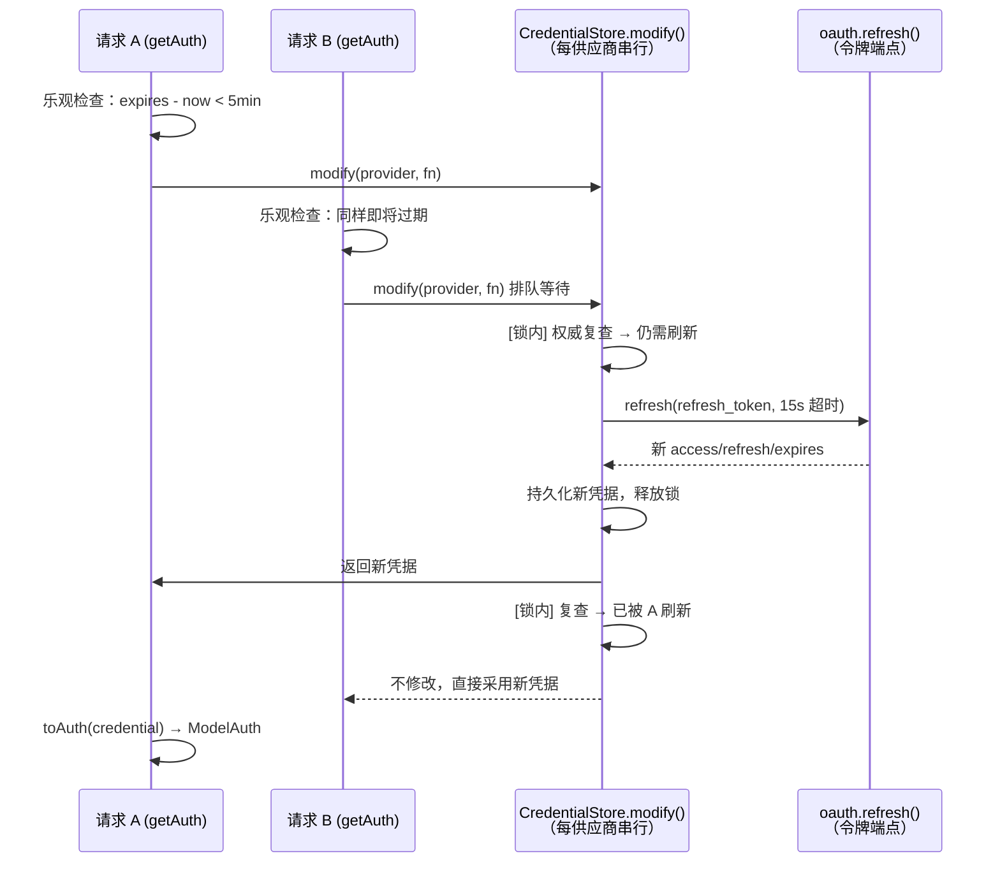
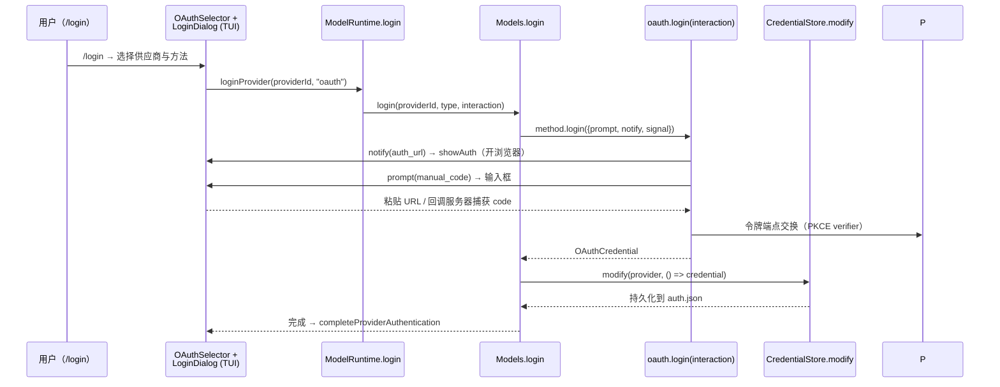

在 pi 的 LLM 统一接口栈中，认证是一块被刻意从"HTTP 调用"里剥离出来的独立子系统：pi-ai 定义了类型化的凭据模型与解析契约，各供应商以声明式方式描述自己的 API Key / OAuth 逻辑，coding-agent 则提供基于 `auth.json` 的持久化存储、交互式登录编排与 CLI 查询命令。本页深入剖析这条链路的内部设计：认证类型模型、解析优先级语义、OAuth 刷新的双检锁并发控制、七种供应商 OAuth 流程的实现模式，以及跨进程安全的凭据存储。读者应已熟悉 TypeScript 异步编程与 OAuth 基础概念；从使用者视角的登录操作指南见[供应商与模型接入：订阅登录与 API Key](3-gong-ying-shang-yu-mo-xing-jie-ru-ding-yue-deng-lu-yu-api-key)。

Sources: [types.ts](packages/ai/src/auth/types.ts#L1-L241), [resolve.ts](packages/ai/src/auth/resolve.ts#L1-L206)

## 分层架构总览

认证子系统分布在两个包中，职责边界清晰。`packages/ai/src/auth/` 是平台无关的核心：`types.ts` 定义凭据与解析契约，`resolve.ts` 实现供应商无关的解析算法，`credential-store.ts` 提供内存版存储，`oauth/` 目录按供应商划分登录流程实现。coding-agent 侧则负责"应用归属"的部分——`auth-storage.ts` 把契约落到磁盘文件上，`model-runtime.ts` / `runtime-credentials.ts` 组装运行时，`interactive-mode.ts` 把登录流程接到终端 UI。关键设计是：pi-ai 不关心凭据存到哪里，应用（如 coding-agent）通过注入 `CredentialStore` 实现来决定持久化策略，登录/登出编排也完全由应用层持有。



整个 auth 模块通过 pi-ai 的公共入口导出（`index.ts` 中的 `export * from "./auth/..."`），SDK 消费者可以完全复用这套契约。`Models` 集合（`models.ts`）与 `ImagesModels`（`images-models.ts`）共享同一个 `resolveProviderAuth` 入口，保证文本与图像模型走一致的认证语义。

Sources: [index.ts](packages/ai/src/index.ts#L21-L32), [resolve.ts](packages/ai/src/auth/resolve.ts#L1-L61), [models.ts](packages/ai/src/models.ts#L4-L4), [images-models.ts](packages/ai/src/images-models.ts#L3-L3), [model-runtime.ts](packages/coding-agent/src/core/model-runtime.ts#L42-L42)

## 类型模型：ModelAuth 与双重认证方法

解析的产出物是 `ModelAuth`——一个刻意收窄的接口，只含 `apiKey`、`headers`、`baseUrl` 三个字段。`types.ts` 顶部的注释点明了判定标准："如果某个值无法用这三者表达，那它是 provider 配置，不是认证"。这个约束把认证与供应商配置（如 Cloudflare 的 account id）干净地分开。存储侧则只有两种类型标签：`ApiKeyCredential`（`type: "api_key"`，可带 `key` 与供应商级 `env`）和 `OAuthCredential`（`type: "oauth"`，含 `refresh`、`access`、`expires`）。每个供应商在存储中至多有一条凭据，这是 `auth.json` 的物理形态，也是并发设计的前提。

```ts
// 解析产物：一次模型请求的认证信息
interface ModelAuth { apiKey?: string; headers?: ProviderHeaders; baseUrl?: string }

// 存储形态：每供应商一条，type 标签区分
type Credential = ApiKeyCredential | OAuthCredential;
```

供应商声明认证能力的方式是 `ProviderAuth`：`apiKey?: ApiKeyAuth` 与 `oauth?: OAuthAuth` 至少存在其一。两者职责对称但生命周期不同——`ApiKeyAuth.resolve()` 在每次请求前执行（可执行命令、读环境文件），而 `OAuthAuth` 被拆成 `login` / `refresh` / `toAuth` 三步：`refresh` 是网络调用，负责把过期凭据换成新凭据；`toAuth` 是无副作用的纯派生，负责把有效凭据转换成 `ModelAuth`。这个拆分正是为了让 `Models` 能"独占"带锁的刷新模式——刷新在存储锁内完成，派生在锁外完成。

| 接口成员 | ApiKeyAuth | OAuthAuth | 说明 |
|---|---|---|---|
| `name` | ✅ | ✅ | 展示名，如 "Anthropic API key" |
| `login` | 可选 | 必须 | 交互式登录；缺失 = 纯环境凭据供应商（如 AWS） |
| `resolve` / `refresh` | `resolve`：从凭据+环境解析请求认证 | `refresh`：锁内网络调用，换新凭据 | ApiKey 侧允许执行命令；OAuth 侧失败抛 `invalid_grant` 等 |
| `check` / `toAuth` | `check`：无副作用可用性检查 | `toAuth`：无副作用派生 `ModelAuth` | 二者均要求幂等、不发网络请求 |
| `isSubscription` | — | 可选 | 标记订阅型认证（Claude Pro/Max、Copilot 等） |

Sources: [types.ts](packages/ai/src/auth/types.ts#L7-L12), [types.ts](packages/ai/src/auth/types.ts#L17-L43), [types.ts](packages/ai/src/auth/types.ts#L170-L241), [resolve.ts](packages/ai/src/auth/resolve.ts#L12-L18)

## 解析管线：resolveProviderAuth 的优先级语义

`resolveProviderAuth` 是 `Models.getAuth()` 背后的唯一算法，其决策顺序是一条严格的三级瀑布：**请求级覆盖 → 已存储凭据 → 环境默认源**。若调用方传入 `overrides.apiKey`，则直接以其构造临时凭据解析（供应商级 `env` 覆盖会通过 `overlayEnvAuthContext` 叠加到环境查询之上）。否则读取存储——命中 OAuth 凭据且供应商声明了 `oauth` 方法时进入刷新路径，命中 api_key 凭据时走 `ApiKeyAuth.resolve()`。两条都未命中，才回退到"环境态"解析（环境变量、AWS profile、ADC 文件）。



值得注意的语义约束写在 `resolve.ts` 的文档注释里：**已存储的凭据独占供应商**——存储命中后不再咨询环境变量；刷新失败后也不做静默的环境回退（避免"以为在用订阅、实际在扣 API 余额"这类事故）。凭据类型与供应商能力不匹配时（如存了 api_key 但供应商只声明了 oauth）同样返回 `undefined` 而非猜测。所有失败路径都被包装成 `ModelsError`，错误码区分 `"auth"`（存储/解析失败）与 `"oauth"`（刷新、派生失败），且 `withCauseDetail` 会把底层原因内联进 `error.message`，因为调用方通常只展示 message。

`AuthContext` 是解析的环境抽象：`env(name)` 读环境变量，`fileExists(path)` 探测文件（支持 `~` 展开）。默认实现 `defaultProviderAuthContext()` 在浏览器环境下 `env` 返回 undefined、`fileExists` 恒为 false，Node 内置模块通过"变量型 specifier"动态导入，防止打包器追踪进 `node:fs`。每个 `AuthResult` 携带 `source` 字符串（如 `"ANTHROPIC_API_KEY"`、`"OAuth"`、`"~/.aws/credentials"`），专供状态 UI 展示凭据来源。

Sources: [resolve.ts](packages/ai/src/auth/resolve.ts#L50-L115), [resolve.ts](packages/ai/src/auth/resolve.ts#L19-L37), [context.ts](packages/ai/src/auth/context.ts#L1-L46), [types.ts](packages/ai/src/auth/types.ts#L97-L111), [models.ts](packages/ai/src/models.ts#L641-L653)

## OAuth 刷新：modify() 上的双检锁

OAuth 令牌过期是认证子系统里最精巧的并发场景：多个并发请求可能同时发现令牌临近过期，若各自刷新会产生竞态（先到的新令牌被后到的旧刷新覆盖，甚至导致 refresh token 轮换失效）。pi 的解法是把 `CredentialStore.modify()` 当作全局锁，配合"双检锁"（double-checked locking）模式：`resolveStoredOAuth` 先做一次无锁的乐观检查——令牌剩余有效期小于 5 分钟（`DEFAULT_OAUTH_MINIMUM_VALIDITY_MS`）即视为即将过期；然后进入 `modify()` 排队，**在锁内再做一次权威检查**，若期间其他进程/请求已刷新则直接返回 undefined（`modify` 的回调返回 undefined 表示"不修改条目"），只有确认仍需刷新才调用 `oauth.refresh()` 并在释放锁前持久化轮换后的凭据。



实现上有三处防御性细节。其一，`refresh` 调用被 `AbortSignal.any([请求 signal, 15 秒超时])` 包裹，网络悬挂不会永久占锁。其二，刷新失败被包装为 `ModelsError("oauth", ...)`，存储层自身的失败则归为 `ModelsError("auth", ...)`，两类错误的修复路径不同（后者通常意味着磁盘或锁问题）。其三，5 分钟窗口默认"触发刷新但不强制约束"——只有显式传入 `minOAuthValidityMs` 的调用方（如 bearer-token 导出命令）会在刷新后复查并抛出"令牌有效期仍不足"的错误。这个语义差异的注释明确写在代码里：普通请求容忍刷新后立即过期的边缘情况，导出命令不能容忍。

Sources: [resolve.ts](packages/ai/src/auth/resolve.ts#L118-L179), [resolve.ts](packages/ai/src/auth/resolve.ts#L120-L126), [types.ts](packages/ai/src/auth/types.ts#L56-L95), [resolve.ts](packages/ai/src/auth/resolve.ts#L181-L192)

## 供应商 OAuth 流程实现

`auth/oauth/` 下的七个流程文件各自实现 `OAuthAuth` 接口，覆盖了 OAuth 生态中的三大 grant 模式。所有实现共享两个基础设施模块：`pkce.ts` 基于 Web Crypto 的 `generatePKCE()`（32 字节随机 verifier + SHA-256 challenge，Node 20+ 与浏览器通用），以及 `device-code.ts` 的 `pollOAuthDeviceCodeFlow()`——一个严格遵循 RFC 8628 的设备码轮询引擎，处理 `slow_down` 响应时优先信任服务器返回的 `interval` 字段（注释指出：仅靠客户端计数在 WSL/VM 时钟漂移下会永久过早轮询），否则按规范每收到一次 `slow_down` 增加轮询间隔 5 秒。

| 供应商 | Grant 模式 | 关键机制 | toAuth 产出 |
|---|---|---|---|
| Anthropic (Claude Pro/Max) | 授权码 + PKCE | 本地回调服务器 `127.0.0.1:53692`；`manual_code` 提示与回调竞争（跨机器粘贴场景）；scope 含 `user:inference` 等 | `{ apiKey: access }` |
| OpenAI Codex | 双模式登录 | 登录时 `select` 提示选择浏览器 PKCE 或设备码（headless）；令牌端点为 `auth.openai.com` | `{ apiKey: access }` |
| GitHub Copilot | 设备码 + 令牌交换 | 登录后用 GitHub access token 调 `copilot_internal/v2/token` 换 Copilot 令牌；从令牌 `proxy-ep` 字段推导每账号 API baseUrl；额外执行模型 policy 启用 | `{ apiKey, baseUrl }` |
| OpenRouter | 授权码 + PKCE | 标准 PKCE 浏览器跳转 | `{ apiKey: access }` |
| xAI | 设备码（RFC 8628） | `auth.x.ai/oauth2/device/code`；优先使用 `verificationUriComplete` | `{ apiKey: access }` |
| Kimi Coding | 设备码（RFC 8628） | `auth.kimi.com` 的 JSON 设备授权端点 | `{ apiKey: access }` |
| Radius | 网关定制 | 经 `createRadiusOAuth({ name, gateway })` 参数化构造 | 网关令牌 |

Anthropic 流程最能体现交互设计的完备性。`startCallbackServer` 起一个临时 HTTP 服务器等待授权码回调，同时发出一条 `manual_code` 提示（"在浏览器完成登录，或把最终重定向 URL 粘贴到这里"）——两条路径由独立的 `manualAbort` 信号竞争：回调先到则中止提示，手动输入先到则关闭回调等待。回调服务器校验 `state` 参数（实现里 `state` 即 PKCE verifier，验证授权响应未被篡改）并对错误分支返回预渲染的 HTML 页面（`oauth-page.ts`）。令牌交换成功后，`expires` 被有意减去 5 分钟（`expires_in * 1000 - 5 * 60 * 1000`），与解析层的最小有效期窗口对齐。

另一个横切关注点是**懒加载**。所有 OAuth 流程都依赖 `node:http`（回调服务器）或 Node 环境 API，不能进入浏览器 bundle。供应商定义用 `lazyOAuth()` 包装：声明 `name`/`isSubscription` 等元数据，`load` 函数延迟到首次 `login`/`refresh`/`toAuth` 时才动态导入实现模块。`load.ts` 中 `importOAuthModule` 用变量型 specifier（且在编译产物中把 `.ts` 重写为 `.js`）使打包器无法静态追踪导入；`registerBundledOAuthFlowLoaders` 则为独立 Bun 二进制注册静态打包的加载器，兼容两种分发形态。

Sources: [pkce.ts](packages/ai/src/auth/oauth/pkce.ts#L21-L35), [device-code.ts](packages/ai/src/auth/oauth/device-code.ts#L29-L99), [anthropic.ts](packages/ai/src/auth/oauth/anthropic.ts#L21-L35), [anthropic.ts](packages/ai/src/auth/oauth/anthropic.ts#L99-L157), [anthropic.ts](packages/ai/src/auth/oauth/anthropic.ts#L234-L365), [openai-codex.ts](packages/ai/src/auth/oauth/openai-codex.ts#L26-L34), [openai-codex.ts](packages/ai/src/auth/oauth/openai-codex.ts#L519-L545), [github-copilot.ts](packages/ai/src/auth/oauth/github-copilot.ts#L493-L508), [xai.ts](packages/ai/src/auth/oauth/xai.ts#L202-L231), [load.ts](packages/ai/src/auth/oauth/load.ts#L1-L69), [helpers.ts](packages/ai/src/auth/helpers.ts#L35-L60)

## 凭据存储契约与实现

`CredentialStore` 是四个方法的窄接口：`read`（可能过期，仅供展示/状态）、`list`（元数据枚举，不得执行配置的命令）、`modify`（**唯一写路径**，串行化读-改-写）、`delete`。契约文档明确了两条并发规则：每供应商 ID 互斥（底层存储支持时跨进程也互斥，如文件锁），以及 `modify` 的回调能看到当前凭据——因为正确的写入（刷新、登录期间的并发刷新）依赖它。pi-ai 自带 `InMemoryCredentialStore`：每个供应商 ID 维护一条 promise 链，任务逐个入队且链尾在活跃任务结束后才收缩，取消信号通过 `raceWithAbortSignal` 介入。

| 实现 | 所在包 | 持久化 | 互斥机制 | 适用场景 |
|---|---|---|---|---|
| `InMemoryCredentialStore` | pi-ai | ❌ 内存 Map | 每供应商 promise 链 | 测试、浏览器、无盘环境 |
| `AuthStorage`（+ `FileAuthStorageBackend`） | coding-agent | ✅ `auth.json` | `proper-lockfile` 文件锁（同步重试 + 异步指数退避） | coding-agent 与 SDK 默认 |
| `ReadOnlyAuthStorage` | coding-agent | 只读 | `modify`/`delete` 直接抛错 | 审计/巡检工具 |
| `RuntimeCredentials` | coding-agent | 覆盖层 | 委托底层 store | `setRuntimeApiKey` 内存注入 |

coding-agent 的 `AuthStorage` 是最重的实现，其难点在跨进程一致性。写入侧通过 `FileAuthStorageBackend.withLockAsync` 完成：`proper-lockfile` 获取文件锁（ELOCKED 时按指数退避 + 随机抖动重试，30 秒为限），锁内"读文件 → 回调产出新 JSON → 写文件"，全程用 `onCompromised` 钩子跟踪锁失效。文件以 `mode: 0o600` 创建（注释强调该模式仅作用于创建时，不会覆盖管理员设置的 ACL）。读取侧做了显著优化：模块级共享 `readState` 缓存（数据 + 文件 revision），`readLatestData` 先比较 `getFileRevision`（基于 mtime/size）——未变化直接返回缓存，变化则把多个并发读合并进同一个 `reload` 任务（带引用计数，最后一个读者离开时取消残留 reload）。这种"revision 校验 + 合并 reload"的设计让多窗口/多进程场景下的重复读盘被摊平。此外，`read` 返回前会经 `resolveConfigValue` 解析 `key` 字段：以 `!` 开头的值被当作 shell 命令执行（如 1Password 的 `op read ...`），普通值支持 `$VAR`/`${VAR}` 插值——**存储层存的是"配置表达式"，真实密钥只在读取时求值**，`list` 则被契约要求不得执行这些命令。

Sources: [types.ts](packages/ai/src/auth/types.ts#L65-L95), [credential-store.ts](packages/ai/src/auth/credential-store.ts#L9-L67), [auth-storage.ts](packages/coding-agent/src/core/auth-storage.ts#L25-L26), [auth-storage.ts](packages/coding-agent/src/core/auth-storage.ts#L116-L200), [auth-storage.ts](packages/coding-agent/src/core/auth-storage.ts#L327-L490), [auth-storage.ts](packages/coding-agent/src/core/auth-storage.ts#L203-L290), [config.ts](packages/coding-agent/src/config.ts#L546-L549), [resolve-config-value.ts](packages/coding-agent/src/core/resolve-config-value.ts#L130-L155), [runtime-credentials.ts](packages/coding-agent/src/core/runtime-credentials.ts#L1-L53)

## 登录编排：从 /login 到凭据持久化

登录编排由 `Models.login()` 统一承载（coding-agent 的 `ModelRuntime.login` 委托给它）。流程是：按 `type` 参数取到 `ApiKeyAuth.login` 或 `OAuthAuth.login` → 执行交互式流程拿到凭据 → `credentials.modify()` 持久化。这里有一段精细的取消语义：登录流程本身可被 `interaction.signal` 中止，但**一旦持久化 mutation 已开始就不再中止**——代码用 `mutationStarted` 标志与 `Promise.race([started, mutation])` 实现"要么完整落地、要么干净取消"，避免出现"登录成功但凭据丢失"的中间态。 mutation 失败统一包装为 `ModelsError("auth")`；coding-agent 侧的 `ModelRuntime` 还定义了 `CredentialSynchronizationError`，用于区分"凭据已写入但本地模型状态同步失败"（此时凭据安全，仅模型列表需刷新）。

交互协议层定义了双向通道。`AuthInteraction` 提供 `prompt()`（返回输入串，`select` 返回选项 id，取消时 reject）与 `notify()`（单向事件通知）。`AuthPrompt` 的四种形态对应 UI 分支：`text`/`secret`（普通输入与掩码输入）、`select`（选项列表）、`manual_code`（可粘贴回调 URL 的输入，可被带外事件取消——注释中的例子正是 Anthropic 回调服务器抢先完成时中止悬挂的手动输入）。`AuthEvent` 则覆盖 `auth_url`（浏览器跳转）、`device_code`（显示用户码）、`info`/`progress`（文案与进度）。coding-agent 的 TUI 侧，`OAuthSelectorComponent` 把所有供应商按 `oauth`/`api_key` 分列展示（标签区分 "subscription" 与 "API key"），选中后 `LoginDialogComponent` 接管编辑器区域：`showAuth` 打开浏览器并渲染超链接，`showDeviceCode` 展示用户码，`showAuthPrompt` 为每条 prompt 附加独立的取消信号监听。



登出对称地走 `Models.logout()` → `credentials.delete()`。coding-agent 的 `/logout` 命令只移除 `/login` 写入的凭据，明确提示环境变量与 `models.json` 配置不受影响。登录成功后的 `completeProviderAuthentication` 负责刷新可用模型集合并恢复编辑器；若同步失败，`CredentialSynchronizationError` 的错误分支会告知用户"已登录但本地状态未同步"而非笼统报错。

Sources: [models.ts](packages/ai/src/models.ts#L570-L631), [types.ts](packages/ai/src/auth/types.ts#L125-L168), [interactive-mode.ts](packages/coding-agent/src/modes/interactive/interactive-mode.ts#L5850-L5940), [interactive-mode.ts](packages/coding-agent/src/modes/interactive/interactive-mode.ts#L5613-L5646), [login-dialog.ts](packages/coding-agent/src/modes/interactive/components/login-dialog.ts#L84-L130), [oauth-selector.ts](packages/coding-agent/src/modes/interactive/components/oauth-selector.ts#L9-L16), [model-runtime.ts](packages/coding-agent/src/core/model-runtime.ts#L91-L98)

## CLI 认证命令与环境凭据源

coding-agent 提供三个非交互式认证子命令，服务于脚本化与 CI 场景。`pi auth check --provider <p>` 返回 `ready`/`not_ready`/`invalid` 三态判定（区分供应商不存在、凭据未配置、状态异常三种原因），默认会触发 OAuth 刷新以验证凭据"真正可用"，`--no-refresh` 可跳过；`--json` 与 `--credentials` 分别控制输出格式与是否回显凭据。`pi auth print-api-key` 输出解析后的密钥，`pi auth print-bearer-token` 面向 OAuth 供应商输出 bearer 令牌并支持 `--min-expiry 30m` 这类时长参数——这正是解析层 `minOAuthValidityMs` 硬约束的消费方。`getAuthCredential` 的提取逻辑同时覆盖 `auth.apiKey` 与 `headers.Authorization: Bearer` 两种形态。

环境侧的发现逻辑集中在 pi-ai 的 `env-api-keys.ts`。`getApiKeyEnvVars` 维护一张供应商 → 环境变量名的映射表（如 `OPENAI_API_KEY`、`GEMINI_API_KEY`、`HF_TOKEN` 等 40 余项），`getEnvApiKey` 按序探测。两个特例值得注意：Anthropic 的 `ANTHROPIC_AUTH_TOKEN` 参与**发现与状态展示**，但 `getEnvApiKey` 会刻意跳过它——因为它必须以 `Authorization: Bearer` 头而非 `x-api-key` 传递（供应商自己的 `resolve` 里有对应的分支）；以及两类"环境态"供应商的判定——Google Vertex 检查 ADC 凭据文件（`GOOGLE_APPLICATION_CREDENTIALS` 或 `~/.config/gcloud/application_default_credentials.json`）加项目/区域三元组，Amazon Bedrock 枚举六种 AWS 凭据源（named profile、IAM key 对、bearer token、ECS task role、IRSA）。这些供应商的 `ApiKeyAuth.resolve` 返回哨兵值 `"<authenticated>"` 表示环境已就绪，实际凭据由 SDK 在请求时读取。交互登录缺失时的用户引导文案由 `auth-guidance.ts` 统一生成，指向 `docs/providers.md`。

Sources: [auth-command.ts](packages/coding-agent/src/cli/auth-command.ts#L1-L127), [auth-check.ts](packages/coding-agent/src/cli/auth-check.ts#L26-L59), [auth-guidance.ts](packages/coding-agent/src/core/auth-guidance.ts#L1-L26), [env-api-keys.ts](packages/ai/src/env-api-keys.ts#L29-L66), [env-api-keys.ts](packages/ai/src/env-api-keys.ts#L68-L189), [anthropic.ts](packages/ai/src/providers/anthropic.ts#L14-L42)

## SDK 集成：ModelRuntime 的认证装配

SDK 消费者通过 `ModelRuntime.create()` 拿到装配好的认证栈。默认情况下 `credentials` 为 `AuthStorage.create()`（即 `~/.pi/agent/auth.json`），可用 `authPath` / `modelsPath` 重定向到应用自有目录；传入自定义 `CredentialStore`（如内存版或加密存储）则完全接管持久化。`ModelRuntime` 内部把注入的 store 包进 `RuntimeCredentials` 覆盖层——`setRuntimeApiKey(providerId, key)` 在内存中注入一个 api_key 覆盖，`read()` 时优先返回覆盖值，`delete()` 时连带清除覆盖。这使得"临时密钥"与"持久凭据"共享同一条解析管线，无需改动任何供应商代码。环境变量方式的接入（`OPENAI_API_KEY` 等）不需要任何 SDK 调用，解析管线的第三级会自动兜住。

```ts
import { createAgentSession, ModelRuntime, SessionManager } from "@earendil-works/pi-coding-agent";

// 默认：凭据读写 ~/.pi/agent/auth.json
const modelRuntime = await ModelRuntime.create();

// 重定向存储位置
const custom = await ModelRuntime.create({
  authPath: "/tmp/my-app/auth.json",
  modelsPath: "/tmp/my-app/models.json",
});

// 内存级密钥覆盖（不落盘）
await modelRuntime.setRuntimeApiKey("anthropic", "sk-my-temp-key");
```

状态查询 API 同样可用：`modelRuntime.checkAuth(provider)` / `getAuth(provider)` 直接转发 pi-ai 的解析管线，`auth check` CLI 内部正是组合这两个方法实现三态判定。SDK 示例 `09-api-keys-and-oauth.ts` 演示了上述三种装配方式的完整代码；更系统的 SDK 嵌入话题见 [AgentSession 与 SDK：将智能体嵌入自有应用](16-agentsession-yu-sdk-jiang-zhi-neng-ti-qian-ru-zi-you-ying-yong)。

Sources: [model-runtime.ts](packages/coding-agent/src/core/model-runtime.ts#L173-L177), [model-runtime.ts](packages/coding-agent/src/core/model-runtime.ts#L400-L402), [model-runtime.ts](packages/coding-agent/src/core/model-runtime.ts#L470-L479), [model-runtime.ts](packages/coding-agent/src/core/model-runtime.ts#L536-L547), [runtime-credentials.ts](packages/coding-agent/src/core/runtime-credentials.ts#L20-L38), [09-api-keys-and-oauth.ts](packages/coding-agent/examples/sdk/09-api-keys-and-oauth.ts#L1-L35)

## 延伸阅读

认证子系统是理解供应商接入的钥匙，建议按以下路径继续：

- **上游抽象**：`resolveProviderAuth` 的产出如何进入统一请求管线、跨模型切换如何工作，见 [pi-ai：统一多供应商 API 与跨模型切换](10-pi-ai-tong-duo-gong-ying-shang-api-yu-kua-mo-xing-qie-huan)。
- **供应商定义全貌**：`Provider.auth` 只是 `createProvider` 的一个切片，完整定义（模型目录、API 适配、懒加载）见 [供应商与模型接入：订阅登录与 API Key](3-gong-ying-shang-yu-mo-xing-jie-ru-ding-yue-deng-lu-yu-api-key) 与 [模型目录：生成脚本与自动刷新机制](13-mo-xing-mu-lu-sheng-cheng-jiao-ben-yu-zi-dong-shua-xin-ji-zhi)。
- **扩展如何注入认证**：`provider-composer.ts` 中 `adaptOAuth` 把扩展的 `OAuthLoginCallbacks` 适配为标准 `OAuthAuth`，扩展系统全貌见 [扩展系统：事件拦截、自定义工具与自定义 UI](19-kuo-zhan-xi-tong-shi-jian-lan-jie-zi-ding-yi-gong-ju-yu-zi-ding-yi-ui)。
- **交互层**：登录对话框依赖的 TUI 组件体系见 [内置组件体系：编辑器、选择列表与布局栈](15-nei-zhi-zu-jian-ti-xi-bian-ji-qi-xuan-ze-lie-biao-yu-bu-ju-zhan)。