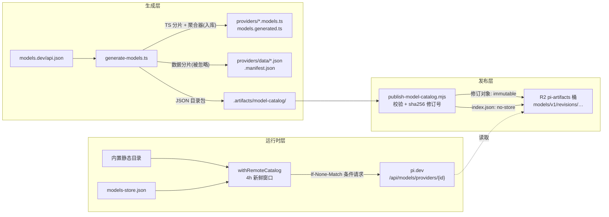
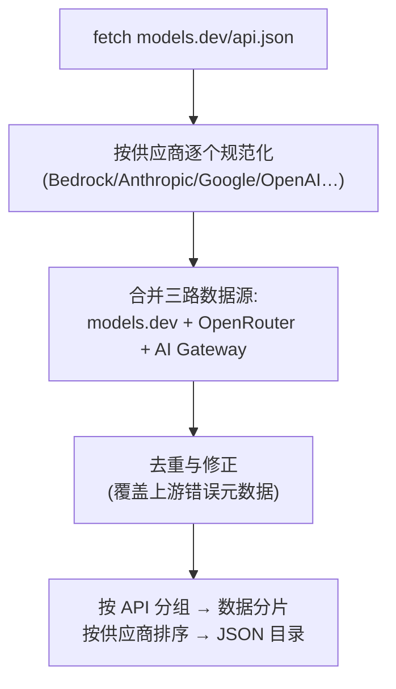
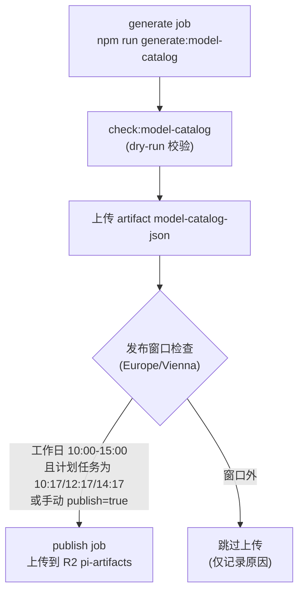
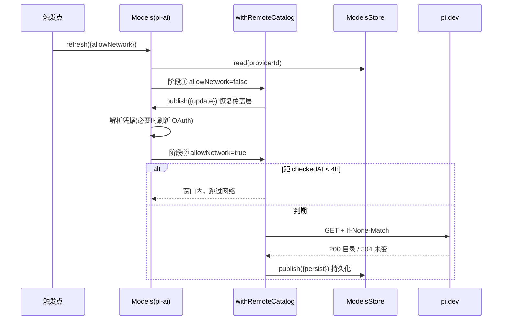

pi 的模型目录不是一份手写的静态清单，而是一条**"生成 → 发布 → 自动刷新"**的完整流水线：构建时由生成脚本从 models.dev 拉取全量模型元数据并加工成类型化代码；CI 定时将其打包发布到 Cloudflare R2 作为不可变修订版本；运行时客户端则以"静态内置目录 + 远程覆盖层"的方式，通过 4 小时新鲜窗口与 ETag 条件请求实现低成本的自动刷新。本文沿这条流水线自上而下拆解每一层的实现。

## 三层目录架构总览

整个体系由三个解耦的层构成：生成层负责把外部数据源变成仓库内的代码与 JSON 工件；发布层把 JSON 工件推送到 R2 并维护一个带客户端版本门控的索引；运行时层在静态内置目录之上叠加持久化的远程覆盖层。注意生成层的数据分片被 `.gitignore` 排除（构建时本地生成），而 `.artifacts/` 中的发布工件同样不入库：

生成层的输出同时服务于两条路径：TS 分片进入 npm 包（离线兜底），JSON 目录包进入 R2（在线刷新）。运行时层里，`withRemoteCatalog` 把动态模型合并进静态基线——远程覆盖层只做**替换或追加**，永不删除内置条目，这保证了最坏情况下（网络不可用、目录过期）客户端始终拥有完整的离线目录。

Sources: [.gitignore](.gitignore#L3-L11), [.github/workflows/publish-model-catalog.yml](.github/workflows/publish-model-catalog.yml#L1-L32), [remote-catalog-provider.ts](packages/coding-agent/src/core/remote-catalog-provider.ts#L10-L18)

## 生成脚本：以 models.dev 为单一上游

生成器 `packages/ai/scripts/generate-models.ts`（约 3100 行）的第一步是拉取 `https://models.dev/api.json`，这一调用失败会直接中止生成。它汇聚三个数据源——models.dev 全量目录、OpenRouter 专属目录、AI Gateway 目录——合并后过滤出支持工具调用的模型：

值得注意的是，生成器并非对 models.dev 数据做无损转发，而是内嵌了大量**领域修正**：过滤不支持流式工具调用的 Bedrock 模型、剔除不支持系统消息的旧 Mistral 模型、纠正 models.dev 上 OpenCode Go 端点与 GLM-5.2 的错误标注、为订阅制供应商补零成本字段等。这些修正以注释形式散布在代码中，例如 "models.dev reports Vertex cache_read/cache_write values… keep pi's authoritative values"、"Baseten's GLM-5.2 endpoints are text-only despite models.dev reporting image input"。这意味着**生成器本身就是一份持续维护的供应商知识库**，pi 只信任上游的形状，不信任上游的每个值。

Sources: [generate-models.ts](packages/ai/scripts/generate-models.ts#L1463-L1465), [generate-models.ts](packages/ai/scripts/generate-models.ts#L2431-L2434), [generate-models.ts](packages/ai/scripts/generate-models.ts#L1356-L1356)

## 四种运行模式与原子落盘

生成器通过命令行开关支持四种互斥模式，对应仓库根目录与 `packages/ai` 中的 npm 脚本链：

| npm 脚本 | 生成器参数 | 产物 | 使用场景 |
|---|---|---|---|
| `generate-models` | `--strict` | TS 分片 + 聚合器 + 数据分片 | 日常构建（`packages/ai` 的 `build` 首步） |
| `hydrate:model-data` | `--strict --data-only` | 仅数据分片 + manifest | 依赖安装后水合被忽略的 JSON |
| `generate:model-catalog` | `--strict --json-only --json-output` | 仅 `.artifacts/model-catalog/` | CI 生成待发布目录 |
| `diff:model-catalog` | （独立脚本） | 对比报告 | 审计目录变更 |

落盘采用**staging 目录 + 原子重命名 + 失败回滚**的三步协议：先写入 `src/providers/.model-generation-*/data` 临时目录并完成校验，再 `renameSync` 替换现有 `data/` 目录；若替换后校验失败，删除新目录并恢复旧数据。TS 分片的替换同样先备份旧内容，失败时通过 `restoreGeneratedCatalog` 恢复。`generatedAt` 时间戳在生成时取 `new Date().toISOString()`，写入 `.manifest.json`——它后面会成为运行时判断"远程目录是否比内置目录更新"的基准。

Sources: [packages/ai/package.json](packages/ai/package.json#L54-L65), [package.json](package.json#L28-L33), [generate-models.ts](packages/ai/scripts/generate-models.ts#L3001-L3018), [generate-models.ts](packages/ai/scripts/generate-models.ts#L3085-L3093), [generate-models.ts](packages/ai/scripts/generate-models.ts#L2997)

## 产物形态：数据分片、TS 分片与类型化聚合

生成器产出三族文件，职责边界清晰。**数据分片** `src/providers/data/{provider}.json` 是内部存储，按 API 分组（如 `anthropic-messages`、`openai-responses`）以便推导字面量类型——正如代码注释所言："Only the ignored internal data is grouped by API for type derivation. Public JSON catalog output stays flat."（内部数据按 API 分组用于类型推导，公开 JSON 目录保持扁平）。该目录被 `.gitignore` 排除，但构建时被整体拷贝进 `dist/providers/data` 随 npm 包发布：

| 产物 | 内容 | 类型/校验 | 入库状态 |
|---|---|---|---|
| `data/{provider}.json` | 按 API 分组的模型值 | `manifest.files` 记录每个文件的 sha256 | 忽略，随 dist 发布 |
| `data/.manifest.json` | schemaVersion 3、generatedAt、structureHash、文件哈希 | 生成后 `validateModelDataDirectory` 复验 | 忽略 |
| `{provider}.models.ts` | 薄 TS 壳：`import values from "./data/x.json" with { type: "json" }` | 经 `flattenModelCatalog` 获得精确模型 ID 联合类型 | 入库 |
| `models.generated.ts` | 聚合器：`MODELS = { "anthropic": ANTHROPIC_MODELS, … }` | `readModelDataProviderIds` 用正则反解析聚合器，与磁盘分片双向对账 | 入库 |

**TS 分片**利用 JSON import attributes 与 `flattenModelCatalog` 辅助函数，在编译期把每个模型 ID 变成字符串字面量联合类型，使 `getBuiltinModel("anthropic", "claude-…")` 具备完整的静态检查能力。**manifest** 中的 `generatedAt` 则通过 `all.ts` 的 `getBuiltinModelDataGeneratedAt()` 暴露为运行时常量，成为远程覆盖层新鲜度判断的锚点：

Sources: [generate-models.ts](packages/ai/scripts/generate-models.ts#L2985-L2998), [model-data.ts](packages/ai/scripts/model-data.ts#L5-L15), [model-data.ts](packages/ai/scripts/model-data.ts#L85-L94), [model-catalog.ts](packages/ai/src/model-catalog.ts#L22-L27), [models.generated.ts](packages/ai/src/models.generated.ts#L1-L4), [all.ts](packages/ai/src/providers/all.ts#L73-L77), [packages/ai/package.json](packages/ai/package.json#L61-L62)

校验贯穿全链路：`validateModelValue` 要求每个模型条目具备 id/provider/api 一致性、非空 name、合法 baseUrl、reasoning 布尔值、非空 input 模态、正数 contextWindow/maxTokens 以及四项有限成本数值；`readModelDataStructure` 则保证聚合器声明的分片与磁盘文件一一对应。独立脚本 `check-model-data.ts` 供 CI 与 `build:offline` 在不联网的情况下复验数据完整性，失败时提示运行 `hydrate:model-data`。

Sources: [model-data.ts](packages/ai/scripts/model-data.ts#L140-L185), [check-model-data.ts](packages/ai/scripts/check-model-data.ts#L1-L22)

## 发布流水线：不可变修订与版本门控索引

`publish-model-catalog.yml` 是这条流水线的调度中枢，其触发矩阵刻意设计为"高频候选、低频落盘"：

| 触发方式 | 条件 | 行为 |
|---|---|---|
| `workflow_run` | main 分支 CI 成功 | 生成 + 按窗口发布 |
| `schedule` | `17 8-13 * * 1-5`（UTC，工作日每小时） | 生成 + 仅在偶数小时落盘 |
| `pull_request` | 触碰 `packages/ai/**` 或相关脚本 | 仅生成 + 校验（dry-run） |
| `workflow_dispatch` | 手动指定 `source_ref`/`publish` | `publish=true` 时随时发布 |

UTC cron `17 8-13 * * 1-5` 覆盖了维也纳时区（CET/CEST）夏令时切换的边界，而真正的落盘由 `publish` job 内嵌脚本按本地时间复验：工作日 10:00–15:00 之间，计划任务只允许在 10:17、12:17、14:17 三个时点上传，手动发布不受限。发布使用独立的 `pi-model-upload` environment 与并发组 `publish-model-catalog-r2`（取消进行中的旧任务），凭据走 R2 专用的 AWS 密钥对。

Sources: [.github/workflows/publish-model-catalog.yml](.github/workflows/publish-model-catalog.yml#L16-L32), [.github/workflows/publish-model-catalog.yml](.github/workflows/publish-model-catalog.yml#L38-L71), [.github/workflows/publish-model-catalog.yml](.github/workflows/publish-model-catalog.yml#L109-L147)

`publish-model-catalog.mjs` 在上传前执行**完整性门禁**：`models.json` 必须是对象、`providers.json` 必须与其排序后的键严格一致、每个 `providers/{id}.json` 分片与主文件深度相等、必须包含 anthropic/openai/openrouter 三个必备供应商、模型总数不得低于 500。通过校验后计算 `sha256` 得到修订号 `sha256-<digest>`。R2 上的键布局与缓存策略如下：

| R2 键 | 缓存策略 | 说明 |
|---|---|---|
| `models/v1/revisions/{rev}/models.json` | `max-age=31536000, immutable` | 全量目录，内容寻址永不变 |
| `models/v1/revisions/{rev}/providers.json` | immutable | 排序的供应商 ID 数组 |
| `models/v1/revisions/{rev}/providers/{id}.json` | immutable | 按供应商分片，客户端可按需拉取 |
| `models/v1/index.json` | `no-store` | 唯一的可变入口 |

索引结构是设计的点睛之笔：`catalogs[]` 数组按 `minimumPiVersion` 排序，每个条目绑定一个修订号（`revision`）、来源提交（`sourceCommit`）与计数信息；`defaultRevision` 指向当前默认。`MINIMUM_PI_VERSION = "0.80.7"` 只在生成元数据需要新客户端行为时才提升——同一 `minimumPiVersion` 的旧条目会被新发布替换，而**旧客户端对应的历史修订永远保留在桶中**，实现按客户端版本优雅降级。发布还是幂等的：若现有索引已指向相同修订号，直接跳过上传。

Sources: [publish-model-catalog.mjs](scripts/publish-model-catalog.mjs#L16-L25), [publish-model-catalog.mjs](scripts/publish-model-catalog.mjs#L68-L134), [publish-model-catalog.mjs](scripts/publish-model-catalog.mjs#L223-L241), [publish-model-catalog.mjs](scripts/publish-model-catalog.mjs#L271-L298)

## 运行时覆盖层：withRemoteCatalog 的合并与新鲜度协议

运行时的自动刷新核心是 `packages/coding-agent/src/core/remote-catalog-provider.ts` 中的 `withRemoteCatalog` 高阶函数。它把任意静态 Provider 包装为一个"静态基线 + 动态覆盖层"的组合体：`getModels()` 将远程模型按 ID **替换或追加**到内置目录之上；`refreshModels()` 实现完整的新鲜度协议。每次刷新的第一步是从持久化存储恢复上次的覆盖层（`remoteModels` 还带一道护栏：若覆盖层的 `lastModified` 不晚于内置目录的生成时间，则丢弃覆盖、退回内置目录，防止被旧缓存倒挂）：

| 刷新阶段 | 动作 |
|---|---|
| 恢复缓存 | 读 `stored`，过滤本供应商模型，`publish({ update })` 先行恢复 |
| 新鲜窗口 | `Date.now() - checkedAt < 4h` 且非强制 → 直接返回，不发请求 |
| 条件请求 | 仅当缓存正文存在时携带 `If-None-Match: <etag>`，尝试超时 4s |
| 304 未变 | 只推进 `checkedAt`，正文与 etag 原样保留 |
| 404/501 | 持久化空覆盖层（`lastModified: 0`、清除 etag） |
| 其他非 2xx | 保留 etag 供下次复验，更新 `checkedAt` 后抛错 |
| 200 成功 | 解析正文，写入 `lastModified`/`etag`/`checkedAt`，`persist + update` 同步发布 |

三个细节体现了对边界情况的谨慎：其一，条件请求的校验器**只在缓存正文存在时**才发送，注释明确指出目的是"so a 304 can never leave the overlay empty"——避免 304 净空覆盖层；其二，瞬时失败保留 etag 而非清除，让下次刷新走 304 复验而非重新下载全量目录；其三，`parseCatalog` 容忍三种响应形态（裸数组、`{ models: [...] }`、模型对象映射），并以 URL 中的供应商 ID 强制回填每个模型的 `provider` 字段。刷新 URL 默认指向 `https://pi.dev/api/models/providers/{id}`，可经 `catalogBaseUrl` 覆写；4 小时窗口由导出常量 `REMOTE_CATALOG_REFRESH_INTERVAL_MS` 定义。值得注意的是，pi.dev 与 R2 之间的服务逻辑不在本仓库内——仓库内可验证的事实是客户端端点形状与 R2 的修订索引布局。

Sources: [remote-catalog-provider.ts](packages/coding-agent/src/core/remote-catalog-provider.ts#L34-L76), [remote-catalog-provider.ts](packages/coding-agent/src/core/remote-catalog-provider.ts#L78-L117), [remote-catalog-provider.ts](packages/coding-agent/src/core/remote-catalog-provider.ts#L119-L134), [model-runtime.ts](packages/coding-agent/src/core/model-runtime.ts#L182-L188)

## 两阶段刷新协议：先离线恢复，再联网校验

pi-ai 的 `Models.refresh()` 为每个动态 Provider 定义了严格的两阶段协议：**阶段①** 以 `allowNetwork: false` 运行，在任何凭据解析与网络访问之前先恢复缓存状态——这保证离线启动时目录立即可用；**阶段②** 解析有效凭据（OAuth 令牌过期时先经凭据存储原子刷新），再以 `allowNetwork: true` 重新进入 `refreshModels`。每个 Provider 拥有独立的 generation 号与 AbortController，并发用 `Promise.all` 编排，单供应商失败只进错误映射而不拖垮整体：

`ModelsStore` 接口只有 `read/write/delete` 三个操作，`ModelsStoreEntry` 携带四个字段：`models`、`lastModified`（来自响应的 Last-Modified 头）、`checkedAt`（最近一次完成检查的时间戳）、`etag`（原样存储含引号，回传为 If-None-Match）。coding-agent 侧的实现是 `FileModelsStore`——基于文件锁的 JSON 存储，默认路径为 `~/.pi/models-store.json`（`getAgentDir()` 下），多进程共享同一读取状态，并发安全由 `AuthStorageBackend` 的锁原语保证。

Sources: [models.ts](packages/ai/src/models.ts#L391-L423), [models.ts](packages/ai/src/models.ts#L453-L470), [models-store.ts](packages/ai/src/models-store.ts#L3-L25), [models-store.ts](packages/coding-agent/src/core/models-store.ts#L40-L45)

## 刷新触发点全景

刷新不是由单一定时器驱动的，而是散布在生命周期的多个节点，每个节点对 `allowNetwork` 的取舍不同：

| 触发点 | allowNetwork | 说明 |
|---|---|---|
| `ModelRuntime.create()` | 取决于 `allowModelNetwork`（默认 false） | 可选超时 `modelRefreshTimeoutMs`，`refreshOnCreate: false` 可整体跳过 |
| 会话启动装配 | false | `agent-session-services.ts` 仅恢复缓存，不做网络 |
| RPC 模式启动 | true | main.ts 后台执行，15s 超时，不阻塞 RPC 握手 |
| 交互模式 TUI 初始化后 | true | `refreshModelCatalogs` 后台执行，15s 超时 |
| 模型选择器/搜索 | true | 刷新状态显示在 UI 上，超时降级到缓存模型 |
| 凭据/供应商注册变更 | false | `registerNativeProvider` 等变更后仅做离线重组 |
| mini worker ModelsService | true | 经协调器去重，15s 超时 |

交互模式进一步引入 `ModelCatalogRefreshCoordinator` 处理并发：多个 UI 入口同时请求刷新时，`WeakMap` 保证同一 `ModelRuntime` 只有一个底层操作在飞，后来者共享结果；当最后一个等待者取消时，共享的 AbortController 才被触发——这是"共享操作、独立取消"的教科书实现。

Sources: [model-runtime.ts](packages/coding-agent/src/core/model-runtime.ts#L66-L81), [agent-session-services.ts](packages/coding-agent/src/core/agent-session-services.ts#L182-L182), [main.ts](packages/coding-agent/src/main.ts#L920-L926), [interactive-mode.ts](packages/coding-agent/src/modes/interactive/interactive-mode.ts#L1037-L1043), [model-catalog-refresh.ts](packages/coding-agent/src/modes/interactive/model-catalog-refresh.ts#L13-L51), [models-service.ts](packages/coding-agent/src/experimental/mini/worker/models-service.ts#L32-L46)

## 目录审计：diff 与思考能力对比

`scripts/diff-model-catalog.mjs` 是开发者在本地审计目录变更的瑞士军刀。它先用 `git worktree add --detach` 在 HEAD 上创建基线工作树（符号链接 `node_modules` 复用依赖），分别在基线与当前工作树运行生成器，再对每个供应商做**规范化后逐模型对比**：JSON 键递归排序（`thinkingLevelMap` 与 `values` 按 off→max 的语义序而非字母序），空数组/空对象压缩为单行，最终只输出每个模型的前后 diff。`--thinking` 开关则更进一步——分别用两个工作树各自的 `getSupportedThinkingLevels()` 实现计算**生效**的思考能力，用 `scripts/generate-thinking-capabilities.mjs` 产出对比，从而捕捉"代码改了逻辑但未重新生成目录"这类纯 JSON diff 无法发现的问题。

Sources: [diff-model-catalog.mjs](scripts/diff-model-catalog.mjs#L8-L21), [diff-model-catalog.mjs](scripts/diff-model-catalog.mjs#L148-L165), [diff-model-catalog.mjs](scripts/diff-model-catalog.mjs#L93-L114), [diff-model-catalog.mjs](scripts/diff-model-catalog.mjs#L167-L171)

## 设计模式小结

回头看，这套机制有三条值得借鉴的设计原则。**单一上游 + 本地修正**：models.dev 提供数据形状，生成器内嵌供应商知识库负责纠偏，两者职责分离使上游错误不会直接污染产物。**内容寻址 + 版本门控**：R2 修订对象以 sha256 为键且不可变，索引才需要 `no-store`；`minimumPiVersion` 分层让新旧客户端各取所需，发布幂等性则天然防重放。**离线优先的两阶段刷新**：静态目录是永远可用的地板，覆盖层是锦上添花的天花板——4 小时窗口、ETag 条件请求与"304 永不清空覆盖层"的不变量共同保证了低成本与高可用的兼得。

| 维度 | 静态内置目录 | 远程覆盖层 |
|---|---|---|
| 数据来源 | 生成器产物（npm 包内置） | pi.dev 目录服务（R2 修订） |
| 新鲜度 | 随客户端版本冻结 | 4h 窗口 + ETag 复验 |
| 失败兜底 | 永远可用 | 失败保留上次覆盖层，仅推进 checkedAt |
| 类型支持 | 精确字面量联合类型 | `Model<Api>` 宽类型 |

Sources: [models.ts](packages/ai/src/models.ts#L97-L149), [remote-catalog-provider.ts](packages/coding-agent/src/core/remote-catalog-provider.ts#L45-L55), [publish-model-catalog.mjs](scripts/publish-model-catalog.mjs#L21-L23)

## 下一步阅读

理解目录机制后，推荐按以下顺序延伸：

- 运行时如何使用这些模型发起请求：[pi-ai：统一多供应商 API 与跨模型切换](10-pi-ai-tong-duo-gong-ying-shang-api-yu-kua-mo-xing-qie-huan)
- 刷新阶段②中 OAuth 令牌刷新与凭据存储的细节：[认证解析、OAuth 与凭据存储](12-ren-zheng-jie-xi-oauth-yu-ping-ju-cun-chu)
- 用户视角的模型接入与订阅登录：[供应商与模型接入：订阅登录与 API Key](3-gong-ying-shang-yu-mo-xing-jie-ru-ding-yue-deng-lu-yu-api-key)
- 发布凭据与 R2 供应链安全的整体视角：[供应链安全：依赖锁定、shrinkwrap 与发布流水线](28-gong-ying-lian-an-quan-yi-lai-suo-ding-shrinkwrap-yu-fa-bu-liu-shui-xian)