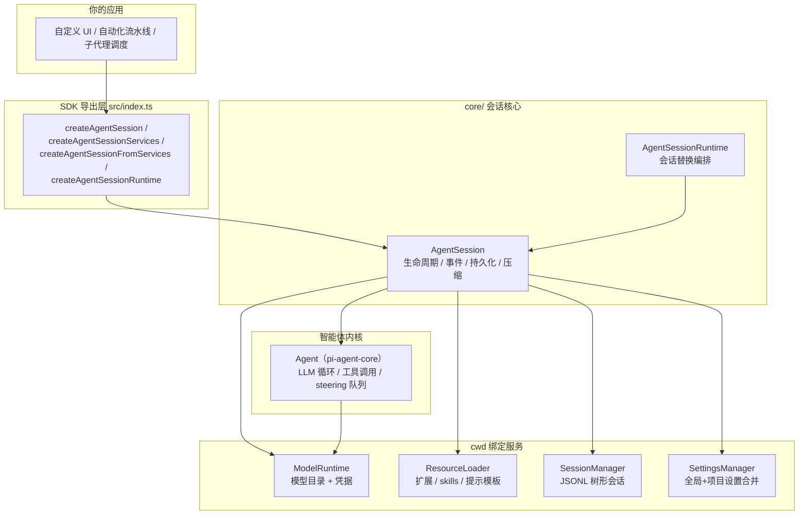
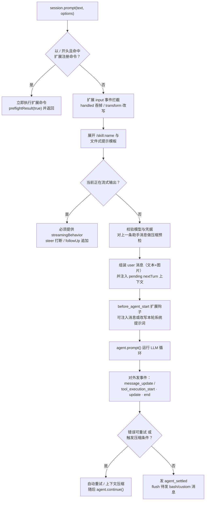

pi 的 CLI 只是它的一种"外壳"。真正的产品是 `@earendil-works/pi-coding-agent` 包导出的 SDK：一组工厂函数加上 `AgentSession` 这个核心抽象，让你能在自己的 Node.js 进程里直接驱动一个具备读写、执行、编辑能力的编码智能体。本页面向中间级开发者，拆解这个嵌入层的三个层次——`createAgentSession()` 单会话工厂、`AgentSession` 会话内核、`AgentSessionRuntime` 会话替换编排——并给出事件流、prompt 管线与选型建议。阅读本页前，建议先浏览[项目概览](1-xiang-mu-gai-lan-zui-xiao-hua-zhong-duan-bian-ma-zhi-neng-ti-tao-jian)与[四种运行模式](6-si-chong-yun-xing-mo-shi-jiao-hu-da-yin-json-rpc-yu-sdk)建立整体认知。

Sources: [docs/sdk.md](packages/coding-agent/docs/sdk.md#L3-L14)、[package.json](packages/coding-agent/package.json#L6-L15)

## AgentSession：四种运行模式共享的会话内核

`AgentSession` 的类头注释开宗明义：它是"智能体生命周期与会话管理的核心抽象"，被交互、打印、RPC 三种运行模式共同复用；各模式只在其上叠加自己的 I/O 层。它封装了五件事——Agent 状态访问、带自动持久化的事件订阅、模型与思考级别管理、手动与自动上下文压缩、会话切换与分支。这意味着你通过 SDK 嵌入时，得到的不是"阉割版"，而是与官方 TUI 完全同源的内核。

Sources: [agent-session.ts](packages/coding-agent/src/core/agent-session.ts#L1-L14)

从导出面看，`src/index.ts` 把 SDK 需要的一切集中在一个主入口：`AgentSession` 及其事件类型、`createAgentSession` / `createAgentSessionServices` / `createAgentSessionFromServices` / `createAgentSessionRuntime` 四个工厂、`ModelRuntime`、`DefaultResourceLoader`、`SessionManager`、`SettingsManager`、工具工厂，甚至 `runPrintMode` / `runRpcMode` / `InteractiveMode` / `RpcClient` 这些运行模式本身也可编程调用。

Sources: [index.ts](packages/coding-agent/src/index.ts#L203-L231)、[index.ts](packages/coding-agent/src/index.ts#L346-L365)、[modes/index.ts](packages/coding-agent/src/modes/index.ts#L1-L19)

## SDK 架构总览

理解嵌入层的关键，是分清"会话"与"服务"两类对象：`AgentSession` 是有状态的活动主体，而 `ModelRuntime`、`ResourceLoader`、`SessionManager`、`SettingsManager` 是围绕它、按 cwd 绑定重建的基础服务。下图展示一个典型的嵌入应用如何逐层获得能力：



`AgentSession` 在构造时持有全部协作者：`agent`、`sessionManager`、`settingsManager`、`resourceLoader`、`modelRuntime` 等都来自 `AgentSessionConfig`。工具白名单（`allowedToolNames`）、黑名单（`excludedToolNames`）与初始激活工具（`initialActiveToolNames`）也在这一层传入。

Sources: [agent-session.ts](packages/coding-agent/src/core/agent-session.ts#L200-L230)

## createAgentSession()：单会话工厂

`createAgentSession()` 是 90% 嵌入场景的入口。官方文档的 Quick Start 只有四行：创建 `ModelRuntime`、调用工厂、订阅事件、发送 prompt。

```typescript
import { createAgentSession, ModelRuntime, SessionManager } from "@earendil-works/pi-coding-agent";

const modelRuntime = await ModelRuntime.create();
const { session } = await createAgentSession({
  sessionManager: SessionManager.inMemory(),
  modelRuntime,
});

session.subscribe((event) => {
  if (event.type === "message_update" && event.assistantMessageEvent.type === "text_delta") {
    process.stdout.write(event.assistantMessageEvent.delta);
  }
});

await session.prompt("What files are in the current directory?");
```

Sources: [docs/sdk.md](packages/coding-agent/docs/sdk.md#L16-L34)

工厂的选项接口 `CreateAgentSessionOptions` 是嵌入时的"总开关"。核心默认值如下表（完整字段见源码注释）：

| 选项 | 默认值 | 说明 |
|------|--------|------|
| `cwd` | `process.cwd()` | 项目本地资源发现（扩展、skills、AGENTS.md）与工具路径解析 |
| `agentDir` | `~/.pi/agent` | 全局配置目录（凭据、models.json、全局扩展） |
| `modelRuntime` | 基于 `agentDir/auth.json` 与 `models.json` 创建 | 模型目录与凭据的规范运行时 |
| `model` / `thinkingLevel` | 从设置恢复，否则首个可用模型 / `"medium"`（并按模型能力钳制） | 指定模型与思考级别 |
| `tools` / `excludeTools` / `noTools` | 默认启用 `read, bash, edit, write` | 工具白名单、黑名单、全禁开关 |
| `customTools` | `[]` | 在扩展之外直接注册的 `ToolDefinition` |
| `resourceLoader` | `DefaultResourceLoader` 并自动 `reload()` | 资源加载器 |
| `sessionManager` | `SessionManager.create(cwd)` | 会话持久化策略 |
| `settingsManager` | `SettingsManager.create(cwd, agentDir)` | 设置覆盖 |
| `scopedModels` | `[]` | 交互模式下 Ctrl+P 循环切换的模型集合 |

Sources: [sdk.ts](packages/coding-agent/src/core/sdk.ts#L39-L88)

恢复逻辑是这个工厂最"贴心"的部分：如果传入的 `sessionManager` 已有历史数据，`createAgentSession` 会先从会话上下文恢复上次使用的模型（且仅在该 provider 已配置凭据时才恢复，否则产生 `modelFallbackMessage` 警告），再恢复思考级别；都没有时才走 `findInitialModel`（设置默认 → 供应商默认）。会话恢复时消息直接注入 `agent.state.messages`；全新会话则把初始模型与思考级别写进会话文件，保证下次 resume 可还原。

Sources: [sdk.ts](packages/coding-agent/src/core/sdk.ts#L192-L227)、[sdk.ts](packages/coding-agent/src/core/sdk.ts#L374-L386)

返回值 `CreateAgentSessionResult` 包含三部分：`session`（即 `AgentSession`）、`extensionsResult`（供宿主 UI 绑定扩展上下文）、`modelFallbackMessage`（模型回退提示，官方示例会直接打印）。注意错误不会导致启动失败——非致命问题都收敛为消息返回给调用方自行处理。

Sources: [sdk.ts](packages/coding-agent/src/core/sdk.ts#L90-L98)、[11-sessions.ts](packages/coding-agent/examples/sdk/11-sessions.ts#L24-L29)

## 组装过程：SDK 如何把部件装进 Agent

在返回 `AgentSession` 之前，工厂实际完成了一次完整的 Agent 组装，其中三处细节值得嵌入者了解。其一，模块加载时通过 `setDefaultStreamFn(streamSimple)` 保留了 0.81 之前的回退行为——扩展若自行构造 `Agent` 实例却不传 `streamFn`，仍能使用 pi-ai 的默认流式实现，因为 agent 内核刻意保持供应商无关、不反向依赖 pi-ai。

Sources: [sdk.ts](packages/coding-agent/src/core/sdk.ts#L34-L37)

其二，注入的 `streamFn` 把设置驱动的网络策略（供应商重试参数、HTTP 空闲超时、WebSocket 连接超时）与扩展拦截点（`before_provider_headers` 请求头改写、`before_provider_request` 载荷拦截、`after_provider_response` 响应监听）全部织入请求路径，并附加供应商归因请求头。这意味着你在 SDK 中获得的每一次 LLM 调用都自动具备重试、超时与扩展可观测性。

Sources: [sdk.ts](packages/coding-agent/src/core/sdk.ts#L306-L372)

其三，`convertToLlm` 被包了一层 `convertToLlmWithBlockImages`：它动态读取设置中的图片屏蔽开关，若启用则把消息中的图片内容替换为"Image reading is disabled."占位文本，且每轮调用实时判断、中途改设置即刻生效。这是 SDK 层面纵深防御的一个典型样本。

Sources: [sdk.ts](packages/coding-agent/src/core/sdk.ts#L267-L302)

## prompt()：一条消息的完整旅程

`AgentSession.prompt()` 远不止"发消息"那么简单。它是一条包含扩展命令、输入拦截、模板展开、队列分流与前置校验的完整管线：



Sources: [agent-session.ts](packages/coding-agent/src/core/agent-session.ts#L1150-L1317)

管线中两个设计点对宿主应用尤其重要。一是 `PromptOptions.preflightResult` 回调：它在 prompt 被接受/排队/即时处理时回调 `true`，在预检阶段被拒绝时回调 `false`，且保证在 `prompt()` resolve 之前触发——RPC 模式正是靠它把"提交是否成功"与"运行是否完成"解耦。二是运行结束语义：`prompt()` 只在**整个被接受的运行**（含自动重试与压缩后的续跑）结束后才 resolve，运行中的失败走正常事件流而非异常抛出。

Sources: [agent-session.ts](packages/coding-agent/src/core/agent-session.ts#L1105-L1148)、[docs/sdk.md](packages/coding-agent/docs/sdk.md#L180-L199)

若在流式期间调用 `prompt()` 而未指定 `streamingBehavior`，会直接抛错——这是一个刻意设计的防呆：你必须显式选择"打断当前回合"（steer）还是"等本轮结束后追加"（followUp）。

Sources: [agent-session.ts](packages/coding-agent/src/core/agent-session.ts#L1209-L1223)

## steer / followUp：流式中的消息排队

SDK 把"运行中插入指令"做成了一等公民。`steer()` 在当前助手回合的工具调用结束后立即投递消息（打断导向），`followUp()` 则排队到智能体完全停下后才投递。两者都会展开文件式提示模板，但对扩展命令直接报错——扩展命令不允许排队执行。两个队列的状态通过 `queue_update` 事件实时对外可见，`clearQueue()` 可以一次性取走并清空。

Sources: [agent-session.ts](packages/coding-agent/src/core/agent-session.ts#L1387-L1421)、[agent-session.ts](packages/coding-agent/src/core/agent-session.ts#L1587-L1598)

## 事件驱动：subscribe 与自动持久化

`session.subscribe(listener)` 返回取消函数，允许多个监听者并存。但 `AgentSession` 真正的价值在于：它在构造函数中**无条件**订阅了内核 Agent 的事件流，注释写明这是为了"内部处理——会话持久化、扩展分发、自动压缩、重试逻辑"。也就是说，即使你的宿主应用一个监听器都不注册，持久化和压缩照常运转。

Sources: [agent-session.ts](packages/coding-agent/src/core/agent-session.ts#L384-L410)、[agent-session.ts](packages/coding-agent/src/core/agent-session.ts#L857-L867)

对嵌入者而言，`AgentSessionEvent` 是你最常打交道的类型。它在内核 `AgentEvent` 之上扩展了会话级事件（注意 `agent_end` 被改造为携带 `messages` 与 `willRetry`，并新增 `agent_settled` 表示"一切尘埃落定"）：

| 类别 | 事件 | 嵌入时的典型用途 |
|------|------|------------------|
| 流式增量 | `message_update`（`text_delta` / `thinking_delta` / `tool_delta`） | 实时渲染回复与思考 |
| 工具执行 | `tool_execution_start` / `update` / `end` | 展示工具进度条与结果 |
| 消息生命周期 | `message_start` / `message_end` | 增量更新消息列表 |
| 回合与运行 | `turn_start` / `turn_end` / `agent_start` / `agent_end` | 回合边界统计 |
| 会话级 | `agent_settled` / `queue_update` / `entry_appended` / `session_info_changed` | 空闲信号、队列指示器 |
| 压缩 | `compaction_start` / `compaction_end`（含 `reason: manual \| threshold \| overflow`） | 压缩进度提示 |
| 自动重试 | `auto_retry_start` / `auto_retry_end`、`summarization_retry_*` | 网络错误恢复展示 |
| 独立 bash | `bash_execution_update` | 宿主侧直接执行 shell 时的输出流 |

Sources: [agent-session.ts](packages/coding-agent/src/core/agent-session.ts#L143-L188)

持久化的触发点在内部事件处理器里：每当 `message_end` 到达，用户/助手/工具结果消息写入 `SessionManager`，扩展产生的 custom 消息则持久化为 `CustomMessageEntry`；助手消息同时被记录为"最后一条"，供 `agent_end` 时判断是否需要自动压缩或重试。`turn_end` 时会 flush 运行期间排队的仅上下文 custom 消息，保证它们不会插在工具调用与结果之间。

Sources: [agent-session.ts](packages/coding-agent/src/core/agent-session.ts#L643-L723)

## 生命周期控制：bindExtensions、abort 与 dispose

`bindExtensions()` 是宿主应用把自身能力"借"给扩展的接合点：UI 上下文（对话框/编辑器/小组件）、运行模式、命令上下文动作、中断与退出处理器、错误监听都从这里注入，随后触发 `session_start` 事件并从扩展处回收额外资源。官方 13 号示例展示了标准做法——每次会话替换后都要对新 session 重新调用 `bindExtensions({})` 并重新订阅事件。

Sources: [agent-session.ts](packages/coding-agent/src/core/agent-session.ts#L2445-L2468)、[13-session-runtime.ts](packages/coding-agent/examples/sdk/13-session-runtime.ts#L38-L50)

收尾时，`dispose()` 依次中止重试、压缩、分支摘要、独立 bash 与内核 Agent，然后**使所有扩展上下文失效**（防止持有旧 `pi` 引用的代码在会话替换后继续运行），断开事件连接并清理会话级资源。`dispose()` 被设计为永不抛出，即使某个 abort 钩子出错。

Sources: [agent-session.ts](packages/coding-agent/src/core/agent-session.ts#L881-L898)

## 三级 API：从单会话到运行时替换

SDK 的工厂体系刻意分了三级，各自解决不同的嵌入形态：

| API 层 | 入口 | 适用场景 |
|--------|------|----------|
| 单会话工厂 | `createAgentSession()` | 绝大多数嵌入：一次创建一个会话，用完即弃 |
| 服务拆分 | `createAgentSessionServices()` + `createAgentSessionFromServices()` | 先针对目标 cwd 建好模型/资源/设置服务，再解析会话选项后建会话 |
| 会话替换运行时 | `createAgentSessionRuntime()` + `AgentSessionRuntime` | 需要在进程内持续 new / resume / fork / import 会话的长生命周期应用 |

Sources: [agent-session-services.ts](packages/coding-agent/src/core/agent-session-services.ts#L130-L193)、[agent-session-runtime.ts](packages/coding-agent/src/core/agent-session-runtime.ts#L416-L440)

`AgentSessionServices` 明确定义为"一个有效会话 cwd 下的内聚服务集合"——cwd、agentDir、modelRuntime、settingsManager、resourceLoader 五件套，外加创建期间收集的 `diagnostics`（`info` / `warning` / `error` 三级非致命问题，由调用方决定展示或中止）。这个"诊断而非打印"的约定是 SDK 与 CLI 的关键区别：CLI 拿到诊断后决定怎么报错，SDK 应用则拿到原始数据。

Sources: [agent-session-services.ts](packages/coding-agent/src/core/agent-session-services.ts#L25-L28)、[agent-session-services.ts](packages/coding-agent/src/core/agent-session-services.ts#L73-L80)

`AgentSessionRuntime` 拥有当前会话及其服务的所有权，`newSession()` / `switchSession()` / `fork()` / `importFromJsonl()` 共享同一套替换协议：先让进行中的回合 `abort()` 落盘，触发 `session_shutdown` 扩展事件，失效旧会话，然后用**同一个工厂闭包**为新的 cwd/会话目标重建整套服务与会话。工厂模式保证了 `/new`、`/resume`、`/fork` 之后的运行时与初始启动完全一致——这正是官方 CLI 的 `main.ts` 传给 `createAgentSessionRuntime` 的做法（项目信任解析、扩展路径、模型范围都在工厂里处理）。

Sources: [agent-session-runtime.ts](packages/coding-agent/src/core/agent-session-runtime.ts#L67-L95)、[agent-session-runtime.ts](packages/coding-agent/src/core/agent-session-runtime.ts#L167-L178)、[main.ts](packages/coding-agent/src/main.ts#L713-L846)

替换行为有四条铁律，官方文档逐条列出：`runtime.session` 在替换后会变化；事件订阅绑定在具体 `AgentSession` 上，替换后必须**重新订阅**；使用扩展的应用必须对新会话重新 `bindExtensions()`；诊断在 `runtime.diagnostics` 上，替换失败则方法抛错、由调用方决定善后。官方 13 号示例给出标准的重绑循环：

```typescript
let unsubscribe: (() => void) | undefined;

async function bindSession() {
  unsubscribe?.();
  const session = runtime.session;
  await session.bindExtensions({});
  unsubscribe = session.subscribe((event) => { /* ... */ });
  return session;
}

let session = await bindSession();
await runtime.newSession();      // 替换后
session = await bindSession();   // 重新绑定
```

Sources: [docs/sdk.md](packages/coding-agent/docs/sdk.md#L153-L167)、[13-session-runtime.ts](packages/coding-agent/examples/sdk/13-session-runtime.ts#L38-L67)

## 官方示例导览：13 个递进式样例

`examples/sdk/` 目录提供了一条从零到完全掌控的学习路径，README 中有对照表：

| 示例 | 主题 |
|------|------|
| `01-minimal.ts` | 全默认配置的最小用法（含 dispose 收尾） |
| `02-custom-model.ts` | 选择模型与思考级别 |
| `03-custom-prompt.ts` | 通过 `systemPromptOverride` 替换或追加系统提示词 |
| `04-skills.ts` | 发现、过滤或注入自定义 skills |
| `05-tools.ts` | 内置工具白名单与自定义 cwd |
| `06-extensions.ts` | 内联扩展：日志、输入拦截、结果修改 |
| `07-context-files.ts` | 虚拟 AGENTS.md 上下文文件 |
| `08-prompt-templates.ts` | 文件式斜杠命令（提示模板） |
| `09-api-keys-and-oauth.ts` | API key 解析、运行时 key、OAuth 配置 |
| `10-settings.ts` | 压缩/重试/终端设置覆盖与 in-memory 设置 |
| `11-sessions.ts` | in-memory、持久化、continueRecent、list 与 open |
| `12-full-control.ts` | 关闭一切自动发现，逐项显式注入 |
| `13-session-runtime.ts` | `AgentSessionRuntime` 级会话替换与重绑 |

Sources: [examples/sdk/README.md](packages/coding-agent/examples/sdk/README.md#L14-L26)

其中 1 号示例是所有嵌入的骨架——订阅 `message_update` 中的 `text_delta` 实时打印，`prompt()` 完成后遍历 `session.state.messages`，最后在 `finally` 中 `dispose()`：

```typescript
const { session } = await createAgentSession();
try {
  session.subscribe((event) => {
    if (event.type === "message_update" && event.assistantMessageEvent.type === "text_delta") {
      process.stdout.write(event.assistantMessageEvent.delta);
    }
  });
  await session.prompt("What files are in the current directory?");
} finally {
  session.dispose();
}
```

Sources: [01-minimal.ts](packages/coding-agent/examples/sdk/01-minimal.ts#L10-L26)

## 嵌入选型：SDK 还是 RPC？

pi 同时提供进程内 SDK 与子进程 RPC 两种嵌入方式，官方文档给出了明确的取舍标准：

| 维度 | SDK（同进程） | RPC 模式（子进程） |
|------|--------------|-------------------|
| 宿主语言 | TypeScript / JavaScript | 任意语言（stdin/stdout 上的 JSON 协议） |
| 类型安全 | 完整 TS 类型直达事件与状态 | 需自行维护协议映射 |
| 状态访问 | 直接读写 `session.agent.state` | 经 JSON-RPC 请求与事件 |
| 进程隔离 | 无 | 有（崩溃隔离、独立生命周期） |
| 定制方式 | 程序化注入工具、扩展、资源加载器 | 经 CLI 参数与扩展文件 |
| 典型场景 | 自定义 UI、自动化流水线、子代理 | 跨语言集成、需要隔离的托管运行 |

Sources: [docs/sdk.md](packages/coding-agent/docs/sdk.md#L1150-L1169)

两条路径并非互斥：SDK 导出了 `runPrintMode` / `runRpcMode` / `InteractiveMode` / `RpcClient`，意味着你可以在 SDK 应用里复用官方运行模式实现（官方文档的"Complete Example"就演示了用运行时工厂 + `runPrintMode` 驱动打印模式），而 subagent 示例则采用另一条思路——通过扩展在运行中的会话里再拉起多个 pi 子进程充当隔离上下文的子智能体。

Sources: [docs/sdk.md](packages/coding-agent/docs/sdk.md#L1100-L1146)、[modes/index.ts](packages/coding-agent/src/modes/index.ts#L1-L19)、[examples/extensions/subagent/README.md](packages/coding-agent/examples/extensions/subagent/README.md#L1-L9)

## 小结与下一步

把嵌入层浓缩成一句话：**`createAgentSession()` 负责"一次性把世界组装好"，`AgentSession` 负责"活着的事件流与持久化"，`AgentSessionRuntime` 负责"在长生命周期应用里安全地换会话"**。所有诊断以数据形式返回而非打印，所有副作用（重试、压缩、持久化、扩展分发）默认开启，你可以按需显式关闭。

想继续深入，推荐按以下顺序：

- 想理解 `session.agent` 背后的内核循环，读 [Agent 运行时：事件流、工具调用与状态管理](7-agent-yun-xing-shi-shi-jian-liu-gong-ju-diao-yong-yu-zhuang-tai-guan-li)；
- 想自定义传给 LLM 的消息序列，读 [AgentMessage 与上下文转换管线（transformContext / convertToLlm）](8-agentmessage-yu-shang-xia-wen-zhuan-huan-guan-xian-transformcontext-converttollm)；
- 想写 SDK 中注入的 `customTools` 与 `extensionFactories`，读 [扩展系统：事件拦截、自定义工具与自定义 UI](19-kuo-zhan-xi-tong-shi-jian-lan-jie-zi-ding-yi-gong-ju-yu-zi-ding-yi-ui)；
- 想搞懂 `sessionManager` 的 JSONL 树与会话文件，读 [会话 JSONL 格式与 SessionManager](21-hui-hua-jsonl-ge-shi-yu-sessionmanager)；
- 若你的宿主不在 Node 生态，跨进程方案见 [RPC 模式：stdin/stdout 上的 JSON 协议与帧规则](17-rpc-mo-shi-stdin-stdout-shang-de-json-xie-yi-yu-zheng-gui-ze)。