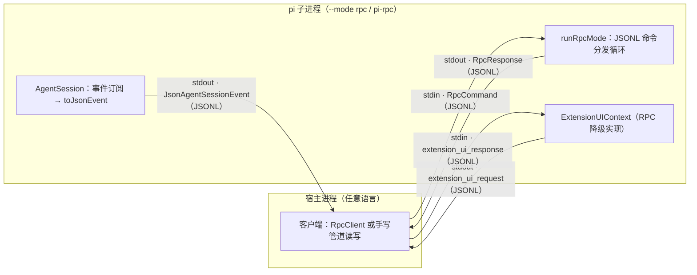
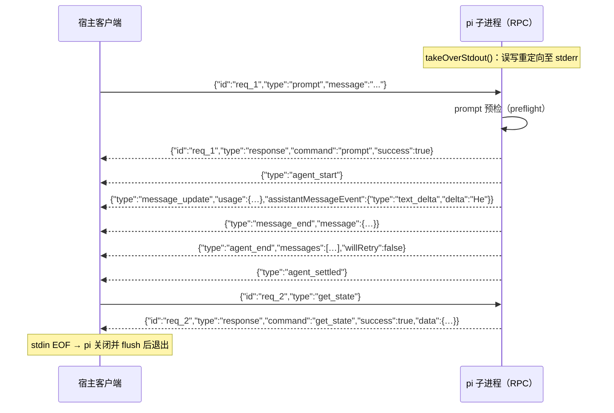

RPC 模式是 pi coding-agent 面向进程级嵌入的头等公民接口：它把整个智能体会话封装进一个子进程，通过 stdin/stdout 上的**严格 JSONL**（按行分隔的 JSON）通道进行命令下发、事件流式推送与响应关联。本文从协议形态、传输帧规则、输出通道独占、扩展 UI 子协议到生命周期语义，逐层拆解其实现。与 SDK 方式（直接 import `AgentSession`）相比，RPC 模式适合非 Node.js 宿主或需要进程隔离的场景。

Sources: [rpc-mode.ts](packages/coding-agent/src/modes/rpc/rpc-mode.ts#L1-L16), [README.md](packages/coding-agent/README.md#L481-L491)

## 一、进程拓扑与启动路径

RPC 模式有两条等价的启动路径。其一是标准 CLI 参数 `--mode rpc`：`parseArgs` 将 `Mode` 判别为 `"text" | "json" | "rpc"` 三值之一，`main.ts` 在完成会话初始化后进入 `runRpcMode(runtime)` 分支。其二是独立入口 `rpc-entry.ts`：它把进程标题改为 `pi-rpc`、注入 `PI_CODING_AGENT=true` 等环境标记，然后把剩余 argv 拼接为 `["--mode", "rpc", ...]` 转交给 `main`——本质上是同一条代码路径的包装。

两个细节决定了 RPC 模式的 I/O 语义：第一，`main.ts` 在读取管道 stdin 内容之前显式跳过 RPC 模式，因为其 stdin 已被保留为命令通道，不能与 `-p` 式的管道输入混用；第二，模型目录在后台以 15 秒超时异步刷新，不阻塞命令循环启动。



Sources: [args.ts](packages/coding-agent/src/cli/args.ts#L11-L99), [rpc-entry.ts](packages/coding-agent/src/rpc-entry.ts#L1-L14), [main.ts](packages/coding-agent/src/main.ts#L869-L876), [main.ts](packages/coding-agent/src/main.ts#L921-L932)

## 二、传输层：严格 JSONL 帧规则

这是本协议最容易踩坑、也被作者刻意工程化的部分。**帧规则是 LF-only 的严格 JSONL**：`serializeJsonLine` 仅做 `JSON.stringify(value) + "\n"`，解码侧 `attachJsonlLineReader` 以 `\n` 作为唯一记录分隔符，并容忍 `\r\n` 输入（剥离行尾 `\r`）。流结束时若残留未换行的尾部数据，会作为最后一条完整记录发出。

关键的设计决策是**刻意绕开 Node 的 `readline` 模块**。`readline` 除 `\n` 外还会按 Unicode 行分隔符 U+2028、U+2029 切分——而这两个码点在 JSON 字符串内是合法内容（`JSON.stringify` 不转义它们）。如果客户端用 `readline` 读 stdout，一条包含这些字符的合法 JSON 行会被错误地撕成多条残片。解码侧还通过 `StringDecoder("utf8")` 处理跨 chunk 的多字节 UTF-8 序列，避免半个汉字被误判为损坏行。官方 README 与 `docs/rpc.md` 均明确要求：**客户端必须只按 `\n` 切分，禁止使用通用行读取器**。这一行为由 `test/rpc-jsonl.test.ts` 的四个用例锁定：U+2028/U+2029 保留、CRLF 兼容、无尾随 LF 的末行、以及负载内分隔符不被切分。

| 切分策略 | `\n` 之外的分隔符 | 多字节 UTF-8 安全 | 协议兼容性 |
|---|---|---|---|
| Node `readline` | U+2028 / U+2029 | — | ❌ 会撕裂合法 JSON |
| `attachJsonlLineReader` | 无（仅 `\n`，容忍 `\r`） | ✅ StringDecoder | ✅ 严格 JSONL |

Sources: [jsonl.ts](packages/coding-agent/src/modes/rpc/jsonl.ts#L8-L59), [rpc-jsonl.test.ts](packages/coding-agent/test/rpc-jsonl.test.ts#L5-L47), [README.md](packages/coding-agent/README.md#L489-L491), [docs/rpc.md](packages/coding-agent/docs/rpc.md#L28-L37)

## 三、stdout 独占与背压控制

协议通道必须免受杂散输出的污染。`runRpcMode` 启动时第一件事就是 `takeOverStdout()`：把 `process.stdout.write` 整体重绑到 stderr。此后任何扩展或库代码里的 `console.log` 都会落到 stderr——宿主侧（如 `RpcClient`）把 stderr 收集为调试信息——而 stdout 上只剩协议帧。真正的协议写入只经 `writeRawStdout`，它把所有写操作串接在一条 `rawStdoutWriteTail` Promise 链上，天然保证**帧的顺序性与原子边界**；对 `ENOBUFS`/`EAGAIN`/`EWOULDBLOCK` 三类瞬态错误以 10ms 间隔重试，写链失败则直接退出进程。

背压处理分两个层面：命令循环在每次发出响应后 `await waitForRawStdoutBackpressure()`，即等待写链追平当前尾部，确保响应在继续处理下一条命令前已实际落盘；同时 `rebindSession` 订阅 `session.agent` 的回调，在每个 agent 事件 tick 之后也等待写链追平，防止流式事件积压撑爆管道缓冲。关闭路径（非 SIGTERM）同样先 `flushRawStdout` 再退出。

Sources: [rpc-mode.ts](packages/coding-agent/src/modes/rpc/rpc-mode.ts#L50-L66), [output-guard.ts](packages/coding-agent/src/core/output-guard.ts#L19-L52), [output-guard.ts](packages/coding-agent/src/core/output-guard.ts#L54-L75), [output-guard.ts](packages/coding-agent/src/core/output-guard.ts#L79-L108), [rpc-mode.ts](packages/coding-agent/src/modes/rpc/rpc-mode.ts#L313-L364)

## 四、协议消息分类法

线上共有四类消息，全部是单行 JSON 对象，通过 `type` 字段判别：

| 类别 | 方向 | `type` 取值 | 关联机制 | 语义 |
|---|---|---|---|---|
| 命令 | 宿主 → pi | 约 35 个命令名（`prompt`、`get_state`…） | 可选 `id` | 触发一个操作或查询 |
| 响应 | pi → 宿主 | 固定 `"response"` | 回显命令的 `id` | `{command, success, data?}` 或 `{success:false, error}` |
| 事件 | pi → 宿主 | 事件名（`agent_start`、`message_update`…） | 一般无 `id` | 智能体运行状态流（无需请求） |
| 扩展 UI 请求/响应 | 双向 | `"extension_ui_request"` / `"extension_ui_response"` | UUID `id` | 扩展向宿主申请用户交互的子协议 |

响应的类型系统值得注意：`RpcResponse` 是逐命令枚举的判别联合——每个 `command` 的 `data` 载荷形状都被静态编码，而错误分支统一为 `{command: string; success: false; error: string}` 可匹配任意命令。`id` 在整个协议中是可选的：省略时命令仍会执行，只是响应无法与请求强关联；`bash_execution_update` 事件会额外携带发起它的 `bash` 命令的 `id`，是唯一携带请求关联信息的事件。

Sources: [rpc-types.ts](packages/coding-agent/src/modes/rpc/rpc-types.ts#L20-L83), [rpc-types.ts](packages/coding-agent/src/modes/rpc/rpc-types.ts#L112-L239), [rpc-types.ts](packages/coding-agent/src/modes/rpc/rpc-types.ts#L246-L291), [docs/rpc.md](packages/coding-agent/docs/rpc.md#L20-L37)

## 五、命令集全景

`handleCommand` 是一个覆盖全部命令类型的巨型 switch，命令按职责分为十组：

| 分组 | 命令 | 备注 |
|---|---|---|
| 提示 | `prompt` / `steer` / `follow_up` / `abort` / `clear_queue` / `new_session` | `prompt` 支持图片与 `streamingBehavior`（`steer`/`followUp`） |
| 状态 | `get_state` | 返回模型、思考等级、流式/压缩标志、队列模式、会话文件等完整快照 |
| 模型 | `set_model` / `cycle_model` / `get_available_models` | `set_model` 未命中时返回错误响应 |
| 思考 | `set_thinking_level` / `cycle_thinking_level` / `get_available_thinking_levels` | |
| 队列模式 | `set_steering_mode` / `set_follow_up_mode` | `all` 与 `one-at-a-time` |
| 压缩 | `compact` / `set_auto_compaction` | `compact` 同步等待 `CompactionResult` |
| 重试 | `set_auto_retry` / `abort_retry` | |
| Bash | `bash` / `abort_bash` | 直连执行，`bash_execution_update` 事件流式回传输出块 |
| 会话 | `get_session_stats` / `export_html` / `switch_session` / `fork` / `clone` / `get_fork_messages` / `get_entries`（支持 `since` 增量）/ `get_tree` / `get_last_assistant_text` / `set_session_name` | `switch_session`/`fork`/`clone` 可能触发会话重绑 |
| 元信息 | `get_messages` / `get_commands` | `get_commands` 汇集扩展命令、提示模板与技能 |

`prompt` 命令的响应语义与众不同：它是**异步预检制**。命令处理函数立即启动 `session.prompt`，但权威响应要等 prompt 预检成功后经 `preflightResult` 回调发出——排队或被立即处理的 prompt 都算成功；预检失败则返回 `success:false`。这保证了"响应成功"严格等价于"prompt 已被接受"，而接受之后的失败只通过事件流报告，不会对同一 `id` 发出第二个响应。

Sources: [rpc-types.ts](packages/coding-agent/src/modes/rpc/rpc-types.ts#L20-L83), [rpc-mode.ts](packages/coding-agent/src/modes/rpc/rpc-mode.ts#L386-L416), [rpc-mode.ts](packages/coding-agent/src/modes/rpc/rpc-mode.ts#L450-L466), [rpc-mode.ts](packages/coding-agent/src/modes/rpc/rpc-mode.ts#L715-L719), [docs/rpc.md](packages/coding-agent/docs/rpc.md#L39-L60)

## 六、事件流与增量序列化优化

事件是 `AgentSessionEvent`（约 20 种判别成员：`agent_start`/`agent_end`/`agent_settled`、`turn_start`/`turn_end`、`message_start`/`message_update`/`message_end`、工具执行三段事件、`queue_update`、压缩、自动重试、总结重试、`extension_error` 等）经 `toJsonEvent` 变换后的 JSON 投影。其中 `message_update` 的变换是刻意的**带宽优化**：原始事件携带累积的 assistant 消息快照（`partial`），随流式增长呈 O(n) 重复；JSON/RPC 投影将其剥离，只保留 O(1) 大小的 `usage` 与 delta 事件。协议约定为：`message_start` 给出初始消息、增量按 `contentIndex` 拼装、`message_end.message` 为权威终稿。`toolcall_start` 特殊处理——它把工具调用的 `id` 与 `toolName` 从大体积 `partial` 中抽出平铺到事件顶层，让客户端无需解析快照即可获知是哪个工具。



Sources: [json-event.ts](packages/coding-agent/src/modes/json-event.ts#L1-L62), [agent-session.ts](packages/coding-agent/src/core/agent-session.ts#L144-L185), [docs/rpc.md](packages/coding-agent/docs/rpc.md#L855-L883), [docs/rpc.md](packages/coding-agent/docs/rpc.md#L938-L996)

## 七、扩展 UI 子协议：TUI 能力的远程投射

扩展通过 `ctx.ui.select()`、`ctx.ui.confirm()` 等发起用户交互。RPC 模式将这套 TUI 能力**投射为管道上的请求/响应子协议**，方法分两类：

- **对话框方法**（`select`、`confirm`、`input`、`editor`）：agent 侧发出 `extension_ui_request`（UUID `id`），随后挂起一个 Promise，注册进 `pendingExtensionRequests` 映射；直到宿主回发匹配 `id` 的 `extension_ui_response` 才 resolve。支持 `AbortSignal` 取消与 `timeout` 超时（超时由 **agent 侧**用默认值自动结算，宿主无需计时）。
- **即发即弃方法**（`notify`、`setStatus`、`setWidget`、`setTitle`、`set_editor_text`）：只发请求不等响应，由宿主自行决定展示或忽略。

并非所有 `ExtensionUIContext` 方法都能投射：需要真实 TUI 访问的能力被显式降级为无操作或固定值。这一降级契约有代码与文档双份记录：

| 方法 | RPC 模式行为 |
|---|---|
| `custom()` | 返回 `undefined` |
| `setWorkingMessage` / `setWorkingIndicator` / `setFooter` / `setHeader` / `setEditorComponent` / `setToolsExpanded` / `addAutocompleteProvider` / `setEditorComponent` | 无操作 |
| `getEditorText` | 返回 `""`（同步方法无法等待 RPC 往返） |
| `getToolsExpanded` | 返回 `false` |
| `pasteToEditor` | 委托给 `setEditorText`（无粘贴折叠处理） |
| `getAllThemes` / `getTheme` | 返回 `[]` / `undefined` |
| `setTheme` | 返回 `{success:false, error:…}` |

注意 `ctx.mode` 此时为 `"rpc"`，而 `ctx.hasUI` 仍为 `true`——因为对话框方法经子协议是可用的；扩展应以 `ctx.mode === "tui"` 守卫真正依赖终端的特性。

Sources: [rpc-mode.ts](packages/coding-agent/src/modes/rpc/rpc-mode.ts#L91-L152), [rpc-mode.ts](packages/coding-agent/src/modes/rpc/rpc-mode.ts#L210-L311), [rpc-types.ts](packages/coding-agent/src/modes/rpc/rpc-types.ts#L246-L291), [docs/rpc.md](packages/coding-agent/docs/rpc.md#L1184-L1210)

## 八、RpcClient：Node.js 侧的类型化参考实现

仓库自带的 `RpcClient` 既是可用组件，也是协议行为的参考实现。其内部状态机围绕三张表运转：`pendingRequests`（id → resolver）、`eventListeners`（事件广播列表）、以及累计的 `stderr` 缓冲。`send` 自动生成 `req_N` 递增 id，写 stdin 后启动 30 秒响应超时；子进程 exit/error/stdin 写失败任一发生时，所有挂起请求立即以携带 stderr 上下文的错误 reject。`handleLine` 的路由逻辑极简：`type === "response"` 且 `id` 命中挂起表则 resolve，否则一律广播为事件，非 JSON 行静默忽略（防御 stderr 混入不可期内容）。

在编排层面，客户端提供三个组合原语：`waitForIdle()`（等 `agent_settled` 事件，默认 60 秒超时）、`collectEvents()`（收集至 settled 为止的全部事件）、`promptAndWait()`（发送 prompt 并一次性收齐整轮事件）。`agent_settled` 的语义在此得到体现——它不仅意味着流结束，还意味着自动重试、压缩重试与排队续发都不再发生，是宿主判断"一轮真正结束"的可靠信号。

Sources: [rpc-client.ts](packages/coding-agent/src/modes/rpc/rpc-client.ts#L76-L140), [rpc-client.ts](packages/coding-agent/src/modes/rpc/rpc-client.ts#L464-L510), [rpc-client.ts](packages/coding-agent/src/modes/rpc/rpc-client.ts#L516-L535), [rpc-client.ts](packages/coding-agent/src/modes/rpc/rpc-client.ts#L548-L597)

## 九、生命周期与关闭语义

RPC 进程的关闭有四个入口，语义各有不同：

1. **stdin EOF**：宿主关闭写端即触发 `process.stdin "end"` → 正常 `shutdown()`（exit 0）。这是协作式关闭的推荐方式。
2. **扩展请求关闭**：扩展调用 shutdown handler 后仅置 `shutdownRequested` 标志；实际退出延迟到 `agent_settled` 事件或下一条命令处理完成之后——保证扩展可以在当前回合自然收尾。
3. **SIGTERM**：先 `killTrackedDetachedChildren` 清理被跟踪的分离子进程，随后以退出码 143 关闭，且**跳过 stdout flush**（SIGTERM 意味着宿主可能已不读）。
4. **SIGHUP**（非 Windows）：同上，退出码 129，但保留 flush。

`shutdown` 本身是幂等的：二次调用直接 `process.exit`。`runRpcMode` 的返回类型是 `Promise<never>`——函数末尾以 `return new Promise(() => {})` 永不 resolve，进程的存续完全由 Node 事件循环与上述信号驱动。

Sources: [rpc-mode.ts](packages/coding-agent/src/modes/rpc/rpc-mode.ts#L366-L383), [rpc-mode.ts](packages/coding-agent/src/modes/rpc/rpc-mode.ts#L722-L750), [rpc-mode.ts](packages/coding-agent/src/modes/rpc/rpc-mode.ts#L804-L821)

## 十、错误处理契约

错误路径有三层：帧内 JSON 解析失败返回 `{command:"parse", success:false}`（无 id，因为无从关联）；命令执行抛错被 `handleInputLine` 捕获后转为携带命令原始 `id` 的 `success:false` 响应；未知命令类型返回 `Unknown command: ${type}`（有回归测试 5868 锁定此行为）。值得注意 prompt 特殊性：预检失败的错误响应可能与随后的运行时错误事件流并存，文档明确"接受后的失败不走第二条响应"，防止宿主重复结算同一请求。

Sources: [rpc-mode.ts](packages/coding-agent/src/modes/rpc/rpc-mode.ts#L752-L802), [docs/rpc.md](packages/coding-agent/docs/rpc.md#L1376-L1395), [5868-rpc-unknown-command-id.test.ts](packages/coding-agent/test/suite/regressions/5868-rpc-unknown-command-id.test.ts#L1-L10)

## 十一、落地实践：最小宿主写法

对非 Node 宿主，Python 的最小实现只有两个函数——写入时追加 `\n` 并 flush，读取时逐行 `json.loads`：

```python
proc = subprocess.Popen(["pi", "--mode", "rpc", "--no-session"],
                        stdin=subprocess.PIPE, stdout=subprocess.PIPE, text=True)

def send(cmd):
    proc.stdin.write(json.dumps(cmd) + "\n")
    proc.stdin.flush()

for event in proc.stdout:          # 逐行迭代即逐帧迭代
    e = json.loads(event)
    if e.get("type") == "message_update":
        delta = e.get("assistantMessageEvent", {})
        if delta.get("type") == "text_delta":
            print(delta["delta"], end="", flush=True)
```

Node.js 宿主则可直接复用 `RpcClient`（`npx tsx test/rpc-example.ts` 是可运行的交互示例），或按 `docs/rpc.md` 的参考代码自建基于 `StringDecoder` 的 JSONL 读取器。扩展 UI 子协议的完整端到端示例见 `examples/rpc-extension-ui.ts`（宿主侧）与 `examples/extensions/rpc-demo.ts`（扩展侧）配对使用。

Sources: [docs/rpc.md](packages/coding-agent/docs/rpc.md#L1526-L1619), [rpc-example.ts](packages/coding-agent/test/rpc-example.ts#L1-L87), [rpc.md](packages/coding-agent/docs/rpc.md#L1562-L1575)

---

**选型提示**：若宿主是 Node.js/TypeScript 应用，优先考虑 [AgentSession 与 SDK：将智能体嵌入自有应用](16-agentsession-yu-sdk-jiang-zhi-neng-ti-qian-ru-zi-you-ying-yong)——RPC 模式的全部命令即 SDK 方法的进程化镜像，两者共享同一事件模型。若需要了解事件在智能体核心中的产生方式，参见 [Agent 运行时：事件流、工具调用与状态管理](7-agent-yun-xing-shi-shi-jian-liu-gong-ju-diao-yong-yu-zhuang-tai-guan-li)；若需要理解消息在持久层的形态（RPC `get_entries`/`get_tree` 返回的数据结构），参见 [会话 JSONL 格式与 SessionManager](21-hui-hua-jsonl-ge-shi-yu-sessionmanager)。扩展 UI 子协议背后的完整扩展体系在 [扩展系统：事件拦截、自定义工具与自定义 UI](19-kuo-zhan-xi-tong-shi-jian-lan-jie-zi-ding-yi-gong-ju-yu-zi-ding-yi-ui) 展开。