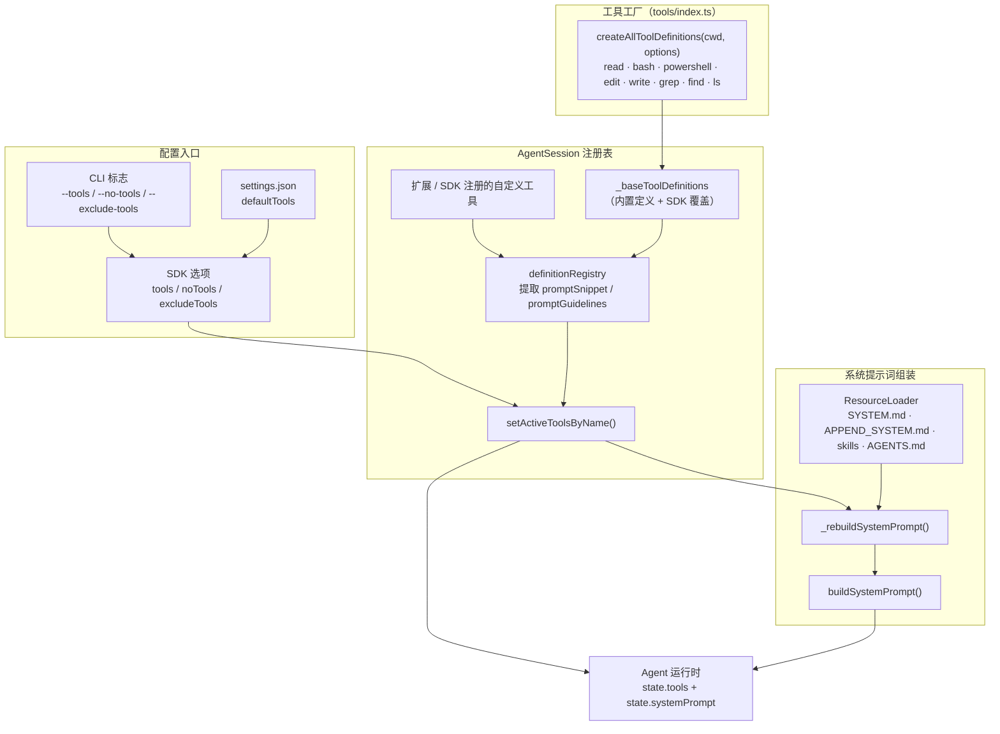
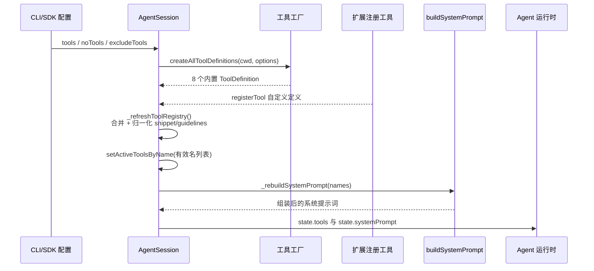
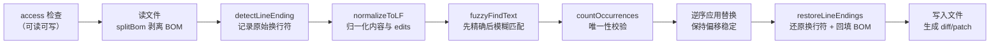

本文聚焦 pi coding-agent 的两个核心机制：**系统提示词的动态组装**与**内置工具（read/bash/edit/write）的工程实现**。与静态模板不同，pi 的系统提示词是"激活工具集"的派生产物——工具定义同时承载可执行语义（TypeBox 参数模式 + `execute`）与提示词语义（`promptSnippet`/`promptGuidelines`），二者由同一对象派发，保证提示词永远与运行时工具能力一致。理解这条同源链路，是读懂扩展系统、SDK 定制与工具行为调优的前提。

## 设计总览：一条"工具定义 → 提示词"的同源链路

pi 的提示词组装遵循一个第一性原理：**提示词中描述的能力必须与运行时真实可调用的工具一一对应**。为此，`AgentSession` 维护两个平行结构：`_toolDefinitions`（全部已注册工具的元数据中心）与 `_toolRegistry`（可被 LLM 调用的 `AgentTool` 运行时实例）。当激活工具集变化时，系统提示词从工具元数据中**重新推导**，而不是简单拼接静态文本。

整个链路可以用下图概括——从 CLI/SDK 配置入口，经工具工厂与注册表，最终汇入提示词组装函数与 Agent 运行时：

关键实现入口有三处：`buildSystemPrompt` 是无副作用的纯组装函数（[system-prompt.ts](packages/coding-agent/src/core/system-prompt.ts#L28-L168)）；`_refreshToolRegistry` 负责合并内置与自定义工具并提取提示词元数据（[agent-session.ts](packages/coding-agent/src/core/agent-session.ts#L2665-L2762)）；`_rebuildSystemPrompt` 则把激活工具名、资源加载器产物打包成组装参数（[agent-session.ts](packages/coding-agent/src/core/agent-session.ts#L1065-L1099)）。

Sources: [system-prompt.ts](packages/coding-agent/src/core/system-prompt.ts#L1-L169)、[agent-session.ts](packages/coding-agent/src/core/agent-session.ts#L2665-L2762)

## buildSystemPrompt：单函数、双路径

`buildSystemPrompt(options)` 是整个组装体系的收敛点，其输入由 `BuildSystemPromptOptions` 完整描述：`customPrompt`（整体替换默认模板）、`selectedTools`（参与组装的工具名列表）、`toolSnippets`（各工具的一行简介）、`promptGuidelines`（额外守则条目）、`appendSystemPrompt`（尾部追加文本）、`cwd`、`contextFiles`（项目上下文文件）与 `skills`（技能列表）（[system-prompt.ts](packages/coding-agent/src/core/system-prompt.ts#L8-L25)）。默认工具集硬编码为 `["read", "bash", "edit", "write"]`，且函数会预先判断 `read` 或 `bash` 是否可用——因为技能文件需要靠其中之一读取（[system-prompt.ts](packages/coding-agent/src/core/system-prompt.ts#L43-L46)）。

**自定义提示词路径**：当 `customPrompt` 存在时，默认模板整体弃用，组装退化为"用户提示词 + 追加段 + 项目上下文 + 技能 + 工作目录"的顺序拼接。值得注意的是，此时 `toolSnippets` 不再出现在提示词里，但技能段仍会依据 `read`/`bash` 的可用性决定是否嵌入（[system-prompt.ts](packages/coding-agent/src/core/system-prompt.ts#L48-L73)）。

**默认提示词路径**：完整模板由五段构成。第一段是角色声明（"You are an expert coding assistant operating inside pi"）；第二段是 `Available tools` 列表——只有提供了 `promptSnippet` 的工具才会出现，列表为空时显示 `(none)`（[system-prompt.ts](packages/coding-agent/src/core/system-prompt.ts#L80-L84)）；第三段是 `Guidelines` 条目，由三部分去重合并：条件化的文件探索守则（有 bash/powershell 且无 grep/find/ls 时建议用 shell 列目录搜索）、调用方传入的 `promptGuidelines`，以及两条恒定守则"Be concise in your responses"与"Show file paths clearly when working with files"（[system-prompt.ts](packages/coding-agent/src/core/system-prompt.ts#L86-L125)）；第四段是 pi 自身文档指引，告诉模型在用户询问 pi/SDK/扩展/主题时去读 README、docs 与 examples 的绝对路径（[system-prompt.ts](packages/coding-agent/src/core/system-prompt.ts#L127-L144)）；第五段是尾部三件套：`appendSystemPrompt`、`<project_context>` 包裹的项目指令文件、以及 `<available_skills>` 技能目录，最后附上当前工作目录（[system-prompt.ts](packages/coding-agent/src/core/system-prompt.ts#L146-L167)）。

| 提示词区段 | 数据来源 | 条件 |
|---|---|---|
| 角色声明 | 硬编码模板 | 仅默认路径 |
| Available tools | 各工具的 `promptSnippet` | 工具被激活且提供 snippet，否则 `(none)` |
| Guidelines | 条件守则 + `promptGuidelines` + 两条恒定守则 | Set 去重后合并 |
| Pi 文档指引 | `getReadmePath/getDocsPath/getExamplesPath` | 仅默认路径 |
| appendSystemPrompt | `APPEND_SYSTEM.md` 或 CLI 追加 | 存在即追加 |
| project_context | ResourceLoader 的 AGENTS.md 类文件 | 文件非空 |
| available_skills | `formatSkillsForPrompt` | 有可读文件的工具（read 或 bash）且技能非空 |
| 工作目录 | `cwd`（反斜杠归一化为 `/`） | 恒定 |

Sources: [system-prompt.ts](packages/coding-agent/src/core/system-prompt.ts#L8-L167)

## 工具贡献机制：promptSnippet 与 promptGuidelines

提示词与工具的一致性由 `ToolDefinition` 接口保证。每个工具除 `name/label/description/parameters/execute` 外，还携带两个可选的提示词贡献字段：`promptSnippet`（一行工具简介，进入 Available tools 区段）与 `promptGuidelines`（使用守则，进入 Guidelines 区段）（[extensions/types.ts](packages/coding-agent/src/core/extensions/types.ts#L451-L490)）。未提供 `promptSnippet` 的自定义工具不会出现在默认提示词的工具列表中，但仍可被调用——这是一种"隐身工具"机制。此外 `constrainedSampling`、`renderShell`、`prepareArguments`、`executionMode` 等字段分别服务于供应商侧受限采样、TUI 渲染策略、参数兼容修补与并发控制（关于 LLM 协议层的工具定义细节，见 [工具定义、流式工具调用与参数校验](11-gong-ju-ding-yi-liu-shi-gong-ju-diao-yong-yu-can-shu-xiao-yan)）。

`AgentSession` 在刷新注册表时执行两次归一化：`_normalizePromptSnippet` 把多行文本折叠为单行、去空白；`_normalizePromptGuidelines` 去空白、去重并剔除空条目（[agent-session.ts](packages/coding-agent/src/core/agent-session.ts#L1041-L1063)）。归一化结果分别落入 `_toolPromptSnippets` 与 `_toolPromptGuidelines` 两个 `Map<工具名, 贡献>`，随后 `_rebuildSystemPrompt` 只遍历**当前激活**的工具名，把对应贡献聚合成 `toolSnippets` 与 `promptGuidelines`，再连同 ResourceLoader 的产物一起传给 `buildSystemPrompt`（[agent-session.ts](packages/coding-agent/src/core/agent-session.ts#L1065-L1099)）。

激活集合的变更入口是 `setActiveToolsByName`：只接受注册表中存在的名字（未知名字被静默忽略），成功后同步更新 `agent.state.tools` 并重建基础提示词（[agent-session.ts](packages/coding-agent/src/core/agent-session.ts#L964-L985)）。下面这张时序图刻画了从启动到提示词就绪的完整协作：

Sources: [extensions/types.ts](packages/coding-agent/src/core/extensions/types.ts#L451-L490)、[agent-session.ts](packages/coding-agent/src/core/agent-session.ts#L964-L1099)

## 内置工具族：8 个定义、4 个默认激活

`ToolName` 联合类型枚举了全部 8 个内置工具：`read | bash | powershell | edit | write | grep | find | ls`（[tools/index.ts](packages/coding-agent/src/core/tools/index.ts#L93-L105)）。工厂层提供四种预设组合：`createCodingToolDefinitions`（read/bash/edit/write，默认编码套件）、`createReadOnlyToolDefinitions`（read/grep/find/ls，只读审查套件）、`createAllToolDefinitions`（全量 8 个，返回 `Record<ToolName, ToolDef>`）、以及运行时实例版本 `createCodingTools`/`createAllTools`（[tools/index.ts](packages/coding-agent/src/core/tools/index.ts#L164-L224)）。`createToolDefinition` 是一个按名字分发的单一入口，任何自定义工具注册也走同一形态（[tools/index.ts](packages/coding-agent/src/core/tools/index.ts#L118-L162)）。

`AgentSession._buildRuntime` 用 `createAllToolDefinitions(this._cwd, { read: { autoResizeImages }, bash: { commandPrefix: shellCommandPrefix, shellPath } })` 构建内置定义，其中图像自动缩放、shell 命令前缀与 shell 路径均来自 settings；SDK 还可通过 `baseToolsOverride` 用自己的 `AgentTool` 整体替换内置工具（经 `createToolDefinitionFromAgentTool` 回转为定义形态）（[agent-session.ts](packages/coding-agent/src/core/agent-session.ts#L2764-L2786)）。

默认激活集的解析链在 SDK 层完成：硬编码默认 `["read", "bash", "edit", "write"]` → settings 的 `defaultTools` 覆盖 → CLI/SDK 的 `tools` 白名单或 `noTools` 清空 → `excludeTools` 黑名单过滤（[sdk.ts](packages/coding-agent/src/core/sdk.ts#L256-L263)）。CLI 侧提供四个正交标志：`--tools/-t`（白名单）、`--exclude-tools/-xt`（黑名单）、`--no-tools/-nt`（全部禁用）、`--no-builtin-tools/-nbt`（仅禁内置、保留扩展工具）（[cli/args.ts](packages/coding-agent/src/cli/args.ts#L133-L140)），帮助文本明确了它们的作用范围覆盖内置、扩展与自定义工具（[cli/args.ts](packages/coding-agent/src/cli/args.ts#L293-L300)），`main.ts` 将 `-nt` 映射为 `noTools: "all"`、`-nbt` 映射为 `noTools: "builtin"`（[main.ts](packages/coding-agent/src/main.ts#L529-L535)）。

| 工具 | 类别 | 默认激活 | 核心能力 |
|---|---|---|---|
| read | 文件 | ✅ | 读文本/图像，支持 offset/limit 分页 |
| bash | shell | ✅ | 流式执行命令，尾部截断 + 全量转存临时文件 |
| edit | 文件 | ✅ | 多段精确文本替换，exact/fuzzy 匹配 |
| write | 文件 | ✅ | 新建或整体覆写文件，自动建父目录 |
| powershell | shell | ❌ | 与 bash 共用 ShellToolDefinition 骨架的 Windows 变体 |
| grep / find / ls | 只读检索 | ❌ | 基于 rg/fd 的内容搜索、文件查找与目录列举 |

Sources: [tools/index.ts](packages/coding-agent/src/core/tools/index.ts#L93-L224)、[sdk.ts](packages/coding-agent/src/core/sdk.ts#L256-L263)、[cli/args.ts](packages/coding-agent/src/cli/args.ts#L129-L140)

## read 工具：文本与图像的统一读取

read 的输入模式极简：`path`（相对或绝对路径）、`offset`（起始行，1-indexed）、`limit`（最大行数）（[read.ts](packages/coding-agent/src/core/tools/read.ts#L15-L19)）。它的提示词贡献是 "Read file contents" 与守则"Use read to examine files instead of cat or sed"——把模型从 shell 文本工具引向结构化读取（[read.ts](packages/coding-agent/src/core/tools/read.ts#L21-L24)）。执行体经 `resolveReadPathAsync` 解析路径后，先用 `access` 探测可读性，再按 MIME 判定分岔（[read.ts](packages/coding-agent/src/core/tools/read.ts#L101-L106)）。

**图像分支**：二进制读入后经 `processImage` 处理（可按 `autoResizeImages` 缩放到 2000x2000），成功时返回一条文本说明加一个 `image` 内容块；若当前模型不支持视觉输入，会附加"[Current model does not support images…]"提示，图像在该轮请求中被省略（[read.ts](packages/coding-agent/src/core/tools/read.ts#L58-L63)、[read.ts](packages/coding-agent/src/core/tools/read.ts#L106-L126)）。

**文本分支**：按 `offset` 切片后交给 `truncateHead`（保留头部）执行双限截断。截断发生时，输出会附带可执行的续读指令——例如 `[Showing lines 1-2000 of 3500. Use offset=2001 to continue.]`，模型可以据此自我续页；若某一行单独超过 50KB 字节上限，则直接返回 bash 兜底命令 `sed -n 'Np' path | head -c 51200`，把超长行问题转移给 shell 工具（[read.ts](packages/coding-agent/src/core/tools/read.ts#L127-L179)）。路径解析还有一套 macOS 兼容回退：依次尝试 AM/PM 窄不换行空格变体、NFD 分解形式、弯引号变体，专门解决截图文件名与法语输入法场景（[path-utils.ts](packages/coding-agent/src/core/tools/path-utils.ts#L52-L118)）。

可插拔性同样体现在 read 上：`ReadOperations` 接口抽象了 `readFile/access/detectImageMimeType` 三个操作，默认实现是本地文件系统，替换后即可把读取委托给 SSH 等远端后端（[read.ts](packages/coding-agent/src/core/tools/read.ts#L36-L56)）。

Sources: [read.ts](packages/coding-agent/src/core/tools/read.ts#L15-L199)、[path-utils.ts](packages/coding-agent/src/core/tools/path-utils.ts#L48-L118)

## bash 工具：流式 shell 执行与有界内存输出

bash 的输入模式为 `command` 与可选 `timeout`（秒，无默认超时，上限为 32 位有符号整数毫秒换算值）（[bash.ts](packages/coding-agent/src/core/tools/bash.ts#L22-L41)）。提示词贡献为 "Execute bash commands (ls, grep, find, etc.)"，并附带一条守则让模型知道可以检查 `PI_*` 环境变量（[bash.ts](packages/coding-agent/src/core/tools/bash.ts#L43-L46)）。架构上最值得注意的设计是 **bash 与 powershell 共享同一个 `createShellToolDefinition` 骨架**：`ShellToolConfig` 只描述名字、shell 类型、TUI 提示符（`$` vs `PS>`）与临时文件前缀等差异点，执行语义完全复用（[bash.ts](packages/coding-agent/src/core/tools/bash.ts#L213-L227)、[bash.ts](packages/coding-agent/src/core/tools/bash.ts#L376-L391)）。

**进程执行层**（`createLocalShellOperations`）：`spawn` 以 `detached` 模式（非 Windows）创建子进程，超时与中止信号都通过 `killProcessTree` 杀掉整个进程树而非单进程；部分平台 shell 走 stdin 传输命令以规避参数注入问题；工作目录不存在时快速失败（[bash.ts](packages/coding-agent/src/core/tools/bash.ts#L80-L146)）。**环境层**（`resolveSpawnContext`）默认从环境中删除全部 `PI_*` 变量，只有当 `exposeSessionEnvironment`（默认 true）开启时才注入 `PI_SESSION_ID/PI_SESSION_FILE/PI_PROVIDER/PI_MODEL/PI_REASONING_LEVEL`，使子进程可以感知会话元数据（[bash.ts](packages/coding-agent/src/core/tools/bash.ts#L166-L192)）。`commandPrefix`（来自 settings 的 shellCommandPrefix）会以换行拼接在每条命令前，用于注入 shell 初始化脚本（[bash.ts](packages/coding-agent/src/core/tools/bash.ts#L247)）。

**输出层**是工程上最精巧的部分。`OutputAccumulator` 用流式 UTF-8 解码器增量吸收 stdout/stderr，内存中只保留约 `2 × 50KB` 的"滚动尾部"，一旦总输出超限就自动把全量内容落盘到 `pi-bash-<hex>.log` 临时文件（[output-accumulator.ts](packages/coding-agent/src/core/tools/output-accumulator.ts#L28-L62)、[output-accumulator.ts](packages/coding-agent/src/core/tools/output-accumulator.ts#L91-L119)）。这意味着长时任务不会因 `tail` 截断策略而丢失开头以外的信息——完整输出始终可追溯。TUI 侧的流式刷新经过 `BASH_UPDATE_THROTTLE_MS = 100` 的节流（[renderers/bash.ts](packages/coding-agent/src/core/tools/renderers/bash.ts#L19)），快照策略采用 `truncateTail`（保留尾部）——因为命令输出的错误与结论通常在末尾（[output-accumulator.ts](packages/coding-agent/src/core/tools/output-accumulator.ts#L91-L99)）。

**结果组装**：命令正常结束时若退出码非 0，输出文本会追加 `Command exited with code N` 后作为错误抛出；中止与超时同样把已捕获的输出附加到错误信息中，保证失败场景下模型仍能看到现场（[bash.ts](packages/coding-agent/src/core/tools/bash.ts#L339-L367)）。截断发生时最终文本附带 `[Showing lines X-Y of Z. Full output: /tmp/…]`，`BashToolDetails` 中的 `fullOutputPath` 让 TUI 可以链接完整日志（[bash.ts](packages/coding-agent/src/core/tools/bash.ts#L317-L335)）。powershell 变体通过 `createLocalShellOperations("PowerShell", …)` 复用同一实现，仅额外注入 UTF-8 输出编码前缀（[powershell.ts](packages/coding-agent/src/core/tools/powershell.ts#L16-L47)）。

Sources: [bash.ts](packages/coding-agent/src/core/tools/bash.ts#L22-L402)、[output-accumulator.ts](packages/coding-agent/src/core/tools/output-accumulator.ts#L28-L223)

## edit 工具：多段精确替换的健壮性工程

edit 是四个内置工具中容错逻辑最重的。输入模式要求 `path` 加一个 `edits[]` 数组，每个元素含 `oldText/newText`；schema 描述明确约束：`oldText` 必须在原文件中唯一、不得与其他 edit 重叠、相邻修改应合并为单个 edit（[edit.ts](packages/coding-agent/src/core/tools/edit.ts#L22-L42)）。提示词贡献进一步强化这些规则，并要求"`oldText` 尽量小但必须唯一"（[edit.ts](packages/coding-agent/src/core/tools/edit.ts#L44-L52)）。

**参数兼容层**（`prepareEditArguments`）是针对真实模型缺陷的防御：某些模型（注释中点名 Opus 4.6 与 GLM-5.1）会把 `edits` 发成 JSON 字符串而非数组，或发成单个 edit 对象而非单元素数组，甚至退回到旧的顶层 `oldText/newText` 形态；该层统一归一化后再进 schema 校验（[edit.ts](packages/coding-agent/src/core/tools/edit.ts#L104-L135)）。

**替换管线**值得用一张流程图描述其顺序敏感性：

匹配环节的容错策略是"先精确、后模糊"：`fuzzyFindText` 首先做 `indexOf` 精确查找，失败后在模糊归一化空间（去行尾空白、Unicode 弯引号/破折号转 ASCII）中重试；一旦任一 edit 走了模糊路径，整个操作就切换到模糊归一化的内容空间进行，最后通过行级对齐把改动叠加回原始内容，**未受影响的行保持原始字节不变**（[edit-diff.ts](packages/coding-agent/src/core/tools/edit-diff.ts#L207-L245)、[edit-diff.ts](packages/coding-agent/src/core/tools/edit-diff.ts#L291-L329)）。错误信息按单/多编辑场景分别生成"找不到文本/出现多次/空 oldText/无变化"四类诊断（[edit-diff.ts](packages/coding-agent/src/core/tools/edit-diff.ts#L253-L289)）。

**并发与中止**：执行体整体包在 `withFileMutationQueue(absolutePath, …)` 中，以文件真实路径为 key 串行化对同一文件的所有变更，不同文件仍可并行（[file-mutation-queue.ts](packages/coding-agent/src/core/tools/file-mutation-queue.ts#L28-L61)）。中止处理刻意不使用 abort 事件监听器抛错，而是在每个 `await` 后检查 `signal.aborted`——注释解释了原因：事件监听器抛错会提前释放互斥队列，让仍在途的文件系统操作与其他写入交错（[edit.ts](packages/coding-agent/src/core/tools/edit.ts#L160-L199)）。成功后返回 `EditToolDetails`：展示用 diff、标准 unified patch 与首个变更行号（[edit.ts](packages/coding-agent/src/core/tools/edit.ts#L200-L213)）。工具以 `renderShell: "self"` 声明自渲染框架（[edit.ts](packages/coding-agent/src/core/tools/edit.ts#L144-L160)）。

Sources: [edit.ts](packages/coding-agent/src/core/tools/edit.ts#L22-L222)、[edit-diff.ts](packages/coding-agent/src/core/tools/edit-diff.ts#L132-L329)、[file-mutation-queue.ts](packages/coding-agent/src/core/tools/file-mutation-queue.ts#L28-L61)

## write 工具：最简单的工具，最明确的边界

write 的输入只有 `path` 与 `content`（[write.ts](packages/coding-agent/src/core/tools/write.ts#L12-L15)），提示词贡献是 "Create or overwrite files" 加一条划界守则"Use write only for new files or complete rewrites"——把增量修改明确推给 edit（[write.ts](packages/coding-agent/src/core/tools/write.ts#L17-L20)）。执行流程同样包在文件互斥队列里：先递归创建父目录，再整体写入，成功后返回确认文本（[write.ts](packages/coding-agent/src/core/tools/write.ts#L59-L94)）。`WriteOperations` 抽象出 `writeFile/mkdir` 两个操作供远端后端替换（[write.ts](packages/coding-agent/src/core/tools/write.ts#L28-L43)）。

四个核心工具的横向对比：

| 维度 | read | bash | edit | write |
|---|---|---|---|---|
| 输入参数 | path, offset?, limit? | command, timeout? | path, edits[] | path, content |
| 截断策略 | 头部保留（truncateHead）+ 续读提示 | 尾部保留（truncateTail）+ 全量转存 | 不适用（结果为 diff/patch 元数据） | 不适用 |
| 失败语义 | offset 越界抛错 | 非零退出码抛错并附输出 | 找不到/重复/无变化抛错 | 文件系统错误透传 |
| 并发控制 | 无（只读） | 独立进程树 | withFileMutationQueue 按文件串行 | withFileMutationQueue 按文件串行 |
| 可插拔操作 | ReadOperations | BashOperations + spawnHook | EditOperations | WriteOperations |

Sources: [write.ts](packages/coding-agent/src/core/tools/write.ts#L12-L99)、[bash.ts](packages/coding-agent/src/core/tools/bash.ts#L38-L53)、[edit.ts](packages/coding-agent/src/core/tools/edit.ts#L22-L78)

## 共享基础设施：双限截断的统一契约

read 用头部保留、bash 用尾部保留，但两者共享同一个截断契约：`DEFAULT_MAX_LINES = 2000` 行与 `DEFAULT_MAX_BYTES = 50KB` 双限独立生效、先到先得，且**绝不返回半行**（[truncate.ts](packages/coding-agent/src/core/tools/truncate.ts#L1-L13)）。`TruncationResult` 结构化记录了截断方向（lines/bytes）、总量、输出量乃至"首行单独超限"这类边界态，供上层生成人类可读的续读/全量路径提示（[truncate.ts](packages/coding-agent/src/core/tools/truncate.ts#L15-L38)）。`truncateHead` 逐行累加字节、超限即停；`truncateTail` 反向遍历，并允许末行部分截断这一唯一例外（[truncate.ts](packages/coding-agent/src/core/tools/truncate.ts#L78-L160)）。这套统一契约也外溢到 grep 等只读工具（`GREP_MAX_LINE_LENGTH = 500` 限制单行匹配长度）。

| 对比项 | truncateHead（read） | truncateTail（bash） |
|---|---|---|
| 保留内容 | 文件开头（阅读起点） | 输出末尾（错误与结论） |
| 半行策略 | 严格禁止 | 允许末行部分截断（lastLinePartial） |
| 首行/末行超限 | firstLineExceedsLimit → 建议转 bash | 部分截断并标注字节量 |
| 续读机制 | offset 续页提示 | fullOutputPath 临时文件 |

Sources: [truncate.ts](packages/coding-agent/src/core/tools/truncate.ts#L1-L160)

## 动态性：提示词的逐轮重建与资源延伸

系统提示词并非一次性产物。`AgentSession` 区分 `_baseSystemPrompt`（随激活工具集与资源重建）与 `_systemPromptOverride`（扩展的 `set_system_prompt` 钩子产出）：每轮提示前都会跑扩展 preflight，若扩展返回了自定义提示词则整体覆盖，否则重置回基础提示词（[agent-session.ts](packages/coding-agent/src/core/agent-session.ts#L1276-L1305)）。扩展运行期注入的新技能/提示模板/主题也会触发 `_rebuildSystemPrompt` 并即时生效（[agent-session.ts](packages/coding-agent/src/core/agent-session.ts#L2480-L2493)）。完整的扩展拦截机制属于另一个专题，见 [扩展系统：事件拦截、自定义工具与自定义 UI](19-kuo-zhan-xi-tong-shi-jian-lan-jie-zi-ding-yi-gong-ju-yu-zi-ding-yi-ui)。

提示词的文件输入有三个稳定来源：`SYSTEM.md`（整体替换默认模板，项目级需项目受信）、`APPEND_SYSTEM.md`（尾部追加）分别从 `.pi/`（项目）与全局 agent 目录发现（[resource-loader.ts](packages/coding-agent/src/core/resource-loader.ts#L1023-L1049)），最终在 ResourceLoader 加载时解析为 `systemPrompt` 与 `appendSystemPrompt` 字符串（[resource-loader.ts](packages/coding-agent/src/core/resource-loader.ts#L526-L545)）。技能目录的呈现格式遵循 Agent Skills 标准的 XML 形态，且当 read 不可用时会自动改写指引文案为"用 bash 读取技能文件"（[skills.ts](packages/coding-agent/src/core/skills.ts#L355-L383)）；技能与提示模板的全貌见 [Skills、提示模板、主题与 Pi 包](20-skills-ti-shi-mo-ban-zhu-ti-yu-pi-bao)。

Sources: [agent-session.ts](packages/coding-agent/src/core/agent-session.ts#L1276-L1305)、[resource-loader.ts](packages/coding-agent/src/core/resource-loader.ts#L1023-L1049)、[skills.ts](packages/coding-agent/src/core/skills.ts#L355-L383)

## 延伸阅读

本文覆盖了 coding-agent 侧的提示词组装与工具实现。若要继续深入，建议按以下顺序：想理解这些工具在 Agent 循环中如何被调度与产生事件，请读 [Agent 运行时：事件流、工具调用与状态管理](7-agent-yun-xing-shi-shi-jian-luan-gong-ju-diao-yong-yu-zhuang-tai-guan-li) 中更上层的 pi-agent 包视角（以及 [AgentMessage 与上下文转换管线（transformContext / convertToLlm）](8-agentmessage-yu-shang-xia-wen-zhuan-huan-guan-xian-transformcontext-converttollm)）；想了解工具调用在 LLM 协议层的序列化与参数校验，请读 [工具定义、流式工具调用与参数校验](11-gong-ju-ding-yi-liu-shi-gong-ju-diao-yong-yu-can-shu-xiao-yan)；想在 pi 之上注册自己的工具或拦截工具调用，请读 [扩展系统：事件拦截、自定义工具与自定义 UI](19-kuo-zhan-xi-tong-shi-jian-lan-jie-zi-ding-yi-gong-ju-yu-zi-ding-yi-ui)；工具结果在终端里的渲染细节则由 [内置组件体系：编辑器、选择列表与布局栈](15-nei-zhi-zu-jian-ti-xi-bian-ji-qi-xuan-ze-lie-biao-yu-bu-ju-zhan) 承接。