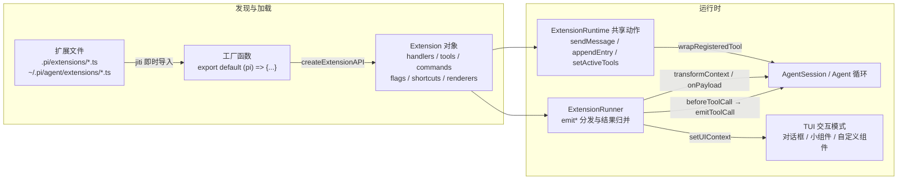
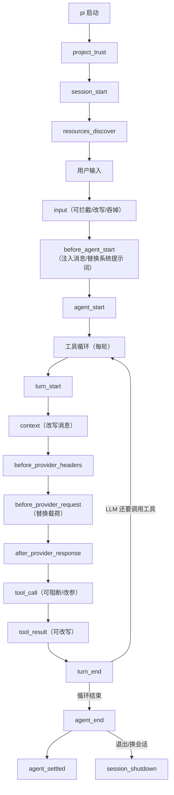
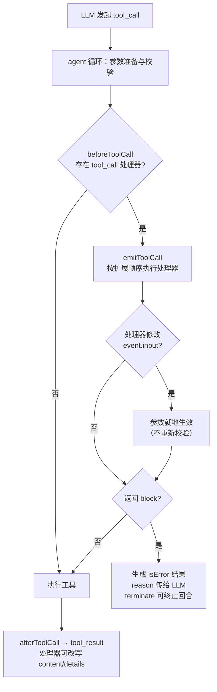

pi 的扩展系统是一套用纯 TypeScript 编写、无需编译即可加载的插件机制：扩展模块通过默认导出的工厂函数接收 `ExtensionAPI`，可以订阅智能体生命周期事件、拦截甚至改写工具调用与工具结果、注册 LLM 可调用的自定义工具、添加斜杠命令与快捷键，并深度定制终端 UI（对话框、小组件、页脚、编辑器乃至整屏交互组件）。本页聚焦扩展系统的三大支柱——**事件拦截**、**自定义工具**、**自定义 UI**——先从架构上说明扩展如何被加载与接线，再逐层拆解拦截语义、工具注册与渲染定制，最后给出错误处理、模式差异与实战示例索引。

Sources: [extensions.md](packages/coding-agent/docs/extensions.md#L1-L27)

## 架构总览：扩展如何嵌入 Pi

扩展系统由四个核心模块协作完成：`loader.ts` 负责"发现 + 加载 + 实例化"，`runner.ts` 负责"分发事件 + 收集结果"，`wrapper.ts` 负责"把注册的工具适配成智能体可执行形态"，`types.ts` 则承载全部契约类型。加载阶段，每个扩展文件经 [jiti](https://github.com/unjs/jiti) 即时编译导入，其工厂函数被调用后会得到一个 `Extension` 对象——内部用 `Map` 归集 handlers、tools、commands、flags、shortcuts 与渲染器；所有扩展共享同一个 `ExtensionRuntime`（动作方法集），运行期由 `ExtensionRunner.bindCore()` 把真实的会话动作（sendMessage、appendEntry、setActiveTools 等）注入进去。随后 `AgentSession` 把 `agent.beforeToolCall` / `agent.afterToolCall` 钩子接到 Runner 上，SDK 层再把 `transformContext`、`transformHeaders`、`onPayload` 等回调接到 Runner 的对应 emit 方法上——事件拦截因此发生在智能体循环的关键缝隙中，而无需侵入其内部。

Sources: [loader.ts](packages/coding-agent/src/core/extensions/loader.ts#L252-L276), [runner.ts](packages/coding-agent/src/core/extensions/runner.ts#L317-L341), [wrapper.ts](packages/coding-agent/src/core/extensions/wrapper.ts#L1-L12), [agent-session.ts](packages/coding-agent/src/core/agent-session.ts#L478-L486), [sdk.ts](packages/coding-agent/src/core/sdk.ts#L330-L372)



Sources: [loader.ts](packages/coding-agent/src/core/extensions/loader.ts#L753-L805), [runner.ts](packages/coding-agent/src/core/extensions/runner.ts#L436-L451), [agent-session.ts](packages/coding-agent/src/core/agent-session.ts#L401-L409)

### 加载管线与发现规则

启动时 `ResourceLoader` 按固定顺序合并扩展路径：CLI 传 `-e` 的路径、`settings.json` 中 `packages` 与 `extensions` 配置的路径，以及自动发现目录。发现规则有三条——目录下的 `*.ts` / `*.js` 直接文件；子目录中的 `index.ts` / `index.js` 入口；子目录 `package.json` 里 `pi.extensions` 字段声明的路径（不再向下递归）。加载使用 jiti 并按运行形态注入模块解析：编译二进制走 `virtualModules`（把 typebox、pi-tui、pi-ai 等打包模块映射给扩展），TypeScript 源码运行走 `virtualModules + tsconfigPaths`，Node 构建走别名表。工厂函数执行期间注册状态为 `loading`，成功后 `commit()`（生效标志默认值与队列中的 Provider 注册），抛错则 `discard()`（回滚订阅并标记失败）——这保证了半加载的扩展不会污染运行时。

Sources: [resource-loader.ts](packages/coding-agent/src/core/resource-loader.ts#L404-L456), [loader.ts](packages/coding-agent/src/core/extensions/loader.ts#L664-L751), [loader.ts](packages/coding-agent/src/core/extensions/loader.ts#L49-L80), [loader.ts](packages/coding-agent/src/core/extensions/loader.ts#L496-L517), [loader.ts](packages/coding-agent/src/core/extensions/loader.ts#L459-L477)

### 仓库自身的扩展即文档

本仓库 `.pi/extensions/` 下就放着三个真实扩展：`tps.ts` 监听 `agent_start` / `agent_end` 统计每轮 token 速度并用 `ctx.ui.notify` 汇报；`prompt-url-widget.ts` 在识别到 PR/Issue 提示词时用 `ctx.ui.setWidget` 在编辑器上方渲染 GitHub 元数据卡片；`redraws.ts` 与 `import-repro.ts` 用于调试。它们是理解扩展最小形态的最佳起点：一个默认导出的函数、若干 `pi.on(...)` 订阅、必要时一次 `pi.registerTool(...)`。

Sources: [tps.ts](.pi/extensions/tps.ts#L13-L48), [prompt-url-widget.ts](.pi/extensions/prompt-url-widget.ts#L172-L221)

## 编写与放置扩展

扩展是一个默认导出工厂函数的 TypeScript 模块，工厂可以是同步或异步的；若返回 Promise，pi 会等待其完成才继续启动，这意味着异步初始化（如拉取远程模型目录并 `registerProvider`）会在 `session_start` 与 `resources_discover` 之前完成。自动发现位置有两级：全局 `~/.pi/agent/extensions/`（含子目录 `index.ts`）与项目级 `.pi/extensions/`（项目受信任后才加载项目级扩展）；`pi -e ./path.ts` 仅用于快速测试，`settings.json` 的 `extensions` 数组可加入额外路径，`packages` 数组则以 npm/git 包形式分发扩展。需要注意安全边界：扩展以你的完整系统权限运行任意代码，只应安装可信来源；同时工厂函数可能在"永不进入会话"的调用中运行，因此不要在工厂里启动进程、socket、文件监听等长生命周期资源——把它们推迟到 `session_start`，并注册幂等的 `session_shutdown` 清理。

Sources: [extensions.md](packages/coding-agent/docs/extensions.md#L109-L152), [extensions.md](packages/coding-agent/docs/extensions.md#L154-L225), [types.ts](packages/coding-agent/src/core/extensions/types.ts#L1252-L1260)

三种组织形态由简到繁：单文件（`my-extension.ts`）、目录 + `index.ts`（多文件协作）、带 `package.json` 的包（声明 `pi.extensions` 入口与 `dependencies`，`npm install` 后 `node_modules` 导入自动可用）。npm 依赖之外，`node:fs`、`node:path` 等 Node 内建模块开箱即用；分发为 pi 包时运行时依赖必须写进 `dependencies`，因为包安装默认执行生产安装（`--omit=dev`）。

Sources: [extensions.md](packages/coding-agent/docs/extensions.md#L139-L152), [extensions.md](packages/coding-agent/docs/extensions.md#L226-L272)

## 事件系统全景：三十余个生命周期钩子

`ExtensionAPI.on()` 以重载形式声明了全部事件，可归为六组：**启动与资源**（`project_trust`、`resources_discover`）、**会话**（`session_start`、`session_before_switch/fork/compact/tree`、`session_compact(_failed)`、`session_shutdown`、`session_info_changed`、`session_tree`）、**智能体**（`before_agent_start`、`agent_start/end/settled`、`turn_start/end`、`message_start/update/end`、`tool_execution_start/update/end`、`ui_prompt_start/end`）、**模型**（`model_select`、`thinking_level_select`）、**工具**（`tool_call`、`tool_result`）、**输入与 Shell**（`input`、`user_bash`）。事件按扩展注册顺序串行分发；处理器抛错会被 Runner 捕获并记录为 `ExtensionError`（不中断流程），唯独 `tool_call` 处理器抛错会转化为"阻断工具执行"——这是一个刻意的 fail-safe 设计。

Sources: [types.ts](packages/coding-agent/src/core/extensions/types.ts#L1086-L1113), [runner.ts](packages/coding-agent/src/core/extensions/runner.ts#L851-L883), [extensions.md](packages/coding-agent/docs/extensions.md#L2922-L2926)

| 事件类别 | 代表事件 | 可做的干预 | 返回值形态 |
|---|---|---|---|
| 启动/资源 | `project_trust`、`resources_discover` | 决定项目信任；追加 skill/提示/主题路径 | `{ trusted, remember }`、`{ skillPaths, ... }` |
| 会话 | `session_before_switch/fork/compact/tree` | 返回 `{ cancel: true }` 中止操作；自定义压缩摘要 | `cancel` / `compaction` / `summary` |
| 智能体 | `before_agent_start`、`message_end`、`context` | 注入消息、替换系统提示词、替换消息（保持 role）、改写上下文消息 | `{ message }`、`{ systemPrompt }`、`{ messages }` |
| 工具 | `tool_call`、`tool_result` | 原地改参、`{ block, reason }` 阻断；改写 content/details/isError/usage | `block` / 内容覆盖 |
| 输入 | `input`、`user_bash` | `continue` / `transform`（改写文本）/ `handled`（吞掉输入）；接管 `!` 命令执行 | `{ action }` / `{ result }` |
| 观察类 | `agent_start/end`、`turn_*`、`model_select` 等 | 只读响应，如统计 TPS、更新页脚状态 | 无 |

Sources: [types.ts](packages/coding-agent/src/core/extensions/types.ts#L1119-L1189)

一轮对话的完整事件流如下（工具循环内每个工具调用会经历 `tool_execution_start → tool_call → tool_execution_update → tool_result → tool_execution_end`）：

Sources: [extensions.md](packages/coding-agent/docs/extensions.md#L273-L349)



Sources: [extensions.md](packages/coding-agent/docs/extensions.md#L277-L349)

### emit 的归并语义

Runner 对不同事件采用不同的结果归并策略，这是编写拦截逻辑前必须理解的差异：`emitToolCall` 沿扩展顺序执行，某个处理器返回 `{ block: true }` 即短路返回（后续扩展不再看到该事件）；`emitToolResult` 则是**累积式**——每个处理器看到的是前序处理器改写后的事件，任何字段被设置即标记"已修改"，最终统一返回覆盖值；`emitContext` 先对消息做 `structuredClone`，各处理器依次改写副本，最后一份作为生效上下文；`session_before_*` 系列在首个 `cancel: true` 时立即返回；`emitMessageEnd` 要求替换消息必须保持原 role，否则记为扩展错误并忽略该替换。

Sources: [runner.ts](packages/coding-agent/src/core/extensions/runner.ts#L927-L1003), [runner.ts](packages/coding-agent/src/core/extensions/runner.ts#L885-L925)

## 事件拦截实战

### tool_call：阻断、改参与 fail-safe

`tool_call` 是权限门禁类扩展的主战场。事件按工具名细分为强类型联合（`BashToolCallEvent`、`EditToolCallEvent`……直到 `CustomToolCallEvent`），`event.input` 是**可变引用**：处理器原地修改它即可在执行前打补丁，后续处理器会看到前序修改，且改后不做重新校验。接线方式是 `AgentSession._installAgentToolHooks()` 把 `agent.beforeToolCall` 指向 `runner.emitToolCall`，而 agent-core 的循环在参数校验之后调用该钩子——若返回 `block`，立即生成一个 `isError: true` 的错误工具结果回给 LLM（`reason` 作为错误文本），`terminate: true` 还能让整批工具结果都终止时提前结束回合。钩子是"读取时取 Runner"的，因此 `/reload` 换入新 Runner 无需重装钩子。

Sources: [agent-session.ts](packages/coding-agent/src/core/agent-session.ts#L486-L539), [types.ts](packages/coding-agent/src/core/extensions/types.ts#L939-L954), [agent-loop.ts](packages/agent/src/agent-loop.ts#L623-L654), [types.ts](packages/coding-agent/src/core/extensions/types.ts#L1125-L1134)

官方 `permission-gate.ts` 示例展示了完整范式：用正则识别危险 bash 命令（`rm -rf`、`sudo`、`chmod 777`），有 UI 时弹确认框，无 UI 时默认阻断——这体现了"非交互模式必须安全降级"的原则。仓库根目录的 `confirm-destructive.ts` 则演示了另一类拦截：在 `session_before_switch` / `session_before_fork` 中返回 `{ cancel: true }`，为清空会话、切换分支等破坏性会话操作加上确认门。

Sources: [permission-gate.ts](packages/coding-agent/examples/extensions/permission-gate.ts#L10-L35), [confirm-destructive.ts](packages/coding-agent/examples/extensions/confirm-destructive.ts#L14-L60)



Sources: [agent-loop.ts](packages/agent/src/agent-loop.ts#L626-L654), [runner.ts](packages/coding-agent/src/core/extensions/runner.ts#L982-L1003)

### input：三种处置动作

用户提交输入后、技能与提示模板展开**之前**，`input` 事件被触发（来源标注 `interactive` / `rpc` / `extension`，流式期间还带 `steer`/`followUp` 投递方式）。处理器返回 `{ action: "handled" }` 可完全吞掉输入（此时提示被记为已处理，直接返回）；返回 `{ action: "transform", text, images }` 则改写后再走正常管线；返回 `{ action: "continue" }` 放行。注意扩展命令（`/xxx`）的检查先于 input 事件，命中即绕过整个智能体循环。斜杠命令前缀之外，`user_bash`（`!`/`!!` 前缀命令）也有专属事件，可返回自定义执行操作甚至整体接管执行结果。

Sources: [agent-session.ts](packages/coding-agent/src/core/agent-session.ts#L1160-L1200), [types.ts](packages/coding-agent/src/core/extensions/types.ts#L863-L883)

### context 与 Provider 三个缝隙

每轮 LLM 调用前，SDK 的 `transformContext` 会调用 `runner.emitContext`，处理器在深拷贝的消息数组上增删改，实现"每轮注入上下文"类需求；HTTP 缝隙上，`before_provider_headers` 允许原地增删请求头（设 `null` 删除），`before_provider_request` 可整体替换请求载荷（返回什么就发什么），`after_provider_response` 在消费响应流之前上报 status 与响应头。`before_agent_start` 则是回合级系统提示词的换装点——返回 `{ systemPrompt }` 即替换本轮系统提示词，多个扩展返回时链式叠加，也可返回 `{ message }` 注入一条自定义消息。

Sources: [sdk.ts](packages/coding-agent/src/core/sdk.ts#L330-L366), [types.ts](packages/coding-agent/src/core/extensions/types.ts#L687-L727), [runner.ts](packages/coding-agent/src/core/extensions/runner.ts#L1034-L1039)

## 自定义工具：让 LLM 学会新技能

### ToolDefinition 解剖

`pi.registerTool()` 接受一个 `ToolDefinition`：`name`/`label`/`description` 面向 LLM 与 UI，`parameters` 用 TypeBox 声明（字符串枚举必须用 pi-ai 的 `StringEnum` 而非 `Type.Literal` 联合，否则 Google API 不兼容），`execute(toolCallId, params, signal, onUpdate, ctx)` 返回 `AgentToolResult`。三个进阶字段值得单独记忆：`promptSnippet` 是一行摘要，决定该工具是否进入默认系统提示词的 Available tools 区段（不写则不进）；`promptGuidelines` 向 Guidelines 区段追加建议条目（必须平铺且自含工具名，例如写"Use my_tool when..."而非"Use this tool when..."）；`prepareArguments` 在 schema 校验前运行，用于兼容旧会话中残留的旧参数形状。执行语义上，**报错必须靠 throw**——返回值永远不会置错误标志；返回 `terminate: true` 可在整批工具结果都终止时跳过后续自动 LLM 调用（结构化输出场景的惯用法）；若工具内部发起嵌套 LLM 调用，把合并后的 `Usage` 放进返回值，pi 会持久化并计入页脚统计。

Sources: [types.ts](packages/coding-agent/src/core/extensions/types.ts#L451-L500), [extensions.md](packages/coding-agent/docs/extensions.md#L1913-L1953), [extensions.md](packages/coding-agent/docs/extensions.md#L2015-L2031)

```typescript
pi.registerTool({
  name: "todo",
  label: "Todo",
  description: "Manage a todo list. Actions: list, add (text), toggle (id), clear",
  parameters: Type.Object({
    action: StringEnum(["list", "add", "toggle", "clear"] as const),
    text: Type.Optional(Type.String()),
    id: Type.Optional(Type.Number()),
  }),
  async execute(_toolCallId, params, _signal, _onUpdate, _ctx) {
    // ... 修改闭包中的 todos 状态
    return {
      content: [{ type: "text", text: `Added todo #${newTodo.id}` }], // 发给 LLM
      details: { action: "add", todos: [...todos], nextId },           // 供渲染与状态重建
    };
  },
  renderCall(args, theme, _context) { /* 工具调用行的 UI */ },
  renderResult(result, { expanded }, theme, _context) { /* 结果区的 UI */ },
});
```

Sources: [todo.ts](packages/coding-agent/examples/extensions/todo.ts#L136-L226)

### 注册与合流：同名覆盖与优先级

所有扩展注册的工具经 `wrapRegisteredTools` 适配为 `AgentTool` 后，由 `AgentSession._refreshToolRegistry` 与内置工具合流：`definitionRegistry` 以内置工具为基础逐项放入自定义工具，**同名即覆盖**（因此 `registerTool({ name: "read", ... })` 可以整体替换内置 read 工具）；跨扩展同名时"先注册者胜出"。此外还有 `--tools` 允许/排除名单过滤与 `includeAllExtensionTools` 启动策略。包装层（wrapper.ts）除了注入扩展上下文，还会在工具执行后对比前后活跃工具集：若执行期间有纯新增的工具被激活，把新增名单记入该工具结果的 `addedToolNames`，供下一轮请求前生效。

Sources: [agent-session.ts](packages/coding-agent/src/core/agent-session.ts#L2671-L2762), [runner.ts](packages/coding-agent/src/core/extensions/runner.ts#L500-L511), [wrapper.ts](packages/coding-agent/src/core/extensions/wrapper.ts#L14-L46)

### 动态工具加载

注册大量工具但只保持小集合激活是官方推荐的模式：`pi.getAllTools()` 返回全部注册工具，`pi.setActiveTools([...当前, ...新增])` 在工具执行期间追加激活名单。约束是**必须纯新增**——不能在同一调用里移除当前激活工具。pi 会把新增名单记录在加载器工具的结果上，下一轮请求前：支持原生延迟加载的模型走原生通道（Anthropic 4.5+ 用 `defer_loading`/`tool_reference`，OpenAI gpt-5.4+ 用 `tool_search_call`/`tool_search_output`），其他模型退化为"下一轮发送完整激活名单"（代价是可能击穿提示词缓存前缀）。官方 `search_tools` 示例即按此模式实现：注册可搜索工具但默认不激活，仅保持一个关键词匹配的搜索器工具活跃。

Sources: [extensions.md](packages/coding-agent/docs/extensions.md#L2365-L2398), [extensions.md](packages/coding-agent/docs/extensions.md#L2404-L2472)

### 状态管理：把状态存进会话

有状态工具（todo 列表、连接池等）的正确姿势是把状态存进工具结果的 `details` 并在会话事件时重建：`session_start` / `session_tree` 时遍历 `ctx.sessionManager.getBranch()`，找到本工具的 toolResult 条目并用其 `details` 恢复内存状态。这使状态天然支持树形分支——切到历史分支，状态自动回到那个时间点。`todo.ts` 扩展完整演示了该模式，并配上 `/todos` 命令与自定义组件视图。

Sources: [extensions.md](packages/coding-agent/docs/extensions.md#L1879-L1911), [todo.ts](packages/coding-agent/examples/extensions/todo.ts#L104-L135)

文件改写类自定义工具还有一条硬规则：用 `withFileMutationQueue()` 包住整段读-改-写窗口并传入解析后的绝对路径，使其与内置 `edit`/`write` 共享同一按文件排队机制——否则同回合内两个工具可能基于同一份旧文件内容各自计算修改，导致一处更新丢失。

Sources: [extensions.md](packages/coding-agent/docs/extensions.md#L1925-L1953)

## 自定义 UI：从对话框到整屏组件

扩展 UI 能力是**分层**的，自底向上依次是：对话框原语（阻塞式问答）、状态与小组件（非阻塞装饰）、自定义组件与编辑器（接管焦点）、渲染器（改写消息/条目的呈现）。所有 API 都在 `ctx.ui` 上，且按运行模式自动降级——非 UI 模式下 Runner 会注入 `noOpUIContext`（select 返回 undefined、confirm 返回 false、notify 为空操作），因此扩展代码无需为降级写分支，只需在必要处用 `ctx.hasUI` / `ctx.mode` 自查。

Sources: [types.ts](packages/coding-agent/src/core/extensions/types.ts#L112-L284), [runner.ts](packages/coding-agent/src/core/extensions/runner.ts#L236-L267), [extensions.md](packages/coding-agent/docs/extensions.md#L2928-L2937)

| 层 | API | 阻塞性 | 典型用途 |
|---|---|---|---|
| 对话框 | `select` / `confirm` / `input` / `editor` / `notify` | 阻塞（notify 除外），支持 `timeout` 倒计时与 `AbortSignal` 手动取消 | 权限确认、向导问答 |
| 状态区 | `setStatus` / `setWidget` / `setFooter` / `setHeader` / `setTitle` | 非阻塞持久 | 页脚状态、编辑器上下小组件（`aboveEditor`/`belowEditor`） |
| 流式指示 | `setWorkingMessage` / `setWorkingVisible` / `setWorkingIndicator` | 非阻塞 | 自定义加载动画帧、隐藏内置 loader |
| 全屏交互 | `custom<T>(factory, options)` | 阻塞直到 `done(value)` | 游戏、向导、Doom 覆盖层 |
| 编辑器 | `setEditorComponent` / `getEditorComponent` | 持久替换 | Vim 模式编辑器 |
| 呈现改写 | `registerMessageRenderer` / `registerEntryRenderer` / `registerMarkdownTransformer` | 非阻塞 | 自定义消息卡片、Markdown 变换 |
| 输入辅助 | `addAutocompleteProvider` / `pasteToEditor` / `setEditorText` | 非阻塞 | 自定义补全触发符（如 `#issue`） |

Sources: [types.ts](packages/coding-agent/src/core/extensions/types.ts#L112-L284), [extensions.md](packages/coding-agent/docs/extensions.md#L2502-L2515)

### 对话框与超时

`select`/`confirm`/`input` 都接受 `ExtensionUIDialogOptions`：传 `timeout` 时对话框显示实时倒计时（"标题 (5s)" → "(4s)" → …）并自动取消（select/input 返回 undefined，confirm 返回 false）；传 `signal` 则可用 `AbortController` 精确区分"超时"与"用户取消"。Runner 会用 `withUIPrompt` 包装这些阻塞调用，进入时发 `ui_prompt_start`、退出时发 `ui_prompt_end`（嵌套提示只报外层一次），让其他扩展能感知"界面正被占用"。

Sources: [extensions.md](packages/coding-agent/docs/extensions.md#L2516-L2584), [types.ts](packages/coding-agent/src/core/extensions/types.ts#L77-L110), [runner.ts](packages/coding-agent/src/core/extensions/runner.ts#L436-L486)

### custom()：接管焦点的临时组件

`ctx.ui.custom<T>(factory)` 用你的组件临时替换编辑器并获得键盘焦点，直到调用 `done(value)` 归还控制权并返回值。factory 收到 `tui`（渲染请求/屏幕尺寸）、`theme`（样式）、`keybindings`（应用级快捷键管理器）、`done` 四个参数。`todo.ts` 的 `/todos` 命令即用此法弹出 Todo 列表组件，Escape 关闭；`snake.ts` 则更进一步，用 `setInterval` 驱动游戏帧并用 `tui.requestRender()` 重绘。传 `{ overlay: true }` 可切换为浮层模式——不清屏、浮在现有内容之上，`overlayOptions` 支持锚点/边距/百分比定位，`onHandle` 拿到 `OverlayHandle` 后可编程控制聚焦、显隐与销毁。

Sources: [extensions.md](packages/coding-agent/docs/extensions.md#L2731-L2794), [todo.ts](packages/coding-agent/examples/extensions/todo.ts#L44-L103), [todo.ts](packages/coding-agent/examples/extensions/todo.ts#L283-L296), [snake.ts](packages/coding-agent/examples/extensions/snake.ts#L56-L80)

### 自定义编辑器与消息渲染

替换主输入编辑器时应继承 `CustomEditor` 而非裸 `Editor`，以保留应用级键位（Escape 中断、Ctrl+D 等）；对你不处理的按键调用 `super.handleInput(data)`。要与其他扩展的编辑器共存，先用 `getEditorComponent()` 捕获先前工厂再包装。呈现侧，`registerMessageRenderer(customType, renderer)` 为 `pi.sendMessage()` 发出的自定义消息注册渲染器（此类消息参与 LLM 上下文）；`registerEntryRenderer` 则渲染不进入 LLM 上下文的 TUI 专属条目（由 `pi.appendEntry()` 写入会话）；`registerMarkdownTransformer` 可在用户/助手 Markdown 渲染前做文本变换。渲染函数统一拿到 `theme` 对象（`theme.fg("toolTitle", ...)`、`theme.bold(...)`），`renderResult` 中可用 `keyHint()` 生成跟随当前键位配置的快捷键提示。

Sources: [extensions.md](packages/coding-agent/docs/extensions.md#L2796-L2846), [extensions.md](packages/coding-agent/docs/extensions.md#L2848-L2887), [extensions.md](packages/coding-agent/docs/extensions.md#L2288-L2343), [extensions.md](packages/coding-agent/docs/extensions.md#L2889-L2920)

### 小组件实战

仓库根目录的 `prompt-url-widget.ts` 是小组件模式的现实范本：监听输入，识别出 GitHub PR/Issue/Advisory 提示词后调用 `gh` CLI 拉取标题与作者，然后用 `ctx.ui.setWidget("prompt-url", (tui, theme) => 组件工厂)` 在编辑器上方渲染带超链接的元数据卡片，会话结束时传 `undefined` 清除。组件工厂形态（而非字符串数组）适用于需要边框、容器等 pi-tui 组合的复杂内容。

Sources: [prompt-url-widget.ts](.pi/extensions/prompt-url-widget.ts#L172-L221), [types.ts](packages/coding-agent/src/core/extensions/types.ts#L164-L176)

## 命令、快捷键、标志与事件总线

`pi.registerCommand(name, { description, handler })` 注册的斜杠命令拥有比普通输入更高的优先级（提交时最先检查），handler 收到 `(args, ctx: ExtensionCommandContext)`——相比普通 ctx 多出会话级操作：`newSession`/`fork`/`navigateTree`/`switchSession`（均支持 `withSession` 回调拿到替换后的新上下文）、`waitForIdle`、`reload`。`registerShortcut(keyId, ...)` 可绑快捷键，但保留键位（如 `app.interrupt`、`tui.input.submit` 等编辑器全局键）会拒绝扩展覆盖并产出诊断告警；`registerFlag` 注册 CLI 布尔/字符串标志，`getFlag` 读取其值（扩展启动阶段先记入 pending，commit 后生效）。扩展之间还可以通过 `pi.events`（基于内部 EventBus 的命名频道）互通——`emit(channel, data)` 发、`on(channel, handler)` 收，订阅生命周期由 Runner 托管，会话替换后自动清理。

Sources: [types.ts](packages/coding-agent/src/core/extensions/types.ts#L355-L389), [types.ts](packages/coding-agent/src/core/extensions/types.ts#L1316-L1345), [runner.ts](packages/coding-agent/src/core/extensions/runner.ts#L40-L58), [runner.ts](packages/coding-agent/src/core/extensions/runner.ts#L544-L587), [loader.ts](packages/coding-agent/src/core/extensions/loader.ts#L445-L456)

Provider 注册走独立通道：`pi.registerProvider(name, config)` 在加载期入队，`bindCore` 时统一刷入 ModelRegistry，此后注册/注销即时生效；异步工厂（如启动时探测本地 OpenAI 兼容服务并注册模型目录）是该 API 的典型用法。

Sources: [loader.ts](packages/coding-agent/src/core/extensions/loader.ts#L229-L241), [runner.ts](packages/coding-agent/src/core/extensions/runner.ts#L356-L414), [extensions.md](packages/coding-agent/docs/extensions.md#L183-L218)

## 消息注入与会话持久化

`pi.sendMessage()` 发送带 `customType` 的自定义消息（`display: true` 时进 TUI，可配渲染器；`triggerTurn` 与 `deliverAs: "steer" | "followUp" | "nextTurn"` 控制是否/如何触发或排队回合）；`pi.sendUserMessage()` 注入真正触发 LLM 的用户消息（流式期间同样按投递策略排队）。`pi.appendEntry(customType, data)` 则向会话追加**不进 LLM 上下文**的自定义条目，配合 `registerEntryRenderer` 可持久化 TUI 专属内容；`setSessionName` / `setLabel` 提供会话与条目的元数据标记（标签可用于 `/tree` 书签）。动作方法全部经由共享 Runtime，并在会话替换/重载后通过 `invalidate()` 将旧 ctx 置为"过期"——捕获旧 ctx 继续调用会抛出明确错误，把替换后的工作放进 `withSession` 回调是官方指定的正确姿势。

Sources: [types.ts](packages/coding-agent/src/core/extensions/types.ts#L1364-L1397), [types.ts](packages/coding-agent/src/core/extensions/types.ts#L396-L406), [loader.ts](packages/coding-agent/src/core/extensions/loader.ts#L207-L227), [runner.ts](packages/coding-agent/src/core/extensions/runner.ts#L593-L599)

## 错误处理与模式行为

错误处理遵循三条不变量：普通事件处理器抛错被记录、智能体继续；`tool_call` 处理器抛错视为"阻断工具"（fail-safe，宁可不做也不放行）；工具 `execute` 内的错误必须 throw，pi 捕获后以 `isError: true` 报给 LLM 并继续回合。模式差异上，四种运行模式对 UI 的支持逐级递减：TUI 全功能；RPC 模式对话框与通知经 JSON 协议转发给客户端（`custom()` 返回 undefined）；JSON 与 print 模式下 UI 方法均为空操作。因此写 UI 代码时用 `ctx.mode === "tui"` 守卫 TUI 专属特性（`custom()`、组件工厂、终端输入监听），用 `ctx.hasUI` 守卫 TUI/RPC 通用的对话框与通知。

Sources: [extensions.md](packages/coding-agent/docs/extensions.md#L2922-L2937), [runner.ts](packages/coding-agent/src/core/extensions/runner.ts#L236-L267)

| 模式 | `ctx.mode` | `ctx.hasUI` | 说明 |
|---|---|---|---|
| 交互 | `"tui"` | `true` | 完整 TUI，全部 UI API 可用 |
| RPC（`--mode rpc`） | `"rpc"` | `true` | 对话框/通知走 JSON 协议，`custom()` 不可用 |
| JSON（`--mode json`） | `"json"` | `false` | 事件流输出，UI 为空操作 |
| Print（`-p`） | `"print"` | `false` | 扩展照常运行但无法弹窗 |

Sources: [extensions.md](packages/coding-agent/docs/extensions.md#L2928-L2937)

## 示例索引：按需求找模板

`examples/extensions/` 下的示例按"想做什么"对号入座即可快速起步：

Sources: [extensions.md](packages/coding-agent/docs/extensions.md#L2939-L3024)

| 需求 | 推荐示例 | 关键 API |
|---|---|---|
| 危险命令门禁 | `permission-gate.ts`、`protected-paths.ts` | `on("tool_call")`、`ui.confirm` |
| 会话操作确认 | `confirm-destructive.ts`、`dirty-repo-guard.ts` | `on("session_before_*")`、`exec` |
| 有状态工具 + 渲染 | `todo.ts`、`structured-output.ts`、`truncated-tool.ts` | `registerTool`、`renderResult`、details 状态 |
| 动态工具集 | `dynamic-tools.ts`、`kimi-deferred-tools.ts` | `setActiveTools` |
| 自定义压缩 | `custom-compaction.ts`、`summarize.ts` | `on("session_before_compact")`、`ui.custom` |
| UI 深度定制 | `custom-footer.ts`、`modal-editor.ts`、`doom-overlay/`、`snake.ts` | `setFooter`、`setEditorComponent`、`ui.custom(overlay)` |
| 输入改写/触发 | `input-transform.ts`、`file-trigger.ts`、`inline-bash.ts` | `on("input")`、`sendMessage`、`on("tool_call")` |
| 远程执行/沙箱 | `ssh.ts`、`sandbox/`、`subagent/` | `on("user_bash")`、工具操作接管 |
| 综合 | `plan-mode/`、`preset.ts`、`tools.ts` | 全事件 + 命令 + 快捷键 + 标志 |

Sources: [extensions.md](packages/coding-agent/docs/extensions.md#L2943-L3024)

## 延伸阅读

掌握了扩展系统后，建议按以下路径继续深入：理解拦截语义背后的智能体循环请读 [Agent 运行时：事件流、工具调用与状态管理](7-agent-yun-xing-shi-shi-jian-liu-gong-ju-diao-yong-yu-zhuang-tai-guan-li)；想把这些能力嵌入自有应用而非 CLI，请读 [AgentSession 与 SDK：将智能体嵌入自有应用](16-agentsession-yu-sdk-jiang-zhi-neng-ti-qian-ru-zi-you-ying-yong)；自定义组件的 pi-tui 底座在 [内置组件体系：编辑器、选择列表与布局栈](15-nei-zhi-zu-jian-ti-xi-bian-ji-qi-xuan-ze-lie-biao-yu-bu-ju-zhan)；扩展的打包分发、Skills 与提示模板详见 [Skills、提示模板、主题与 Pi 包](20-skills-ti-shi-mo-ban-zhu-ti-yu-pi-bao)；RPC 模式下扩展 UI 如何经协议转发则见 [RPC 模式：stdin/stdout 上的 JSON 协议与帧规则](17-rpc-mo-shi-stdin-stdout-shang-de-json-xie-yi-yu-zheng-gui-ze)。