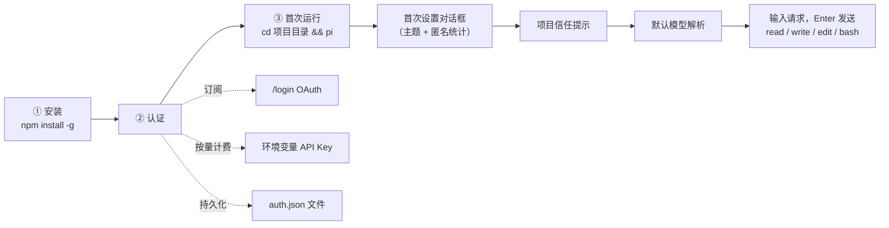
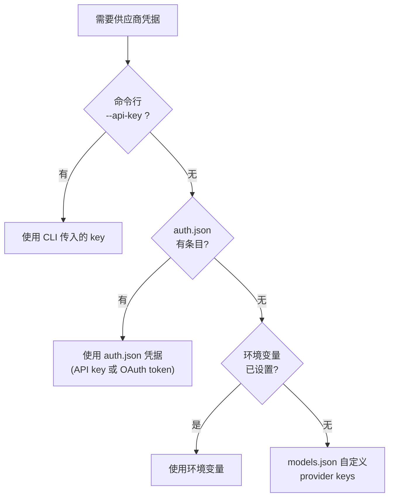
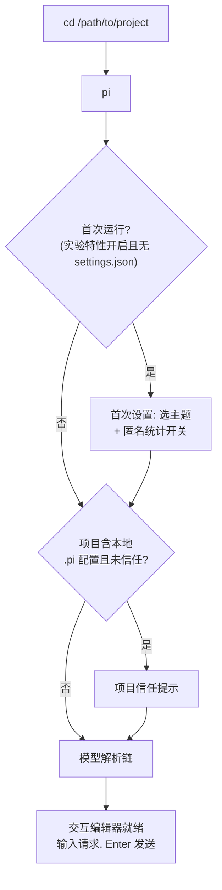

本页是 Pi 编码智能体的入门教程，覆盖从零开始的三件事：**安装 CLI、完成模型认证、跑通第一次会话**。读完本页，你将能在自己的项目目录中启动 `pi`，让它读取代码、编辑文件并执行命令。整个过程只需要一个终端和 Node.js 环境，无需修改任何配置文件即可完成默认流程。

Sources: [quickstart.md](packages/coding-agent/docs/quickstart.md#L1-L3)

## 本页在文档体系中的位置

本页是"入门指南"章节的第二站。前置内容是项目概览（了解 Pi 是什么、由哪些包组成）；本页之后的内容按依赖顺序排列：先理解供应商与模型的接入细节，再学习交互模式的具体操作，然后是会话管理和运行模式。建议按下面表格的顺序推进阅读，每一步都建立在前一步的环境之上：

| 阅读顺序 | 页面 | 你将获得 |
|---------|------|---------|
| 1（前置） | [项目概览：最小化终端编码智能体套件](1-xiang-mu-gai-lan-zui-xiao-hua-zhong-duan-bian-ma-zhi-neng-ti-tao-jian) | Pi 的包结构与设计哲学 |
| 2（本页） | **快速上手：安装、认证与首次运行** | 可用的 `pi` 命令行环境 |
| 3 | [供应商与模型接入：订阅登录与 API Key](3-gong-ying-shang-yu-mo-xing-jie-ru-ding-yue-deng-lu-yu-api-key) | 全量供应商、OAuth 与凭据存储细节 |
| 4 | [交互模式使用指南：编辑器、命令与快捷键](4-jiao-hu-mo-shi-shi-yong-zhi-nan-bian-ji-qi-ming-ling-yu-kuai-jie-jian) | 日常操作效率 |
| 5 | [会话管理：树形分支、上下文压缩与导出](5-hui-hua-guan-li-shu-xing-fen-zhi-shang-xia-wen-ya-suo-yu-dao-chu) | 会话持久化与分支 |
| 6 | [四种运行模式：交互、打印、JSON、RPC 与 SDK](6-si-zhong-yun-xing-mo-shi-jiao-hu-da-yin-json-rpc-yu-sdk) | 脚本化与程序化集成 |

Sources: [README.md](README.md#L22-L30)

## 上手全景：三步走

整个上手流程是一条线性路径，每一步的产物都是下一步的输入。下图展示了从安装到第一次对话的完整链路，其中认证环节有三种可选途径（后续章节展开），启动环节包含若干自动化的首次决策（主题、信任、默认模型）：



Pi 是一个交互式终端编码智能体 CLI，发行名为 `@earendil-works/pi-coding-agent`，安装后提供的命令叫 `pi`。它默认给模型四个工具：`read`、`write`、`edit`、`bash`，模型通过调用这些工具来完成你的请求。

Sources: [README.md](packages/coding-agent/README.md#L63-L92), [package.json](packages/coding-agent/package.json#L2-L10)

## 第一步：安装

### 环境要求与标准安装

Pi 通过 npm 分发，安装命令只有一行：

```bash
npm install -g --ignore-scripts @earendil-works/pi-coding-agent
```

两个关键点值得初学者注意。第一，`--ignore-scripts` 会在安装期间禁用依赖包的生命周期脚本——这是 Pi 项目供应链加固策略的一部分（官方文档明确指出：Pi 在正常 npm 安装中**不需要**任何安装脚本，因此禁用它们没有任何功能损失，只是切断了恶意安装脚本的攻击面）。第二，Pi 要求 **Node.js >= 22.19.0**（定义在包的 `engines` 字段中），安装前请确认版本：`node --version`。

Sources: [quickstart.md](packages/coding-agent/docs/quickstart.md#L5-L13), [package.json](packages/coding-agent/package.json#L110-L112), [README.md](README.md#L95-L107)

如果不想使用 npm，也可以用官方安装脚本一行完成安装：

```bash
curl -fsSL https://pi.dev/install.sh | sh
```

安装脚本内部同样使用 npm 全局安装，因此后续的卸载方式与 npm 安装一致。

Sources: [README.md](packages/coding-agent/README.md#L68-L76), [quickstart.md](packages/coding-agent/docs/quickstart.md#L17-L21)

### 从源码运行（可选，面向开发者）

如果你想在修改源码的同时使用 pi（例如开发扩展），可以走源码路径。仓库根目录提供了一套开发命令：先 `npm install --ignore-scripts` 安装依赖，`npm run build` 构建所有包（或用 `npm run build:offline` 跳过网络刷新），然后通过 `./pi-test.sh` 从源码直接运行 pi——这个脚本可以在任意工作目录下执行，因为它内部用绝对路径定位仓库。`pi-test.sh` 还支持 `--no-env` 标志，会清空所有 API key 相关的环境变量（如 `ANTHROPIC_API_KEY`、`OPENAI_API_KEY` 等），用于测试"无凭据"场景下的行为。

```bash
git clone https://github.com/earendil-works/pi.git
cd pi
npm install --ignore-scripts
npm run build
./pi-test.sh          # 在任意目录运行源码版 pi
```

Sources: [README.md](README.md#L53-L61), [pi-test.sh](pi-test.sh#L12-L58)

### 卸载

用安装时对应的包管理器卸载即可：

```bash
npm uninstall -g @earendil-works/pi-coding-agent   # npm 或 curl 安装器
pnpm remove -g @earendil-works/pi-coding-agent     # pnpm
bun uninstall -g @earendil-works/pi-coding-agent   # bun
```

注意：卸载只移除程序本身，**不会删除你的数据**。设置、凭据、会话记录和已安装的 pi 包都保留在 `~/.pi/agent/` 目录下，重新安装后依然可用。

Sources: [quickstart.md](packages/coding-agent/docs/quickstart.md#L15-L40)

## 第二步：认证

Pi 自己不托管任何模型，它需要凭据来访问你选择的 LLM 供应商。认证体系围绕三种凭据来源构建，三者的配置成本和适用场景不同：

| 途径 | 配置方式 | 适合场景 | 存储位置 |
|------|---------|---------|---------|
| 订阅 OAuth（`/login`） | 交互式浏览器授权 | 已有 Claude Pro/Max、ChatGPT Plus/Pro 等订阅 | `~/.pi/agent/auth.json`（自动刷新 token） |
| 环境变量 API Key | `export XXX_API_KEY=...` | 按量计费账号、CI/脚本环境 | 进程环境，不落盘 |
| auth.json 文件 | 手写 JSON 或经 `/login` 写入 | 需要持久化多个供应商凭据 | `~/.pi/agent/auth.json`（0600 权限） |

Sources: [providers.md](packages/coding-agent/docs/providers.md#L1-L26), [quickstart.md](packages/coding-agent/docs/quickstart.md#L42-L56)

### 途径一：订阅登录（/login）

启动 pi 后在输入框中输入 `/login`，会弹出供应商选择列表。内置支持订阅登录的供应商包括：**ChatGPT Plus/Pro（Codex）**、**Claude Pro/Max**、**GitHub Copilot**、**xAI（Grok/X 订阅）**、**OpenRouter** 和 **Radius**。选择后 pi 会打开浏览器完成 OAuth 授权，获得的 token 存入 `~/.pi/agent/auth.json` 并在过期时**自动刷新**（OpenRouter 是例外：它铸造的是一个不过期的用户控制 API key）。用 `/logout` 可清除凭据。

Sources: [providers.md](packages/coding-agent/docs/providers.md#L15-L26)

一个对初学者实用的细节：在远程/无头环境（例如通过 SSH 连接的服务器）上，浏览器无法回调到本机回环地址。此时 OpenRouter 流程允许你把最终的跳转 URL（或授权码）直接粘贴进登录提示框来完成认证。

Sources: [providers.md](packages/coding-agent/docs/providers.md#L45-L51)

### 途径二：环境变量 API Key

这是最轻量的方式——在启动 pi 前导出环境变量：

```bash
export ANTHROPIC_API_KEY=sk-ant-...
pi
```

每个供应商对应一个约定的环境变量名，下表列出最常用的几个（完整表格见官方 providers 文档）：

| 供应商 | 环境变量 | auth.json 中的键名 |
|--------|---------|-------------------|
| Anthropic | `ANTHROPIC_API_KEY` | `anthropic` |
| OpenAI | `OPENAI_API_KEY` | `openai` |
| Google Gemini | `GEMINI_API_KEY` | `google` |
| DeepSeek | `DEEPSEEK_API_KEY` | `deepseek` |
| xAI | `XAI_API_KEY` | `xai` |
| OpenRouter | `OPENROUTER_API_KEY` | `openrouter` |
| GitHub Copilot | `COPILOT_GITHUB_TOKEN` | `github-copilot` |
| Hugging Face | `HF_TOKEN` | `huggingface` |
| Amazon Bedrock | `AWS_BEARER_TOKEN_BEDROCK` | `amazon-bedrock` |

这套映射在代码中由 `getApiKeyEnvVars` 的 `envMap` 表驱动。一个容易踩坑的细节：Anthropic 实际识别三个变量——`ANTHROPIC_AUTH_TOKEN`、`ANTHROPIC_OAUTH_TOKEN`、`ANTHROPIC_API_KEY`，但 `getEnvApiKey` 在取值时会**跳过 `ANTHROPIC_AUTH_TOKEN`**，因为该变量必须以 `Authorization: Bearer` 头的形式传递，而非作为普通 API key 使用。

Sources: [providers.md](packages/coding-agent/docs/providers.md#L58-L107), [env-api-keys.ts](packages/ai/src/env-api-keys.ts#L28-L93), [env-api-keys.ts](packages/ai/src/env-api-keys.ts#L113-L122)

### 途径三：auth.json 凭据文件

所有持久化凭据最终都汇聚到 `~/.pi/agent/auth.json`（可通过 `PI_CODING_AGENT_DIR` 环境变量重定向整个 agent 目录）。文件结构如下：

```json
{
  "anthropic": { "type": "api_key", "key": "sk-ant-..." },
  "openai": { "type": "api_key", "key": "sk-..." }
}
```

这个文件有两个工程层面的保障值得了解。**权限**：文件以 `0600` 模式创建（仅文件属主可读写），父目录以 `0700` 创建——权限设置只在首次创建时生效，因此管理员后续手动收紧 ACL 不会被覆盖。**并发安全**：写入前会通过 `proper-lockfile` 获取文件锁（最多重试 10 次、每次间隔 20ms），避免多个 pi 进程同时写入互相覆盖。

Sources: [config.ts](packages/coding-agent/src/config.ts#L527-L536), [auth-storage.ts](packages/coding-agent/src/core/auth-storage.ts#L20-L22), [auth-storage.ts](packages/coding-agent/src/core/auth-storage.ts#L48-L77), [providers.md](packages/coding-agent/docs/providers.md#L109-L139)

`key` 字段不只是字面量，它支持四种解析形式，这让凭据管理可以接入系统钥匙串等外部机制：

| key 写法 | 行为 | 示例 |
|---------|------|------|
| `!command` 开头 | 执行整条 shell 命令，取 stdout（进程生命周期内缓存） | `!security find-generic-password -ws 'anthropic'` |
| `$VAR` / `${VAR}` | 环境变量插值，可嵌入更长字面量 | `${KEY_PREFIX}_${KEY_SUFFIX}` |
| `$$` / `$!` | 转义，输出字面量 `$` / `!` | `$$literal-dollar-prefix` |
| 其他 | 原样作为字面量 | `sk-ant-...` |

OAuth 凭据（订阅登录的产物）也存储在同一文件中，由 pi 自动管理刷新。

Sources: [providers.md](packages/coding-agent/docs/providers.md#L141-L167)

### 凭据解析优先级

当 pi 需要为某个供应商取凭据时，按以下顺序解析，**先命中先用**：



这个顺序意味着：**auth.json 的优先级高于环境变量**——如果你在 auth.json 中存了一个 key，即使环境变量也设置了一个，pi 会使用文件里的那个。如果需要临时覆盖，用命令行 `--api-key` 标志的优先级最高。

Sources: [providers.md](packages/coding-agent/docs/providers.md#L310-L318)

### 验证认证状态

不必启动交互会话也能检查认证是否就绪。Pi 提供了非交互的 auth 命令族：

```bash
pi auth check --provider anthropic            # 检查认证就绪状态
pi auth print-api-key --provider openai       # 打印解析后的 API key
pi auth print-bearer-token --provider openai-codex  # 打印 OAuth bearer token
```

`auth check` 会返回三种状态之一：`ready`（凭据可用）、`not_ready`（供应商不存在或凭据未配置）、`invalid`（内部状态异常）。支持 `--json` 输出和 `--credentials` 选项，便于在脚本中集成。

Sources: [auth-command.ts](packages/coding-agent/src/cli/auth-command.ts#L19-L43), [auth-check.ts](packages/coding-agent/src/cli/auth-check.ts#L19-L49)

如果启动时凭据缺失，pi 会在界面上直接给出修复指引，例如 `No API key found for <provider>` 后附上 providers.md 和 models.md 的本地文档路径，提示你使用 `/login`。

Sources: [auth-guidance.ts](packages/coding-agent/src/core/auth-guidance.ts#L5-L26)

## 第三步：首次运行

### 启动流程全览

认证完成后，进入你想让 pi 工作的项目目录并运行 `pi`。Pi 在当前工作目录中运行，并且可以修改那里的文件——官方建议用 git 或其他检查点机制获得回滚能力。下图展示交互模式的启动序列，其中标出了两个"仅首次出现"的环节：



Sources: [quickstart.md](packages/coding-agent/docs/quickstart.md#L69-L84), [usage.md](packages/coding-agent/docs/usage.md#L124-L145)

### 首次设置对话框与项目信任

首次启动时（确切条件为：`PI_EXPERIMENTAL=1`、使用默认 agent 目录、且尚无 `settings.json`），pi 会显示一个两步设置对话框：先选主题（自动检测系统外观为深色/浅色，可用上下键预览切换），再选择是否共享匿名使用数据（选择加入会在 `settings.json` 中写入追踪标识，可通过 `/privacy` 观察共享内容、随时在设置中更改；默认是关闭的）。

Sources: [first-time-setup.test.ts](packages/coding-agent/test/first-time-setup.test.ts#L13-L45), [first-time-setup.ts](packages/coding-agent/src/modes/interactive/components/first-time-setup.ts#L10-L60)

第二个启动决策是**项目信任**：当项目目录包含项目级设置或资源（如 `.pi/settings.json`）且没有已保存的信任决定时，pi 会询问是否信任该目录。信任决定保存在 `~/.pi/agent/trust.json`；信任之前 pi 只加载上下文文件和全局扩展，信任之后才加载项目本地资源。非交互模式（`-p`、`--mode json`、`--mode rpc`）不弹信任提示，而是遵循全局设置中的 `defaultProjectTrust` 策略。也可以用 `--approve`/`-a` 或 `--no-approve`/`-na` 为单次运行显式指定。

Sources: [usage.md](packages/coding-agent/docs/usage.md#L124-L145)

### 默认模型如何被选中

第一次运行时你没有手动选过模型，那 pi 用哪个模型回复？答案是一条五级解析链（在 `findInitialModel` 中实现，按序短路返回）：

1. **命令行参数优先**：`--provider <name> --model <pattern>` 显式指定（支持 `provider/id` 和 `model:thinking` 简写）；
2. **scoped models 第一个**：若用 `--models "pattern1,pattern2"` 限定了候选集（Ctrl+P 循环切换用），取第一个（继续会话时跳过）；
3. **设置中保存的默认模型**：来自 `/model` 选择器中按 Ctrl+S 保存的启动默认（前提是该供应商已配置认证）；
4. **第一个有有效凭据的已知供应商默认模型**：对每个内置供应商按 `defaultModelPerProvider` 表逐个尝试——例如 Anthropic 是 `claude-opus-4-8`、OpenAI 是 `gpt-5.5`、Google 是 `gemini-3.1-pro-preview`；
5. **兜底**：取可用模型列表的第一个；若完全无模型可用，界面会提示 `No model selected` 并指引你 `/login` 后用 `/model` 选择。

所以最典型的首次体验是：你 `export ANTHROPIC_API_KEY=...` 后运行 `pi`，解析链走到第 4 级，直接选中 Anthropic 的默认模型，无需任何额外配置。

Sources: [model-resolver.ts](packages/coding-agent/src/core/model-resolver.ts#L627-L712), [model-resolver.ts](packages/coding-agent/src/core/model-resolver.ts#L20-L40), [auth-guidance.ts](packages/coding-agent/src/core/auth-guidance.ts#L14-L21)

### 默认工具集

默认情况下 pi 赋予模型四个核心工具，这构成了"编码智能体"的最小闭环：

| 工具 | 能力 |
|------|------|
| `read` | 读取文件 |
| `write` | 创建或覆盖文件 |
| `edit` | 补丁式修改文件 |
| `bash` | 执行 shell 命令 |

另有内置只读工具 `grep`、`find`、`ls`（以及 Windows 上的 `powershell`），可通过工具选项启用。你也可以收窄工具集实现只读模式，例如 `pi --tools read,grep,find,ls -p "Review the code"`。

Sources: [quickstart.md](packages/coding-agent/docs/quickstart.md#L69-L84), [usage.md](packages/coding-agent/docs/usage.md#L183-L205)

### 用 AGENTS.md 注入项目指令

Pi 在启动时自动加载上下文文件，让模型了解项目约定。加载来源包括：全局的 `~/.pi/agent/AGENTS.md`、从当前目录向上逐级查找的 `AGENTS.md` 或 `CLAUDE.md`，以及当前目录本身。若目录中存在 `AGENTS.override.md`，则优先于该目录的 `AGENTS.md`/`CLAUDE.md` 加载。修改上下文文件后，重启 pi 或运行 `/reload` 使其生效。下面是一个典型的项目指令文件：

```markdown
# Project Instructions

- Run `npm run check` after code changes.
- Do not run production migrations locally.
- Keep responses concise.
```

Sources: [quickstart.md](packages/coding-agent/docs/quickstart.md#L86-L99), [usage.md](packages/coding-agent/docs/usage.md#L94-L110)

### 会话与常用启动参数

会话自动保存到 `~/.pi/agent/sessions/`（按工作目录组织），因此你随时可以回到之前的对话。以下启动参数覆盖最常见的场景：

| 参数 | 作用 |
|------|------|
| `pi -c` | 继续最近一次会话 |
| `pi -r` | 浏览并选择历史会话 |
| `pi --name "my task"` | 启动时命名会话 |
| `pi --session <path\|id>` | 打开指定会话 |
| `pi -p "提示"` | 非交互打印模式：输出回复后退出 |
| `pi @file.md "总结这个"` | `@` 前缀把文件附加进消息 |
| `cat file.txt \| pi -p "总结"` | 管道输入与提示合并 |

会话内部的 `/resume`、`/new`、`/tree`、`/fork`、`/clone` 命令用于管理会话生命周期；`/model`（或 Ctrl+L）切换模型，`/thinking` 切换思考等级。关于这四种运行模式（交互/打印/JSON/RPC）的完整差异，见 [四种运行模式：交互、打印、JSON、RPC 与 SDK](6-si-zhong-yun-xing-mo-shi-jiao-hu-da-yin-json-rpc-yu-sdk)。

Sources: [quickstart.md](packages/coding-agent/docs/quickstart.md#L101-L157), [usage.md](packages/coding-agent/docs/usage.md#L82-L92), [usage.md](packages/coding-agent/docs/usage.md#L170-L190)

## 常见问题排查

初学者在安装与认证阶段最常遇到的问题汇总如下：

| 症状 | 可能原因 | 解决办法 |
|------|---------|---------|
| `pi: command not found` | 全局安装目录不在 PATH，或 Node 版本过低 | 确认 Node >= 22.19.0，重装并检查 npm 全局 bin 目录 |
| `No API key found for <provider>` | 该供应商无任何凭据来源 | `export XXX_API_KEY=...` 或运行 `/login` |
| `No model selected.` | 有凭据但未确定默认模型 | `/login` 后用 `/model`（Ctrl+S 保存为启动默认） |
| `auth check` 返回 `provider_not_found` | 供应商 ID 拼写错误或不在目录中 | 用 `pi --list-models` 查看可用供应商与模型 |
| SSH 远程机上 OAuth 登录卡住 | 浏览器无法回调本机回环地址 | 将最终跳转 URL 或授权码粘贴进登录提示框 |
| 修改了 AGENTS.md 不生效 | 上下文文件仅在启动时加载 | 重启 pi 或运行 `/reload` |
| auth.json 修改不生效/被覆盖 | 多个 pi 进程并发写入 | 正常现象：pi 用文件锁序列化写入，稍后重试 |

Sources: [auth-guidance.ts](packages/coding-agent/src/core/auth-guidance.ts#L5-L26), [auth-check.ts](packages/coding-agent/src/cli/auth-check.ts#L19-L49), [providers.md](packages/coding-agent/docs/providers.md#L45-L51), [quickstart.md](packages/coding-agent/docs/quickstart.md#L94-L99), [auth-storage.ts](packages/coding-agent/src/core/auth-storage.ts#L48-L77)

## 下一步

到这里你已经拥有一个可用的 pi 环境。推荐按以下路径继续深入：

- **[供应商与模型接入：订阅登录与 API Key](3-gong-ying-shang-yu-mo-xing-jie-ru-ding-yue-deng-lu-yu-api-key)** —— 全量供应商表格、云端供应商（Azure/Vertex/Bedrock/Cloudflare）配置、auth.json 高级用法；
- **[交互模式使用指南：编辑器、命令与快捷键](4-jiao-hu-mo-shi-shi-yong-zhi-nan-bian-ji-qi-ming-ling-yu-kuai-jie-jian)** —— 编辑器特性、斜杠命令、消息队列；
- **[会话管理：树形分支、上下文压缩与导出](5-hui-hua-guan-li-shu-xing-fen-zhi-shang-xia-wen-ya-suo-yu-dao-chu)** —— 会话树、`/compact`、导出与分享；
- **[四种运行模式：交互、打印、JSON、RPC 与 SDK](6-si-zhong-yun-xing-mo-shi-jiao-hu-da-yin-json-rpc-yu-sdk)** —— 把 pi 嵌入脚本与应用。

另外两点补充说明对安全敏感的读者很重要：Pi **不内置权限系统**，默认以启动它的用户身份运行，需要更强边界时应容器化（官方文档提供了三种容器化模式）；项目自身遵循严格的供应链加固规范（依赖精确锁定、`npm-shrinkwrap.json` 随包发布、CI 以 `--ignore-scripts` 安装），这与你安装时使用的 `--ignore-scripts` 是同一套防御策略。