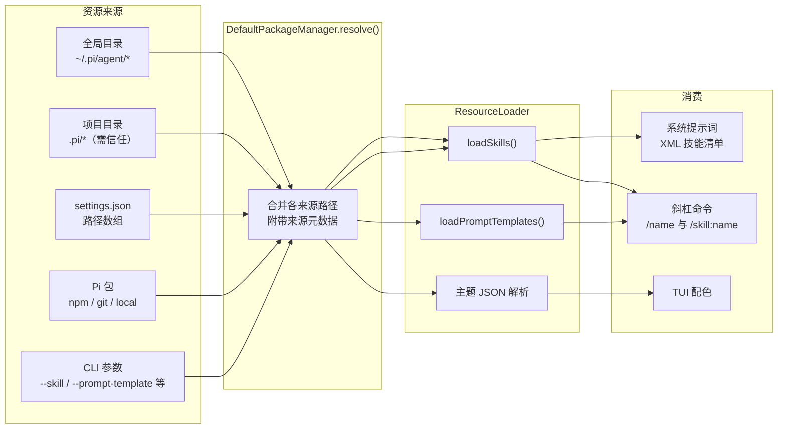
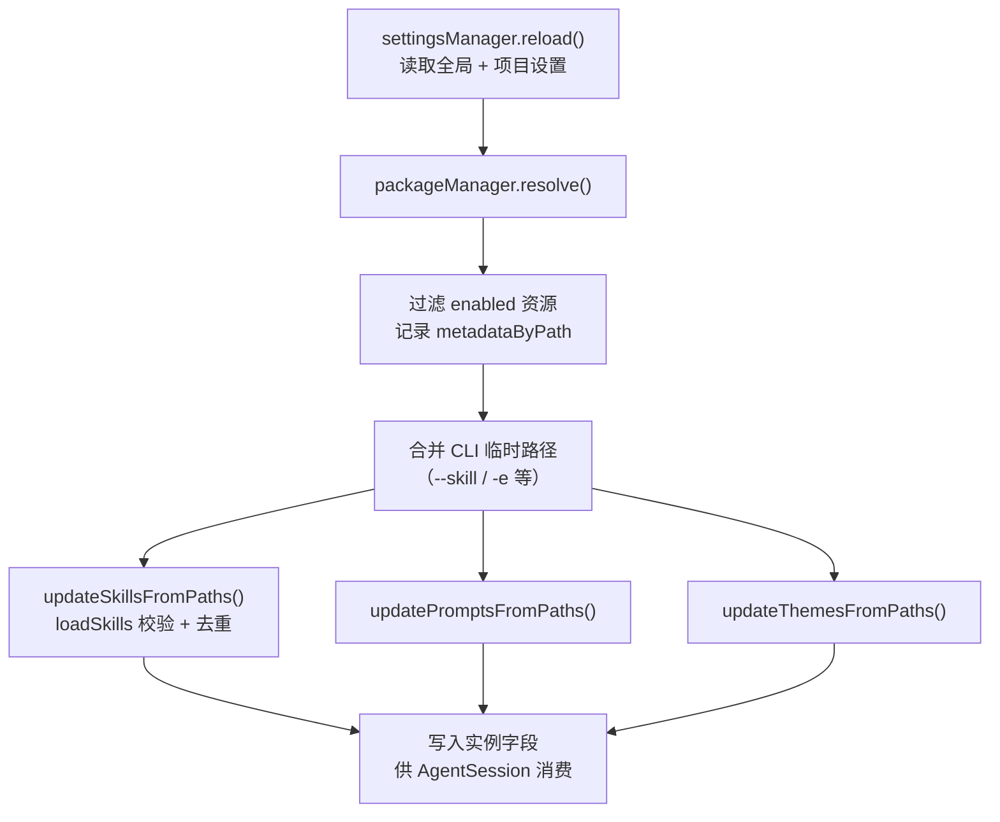
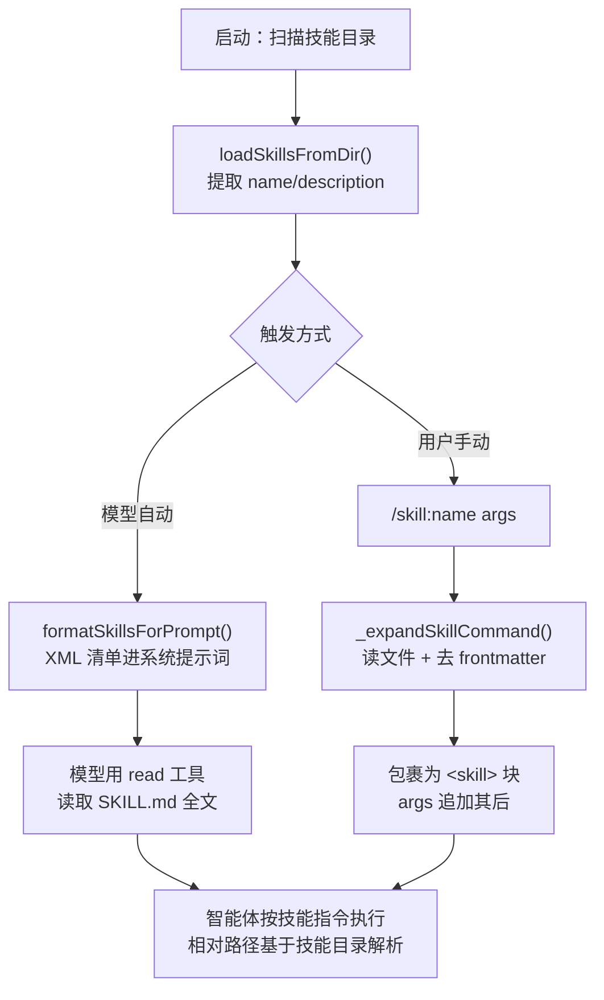
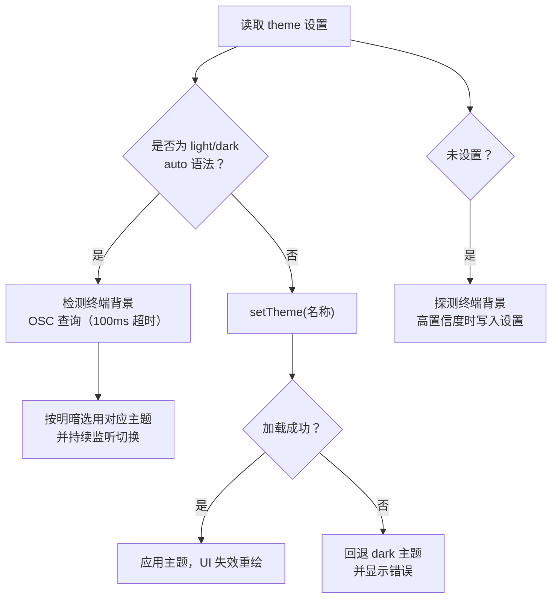

Pi 的设计哲学是"核心保持极简，个性化由外挂完成"。本页介绍 pi coding agent 的四种个性化机制：**Skills**（按需加载的能力包）、**提示模板**（可复用的斜杠命令）、**主题**（TUI 配色）与 **Pi 包**（把前三者打包分发的载体）。它们共同构成一个"发现 → 解析 → 注入"的统一资源管线，让初学者只需编写 Markdown 或 JSON 文件就能扩展智能体的能力与外观，无需修改 Pi 内部代码。

## 总览：一张图理解四层资源体系

四种资源的差异只在于**文件格式**与**触发方式**，其发现、合并与加载流程完全共享：



四类资源在"写什么文件、放在哪、怎么触发"上的对比如下：

| 维度 | Skills | 提示模板 | 主题 | Pi 包 |
|---|---|---|---|---|
| 文件格式 | `SKILL.md`（含 frontmatter） | `.md`（含可选 frontmatter） | `.json` | `package.json` 的 `pi` 字段 |
| 典型位置 | `~/.pi/agent/skills/`、`.pi/skills/` | `~/.pi/agent/prompts/`、`.pi/prompts/` | `~/.pi/agent/themes/`、`.pi/themes/` | npm/git 仓库或本地目录 |
| 触发方式 | 模型自动加载 或 `/skill:name` | 手动输入 `/文件名` | `/settings` 选择 | 安装后自动生效 |
| 消费方 | 系统提示词 + 会话消息 | 用户消息展开 | 交互式 TUI | —（作为前三者的容器） |
| 递归扫描 | 是（找 `SKILL.md`） | 否（仅顶层 `.md`） | 否（仅顶层 `.json`） | 按 manifest 规则 |

Sources: [resource-loader.ts](packages/coding-agent/src/core/resource-loader.ts#L40-L52)、[README.md](packages/coding-agent/README.md#L340-L357)

## 共同骨架：ResourceLoader 的资源管线

`ResourceLoader` 是四类资源的统一编排者。它对外暴露 `getSkills()`、`getPrompts()`、`getThemes()`、`getExtensions()` 等接口，内部则通过 `DefaultPackageManager.resolve()` 把分散在五个来源的路径归一化。

`resolve()` 的合并规则有三条要点。第一，**项目设置优先于全局设置**：同一包在项目与全局都配置时，项目作用域胜出，这样团队共享的 `.pi/settings.json` 可以覆盖个人配置。第二，每个资源路径都会附带一份 `PathMetadata`（来源、作用域、是否来自包），用于 UI 标注和名称冲突裁决。第三，冲突遵循**先到先得**（first-wins），优先级由 `resourcePrecedenceRank` 决定：项目级 settings 条目（rank 0）> 项目级自动发现（rank 1）> 用户级 settings 条目（rank 2）> 用户级自动发现（rank 3）> 包内资源（rank 4）。



这条管线在启动时执行一次，之后 `/reload` 命令可随时重跑（`reload` 的描述明确列出"Reload keybindings, extensions, skills, prompts, themes, and context files"）。加载期间产生的校验问题不会让启动失败，而是以 `ResourceDiagnostic`（warning/error/collision）形式收集，在 UI 中提示。

Sources: [package-manager.ts](packages/coding-agent/src/core/package-manager.ts#L176-L192)、[package-manager.ts](packages/coding-agent/src/core/package-manager.ts#L912-L964)、[resource-loader.ts](packages/coding-agent/src/core/resource-loader.ts#L400-L513)、[slash-commands.ts](packages/coding-agent/src/core/slash-commands.ts#L19-L43)

## Skills：按需加载的能力包

### 是什么，为什么这样设计

Skill 是遵循 [Agent Skills 标准](https://agentskills.io) 的自包含能力包：一个目录里的 `SKILL.md` 写明"这个技能做什么、什么时候用"，外加可选的脚本与参考文档。Pi 采用**渐进披露**（progressive disclosure）策略——启动时只把每个技能的名称和描述放进系统提示词，正文按需加载。这样即使安装了几十个技能，常驻上下文也只有一份轻量清单，任务匹配时智能体才会用 `read` 工具（`read` 不可用时用 `bash`）读取完整 `SKILL.md`。

技能有两条触发路径。**自动触发**：系统提示词中以 XML 格式列出可用技能，模型判断任务匹配后自行加载；**手动触发**：每个技能注册为 `/skill:name` 斜杠命令（可通过 `enableSkillCommands` 设置关闭）。下图概括两条路径：



Sources: [skills.ts](packages/coding-agent/src/core/skills.ts#L347-L383)、[agent-session.ts](packages/coding-agent/src/core/agent-session.ts#L1353-L1376)、[docs/skills.md](packages/coding-agent/docs/skills.md#L65-L72)

### 位置与发现规则

Pi 从五类位置收集技能：全局 `~/.pi/agent/skills/` 与 `~/.agents/skills/`；项目 `.pi/skills/` 与祖先目录的 `.agents/skills/`（`.agents/` 是 Claude Code、Codex 等其他工具的通用约定，Pi 直接兼容，从 cwd 向上查到 git 仓库根）；已安装 Pi 包内的 `skills/` 目录；settings 的 `skills` 数组（可借此直接引用 `~/.claude/skills` 等外部目录）；CLI 的 `--skill <path>`（重复使用、即使 `--no-skills` 也生效）。

发现算法有明确的递归规则：某目录一旦包含 `SKILL.md` 就被当作技能根，**不再向内递归**；否则继续扫描子目录找 `SKILL.md`。在 `~/.pi/agent/skills/` 与 `.pi/skills/` 这两个"Pi 风格"目录里，根级 `.md` 文件只要有合法 frontmatter（含非空 `description`）也会被识别为单文件技能——本仓库自身的 `.pi/skills/add-llm-provider.md` 就是这种形态。扫描过程尊重 `.gitignore`、`.ignore`、`.fdignore`，并跳过 `node_modules` 与点开头目录。

Sources: [skills.ts](packages/coding-agent/src/core/skills.ts#L160-L171)、[skills.ts](packages/coding-agent/src/core/skills.ts#L452-L458)、[package-manager.ts](packages/coding-agent/src/core/package-manager.ts#L462-L481)、[docs/skills.md](packages/coding-agent/docs/skills.md#L24-L42)、[.pi/skills/add-llm-provider.md](.pi/skills/add-llm-provider.md#L1-L4)

### SKILL.md 格式与校验

技能文件由 YAML frontmatter 和 Markdown 正文组成。Pi 对标准的实现是"宽松但会警告"：允许技能名与父目录名不同（标准要求一致，但这对多工具共享技能目录不友好，Pi 认为该规则弊大于利）。校验规则如下表：

| frontmatter 字段 | 必需 | 约束 |
|---|---|---|
| `name` | 否（缺省用父目录名） | ≤64 字符；仅小写字母、数字、连字符；不以连字符开头/结尾；无连续连字符 |
| `description` | 是 | ≤1024 字符；为空则整个技能被丢弃 |
| `disable-model-invocation` | 否 | `true` 时从系统提示词清单中隐藏，只能通过 `/skill:name` 调用 |

名称冲突按加载顺序先到先得，后到者触发一条 `collision` 诊断（记录胜者与败者路径），不会导致崩溃。通过符号链接重复出现的同一文件会被 `canonicalizePath` 识别并静默去重。

Sources: [skills.ts](packages/coding-agent/src/core/skills.ts#L88-L127)、[skills.ts](packages/coding-agent/src/core/skills.ts#L319-L345)、[skills.ts](packages/coding-agent/src/core/skills.ts#L421-L449)、[docs/skills.md](packages/coding-agent/docs/skills.md#L138-L158)

### 手动触发的展开细节

当用户输入 `/skill:name args` 时，`AgentSession.prompt()` 的处理顺序值得初学者注意：**扩展命令最先拦截**，然后是 `input` 事件钩子，接着才轮到技能展开与模板展开。`_expandSkillCommand` 按名字查找技能、读取文件、剥掉 frontmatter，然后把正文包进 `<skill name="..." location="...">` 标签——标签内注明"相对路径基于技能目录"，这解决了模型读取技能后引用 `scripts/xxx.sh` 之类相对路径时的定位问题。命令后的参数原样追加到技能块之后，等价于把用户参数作为附加指令交给模型。

Sources: [agent-session.ts](packages/coding-agent/src/core/agent-session.ts#L1165-L1207)、[agent-session.ts](packages/coding-agent/src/core/agent-session.ts#L1353-L1376)、[interactive-mode.ts](packages/coding-agent/src/modes/interactive/interactive-mode.ts#L713-L731)

## 提示模板：Markdown 即斜杠命令

### 格式与加载

提示模板是更轻量的复用单元：一个 `.md` 文件就是一个命令，**文件名即命令名**（`pr.md` → `/pr`）。frontmatter 支持两个可选字段：`description`（缺省时取正文首个非空行并截断到 60 字符）与 `argument-hint`（在自动补全下拉框中显示，如 `<PR-URL>`，尖括号表示必填、方括号表示可选）。

加载位置与技能一致：全局 `~/.pi/agent/prompts/`、项目 `.pi/prompts/`（需项目信任）、Pi 包、settings `prompts` 数组、CLI `--prompt-template`。与技能的区别在于模板扫描**不递归**——子目录里的模板必须通过 settings 或包 manifest 显式声明。文件支持符号链接（指向文件即加载，断链则跳过）。

Sources: [prompt-templates.ts](packages/coding-agent/src/core/prompt-templates.ts#L104-L133)、[prompt-templates.ts](packages/coding-agent/src/core/prompt-templates.ts#L177-L263)、[docs/prompt-templates.md](packages/coding-agent/docs/prompt-templates.md#L7-L17)、[.pi/prompts/pr.md](.pi/prompts/pr.md#L1-L4)

### Bash 风格的参数替换

模板正文支持一套小型占位符语言，实现于 `substituteArgs`。参数解析遵循 bash 引号规则（`parseCommandArgs` 正确处理 `"双引号"` 与 `'单引号'` 内的空格）：

| 占位符 | 含义 | 示例 |
|---|---|---|
| `$1`、`$2` … | 第 N 个位置参数（1 起始） | `/component Button` → `$1` = `Button` |
| `$@` / `$ARGUMENTS` | 全部参数以空格连接 | `/pr https://... #123` → `$@` = 两个 URL |
| `${N:-default}` | 第 N 个参数，为空时用默认值 | `总结为 ${1:-7} 条要点` |
| `${@:-default}` / `${ARGUMENTS:-default}` | 全部参数，为空时用默认值 | 可选整体指令 |
| `${@:N}` | 从第 N 个参数起到末尾（bash 切片） | 跳过前几个参数 |
| `${@:N:L}` | 从第 N 个参数起取 L 个 | 精确截取区间 |

替换只作用于模板字符串本身——参数值里若包含 `$1` 之类的字面量不会被递归展开，避免了注入嵌套。在 `AgentSession.prompt()` 中，`expandPromptTemplate` 用正则匹配 `/名称 参数串`，命中模板则展开为完整提示词，未命中则原样透传（所以自定义模板名不会与内置斜杠命令冲突时才生效）。

Sources: [prompt-templates.ts](packages/coding-agent/src/core/prompt-templates.ts#L24-L55)、[prompt-templates.ts](packages/coding-agent/src/core/prompt-templates.ts#L57-L102)、[prompt-templates.ts](packages/coding-agent/src/core/prompt-templates.ts#L269-L286)、[docs/prompt-templates.md](packages/coding-agent/docs/prompt-templates.md#L65-L75)

## 主题：JSON 驱动的 TUI 配色

### 结构与色彩降级

主题是一个 JSON 文件，包含三部分：`name`（必需、唯一、不得含 `/`，因为 `/` 保留给自动明暗语法）、`vars`（可复用的颜色变量，可以是十六进制字符串或 256 色序号）、`colors`（必须定义全部 53 个必需 token，其中 `thinkingMax` 与两个搜索高亮 token 可选，缺省时自动回退到相邻 token）。53 个 token 覆盖核心 UI（accent/边框/状态色）、Markdown 渲染（标题/链接/代码块/引用）、diff 增删行、语法高亮（关键字/函数/字符串等 9 类）与思考级别指示色。

Pi 按**终端能力**降级渲染：真彩终端直接输出 hex；仅支持 256 色的终端走最近邻匹配算法——先在 6×6×6 色立方与 24 级灰阶中分别找最近色，再按加权欧氏距离（绿色权重 0.587，模拟人眼敏感度）择优；颜色饱和度极低（max-min < 10）时优先灰阶以避免"沾色"。这套降级让同一份主题 JSON 在高端与低端终端上都能保持视觉一致性。

Sources: [theme.ts](packages/coding-agent/src/modes/interactive/theme/theme.ts#L41-L104)、[theme.ts](packages/coding-agent/src/modes/interactive/theme/theme.ts#L124-L195)、[docs/themes.md](packages/coding-agent/docs/themes.md#L143-L170)

### 发现、选择与热重载

主题来源共六类：内置 `dark`/`light`（随二进制分发于 `theme/dark.json` 与 `theme/light.json`）、全局 `~/.pi/agent/themes/*.json`、项目 `.pi/themes/*.json`、Pi 包、settings `themes` 数组、CLI `--theme <path>`。运行时主题解析的决策链如下：



用户可写三种形式：固定名称（`"theme": "my-theme"`）、自动明暗（`"light/dark"` 格式，跟随终端外观实时切换）、或不设置（首次运行时探测背景，高置信度时自动保存）。此外 `InteractiveThemeController` 提供 `preview()` 用于在主题选择器里即时预览，`setThemeInstance()` 允许扩展注入内存主题。

**热重载**是自定义主题的杀手级体验：当活动主题是自定义文件（非内置 dark/light）时，Pi 用文件监视器监听其所在目录，文件变更经 100ms 防抖后重新解析并全局应用；编辑期间的语法错误会被静默忽略，保留上一个有效版本，直到文件恢复合法。改一行 hex 立即看到效果，无需重启。

Sources: [theme.ts](packages/coding-agent/src/modes/interactive/theme/theme.ts#L402-L453)、[theme.ts](packages/coding-agent/src/modes/interactive/theme/theme.ts#L828-L897)、[theme-controller.ts](packages/coding-agent/src/modes/interactive/theme/theme-controller.ts#L57-L81)、[theme-controller.ts](packages/coding-agent/src/modes/interactive/theme/theme-controller.ts#L132-L145)、[docs/themes.md](packages/coding-agent/docs/themes.md#L30-L57)

## Pi 包：分发一切的四层容器

### 三种来源与安装位置

Pi 包把 extensions、skills、prompts、themes 打包成可分享单元，通过 npm 或 git 分发。`pi install` 接受三种来源语法：

| 来源类型 | 语法 | 安装位置（user / project） | 特性 |
|---|---|---|---|
| npm | `npm:@scope/pkg@1.2.3` | `~/.pi/agent/npm/node_modules/<name>` / `.pi/npm/node_modules/<name>` | 固定版本会被 `pi update` 跳过；经宿主 npm/pnpm/bun 安装 |
| git | `git:github.com/user/repo@v1`、`https://…`、`ssh://…` | `~/.pi/agent/git/<host>/<path>` / `.pi/git/<host>/<path>` | `@ref` 固定到 tag/commit；更新时对齐 ref 并重跑 `npm install` |
| 本地路径 | `/abs/path` 或 `./rel/path` | 不复制，直接引用 | 适合本地开发调试；目录按包规则加载 |

git 包的安装实现很直白：目标目录已存在时按 ref 对齐（`ensureGitRef`），否则 `git clone` 到安装根并写 `.gitignore` 防止嵌套仓库污染。默认 user 作用域写入全局 settings；`-l` 参数切换为 project 作用域（写入 `.pi/settings.json`，需项目信任，团队成员启动时自动补装缺失包）；`-e` / `--extension` 则装入临时目录仅供本次运行使用。

Sources: [package-manager.ts](packages/coding-agent/src/core/package-manager.ts#L136-L152)、[package-manager.ts](packages/coding-agent/src/core/package-manager.ts#L2035-L2052)、[package-manager.ts](packages/coding-agent/src/core/package-manager.ts#L1831-L1850)、[docs/packages.md](packages/coding-agent/docs/packages.md#L52-L114)

### 清单声明与自动发现

包通过 `package.json` 的 `pi` 字段声明资源，四个键（`extensions`/`skills`/`prompts`/`themes`）各接受一个字符串数组，路径相对包根，支持 glob 模式与 `!` 排除。没有 `pi` 字段时 Pi 回退到约定目录自动发现：`extensions/`（`.ts`/`.js`，或带 `index.ts` 的子目录）、`skills/`（递归找 `SKILL.md`）、`prompts/`（顶层 `.md`）、`themes/`（顶层 `.json`）。发现过程同样尊重 ignore 文件并跳过 `node_modules`。

settings 中的包条目还有**对象形式**，可对单个包做细粒度过滤：`autoload: false` 表示默认不加载任何资源、只应用显式列出的模式；四个数组字段按 minimatch 模式筛选包内资源。`pi config` 命令提供交互界面来启停包内单个资源。

```json
{
  "name": "my-package",
  "keywords": ["pi-package"],
  "pi": {
    "extensions": ["./extensions"],
    "skills": ["./skills"],
    "prompts": ["./prompts"],
    "themes": ["./themes"]
  }
}
```

Sources: [pi-manifest.ts](packages/coding-agent/src/core/pi-manifest.ts#L4-L35)、[package-manager.ts](packages/coding-agent/src/core/package-manager.ts#L557-L653)、[settings-manager.ts](packages/coding-agent/src/core/settings-manager.ts#L77-L92)、[docs/packages.md](packages/coding-agent/docs/packages.md#L116-L133)、[README.md](packages/coding-agent/README.md#L440-L457)

### 信任模型与安全边界

包体系有一个不可绕过的安全闸门：**项目信任**。包含项目级 settings、资源或 `.agents/skills` 的目录在首次启动时必须获得信任决策（保存在 `~/.pi/agent/trust.json`），Pi 才会加载 `.pi/settings.json`、安装缺失的项目包并执行项目扩展。`~/.agents/skills` 始终被视为可信的用户资源，不触发询问。官方文档反复强调：Pi 包以完全系统权限运行——扩展执行任意代码，技能可指示模型执行任何操作——安装第三方包前务必审查源码。

命令行的日常操作 summarized 如下：

| 命令 | 作用 |
|---|---|
| `pi install <source> [-l]` | 安装包并写入设置（`-l` 项目级） |
| `pi remove` / `pi uninstall` | 移除包 |
| `pi list` | 列出 settings 中已配置的包及安装路径 |
| `pi update [--all\|--extensions\|--models]` | 更新 Pi 自身与/或包；对齐固定 git ref |
| `pi update <source>` | 只更新指定包 |
| `pi -e <source>` | 临时试装，不落盘设置 |
| `pi config` | 交互式启停 extensions/skills/prompts/themes |

Sources: [trust-manager.ts](packages/coding-agent/src/core/trust-manager.ts#L176-L206)、[package-manager-cli.ts](packages/coding-agent/src/package-manager-cli.ts#L267-L334)、[docs/packages.md](packages/coding-agent/docs/packages.md#L18-L50)、[README.md](packages/coding-agent/README.md#L410-L438)

## 上手清单与延伸阅读

初学者推荐的实践路径：先在 `~/.pi/agent/prompts/` 放一个含 `$1` 占位符的模板感受斜杠命令；再在 `~/.pi/agent/themes/` 复制内置主题改两个颜色，体验热重载；然后写一个单文件技能（根级 `.md` + `description` frontmatter）并用 `/skill:name` 调用；最后把三者打包进一个带 `pi` 字段的 `package.json` 发布到 npm（加 `pi-package` keyword 可被 [pi.dev/packages](https://pi.dev/packages) 画廊收录）。

想继续深入时，建议按以下顺序阅读本目录其他页面：

- 扩展系统的 TypeScript API（自定义工具/命令/UI）见 [扩展系统：事件拦截、自定义工具与自定义 UI](19-kuo-zhan-xi-tong-shi-jian-lan-jie-zi-ding-yi-gong-ju-yu-zi-ding-yi-ui)
- 技能与模板最终注入的上下文结构见 [系统提示词组装与内置工具（read/write/edit/bash）](18-xi-tong-ti-shi-ci-zu-zhuang-yu-nei-zhi-gong-ju-read-write-edit-bash)
- 包内扩展的运行时机制同属上两条；主题渲染的底层（差分渲染、主/备屏）见 [pi-tui：差分渲染、同步输出与主/备屏渲染器](14-pi-tui-chai-fen-xuan-ran-tong-bu-shu-chu-yu-zhu-bei-ping-xuan-ran-qi)
- 设置文件的完整字段说明可配合本页的 `packages`/`skills`/`prompts`/`themes` 数组理解