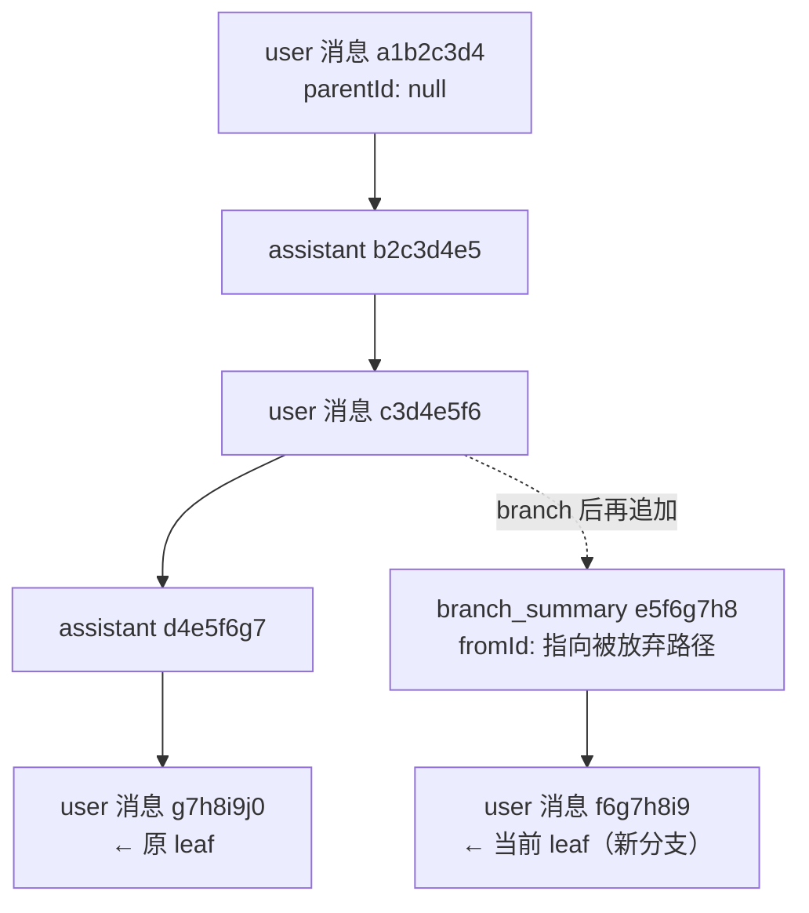
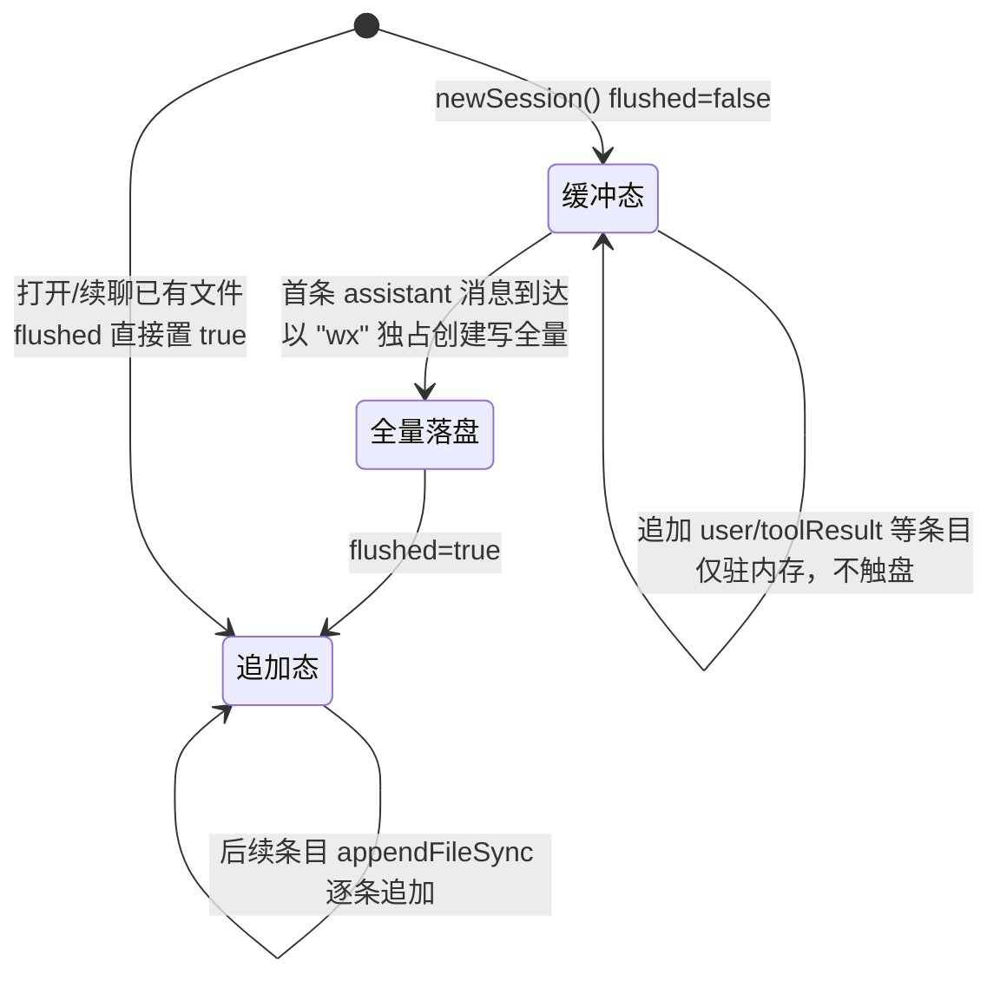
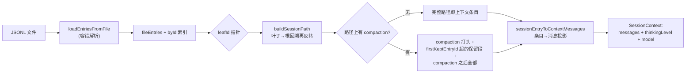
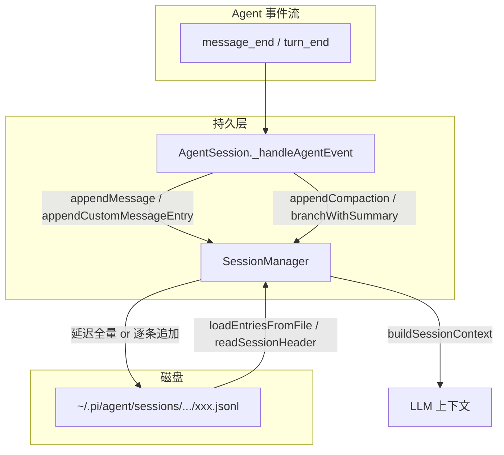

本页聚焦 pi 会话持久化的两个层次：**磁盘上的 JSONL 数据格式**（数据契约）与 **SessionManager 引擎**（围绕该契约的内存态树形管理器）。它回答三个问题：一条对话如何被无损记录为一棵树、树如何被读取修复、以及叶子路径如何被投影为 LLM 上下文。用户侧操作（`/tree`、`/compact`、`/resume` 等命令行为）不在本页展开，请参阅 [会话管理：树形分支、上下文压缩与导出](5-hui-hua-guan-li-shu-xing-fen-zhi-shang-xia-wen-ya-suo-yu-dao-chu)；事件如何产生这些数据则由 [Agent 运行时：事件流、工具调用与状态管理](7-agent-yun-xing-shi-shi-jian-liu-gong-ju-diao-yong-yu-zhuang-tai-guan-li) 覆盖。

Sources: [session-manager.ts](packages/coding-agent/src/core/session-manager.ts#L845-L855), [session-format.md](packages/coding-agent/docs/session-format.md#L1-L11)

## 设计基座：追加式树形日志

会话文件的本质是一份**只追加（append-only）的树形事件日志**。每条记录（除文件头外）携带 `id` 与 `parentId` 两个 8 位十六进制短 ID，构成一棵以首条记录为根的树；`SessionManager` 内部维护一个 **leaf（叶子）指针**标记"当前对话位置"。所有写入都是"以当前叶子为父、追加新节点、然后推进叶子"；而所谓**分支**，仅仅是将叶子指针移动到树上较早的节点——历史条目从不被修改或删除。这一设计让撤销编辑、探索不同方案、树形导航都成为纯指针操作，崩溃安全且天然可回放。

上图中分支节点是 `branchWithSummary` 的产物：它把叶子移回 `c3d4e5f6` 后，追加的 `branch_summary` 成为该节点的子节点，用一段 LLM 生成的摘要保住被放弃路径的上下文。类文档注释对这套不变量的描述是权威表述：追加创建叶子的子节点，`branch()` 移动叶子但不改历史，`buildSessionContext()` 沿根到叶的路径解析消息。

Sources: [session-manager.ts](packages/coding-agent/src/core/session-manager.ts#L845-L855), [session-manager.ts](packages/coding-agent/src/core/session-manager.ts#L1374-L1388), [session-manager.ts](packages/coding-agent/src/core/session-manager.ts#L1390-L1420), [session-format.md](packages/coding-agent/docs/session-format.md#L306-L318)

## 磁盘布局：目录编码与文件命名

会话文件的默认存放位置遵循"按工作目录分桶"的原则。`getDefaultSessionDirPath()` 把当前工作目录的绝对路径剥掉开头的 `/`、将所有 `/` `\\` `:` 替换为 `-`，再包裹成 `--<path>--` 形式的目录名，落在 `~/.pi/agent/sessions/` 之下——例如 `/Users/x/Code/pi` 会映射为 `sessions/--Users-x-Code-pi--/`。新建会话时，文件名为 `<时间戳>_<会话ID>.jsonl`，其中时间戳将 `:` 和 `.` 替换为 `-` 以保证跨文件系统合法，会话 ID 则是 **UUIDv7**（时间有序，利于目录浏览与排序）。

| 配置面 | 值 / 规则 | 控制方式 |
|---|---|---|
| 代理配置根目录 | `~/.pi/agent/` | 环境变量 `PI_CODING_AGENT_DIR` |
| 全局会话根 | `~/.pi/agent/sessions/` | — |
| 项目会话桶 | `sessions/--<编码后的 cwd>--/` | 由 cwd 自动推导 |
| 会话文件名 | `<ISO时间戳去冒号点>_<uuidv7>.jsonl` | `newSession()` 生成 |
| 显式指定目录 | 优先于默认目录 | API 的 `sessionDir` 参数 / 环境变量 `PI_CODING_AGENT_SESSION_DIR` |

`SessionManager.open(path)` 打开显式文件时，若未传 `sessionDir` 则直接取文件的父目录作为后续 `/new`、`/branch` 的落盘位置；`continueRecent()` 则只在自定义目录与默认目录不同时，才按文件头中的 `cwd` 字段过滤会话，避免"在项目 A 的目录里翻出项目 B 的历史"。

Sources: [session-manager.ts](packages/coding-agent/src/core/session-manager.ts#L472-L489), [session-manager.ts](packages/coding-agent/src/core/session-manager.ts#L926-L952), [config.ts](packages/coding-agent/src/config.ts#L508-L534), [session-format.md](packages/coding-agent/docs/session-format.md#L5-L11), [session-manager.ts](packages/coding-agent/src/core/session-manager.ts#L1556-L1597)

## 条目类型全景：一文件头 + 九类条目

JSONL 的每一行都是一个自描述的 JSON 对象，靠 `type` 字段判别。理解这组类型是解析会话文件、编写扩展的先决条件。所有条目（文件头除外）共享 `SessionEntryBase` 四字段：`type`、`id`（8 位十六进制短 ID，冲突时重试 100 次后回退完整 UUID）、`parentId`（根节点为 `null`）、`timestamp`（ISO 8601）。

| `type` | 载体内容 | 进入 LLM 上下文 | 写入方法 |
|---|---|---|---|
| `session`（文件头） | version / id / timestamp / cwd / parentSession | 否（元数据） | `newSession()` |
| `message` | 完整 `AgentMessage` | 是 | `appendMessage()` |
| `thinking_level_change` | `thinkingLevel` | 间接（恢复设置） | `appendThinkingLevelChange()` |
| `model_change` | `provider` + `modelId` | 间接（恢复设置） | `appendModelChange()` |
| `compaction` | 摘要 + `firstKeptEntryId` + `tokensBefore` | 是（替换旧历史） | `appendCompaction()` |
| `branch_summary` | 摘要 + `fromId` | 是 | `branchWithSummary()` |
| `custom` | `customType` + `data` | **否**（扩展状态） | `appendCustomEntry()` |
| `custom_message` | `customType` + `content` + `display` | **是**（扩展注入） | `appendCustomMessageEntry()` |
| `label` | `targetId` + `label` | 否（书签） | `appendLabelChange()` |
| `session_info` | `name` | 否（元数据） | `appendSessionInfo()` |

文件头形如 `{"type":"session","version":3,"id":"<uuid>","timestamp":"...","cwd":"/path/to/project"}`，被 `/fork`、`/clone` 复制的会话额外带 `parentSession` 字段指回源文件。条目 ID 的生成刻意保持短小（8 hex）以控制文件体积，同时用"生成前查重"保证树索引无碰撞。

Sources: [session-manager.ts](packages/coding-agent/src/core/session-manager.ts#L30-L51), [session-manager.ts](packages/coding-agent/src/core/session-manager.ts#L220-L228), [session-format.md](packages/coding-agent/docs/session-format.md#L189-L201), [session-manager.ts](packages/coding-agent/src/core/session-manager.ts#L104-L141)

### `message` 条目内的 AgentMessage 角色

`message` 条目的 `message` 字段承载完整 `AgentMessage`。pi 通过 TypeScript 的 **declaration merging** 在 pi-agent-core 的基础角色（`user` / `assistant` / `toolResult`）之上合并了四个 coding-agent 专属角色：

| role | 来源 | 会话中的承载方式 |
|---|---|---|
| `user` / `assistant` / `toolResult` | pi-ai 基础类型 | `message` 条目直接存储 |
| `bashExecution` | `!` 命令执行的本地命令 | `message` 条目；`excludeFromContext: true` 表示 `!!` 前缀、不进上下文 |
| `custom` | 扩展经 `sendMessage()` 注入 | `custom_message` 条目（重建时经 `createCustomMessage` 还原） |
| `branchSummary` / `compactionSummary` | 分支切换 / 上下文压缩 | **顶层条目**（`branch_summary` / `compaction`），禁止直接 `appendMessage` |

值得注意的是 `appendMessage()` 的防御设计：它拒绝直接写入 `CompactionSummaryMessage` 与 `BranchSummaryMessage`，强制这两类内容以顶层条目形态存在——源码注释给出的理由是"让它们成为会话顶层条目，更容易查找"。发送给 LLM 前，`bashExecution` 经 `bashExecutionToText()` 转写为带代码块的用户文本，`compaction` / `branch_summary` 则包裹在 `
` 标签前缀中。

Sources: [messages.ts](packages/coding-agent/src/core/messages.ts#L29-L77), [messages.ts](packages/coding-agent/src/core/messages.ts#L11-L24), [messages.ts](packages/coding-agent/src/core/messages.ts#L79-L120), [session-manager.ts](packages/coding-agent/src/core/session-manager.ts#L1065-L1081)

### 两类扩展条目的语义分界

`custom` 与 `custom_message` 是扩展系统在会话文件中的两个入口，分界线只有一条：**是否参与 LLM 上下文**。`custom` 条目用于跨会话重载持久化扩展内部状态（如索引缓存、版本标记），重载时扩展扫描自己的 `customType` 重建内存态，`buildSessionContext` 对它返回空数组；`custom_message` 条目则相反，其 `content` 会被投影为 `custom` 角色消息进入上下文，`display: false` 可让它"只喂给模型、不在 TUI 显示"，`details` 字段永远不发给模型。

Sources: [session-manager.ts](packages/coding-agent/src/core/session-manager.ts#L94-L108), [session-manager.ts](packages/coding-agent/src/core/session-manager.ts#L123-L141), [session-manager.ts](packages/coding-agent/src/core/session-manager.ts#L379-L408)

## 版本演进：v1 → v2 → v3 的自动迁移

格式版本记录在文件头的 `version` 字段，当前值为 `CURRENT_SESSION_VERSION = 3`。三级版本的语义边界清晰：**v1** 是无树结构的线性序列（连 `version` 字段都没有，缺省即视为 1）；**v2** 引入 `id`/`parentId` 树形链接，迁移时按物理行序为每条记录补发短 ID 并串成链，同时把压缩条目的 `firstKeptEntryIndex`（数组下标）换算成 `firstKeptEntryId`；**v3** 将扩展消息角色 `hookMessage` 统一更名为 `custom`。

迁移发生在**加载时**：`_loadEntries()` 调用 `migrateToCurrentVersion()`，返回 `true` 表示执行过迁移，随即触发 `_rewriteFile()` 整文件重写回写为新版本。整个迁移是幂等的——已迁移的文件直接跳过，ID 保持原样；这也是官方文档"旧会话加载时自动迁移到 v3"承诺的实现点。

Sources: [session-manager.ts](packages/coding-agent/src/core/session-manager.ts#L230-L296), [session-manager.ts](packages/coding-agent/src/core/session-manager.ts#L954-L970), [session-format.md](packages/coding-agent/docs/session-format.md#L19-L27), [migration.test.ts](packages/coding-agent/test/session-manager/migration.test.ts#L5-L42)

## SessionManager 内部状态与生命周期

`SessionManager` 是私有构造、工厂方法驱动的类。内存态由五个核心字段构成：`fileEntries`（含文件头的全量记录数组）、`byId`（ID → 条目的树索引 `Map`）、`labelsById` / `labelTimestampsById`（标签解析缓存）、`leafId`（当前叶子），外加 `persist` 与 `flushed` 两个落盘控制位。`_buildIndex()` 重建索引时有一个关键语义：**leaf 取物理行序的最后一条记录**——即文件追加顺序决定"上次停在哪"，而非树结构推断。

| 静态工厂 | 场景 | 行为要点 |
|---|---|---|
| `create(cwd, sessionDir?)` | 新建会话 | 默认目录按 cwd 编码；支持 `{ id, parentSession }` 选项 |
| `open(path, sessionDir?, cwdOverride?)` | 打开指定文件 | 有界扫描读头；`cwd` 取头字段，可覆盖；缺失目录回退 `process.cwd()` |
| `continueRecent(cwd, sessionDir?)` | `pi -c` 续聊 | 读各文件头匹配 cwd，按 mtime 取最近；无则新建 |
| `inMemory(cwd, options?, entries?)` | 测试 / SDK 预演 | `persist=false`，可选直接注入外部持有的条目 |
| `forkFrom(sourcePath, targetCwd, ...)` | 跨项目分叉 | 新建头指向源文件，逐条复制非头记录 |
| `list(cwd) / listAll()` | 会话选择器数据源 | 异步流式解析，含进度回调 |

`setSessionFile()` 的容错策略同样体现"契约优先"：目标文件存在但**解析为空**且大小为 0 时，就地初始化一个合法文件头；存在但**无法解析为 pi 会话**（非空却无有效头）时，直接抛错且不动原文件；不存在时按显式路径新建。所有新建会话的 ID 都要过 `assertValidSessionId` 的字符白名单校验。

Sources: [session-manager.ts](packages/coding-agent/src/core/session-manager.ts#L856-L867), [session-manager.ts](packages/coding-agent/src/core/session-manager.ts#L972-L991), [session-manager.ts](packages/coding-agent/src/core/session-manager.ts#L1546-L1602), [session-manager.ts](packages/coding-agent/src/core/session-manager.ts#L898-L924), [session-manager.ts](packages/coding-agent/src/core/session-manager.ts#L1604-L1662)

## 写入路径：延迟落盘协议

SessionManager 的写盘策略是一条精心设计的**两阶段延迟提交**协议，核心目标是避免产生"只有用户消息、没有助手回复"的垃圾会话文件（例如用户启动后立刻退出的场景）：

`_persist()` 每次被 `_appendEntry()` 调用时先检查全量条目中是否**已存在 assistant 消息**：不存在则进入缓冲（`flushed` 保持 false，什么都不写）；一旦首条 assistant 消息入列且尚未落盘，就以 `"wx"` 标志（排他创建，文件已存在则失败）一次性写出全部缓冲条目——`wx` 的排他性同时防范了重复文件头的写入事故；此后每条新记录都走 `appendFileSync` 增量追加。这条协议还有一处分支抽取时的呼应：`createBranchedSession()` 重写文件前同样先检查是否含 assistant 消息，否则把 `flushed` 归零、推迟到 `_persist()` 首次触发，保证两套写路径遵守同一契约。

Sources: [session-manager.ts](packages/coding-agent/src/core/session-manager.ts#L1029-L1063), [session-manager.ts](packages/coding-agent/src/core/session-manager.ts#L1509-L1523), [session-manager.ts](packages/coding-agent/src/core/session-manager.ts#L993-L1003)

## 读取路径：解析容错、有界扫描与会话发现

**全量加载**由同步的 `loadEntriesFromFile()` 承担：以 1MB 缓冲 + `StringDecoder` 处理跨块的多字节 UTF-8 边界，逐行 `JSON.parse`，**畸形行直接跳过**而非报错——这使得手改过的、被截断的文件仍可部分恢复。两道防线收尾：第一行必须是 `type: "session"` 且含字符串 `id` 的头，否则整体判为非会话返回空数组；文件结尾若缺换行符，加载时自动补一个 `\n` 修复。

**头部探测**走独立的 `readSessionHeader()`：以 4KB 缓冲逐块扫描、累计不超过 **1MB** 的有界上限，找到首个可解析头即返回——这是会话发现（列出、续聊）场景的性能优化，避免为浏览列表而全量解析大文件。超出上限抛 `SessionHeaderScanLimitError`；但 `open()` 把该异常视为"发现优化失败"而非数据错误，回退到全量加载兜底，保证超大前缀的遗留文件仍能打开。

**会话列表**走异步流式路线：`buildSessionInfo()` 用 `readline` 逐行统计消息数、提取首个用户消息文本、聚合全文检索用文本，并从 `session_info` 条目解析最新显示名（空名视为显式清除）；"最近修改时间"优先取消息内的时间戳，而非文件 mtime。并发控制为固定 **10 路**的 Promise 竞速池，`listAll()` 先扫全局 sessions 根目录（含符号链接目录）汇总全部 `.jsonl` 再统一调度，全程带 `(loaded, total)` 进度回调。

Sources: [session-manager.ts](packages/coding-agent/src/core/session-manager.ts#L513-L557), [session-manager.ts](packages/coding-agent/src/core/session-manager.ts#L491-L501), [session-manager.ts](packages/coding-agent/src/core/session-manager.ts#L572-L614), [session-manager.ts](packages/coding-agent/src/core/session-manager.ts#L1556-L1582), [session-manager.ts](packages/coding-agent/src/core/session-manager.ts#L688-L766), [session-manager.ts](packages/coding-agent/src/core/session-manager.ts#L768-L843), [session-manager.ts](packages/coding-agent/src/core/session-manager.ts#L1681-L1745)

## 树遍历与 LLM 上下文构建

从 JSONL 到真正发给模型的 `messages` 数组，pi 走了一条"**选路 → 压缩剪枝 → 消息投影**"的三段管线：

**选路**由 `buildSessionPath()` 完成：从叶子沿 `parentId` 回溯至根再反转，`leafId` 传 `null` 返回空路径（对应 `resetLeaf()` 后"从头重写"的状态）。**压缩剪枝**在 `buildContextEntries()` 中进行：取路径上**最后一个** `compaction` 条目，以它打头，拼接 `firstKeptEntryId` 之后的保留段与压缩点之后的全部新条目——被摘要掉的历史从上下文中消失，但完整保留在文件里。**消息投影**由 `sessionEntryToContextMessages()` 处理类型分派：`message` 直接透传（对 null content 做防御性补空数组，兼容手改/旧版文件）、`custom_message` 还原为 `custom` 角色、`compaction` / `branch_summary` 包上 `
` 前缀、`custom` 与 `label` 等返回空。

与此同时，`getSessionContextSettings()` 沿路径回放设置类条目：`thinking_level_change` 与 `model_change` 直接更新状态，**assistant 消息也会回写当前 model**——即"最后用哪个模型成功生成过回复"同样能从消息记录里恢复。三段管线汇合为 `buildSessionContext()`，产出的 `SessionContext` 同时携带消息、思考等级与模型三元组，正好是重启会话恢复完整运行状态所需的最小集合。

Sources: [session-manager.ts](packages/coding-agent/src/core/session-manager.ts#L334-L360), [session-manager.ts](packages/coding-agent/src/core/session-manager.ts#L410-L454), [session-manager.ts](packages/coding-agent/src/core/session-manager.ts#L456-L470), [session-manager.ts](packages/coding-agent/src/core/session-manager.ts#L379-L408), [session-manager.ts](packages/coding-agent/src/core/session-manager.ts#L362-L377), [messages.ts](packages/coding-agent/src/core/messages.ts#L11-L24)

## 分支、总结与分支抽取

树操作 API 构成一组最小完备的指针原语。`branch(branchFromId)` 校验目标存在后直接移动叶子；`resetLeaf()` 把叶子归零，下一次追加将创建新的根节点（对应"重新编辑第一条消息"）；`branchWithSummary()` 在移动叶子的同时追加一条 `branch_summary`——其 `fromId` 记录被放弃路径的原叶子（无叶子时记 `"root"`），摘要本身成为新分支的第一个节点。

**分支抽取**（`createBranchedSession(leafId)`）是把"树中一条路径"物化为独立新文件的操作，实现上有两处精巧处理：其一，路径中的 `label` 条目先被剥离，其子节点**重新链接**到下一个真实条目上（用映射表同时修正 `compaction.firstKeptEntryId` 的指向），避免产生孤儿子树；其二，标签在尾部以链式 `parentId` 重新追加，标签的时间戳保留原值。新文件的头部 `parentSession` 指回原文件，形成跨文件血缘。与之互补的是 `exportSessionToJsonl()`：它把当前 `getBranch()` 路径**改写成线性链**（逐条重写 `parentId`）导出，可选择追加仅存在于导出文件中的尾随条目。

Sources: [session-manager.ts](packages/coding-agent/src/core/session-manager.ts#L1364-L1420), [session-manager.ts](packages/coding-agent/src/core/session-manager.ts#L1422-L1544), [session-export.ts](packages/coding-agent/src/core/session-export.ts#L6-L42)

## 生产集成：AgentSession 的事件落盘点

SessionManager 本身不含任何业务语义——谁在什么时机写入什么条目，由 `AgentSession` 的事件处理器决定。核心分发逻辑在 `_handleAgentEvent`：`message_end` 事件到达时按消息角色分流，`custom` 角色走 `appendCustomMessageEntry()`，`user` / `assistant` / `toolResult` 走 `appendMessage()`；`bashExecution` 消息在命令执行路径上直接落库，而 agent 运行期间执行的命令先进 `_pendingBashMessages` 队列、`turn_end` 后按序冲刷，保证消息顺序不乱。压缩完成后 `appendCompaction()` 连同 `usage`（生成摘要本身的 token 消耗）一并写入，然后立即重建上下文回灌 agent 状态。树导航（`/tree`）则组合使用 `branch()` / `resetLeaf()` / `branchWithSummary()` 并以重建后的上下文驱动 UI。

Sources: [agent-session.ts](packages/coding-agent/src/core/agent-session.ts#L643-L723), [agent-session.ts](packages/coding-agent/src/core/agent-session.ts#L3036-L3082), [agent-session.ts](packages/coding-agent/src/core/agent-session.ts#L2031-L2034)

## 扩展与只读视图

扩展拿到的会话句柄是**裁剪过的只读快照**：`ReadonlySessionManager` 用 `Pick` 从完整类中只挑选 `getCwd`、`getEntries`、`getTree`、`buildSessionContext` 等读方法，`ExtensionContext.sessionManager` 即此类型。写入能力则经由显式的白名单 API 开放：`pi.appendEntry(customType, data)` 映射到 `appendCustomEntry()`（落 `custom` 条目、不进上下文）、`setSessionName` 映射到 `appendSessionInfo()`、`setLabel` 映射到 `appendLabelChange()`。这一"读全量、写白名单"的边界让扩展可以完整消费会话树，又无法绕过 AgentSession 的落盘协议。扩展事件拦截与自定义 UI 的完整话题见 [扩展系统：事件拦截、自定义工具与自定义 UI](19-kuo-zhan-xi-tong-shi-jian-lan-jie-zi-ding-yi-gong-ju-yu-zi-ding-yi-ui)。

Sources: [session-manager.ts](packages/coding-agent/src/core/session-manager.ts#L190-L206), [extensions/types.ts](packages/coding-agent/src/core/extensions/types.ts#L309-L319), [agent-session.ts](packages/coding-agent/src/core/agent-session.ts#L2593-L2608)

## 演进方向：agent 包中的新一代会话存储

主线的 v3 格式之上，仓库中已经出现一层**面向后端抽象的新一代会话存储**，位于 `packages/agent` 的 `harness/session` 模块：它定义了 `JSONL_FORMAT_VERSION = 4` 的新头格式（`kind: "header"`、独立的 `storageVersion` 与 `createdAt`、`nextSeq` 序号高水位、`parentSessionId` + `legacyParentSessionPath` 双血缘字段），解析器同时接受 v4 与旧版 v3 头以平滑过渡；其上构建了 `StorageBackedSession`、`JsonlSessionRepo`、`MemorySessionRepo` 的统一抽象，`packages/session-backends/sqlite-node` 则以 SQLite 实现同一后端契约。值得注意的是，该层的压缩条目携带 `retainedTail`（压缩后保留消息的物化数组），使新式压缩成为**自包含检查点**——官方 `session-format.md` 已将其作为可选字段记录，实验性客户端渲染器亦据此回放。此话题与分布式实验架构相关，深入讨论请移步 [chord：插件、服务、复制状态与增量追踪](22-chord-cha-jian-fu-wu-fu-zhi-zhuang-tai-yu-zeng-liang-zhui-zong) 与 [pi-server 与 pi-client：持久会话与多附件路由](24-pi-server-yu-pi-client-chi-jiu-hui-hua-yu-duo-fu-jian-lu-you)。

Sources: [types.ts](packages/agent/src/harness/session/jsonl/types.ts#L4-L18), [codec.ts](packages/agent/src/harness/session/jsonl/codec.ts#L49-L63), [index.ts](packages/agent/src/harness/session/index.ts#L15-L33), [compaction.ts](packages/agent/src/harness/compaction/compaction.ts#L685-L700), [client-tui-chat.ts](packages/coding-agent/src/experimental/client-tui-chat.ts#L99-L104), [session-format.md](packages/coding-agent/docs/session-format.md#L237-L248)

## 阅读导航

理解了格式与引擎之后，建议沿以下路径延伸：向上看数据如何被用户操作，请读 [会话管理：树形分支、上下文压缩与导出](5-hui-hua-guan-li-shu-xing-fen-zhi-shang-xia-wen-ya-suo-yu-dao-chu)；向内看事件如何驱动写入，请读 [Agent 运行时：事件流、工具调用与状态管理](7-agent-yun-xing-shi-shi-jian-liu-gong-ju-diao-yong-yu-zhuang-tai-guan-li) 与 [AgentMessage 与上下文转换管线（transformContext / convertToLlm）](8-agentmessage-yu-shang-xia-wen-zhuan-huan-guan-xian-transformcontext-converttollm)；向外看会话如何被嵌入第三方应用，请读 [AgentSession 与 SDK：将智能体嵌入自有应用](16-agentsession-yu-sdk-jiang-zhi-neng-ti-qian-ru-zi-you-ying-yong)。