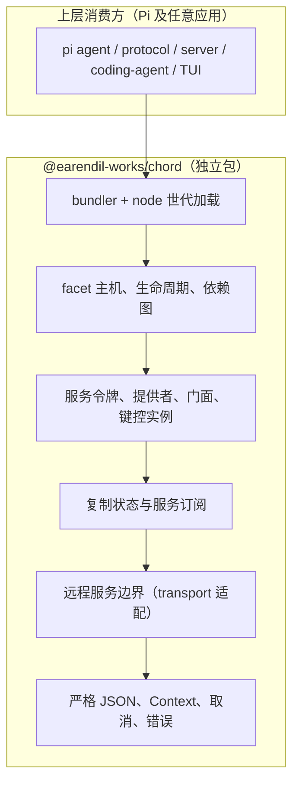
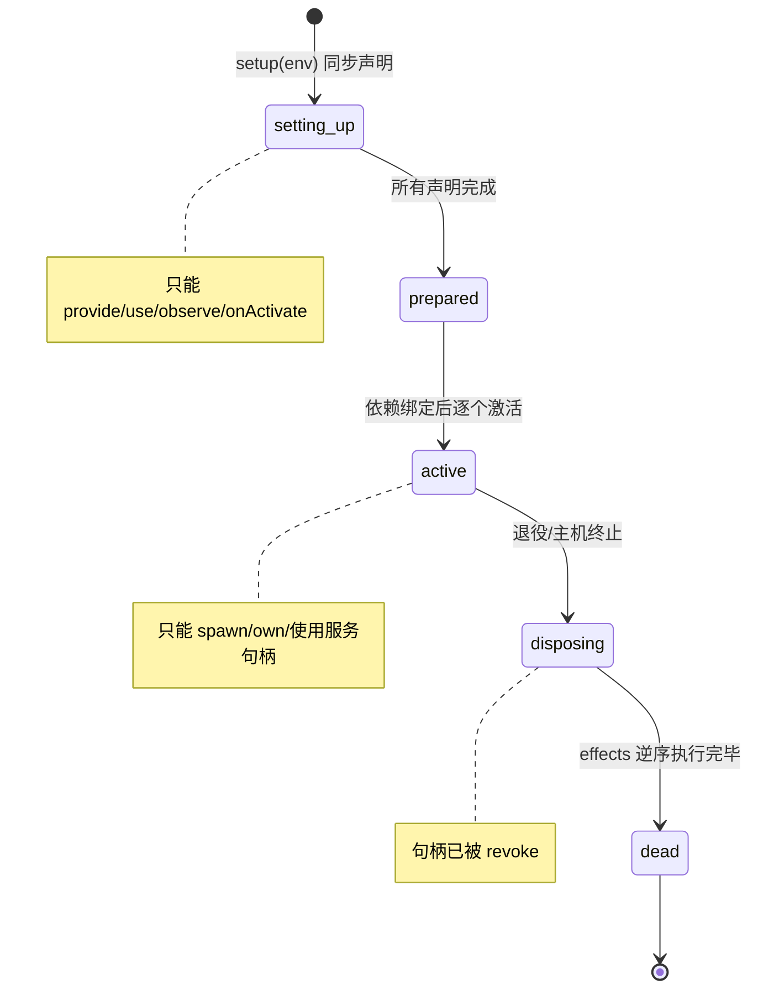
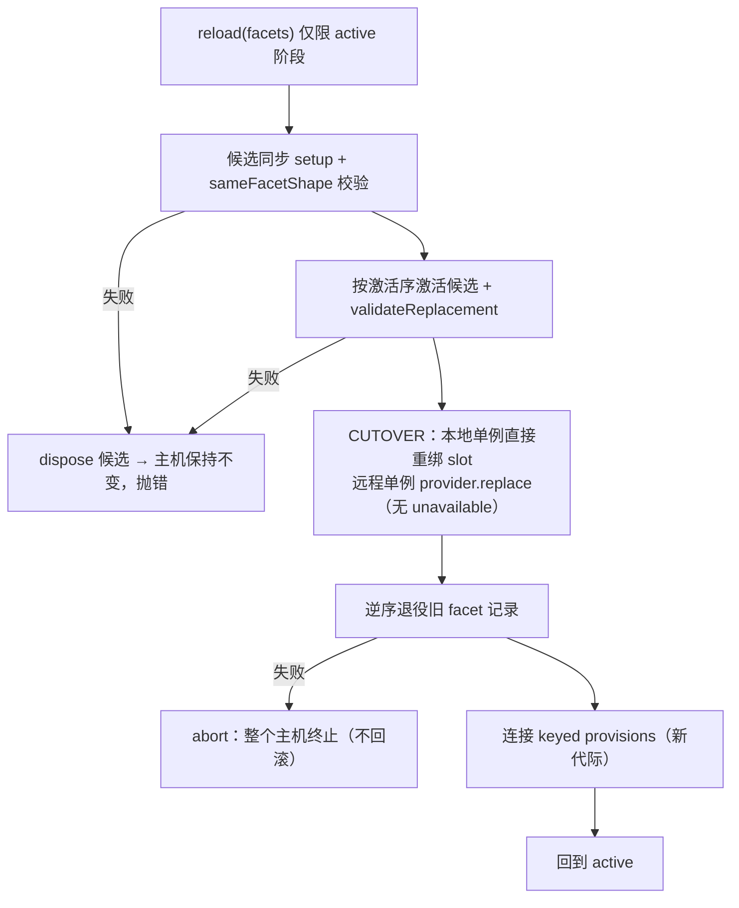
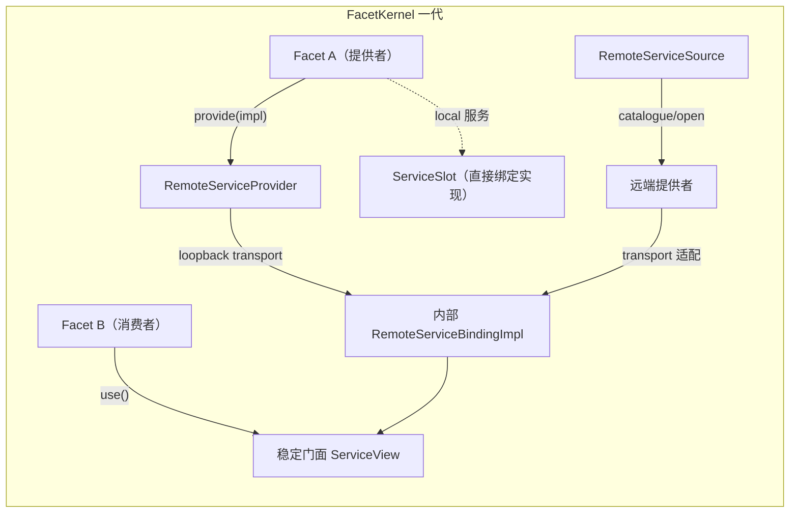
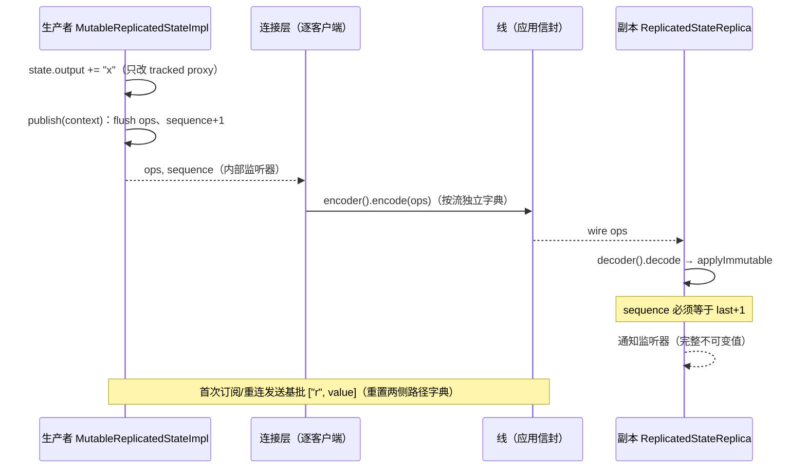
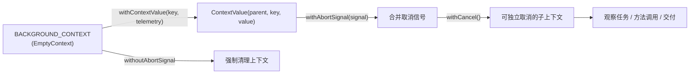
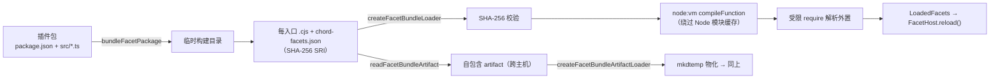

`@earendil-works/chord` 是 Pi monorepo 中的应用组装运行时（application-composition runtime）：它为"同一个功能要跑在智能体 worker、终端 UI、远程 WebUI 等多个环境里"的需求，提供插件化组装（facets）、类型化服务（services）、权威状态复制（replicated state）与可插拔远程边界（remote service boundary）四块通用机器。它定位为独立包——不依赖任何 `@earendil-works/pi-*` 工作区包，可被无关应用直接使用。本页面向高级读者，拆解其插件生命周期、服务门面稳定性机制、`$chord.service` 线协议、序列号门控的复制语义、flush 时差分追踪，以及内容寻址的世代加载；线协议之外的 CBOR 帧与服务器侧路由属于后续两页的内容。

## 定位：与 Pi 解耦的独立运行时

Chord 的依赖方向是刚性的：Pi 的 agent、protocol、server、coding-agent、TUI 在上层，chord 在底层；chord 源码中不得出现任何对 Pi 包或包外相对路径的导入，且必须使用应用中立词汇——Session、Harness、AgentLane、attachment、tool、hook 等术语被明确禁止成为 chord 概念，它们属于消费方。这一约束的目的是让 chord 能承载 Pi 之外的应用，同时让 Pi 各包只从上往下依赖它。

PLANNING.md 中定义的实现分层为：打包器与加载器在最上，向下依次是插件主机与生命周期、服务令牌/提供者/门面/键控实例、复制状态与订阅、对称 RPC 与传输适配器、最底层是严格 JSON 与调用上下文。其中"对称 RPC peer"一节标记为规划中（planned），当前代码已落地的是服务线协议语法与端点；其余五层均已在 `src/` 中实现。

Sources: [PLANNING.md](packages/chord/PLANNING.md#L16-L33), [PLANNING.md](packages/chord/PLANNING.md#L49-L66), [PLANNING.md](packages/chord/PLANNING.md#L90-L100)

包结构印证了这一分层：公共运行时 API 从包根导出，取消上下文因命名过于通用而隔离在 `./context` 子路径，差分原语独立为 `./delta` 子路径，esbuild 打包与 Node 加载分别由 `./bundler` 和 `./node` 提供。整个包唯一的运行时依赖是 esbuild（仅供打包器使用）。

Sources: [index.ts](packages/chord/src/index.ts#L1-L80), [package.json](packages/chord/package.json#L10-L35), [package.json](packages/chord/package.json#L53-L58)

## 核心概念速览

Chord 的概念体系高度收敛，每个概念对应一个明确的实现文件。理解这张映射表后，后续章节的展开只需在两条主线上进行：**生命周期主线**（facet 主机如何组装、激活、替换、终止）与**数据主线**（变更如何从 tracked proxy 变成紧凑操作、再变成远端副本上的完整不可变值）。

| 概念 | 职责 | 核心实现 |
| --- | --- | --- |
| Facet | 同步声明式组装单元（提供/消费服务、创建状态、注册清理） | `types.ts` 的 `Facet`/`FacetEnvironment` |
| Facet 主机 | 校验依赖图、依赖序激活、逆序销毁、形状保持重载 | `facets/host.ts` 的 `FacetKernel` |
| 服务令牌 | 稳定 ID + TypeScript 契约 + 局部性策略 | `defineService()` |
| 单例门面 | 源无关的稳定代理视图，跨提供者替换保持身份 | `services/handle.ts` |
| 键控实例 | `(key, generation)` 寻址的动态实例与观察任务 | `services/instances.ts` |
| 复制状态 | 单写者权威值 + 只读副本 | `services/state.ts` |
| 增量追踪 | flush 时从 tracked JSON 派生紧凑操作 | `delta/index.ts` |
| 远程边界 | 传输无关的调用/订阅线语法 | `services/wire.ts` |
| Context | Go 风格取消与调用作用域值 | `context/index.ts` |

Sources: [types.ts](packages/chord/src/types.ts#L206-L223), [api.ts](packages/chord/src/api.ts#L77-L82), [host.ts](packages/chord/src/facets/host.ts#L340-L345)

## Facet 主机：同步声明、图校验与依赖序激活

**Facet 是插件的组成单位**：一个 `{ id, setup(env) }` 对象。`setup` 必须是同步的纯声明——它可以提供单例服务、声明键控集合所有权、获取单例句柄、声明键控观察、创建复制状态、注册激活回调与清理函数；但它不得在 setup 期间调用服务、读复制状态、做异步工作，或事后（事件回调/激活回调里）引入新依赖。违反同步性会被立即检测：`setup` 的返回值若是 promise-like，主机直接抛出错误。

Sources: [PLANNING.md](packages/chord/PLANNING.md#L103-L132), [host.ts](packages/chord/src/facets/host.ts#L379-L387)

宿主把每个 facet 的 setup 记录进私有"生成账本"（`FacetRuntime`）：`requires`/`provides` 服务引用列表、生命周期对象、暂存提供项、以及按服务 ID 缓存的单例视图。生命周期状态机有五个状态，访问权限由断言函数在每个入口强制执行：

Sources: [host.ts](packages/chord/src/facets/host.ts#L59-L136), [host.ts](packages/chord/src/facets/host.ts#L449-L474)

**组装是一条九步流水线**，全部发生在所有 setup 完成之后：收集本地提供项与远程源目录 → 将每个硬依赖解析到恰好一个本地或连接的提供 → 拒绝缺失/重复/歧义/模式不匹配 → 拒绝重复 facet ID → 推导提供者到消费者的生命周期边 → 拒绝依赖环 → 在句柄不可访问时构造绑定 → 水合所需的连接服务 → 先提供者后消费者激活。`FacetKernel.activate()` 严格按此执行，任一步失败即整体 `#terminate` 并用 `AggregateError` 聚合启动与清理两阶段的错误。

Sources: [PLANNING.md](packages/chord/PLANNING.md#L134-L148), [host.ts](packages/chord/src/facets/host.ts#L388-L417)

激活序来自 `validateFacets` 的拓扑排序：它把外部服务（按服务 ID 索引，无归属 facet）与各 facet 的 `provides` 合并成提供者映射，检测重复提供与缺失，产出依赖序激活序列。服务源目录本身也参与图校验——多个源提供同一服务 ID 是组装错误；唯一标记 `acceptsUnavailableServices` 的源可以"暂时收养"尚不可用的需求（但至多一个）。

Sources: [host.ts](packages/chord/src/facets/host.ts#L596-L653), [host.ts](packages/chord/src/facets/host.ts#L808-L825)

**键控提供采用两段式**：`provideMany(token)` 在 setup 期返回一个 `StagedServiceSpawner`，此时 `spawn(key, implementation)` 只把实例暂存在 spawner 内；当主机组装到该 facet 时调用 `connect(installer)`，把已暂存与后续 spawn 的实例真正安装进本地注册表或远程提供者。这保证了"发布方法与初始状态原子化"——观察者不会看到半安装的实例。

Sources: [host.ts](packages/chord/src/facets/host.ts#L283-L337), [PLANNING.md](packages/chord/PLANNING.md#L339-L348)

**资源所有权与销毁是幂等且逆序的**：每个 facet 世代拥有自己的激活回调、显式清理（`own`）、键控实例、观察任务与服务提供。`onDeactivate` 实际上就是注册进 effects 链的清理项；销毁时 effects 按注册逆序执行，单个失败不中断后续，最终以单错误或 `AggregateError` 汇报。键控观察处理器每次启动都获得一个全新的可取消上下文（`withCancel`），实例关闭/替换/断连只中止对应的那个处理器任务。

Sources: [host.ts](packages/chord/src/facets/host.ts#L109-L136), [host.ts](packages/chord/src/facets/host.ts#L528-L594), [instances.ts](packages/chord/src/services/instances.ts#L127-L140)

## 热重载：形状保持替换与切换后不回滚

`FacetHost.reload(facets)` 支持**形状保持替换**：每个被替换的 facet 必须保留相同的插件 ID、需求/提供的服务 ID 与模式、以及远程单例的成员名与类别表。重载序列是——加载候选模块 → 同步 setup → 校验形状与远程实现 → 按原依赖序激活候选（此时旧提供者仍在路由）→ 逐个单例直接替换（不 withdraw，无 unavailable 间隔）→ 逆序停用被替换 facet → 释放退役的已加载世代。

Sources: [host.ts](packages/chord/src/facets/host.ts#L423-L525), [PLANNING.md](packages/chord/PLANNING.md#L191-L227)

切换点的语义边界非常明确：**切换之前**的任何失败（setup、形状校验、候选激活、替换预校验）都会清理候选并让现行世代原样运行；**切换之后**的任何失败则通过 `#abort` 终止整个主机——因为退役图已不可恢复。这换来一个关键属性：既有单例门面（本地与远程）在普通重载期间保持对象身份，捕获的方法在切换前派发到旧提供者、切换后派发到新提供者，复制状态门面直接安装替换快照而不经历 unhydrate。键控实例则是例外：旧插件的实例关闭，新插件 staged 的实例以全新代际出现。

Sources: [host.ts](packages/chord/src/facets/host.ts#L481-L516), [PLANNING.md](packages/chord/PLANNING.md#L216-L227), [README.md](packages/chord/README.md#L146-L160)

替换安全由两道校验把关：`sameFacetShape` 比较新旧 facet 的需求/提供形状；`validateReplacement` 在不改变现行提供者的前提下，对新实现做远程成员分类（`classifyRemoteServiceImplementation`）并断言成员名/类别表与原形状一致。缺少这一步时，已访问过的远程成员槽会因提供者丢失成员而变成绑定错误。

Sources: [host.ts](packages/chord/src/facets/host.ts#L437-L445), [host.ts](packages/chord/src/facets/host.ts#L526-L531), [provider.ts](packages/chord/src/services/provider.ts#L124-L141)

## 服务系统：令牌、双模式与稳定门面

**服务令牌是类型化的稳定身份**：`defineService(id, options)` 生成一个冻结的 `{ id, local }` 对象，附带唯一符号类型标记防止不同契约互换。`local: true` 的进程本地服务接受任意 JavaScript 契约（同步方法、类、原生句柄、非 JSON 值），绝不进入远程目录；默认（`local: false`）的远程可暴露服务则要求严格 JSON 契约。保留前缀 `$chord.` 被拒绝用于应用服务 ID。一个令牌在一个主机图中只有一个模式（singleton 或 keyed），混用是组装或协议错误。

Sources: [api.ts](packages/chord/src/api.ts#L70-L82), [types.ts](packages/chord/src/types.ts#L58-L75), [PLANNING.md](packages/chord/PLANNING.md#L270-L288)

**远程契约的类型级校验**由 `RemoteServiceContract<T>` 承担：它逐成员验证，成员只能是 `(args…, Context) => Promise<strict JSON | void>` 方法，或携带合法 JSON 值类型的 `ReplicatedState`；`any`/`unknown` 载荷退化为 `JsonValue`（`JsonRepresentation<T>` 负责这一映射），不合法成员名会让整个契约类型变成 `never`，从而在编译期拒绝错误的 `provide` 调用。类型不authenticate 对端，因此运行时校验是强制的：分类函数只接受自有数据属性——函数归类为 method，内部带有 `ReplicatedStateInternals` 的值归类为 state，访问器、字段、其他成员种类在发布前被拒绝，且至少要有一个成员。

Sources: [types.ts](packages/chord/src/types.ts#L76-L110), [provider.ts](packages/chord/src/services/provider.ts#L541-L569)

**稳定单例门面是这套系统的巧思所在**。消费方 `use(token)` 拿到的不是提供者对象，而是一个源无关的懒代理（`ServiceView`）：成员在首次属性访问时创建视图并缓存，每次方法调用/属性读取都通过 `ServiceSlot.resolve()` 重新解析到 slot 当前绑定的实现（以实现为 receiver），并先执行 `assertAccess` 守卫（生命周期外访问即抛错）。效果是：setup 顺序无关（句柄在绑定前访问只会在解析时失败），提供者替换后已捕获的方法自动派发到新实现。键控观察者收到的则是每个实例一个的槽视图，闭包在任务中止后抛 `service_stale_instance`。

Sources: [handle.ts](packages/chord/src/services/handle.ts#L1-L114), [host.ts](packages/chord/src/facets/host.ts#L566-L575), [consumer.ts](packages/chord/src/services/consumer.ts#L247-L296)

**回环绑定（loopback）让"本地"成为远程的特例**。即使提供者与消费者同宿主，可远程暴露的服务也走 provider/binding 路径：主机为所有远程提供项建一个 `RemoteServiceProvider`，再用 `createLoopbackServiceTransport` 把它接到一个内部的 `RemoteServiceBindingImpl` 上，消费方句柄绑定到 `internalServiceBinding.use(service)` 返回的门面。这样替换、复制状态、键控代际语义与部署位置完全解耦；只有显式 `local` 的服务绕过该路径直接绑定实现。

Sources: [host.ts](packages/chord/src/facets/host.ts#L655-L722), [loopback.ts](packages/chord/src/services/loopback.ts#L1-L18), [PLANNING.md](packages/chord/PLANNING.md#L301-L302)

`RemoteServiceProvider` 同时是单例与键控的宿主：`provide`/`replace`/`withdraw` 管理单例（`withdraw` 断开但保留订阅与远端门面，发出 `unavailable`；`replace` 直接换实现并广播 `replaced` + 完整快照）；`spawn`/`close` 管理键控实例，`generations` 映射保证同一 key 重生时代际单调递增。所有入站调用先经 `#resolveInstance` 校验：模式不匹配、key 不存在、代际过时分别映射到不同的稳定错误码（`service_mode_mismatch`、`service_instance_not_found`、`service_stale_instance`）。

Sources: [provider.ts](packages/chord/src/services/provider.ts#L80-L198), [provider.ts](packages/chord/src/services/provider.ts#L380-L423)

## 键控实例：地址三元组与可取消观察任务

一个键控实例的完整地址是 `(service ID, key, generation)`。`spawn(key, implementation)` 要求非空且在活实例中唯一的 key，创建主机拥有的单调代际，原子地发布方法与初始状态，返回幂等的 close 函数，并在插件销毁时自动关闭。关闭后的 key 可复用——产生新代际；持有旧地址的陈旧门面无法调用替换者。

Sources: [PLANNING.md](packages/chord/PLANNING.md#L339-L349), [provider.ts](packages/chord/src/services/provider.ts#L145-L177)

`InstanceDirectory` 是键控生命周期的通用容器（本地注册表与消费方绑定共用）：`insert/replace/remove` 维护 key→条目映射与代际一致性（同一活代际重复出现是错误）；`ready()` 之前插入不触发观察；`observe(handler)` 为每个就绪实例启动一个处理器任务，任务上下文由 `withCancel` 派生，remove/dispose 时精准取消对应任务；处理器异常经 host policy 上报，除非上下文已被正常取消（作为清理的一部分）。观察者注销（stop）只取消自己的任务集合，不影响其他观察者。

Sources: [instances.ts](packages/chord/src/services/instances.ts#L20-L148)

`LocalKeyedServiceRegistry` 是本地键控服务的对应物：为每个本地键控服务维护 `generations` 映射与就绪的 `InstanceDirectory`，`spawn` 校验 key 唯一性与实现必须是对象，`observe` 直接代理到目录。它与远程路径的差异仅在传输介质——语义（代际、原子发布、可取消观察）完全一致。

Sources: [host.ts](packages/chord/src/facets/host.ts#L238-L281)

## 远程边界：transport 抽象、`$chord.service` 控制协议与错误码

Chord 拥有一个**传输无关的服务线语法**，但不规定帧格式、路由、传输介质或应用信封。切面上它只暴露一个极小的适配器接口 `RemoteServiceTransport`：`invoke(call, context)` 处理一次方法调用，`subscribe(serviceId, mode, listener, context)` 打开一个订阅并返回 `{ snapshot, activate, close }`。套接字、管道、WebSocket、worker、回环投递、重连策略、认证授权、路由选择与信封编码全部属于应用适配器；Chord 只看见"一个已连接的对端"和"已解码的严格 JSON 消息"。跨边界的值必须保持严格 JSON，Chord 不做克隆——隔离拷贝由适配器自担。

Sources: [types.ts](packages/chord/src/types.ts#L162-L201), [PLANNING.md](packages/chord/PLANNING.md#L400-L436)

**控制协议复用业务调用通道**：`$chord.service` 是保留的控制服务 ID，三个成员分别对应目录发现、订阅开启（参数 `subscriptionId, serviceId, mode`）与订阅关闭（参数 `subscriptionId`）。消费侧由 `createServiceCatalogueCall()` 等工厂构造，提供侧由 `decodeServiceControlCall()` 识别；`createRemoteServiceEndpoint()` 则是单提供者消费者的完整端点——维护订阅 ID 到订阅的映射，识别控制调用后立即激活订阅并返回快照，业务调用转发给 `provider.invoke`。

Sources: [wire.ts](packages/chord/src/services/wire.ts#L28-L64), [provider.ts](packages/chord/src/services/provider.ts#L503-L538)

**更新语法有五个类型**，覆盖键控与单例两种模式的全部生命周期事件；订阅快照则把每个实例的成员表与初始状态一并送达：

| 更新类型 | 载荷 | 触发场景 |
| --- | --- | --- |
| `state` | `instance?`、`member`、`sequence`、`ops` | 复制状态增量发布（单例无 instance） |
| `unavailable` | 无 | 单例被 withdraw 或尚未提供 |
| `replaced` | 完整 `snapshot` | 单例热替换（门面无需 unhydrate） |
| `spawned` | `instance` 快照 | 键控新实例出现 |
| `closed` | `instance` 地址 | 键控实例关闭 |

Sources: [types.ts](packages/chord/src/types.ts#L134-L168), [wire.ts](packages/chord/src/services/wire.ts#L12-L27)

**所有跨边界值都要过解析器**：`parseServiceCall` 校验 `{serviceId, member, args[, instance]}` 的键集合与类型；快照与更新各有 decoded 与 wire 两个解析器，区别只在操作词表（`assertValidOp` 对 `assertValidWireOp`）。线词表额外接受路径 ID 引用与省略路径短形，且二元的 `["s", value]` 只有在线词表才合法——按解码词表它会退化成"以值为路径"，把写操作错误地落到根上。未知动词一律抛错，注释写明理由："静默跳过未知动词，正是新生产者的 op 消失的方式"。

Sources: [wire.ts](packages/chord/src/services/wire.ts#L89-L235), [delta/index.ts](packages/chord/src/delta/index.ts#L777-L871)

跨边界错误收敛为八个稳定码：`service_not_allowed`、`service_not_found`、`service_mode_mismatch`、`service_member_not_found`、`service_member_mismatch`、`service_instance_not_found`、`service_stale_instance`、`service_invalid_value`。提供者的意外异常默认净化为内部错误——堆栈与任意异常字段不过线；应用可通过适配器映射额外错误码，但 Chord 不拥有应用错误分类。

Sources: [errors.ts](packages/chord/src/services/errors.ts#L1-L27), [PLANNING.md](packages/chord/PLANNING.md#L458-L478)

**消费侧的稳定门面**（`RemoteServiceBindingImpl`）实现了 README 所述的"提供者断连或替换时门面保持"：`use()` 对每个服务 ID 只创建一次 `ServiceFacade`，之后每次调用返回同一 proxy；单例监听器把 `unavailable` 映射为清空门面（状态读变 `undefined`、方法调用 reject）、`replaced` 映射为原地安装新快照、`state` 映射为增量更新。`rebind(bound)` 用修订号（revision）串行化竞态——监听回调先比对修订号再应用更新，过期的订阅在启动完成后立即关闭。成员槽是惰性的：快照中缺少一个已访问过的成员是 `service_member_not_found` 绑定错误；同一成员被用作两种类别是 `service_member_mismatch`。

Sources: [consumer.ts](packages/chord/src/services/consumer.ts#L425-L530), [consumer.ts](packages/chord/src/services/consumer.ts#L24-L139), [README.md](packages/chord/README.md#L36-L48)

## 复制状态：单一写者、序列号门控与按流编解码

复制状态的模型是**单写者最新值复制**：生产者暴露 tracked 可变代理与显式 `publish(context)`；消费者拿到只读门面，`value` 在水合前为 `undefined`。生产者 `MutableReplicatedStateImpl` 在构造时立即 flush 出基批，把初始已发布值建立在 `applyImmutable` 的结构共享副本上；`publish()` 则 flush 自上次发布以来的操作、递增序列号、用 `applyImmutable` 推进已发布值，然后先通知内部监听器（拿到 `ops + sequence + context`，供连接层逐客户端编码），再通知本地监听器（拿到完整不可变值）。订阅建立时先发布当前未发布的变更、再立即以 `hydrate` 投递，保证订阅者从最新值开始。

Sources: [state.ts](packages/chord/src/services/state.ts#L6-L58), [types.ts](packages/chord/src/types.ts#L38-L57), [PLANNING.md](packages/chord/PLANNING.md#L360-L379)

生产者与连接层之间的桥梁是一个**隐藏品牌**：`registerReplicatedStateInternals` 用 `WeakMap` 把 `sequence/value/publish/subscribe` 内部接口挂到每个状态值上。服务提供者在分类远程实现时据此识别成员是复制状态（`getReplicatedStateInternals`），并在订阅开启时调用 `#publishPending` 把每个实例每个状态成员的待发布操作冲出，保证快照不含未发布间隙。

Sources: [state-internals.ts](packages/chord/src/services/state-internals.ts#L1-L21), [provider.ts](packages/chord/src/services/provider.ts#L425-L441), [provider.ts](packages/chord/src/services/provider.ts#L549-L552)

**副本侧的序列号门控**是就绪状态的唯一仲裁者：`hydrate` 要求批次以替换操作开头（`isBase`），否则抛错；`update` 要求 `sequence === last + 1`——出现间隙就 `clear()` 并抛错，副本立即回到未就绪（`value === undefined`），绝不让陈旧状态伪装成当前值。断连、提供者撤回、路由变更与替换都会调用 `clear()`；重连或替换则先安装完整新快照、再续接增量。监听器异常被隔离并经 `reportError` 上报，不影响其他监听器。

Sources: [state.ts](packages/chord/src/services/state.ts#L60-L125), [PLANNING.md](packages/chord/PLANNING.md#L360-L379)

**每个客户端/状态流拥有独立的编解码器**，这是增量路径字典有状态性的直接推论。`createServiceStateEncoder/Decoder` 各自维护一个 `StateCodecRegistry`，以 `(key, generation, member)` 序列化为索引：快照编码时整体重置并为每个成员新建编解码器；`state` 增量复用既有编解码器；`replaced`/`unavailable` 重置字典；`closed` 移除该实例全部条目；`spawned` 为新实例成员逐个注册。未知的 `(instance, member)` 组合在编码/解码时都会抛错，防止串流污染。

Sources: [state-codec.ts](packages/chord/src/services/state-codec.ts#L17-L159), [README.md](packages/chord/README.md#L50-L57)

显式非目标同样重要：无进程重启后的持久化与重建、无事件历史、无 CRDT 合并或多写者、无离线变更重放、无自动未变值抑制、不面向高频流传输。副本值是不可变数据，delta 应用保持先前值并可结构共享未变子树，但调用方不得依赖对象身份。

Sources: [PLANNING.md](packages/chord/PLANNING.md#L381-L398), [types.ts](packages/chord/src/types.ts#L43-L57)

## 增量追踪：flush 时差分与 Op 词表

Delta 是一个可独立使用的原语（`@earendil-works/chord/delta`），也是复制状态的传输内核。它的设计决策是**在 flush 时刻从"发布过的基线"与"tracked 当前值"之间派生紧凑操作**，而非在每次突变时记录历史。生产者通过 `track()` 拿到一个 Proxy 包装的可变对象，随意读写；`flush()` 返回把"上次发布值"变换为"当前值"的操作批，首个 flush 总是完整基批，值未变时返回 `[]`。副本侧 `apply()`/`applyImmutable()` 把操作批应用为完整值。

| 元组 | 含义 | 根可寻址 |
| --- | --- | --- |
| `["r", value]` | 整值替换（基批首操作） | 是（唯一） |
| `["s", path, value]` | 设置属性/数组元素 | 否 |
| `["d", path]` | 删除对象属性 | 否 |
| `["a", path, text]` | 字符串尾部追加 | 否 |
| `["t", path, count]` | 字符串头部截断（UTF-16 码元） | 否 |
| `["p", path, index, remove, items]` | 数组 splice | 是（根数组） |

Sources: [delta/index.ts](packages/chord/src/delta/index.ts#L20-L46), [delta/README.md](packages/chord/src/delta/README.md#L1-L58)

**字符串差分是性能敏感区**，实现里嵌着两处精心调校。追加检测刻意不用 `after.startsWith(before)`——生产者刚做完 `s += chunk`，V8 的 after 通常是 cons 字符串，`startsWith` 会逐字符遍历，而 `after.slice(0, before.length) === before` 一次扁平化后走 memcmp，注释给出了实测数据：200KB 字符串每次增长 8 字节的场景从 845µs 降到 42µs。滚动窗口（如日志环形缓冲前移）则依赖 `overlap()` 求"a 的最长后缀等于 b 的前缀"：用 64 字符探针优先找大重合（滚动窗口的典型形态），候选数超限或落空再退回单字符探针，最终仍失败就发整串 `s`——宁可变大也不出错。

Sources: [delta/index.ts](packages/chord/src/delta/index.ts#L205-L227), [delta/index.ts](packages/chord/src/delta/index.ts#L81-L102)

**数组差分按突变类型分档**：连续 `push` 累积为一次尾部 `p`（含尾部编辑）；`unshift/shift/pop/sort/reverse/fill/copyWithin` 及中部 splice 标记为 diff（按保留后缀逐位比较，数据量可能随保留后缀扩大）；splice 清空整个数组标记为 replace。代理层用一棵 `DirtyNode` 树（`valueDirty`/数组状态/子节点映射）合并突变：一旦祖先标记为整值脏或数组 diff，后代路径的进一步标记即失效——flush 时只沿脏路径走基线与当前值的对比。稀疏数组被禁止，越界写直接抛错，增大 `length` 会显式填 `null`。

Sources: [delta/index.ts](packages/chord/src/delta/index.ts#L440-L520), [delta/index.ts](packages/chord/src/delta/index.ts#L655-L699), [delta/README.md](packages/chord/src/delta/README.md#L200-L219)

**所有权规则**支撑了零历史记录的设计：`track()` 的对象及其后被插入的值都归 tracker 收养——保留引用可以读，但必须只通过 `state` 代理突变，也不得把同一对象放到两个活路径（tracker 不做递归校验、不检测别名）。跨索引的数组操作会使子代理失效，需按新索引重新读取。生命周期 API 补齐边界：`rebase()` 强制下个 flush 为基批；`discard()` 本地吸收当前变更（明确阻止其到达既有副本）；替换根对象触发基批；`dirty` 标记是否有未发布内容。flush 之后 `syncBaseline` 尽量通过共享引用推进基线（标量、字符串、追加场景零拷贝），无法廉价同步时才重放操作克隆重建。

Sources: [delta/README.md](packages/chord/src/delta/README.md#L205-L260), [delta/index.ts](packages/chord/src/delta/index.ts#L700-L747), [delta/index.ts](packages/chord/src/delta/index.ts#L421-L434)

**线格式（WireOp）在 Op 之上加两种压缩，此外无他**：路径内插（`#` 定义 ID，编码器在路径第二次显式使用时发出）与路径省略（后续操作复用上一操作的路径，靠元数消歧）。路径 ID 跨批次有效，省略只在单批内有效；完整替换操作会重置两侧的路径字典——这就是"每个独立水合的流需要自己的编码器/解码器对"的原因。`apply()` 拒绝直接接收 `WireOp[]`，必须先经 `decoder().decode()` 还原完整路径并校验。

Sources: [delta/index.ts](packages/chord/src/delta/index.ts#L48-L69), [delta/README.md](packages/chord/src/delta/README.md#L60-L170)

**路径安全是安全边界而非风格问题**：`RESERVED_SEGMENTS` 阻断 `__proto__`、`constructor`、`prototype` 三种路径段。注释点破了威胁模型——`JSON.parse` 本身安全，但应用操作使用 `parent[key] = value` 形式的写回，而操作来自 facet、插件舱或可能回显模型输出的工具，`["s", ["__proto__", "isAdmin"], true]` 会污染整个进程的原型链。`assertSafePath` 在所有路径段上执行；`__proto__` 等键名仍可读与序列化，只是不能通过该键突变，绕行方式是替换最近一个普通命名的父对象。

Sources: [delta/index.ts](packages/chord/src/delta/index.ts#L751-L775), [delta/README.md](packages/chord/src/delta/README.md#L300-L320)

`apply` 与 `applyImmutable` 的分工同样明确：前者收养载荷（不可冻结，多副本共享需各自拥有批次）、非事务（失败前已执行的操作不回滚，出错即终止该流）；后者视输入为不可变，只复制变更路径上的容器、结构共享未变子树，因此单批可安全扇出到多个进程内副本。复制状态的生产者与副本都构建在 `applyImmutable` 之上。

Sources: [delta/index.ts](packages/chord/src/delta/index.ts#L938-L1075), [delta/README.md](packages/chord/src/delta/README.md#L255-L268), [state.ts](packages/chord/src/services/state.ts#L16-L18)

## Context：Go 风格的取消与作用域值

Chord 自带一个极小的 Go 风格调用于上下文，替代它无法导入的 Pi Harness `Context`。`Context` 是不可变链式对象：`value(key)` 沿父链查找符号键值，`abortSignal` 是内置保留键。派生函数族覆盖典型场景：`withContextValue` 附加或替换一个类型化值；`withAbortSignal` 用 `AbortSignal.any` 合并父信号与调用方信号；`withoutAbortSignal` 摘除取消信号（专供强制清理路径）；`withCancel` 创建可独立取消的子上下文（键控观察任务即用它）；`awaitWithContext` 让等待者在取消时拒绝——但不取消底层 promise 本身。

Sources: [context/index.ts](packages/chord/src/context/index.ts#L1-L122), [types.ts](packages/chord/src/types.ts#L8-L21)

上下文永不作为业务值跨 RPC：调用方发送取消控制（及可选的不透明严格 JSON 元数据载体），接收端适配器构造一个全新本地上下文，认证身份由适配器（而非远程业务参数）通过上下文键安装。Chord 不内置遥测、身份或应用值——Pi 适配器正是通过自定义 `createContextKey` 携带这些而不让 Chord 知晓其类型。

Sources: [PLANNING.md](packages/chord/PLANNING.md#L108-L129)

## 打包与世代加载：内容寻址、SHA-256 与 `node:vm`

Node 的默认 ESM 加载器把每个导入的模块世代永久保留在进程级缓存中——这与"卸载一个插件世代"的契约直接冲突。Chord 的对策是：把 Node facet 打包为 CommonJS，加载时用 `node:vm` 的 `compileFunction` 直接编译每个世代，完全不进入 Node 的模块缓存；退役世代的 dispose 释放对 facet 的引用，一旦插件自有资源也释放，编译代码即可被 GC 回收。

Sources: [PLANNING.md](packages/chord/PLANNING.md#L164-L188), [README.md](packages/chord/README.md#L130-L144)

打包侧的包级 API `bundleFacetPackage` 从插件包的 `package.json` 推导身份与构建配置：`peerDependencies` 的全部键（含 `name/*` 形式）被外置、由宿主在加载时解析；`chord.facets` 覆盖或禁用（`false`）应用提供的约定入口（文件存在才成为入口）；`chord.external` 追加外置模块；`chord.sourceMap` 默认开启。底层 `bundleFacets` 接受显式的插件身份与入口映射。产物是每入口一个独立 CommonJS 文件加一份 `chord-facets.json` 清单，esbuild 以临时目录整体写出再替换，加载器不会观察到半成品世代。

Sources: [node/package.ts](packages/chord/src/node/package.ts#L30-L47), [node/package.ts](packages/chord/src/node/package.ts#L166-L232), [README.md](packages/chord/README.md#L96-L128)

清单格式是版本化的内容寻址结构：`format: "chord.facet-bundle"`（v2），每个入口记录内容寻址的 `.cjs` 文件名、SHA-256 subresource-integrity 值、外置导入清单与可选 source map。

Sources: [node/manifest.ts](packages/chord/src/node/manifest.ts#L1-L40)

加载器 `createFacetBundleLoader` 对选定入口执行三步：读清单 → SHA-256 完整性校验 → 在受限环境中执行。受限 require 由宿主的 `createRequire` 加 `resolveExternal` 解析器构成，bundle 若 require 了未声明的外置导入会立即报错；esbuild 已把动态 import 降级到同一路径。跨主机传输由 artifact 机制承担：`readFacetBundleArtifact` 把一个校验过的清单条目连同源码打包为自包含 JSON，`createFacetBundleArtifactLoader` 在接收主机上物化到临时目录、每次 `load()` 生成全新编译的世代、dispose 时清理目录。完整的重载协议是：加载候选 → 传给 `FacetHost.reload()` → 失败则 dispose 候选 → 成功切换后才 dispose 退役的 `LoadedFacets`。

Sources: [node/bundle-loader.ts](packages/chord/src/node/bundle-loader.ts#L79-L166), [node/bundle-loader.ts](packages/chord/src/node/bundle-loader.ts#L171-L200), [README.md](packages/chord/README.md#L130-L160)

## 测试与验证矩阵

包内十个测试文件按模块边界切分，与上述分层一一对应：

| 测试文件 | 覆盖范围 |
| --- | --- |
| `facets.test.ts` / `facet-loader.test.ts` | 主机组装、激活、重载、加载器组合与逆序清理 |
| `boundary.test.ts` | 依赖边界与访问权限断言 |
| `services.test.ts` / `service-wire.test.ts` | 提供者/消费者语义、键控代际、线协议解析 |
| `delta.test.ts` | 差分词表、字符串/数组差分、编解码、路径安全 |
| `context.test.ts` | 取消派生与作用域值 |
| `json.test.ts` | 严格 JSON 校验 |
| `bundle.test.ts` | 打包产物与清单 |
| `helpers.ts` | 共享测试工具 |

Sources: [test/helpers.ts](packages/chord/test/helpers.ts#L1-L10)

## 后续阅读

Chord 定义了"服务语法"，但它不拥有线上的帧与信封：CBOR 帧编码与路由信封见 [pi-protocol：CBOR 帧编码与路由信封](23-pi-protocol-cbor-zheng-bian-ma-yu-lu-you-xin-feng)，持久会话与多附件路由见 [pi-server 与 pi-client：持久会话与多附件路由](24-pi-server-yu-pi-client-chi-jiu-hui-hua-yu-duo-fu-jian-lu-you)。若想理解 chord 的服务与状态如何被上层 Agent 运行时消费，建议先回顾 [AgentSession 与 SDK：将智能体嵌入自有应用](16-agentsession-yu-sdk-jiang-zhi-neng-ti-qian-ru-zi-you-ying-yong) 与 [RPC 模式：stdin/stdout 上的 JSON 协议与帧规则](17-rpc-mo-shi-stdin-stdout-shang-de-json-xie-yi-yu-zheng-gui-ze)。