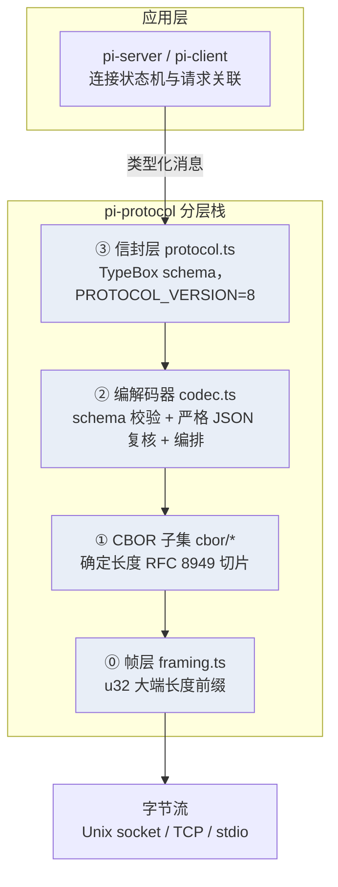
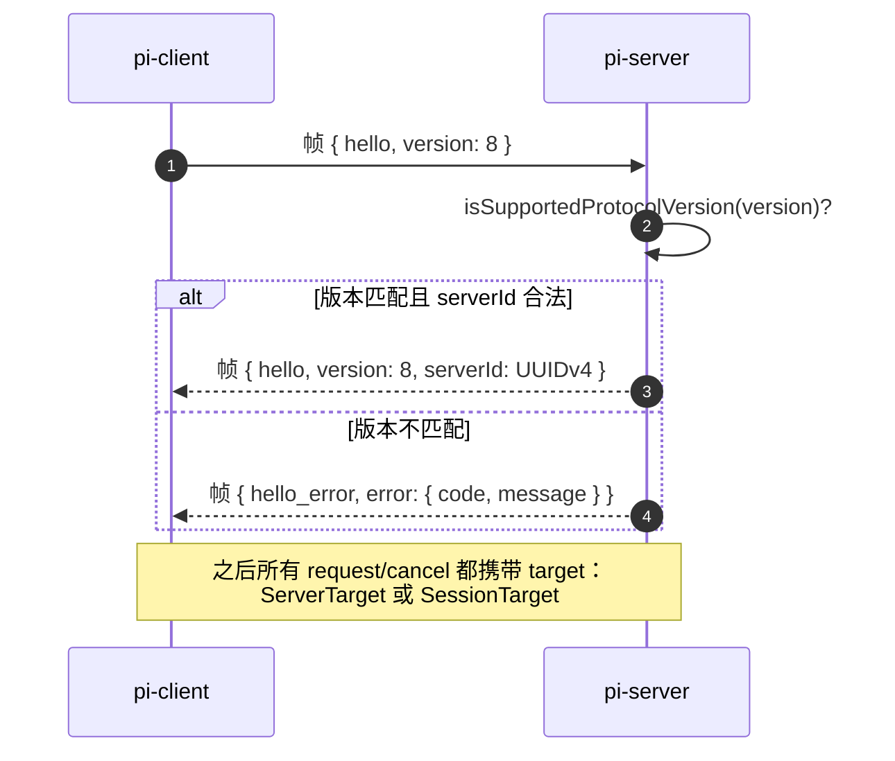
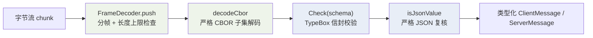

`@earendil-works/pi-protocol` 是 Pi 实验性分布式架构中的协议基石：它独立于任何传输介质，定义了**路由信封 schema**（TypeBox 严格校验）、**RFC 8949 的确定性 CBOR 子集**（自研编解码器）与**字节流分帧规则**（4 字节大端长度前缀）三层能力。本页面向高级开发者，从设计原理出发逐层拆解这三个模块，并给出字节级编码示例、资源限制合同与安全边界。注意：本协议是实验性的，版本号当前为 `PROTOCOL_VERSION = 8`，官方明确不提供兼容性保证。

Sources: [README.md](packages/protocol/README.md#L1-L42), [package.json](packages/protocol/package.json#L1-L50)

## 包定位：只定义"信封"，不定义"内容"

理解 pi-protocol 的第一步是划清职责边界。它回答的是"**如何把一条消息可靠地送到正确的目的地**"——信封结构、编码格式、帧切分；而消息里 `call` 字段承载的业务语义（例如 Chord 的 `{ serviceId, instance?, member, args }` 调用形态、服务目录、订阅快照）全部归 Chord 与上层应用所有。协议层对载荷只施加一条约束：必须是**严格 JSON**（有限数字、无循环、纯对象原型），这一判定直接复用自 `@earendil-works/chord` 导出的 `isJsonValue()`。因此依赖方向是单向的：pi-protocol → chord，而不是反过来。

Sources: [README.md](packages/protocol/README.md#L4-L14), [index.ts](packages/protocol/src/index.ts#L1-L23), [json.ts](packages/chord/src/json.ts#L4-L6)

会话目录状态、管理操作结果、转录文本、模型列表等所有应用值在信封层面都是**不透明服务数据**——协议不解析它们，只负责把字节原样送达拥有该目标的服务提供方。真正持有生命周期的服务端进程（pi-server）只被本协议视作一个"不透明的消息路由器"，其私有生命周期协议刻意留在公共协议之外。这一设计使信封层可以独立演进：协议词汇表仅由 `protocol.ts` 的 111 行代码完全定义。

Sources: [README.md](packages/protocol/README.md#L16-L27), [protocol.ts](packages/protocol/src/protocol.ts#L1-L111)

从仓库布局看，整个包极其精简：`src/` 下只有 6 个源文件（`protocol.ts`、`codec.ts`、`framing.ts` 加上 `cbor/` 目录的编解码器三件套），运行时依赖仅 `typebox`（1.3.7，用于 schema 声明与校验）和 `@earendil-works/chord`（用于 `JsonValue` 类型与严格 JSON 判定）。`package.json` 将其描述为"面向远程 pi 会话的传输中立 CBOR 协议"，要求 Node ≥ 22.19.0，且 `exports` 只暴露单一入口 `dist/index.js`——不存在按需子路径导入，所有公共 API 从包根导出。

Sources: [package.json](packages/protocol/package.json#L1-L50), [index.ts](packages/protocol/src/index.ts#L1-L23)

## 四层协议栈总览

发送一条消息要依次穿过四层：信封 schema 校验 → 严格 JSON 复核 → CBOR 编码 → 帧封装；接收侧按相反顺序还原。下图标注了每层对应的实现文件，读者可先建立整体印象，再进入各节细节：



一条编码完成的帧具有极简的字节布局：前 4 字节是 CBOR 载荷的**无符号 32 位大端长度**，其后紧跟**一个确定长度的 CBOR item**。帧层测试给出了最直接的示例——`encodeFrame([0xaa, 0xbb, 0xcc])` 产生的字节为 `00 00 00 03 aa bb cc`，空载荷则编码为 `00 00 00 00`：

```
偏移    0         1         2         3         4 …
      ┌─────────┬─────────┬─────────┬─────────┬──────────────────┐
字节   │ 0x00    │ 0x00    │ 0x00    │ 0x03    │ 0xaa 0xbb 0xcc   │
      └─────────┴─────────┴─────────┴─────────┴──────────────────┘
       └── u32 大端长度前缀 = 3 ──┘  └─ 一个确定长度 CBOR item ─┘
```

Sources: [framing.ts](packages/protocol/src/framing.ts#L1-L6), [framing.test.ts](packages/protocol/test/framing.test.ts#L20-L25), [README.md](packages/protocol/README.md#L31-L36)

## 路由信封：版本 8 的消息词汇表

整个公共词汇表由两组 TypeBox schema 定义：`ClientMessageSchema`（客户端→服务器）是 `hello | request | cancel` 的联合，`ServerMessageSchema`（服务器→客户端）是 `hello | hello_error | response | service_update | attachment` 的联合。所有信封通过 `StrictObject` 辅助函数构建，它强制 `additionalProperties: false`——**任何未知字段都会被拒绝**，测试专门验证了带 `extra: true` 字段的 hello、带 `snapshot: {}` 的服务器 hello 以及完全未知的 `{ type: "unknown" }` 消息均抛出 `ProtocolValidationError`。下表汇总了全部 8 种消息：

| 方向 | `type` | 关键字段 | 语义 |
|------|--------|----------|------|
| 客户端→服务器 | `hello` | `version: int ≥ 0` | 握手首帧，信封层接受任意非负整数版本以便协商 |
| 客户端→服务器 | `request` | `id`, `target`, `call` | 关联式 RPC 请求，`call` 为不透明严格 JSON 载荷 |
| 客户端→服务器 | `cancel` | `id`, `target` | 取消一个进行中的请求 |
| 服务器→客户端 | `hello` | `version: 8`（字面量）, `serverId` | 握手应答，声明逻辑服务器身份 |
| 服务器→客户端 | `hello_error` | `error: {code, message}` | 拒绝握手（版本不支持等） |
| 服务器→客户端 | `response` | `id`, `ok`, `result?` / `error` | 关联式应答，双形态联合 |
| 服务器→客户端 | `service_update` | `subscriptionId`, `update` | 订阅更新，载荷不透明 |
| 服务器→客户端 | `attachment` | `attachment: SessionTarget \| null` | 带外切换当前呈现附件指向的会话路由 |

Sources: [protocol.ts](packages/protocol/src/protocol.ts#L28-L94), [protocol.test.ts](packages/protocol/test/protocol.test.ts#L29-L65), [protocol.test.ts](packages/protocol/test/protocol.test.ts#L184-L218)

### 目标寻址：双重"栅栏"

请求与取消信封通过 `target` 字段路由，`RpcTargetSchema` 是两种目标形态的联合。这一设计被称为"栅栏"（fence）：路由精确 fence 到一个逻辑服务器、一个持久会话与一个活动呈现附件的组合，调用不可能漂移到错误的对象上。

| 目标形态 | 字段 | 隔离对象 |
|----------|------|----------|
| `ServerTarget` | `{ serverId }` | 单一逻辑服务器范围内的全局调用 |
| `SessionTarget` | `{ serverId, sessionId, attachmentId }` | 逻辑服务器 + 持久会话 + 活动附件三重隔离 |

`serverId` 的格式约束异常严格：schema 使用正则 `^[0-9a-f]{8}-[0-9a-f]{4}-4[0-9a-f]{3}-[89ab][0-9a-f]{3}-[0-9a-f]{12}$` 强制**规范形式的小写 UUIDv4**——测试枚举了空串、`server-1`、版本位非 4、变体位非法、大写字母等多种反例，全部被拒。相比之下 `sessionId` 与 `attachmentId` 只要求非空字符串，其命名空间由拥有该会话的服务器解释。

Sources: [protocol.ts](packages/protocol/src/protocol.ts#L35-L47), [protocol.test.ts](packages/protocol/test/protocol.test.ts#L50-L65), [server.ts](packages/server/src/server.ts#L556-L562)

### 关联式请求与双形态应答

`request`/`response` 通过不透明的 `id` 字符串做请求-应答关联：客户端为每个请求分配唯一 `id`，服务器在应答中原样返回。应答信封是一个刻意拆开的联合类型：成功形态为 `{ type, id, ok: true, result? }`——`result` 是可选的，测试确认"无 `result` 字段的 void 应答"合法通过；失败形态为 `{ type, id, ok: false, error }`，其中 `error.code` 必须是非空字符串（`IdSchema` 的 `minLength: 1`），错误码本身是不透明的（如 `wrong_server`、`cancelled`、`application_error` 均可接受），`message` 则受编解码器的 500 字符限幅约束。`cancel` 信封复用同一 `id` 与 `target`，使服务器能够定位并中止仍在执行的调用。

Sources: [protocol.ts](packages/protocol/src/protocol.ts#L49-L62), [protocol.ts](packages/protocol/src/protocol.ts#L74-L84), [protocol.test.ts](packages/protocol/test/protocol.test.ts#L176-L204)

## 版本握手时序

握手是协议会话的第一道关卡，服务器端的状态机强制两条硬规则：**第一条消息必须是 `hello`**，且 **`hello` 只能出现一次**。`hello_error` 信封则将失败原因（版本不支持等）以非空错误码传达给客户端。完整时序如下：



一个值得注意的设计细节：`ClientHello` 的 `version` 字段在**信封层接受任意非负整数**——测试明确验证了版本 0、8、9 的 hello 都能通过 `parseClientMessage`，其目的正是让客户端能够上报自己支持的版本供服务器协商；真正的兼容性判定发生在服务器侧的 `isSupportedProtocolVersion()`，它要求版本严格等于 `PROTOCOL_VERSION`（8），8.5 这样的非整数在编解码器层就已失败。而 `ServerHello` 的 `version` 直接声明为 `Type.Literal(PROTOCOL_VERSION)`，服务器应答的版本由类型系统钉死，不存在声明漂移的可能。

Sources: [protocol.ts](packages/protocol/src/protocol.ts#L28-L33), [protocol.ts](packages/protocol/src/protocol.ts#L65-L73), [protocol.test.ts](packages/protocol/test/protocol.test.ts#L30-L48), [server.ts](packages/server/src/server.ts#L262-L290)

在消费者侧，pi-client 在建连时即构造 `ServerMessageDecoder` 并显式传入连接级 `maxFrameLength`，随后把 `{ type: "hello", version: PROTOCOL_VERSION }` 编码为完整帧发出；pi-server 则在每个连接上持有 `ClientMessageDecoder` 并在握手阶段执行上述校验。连接生命周期与路由策略属于 pi-server/pi-client 的职责范围，详见 [pi-server 与 pi-client：持久会话与多附件路由](24-pi-server-yu-pi-client-chi-jiu-hui-hua-yu-duo-fu-jian-lu-you)。

Sources: [connection.ts](packages/client/src/connection.ts#L70-L140), [connection.ts](packages/server/src/connection.ts#L1-L30), [server.ts](packages/server/src/server.ts#L225-L245)

## CBOR 严格子集：RFC 8949 的确定性切片

pi-protocol 没有引入第三方 CBOR 库，而是自研了一个仅约 380 行的编解码器对，实现 RFC 8949 的一个**确定长度、严格类型**的子集。设计动机在源码注释中点明："Encodes the protocol's strict, definite-length RFC 8949 subset"。支持与拒绝的类型边界如下表所示：

| JS 值 | CBOR major type | 编码行为 |
|-------|-----------------|----------|
| `null` / `true` / `false` | 7（simple） | 单字节 `0xf6` / `0xf5` / `0xf4` |
| 非负安全整数 | 0（unsigned） | `writeArgument` 按值域选用 1/2/3/5 字节紧凑编码 |
| 负安全整数 | 1（negative） | 编码为 `-1 - n`（如 -1 → `0x20`） |
| 非整数浮点 / `-0` | 7 | 固定 `0xfb` + 8 字节大端 float64（**不接受** float16/float32） |
| 文本字符串 | 3 | UTF-8 编码 + 长度前缀，要求无损往返 |
| `Uint8Array` | 2（byte string） | 仅解码侧支持，信封载荷中禁止出现 |
| 数组 | 4 | 确定长度，逐元素递归 |
| 字符串键纯对象 | 5 | 确定长度 map，键必须为文本 |

Sources: [encoder.ts](packages/protocol/src/cbor/encoder.ts#L101-L216), [decoder.ts](packages/protocol/src/cbor/decoder.ts#L19-L89), [options.ts](packages/protocol/src/cbor/options.ts#L1-L19)

**拒绝清单**是安全设计的核心。解码器通过一个 30 个用例的十六进制向量表系统性封堵了每一类畸形输入：CBOR tag（major 6）、不定长 byte string/array/map（`0x5f`/`0x9f`/`0xbf`）、break 标记（`0xff`）、undefined（`0xf7`）、float16（`0xf9`）与 float32（`0xfa`）、NaN 与 ±Infinity、以 float64 编码的超安全范围整数（如 `fb4340000000000000`）、截断载荷、尾随数据、非字符串 map 键、重复 map 键、无效/过长/含代理对的 UTF-8。编码器侧同样拒绝：`undefined`、数组空洞、BigInt、Symbol、函数、`Date`、`Map`、可枚举 symbol 键、孤立代理对（编码后回读比对原文，`"\ud800"` 被拒）、循环引用（祖先集合检测）与超深度嵌套。

Sources: [cbor.test.ts](packages/protocol/test/cbor/cbor.test.ts#L120-L152), [encoder.ts](packages/protocol/src/cbor/encoder.ts#L85-L99), [cbor.test.ts](packages/protocol/test/cbor/cbor.test.ts#L71-L119)

编解码的正确性由**官方 RFC 8949 已知向量**锚定：34 组“值 ↔ 十六进制”对覆盖了从 `null → f6`、`1000 → 1903e8`、`Number.MAX_SAFE_INTEGER → 1b001fffffffffffff`、`-1 → 20`、`1.1 → fb3ff199999999999a`、多字节 Unicode（`水 → 63e6b0b4`、四字节 `𐅑`）到嵌套结构 `{a: 1, b: [2, 3]} → a26161016162820203` 的全部主要路径。两个细节最能体现严谨性：其一，`-0` 被刻意排除出整数路径（`Object.is(value, -0)` 检查），编码为 `fb8000000000000000` 以保留符号语义；其二，解码 map 时使用 `Object.defineProperty` 逐键写入而非普通赋值，使 `__proto__` 作为普通数据键安全落地（测试验证解码结果的 `Object.getPrototypeOf` 仍是 `Object.prototype`，原型污染无从谈起），并用 `Set` 检测重复键。

Sources: [cbor.test.ts](packages/protocol/test/cbor/cbor.test.ts#L19-L69), [decoder.ts](packages/protocol/src/cbor/decoder.ts#L48-L62)

性能层面，`CborWriter` 从 256 字节起步按倍数扩容（上限受 `maxByteLength` 约束，超出即抛 `CborError`），`CborReader` 则全程在输入缓冲区上做 `subarray` 零拷贝切片，仅在 byte string 时才复制。深度限制在递归入口统一检查（`readItem`/`encodeValue` 的 `depth` 参数），且解码器在**遍历元素之前**就检查声明长度是否超限——一个声明长度 16 MiB+1 的 byte string 头部会在读到任何载荷字节前被拒绝，这使得恶意长度声明无法消耗内存。

Sources: [encoder.ts](packages/protocol/src/cbor/encoder.ts#L12-L70), [decoder.ts](packages/protocol/src/cbor/decoder.ts#L91-L120), [cbor.test.ts](packages/protocol/test/cbor/cbor.test.ts#L154-L174)

## 帧层：增量解码状态机与拷贝语义

`framing.ts` 实现了两个方向的分帧。编码侧 `encodeFrame()` 只做一件事：分配 `4 + payload.length` 的缓冲区，手工移位写入大端长度（`length >>> 24` … `length`），再 `set` 拷贝载荷——超过 `0xffff_ffff` 直接抛 `RangeError`。解码侧 `FrameDecoder` 是一个带三态（`open | ended | failed`）的增量状态机，其设计围绕两个现实问题：**任意分片**（TCP/socket 可能在任意字节边界切割，甚至一帧拆到半个头部）与**任意合并**（多次发送可能被操作系统聚包）。

Sources: [framing.ts](packages/protocol/src/framing.ts#L1-L40), [framing.ts](packages/protocol/src/framing.ts#L42-L47)

分片容错的实现要点有三。第一，头部攒齐前不消费状态：`header` 缓冲区与 `headerLength` 计数器保证 1 字节的分片也能逐步填充，4 字节攒齐后才解析长度并**立刻校验上限**——声明长度超过 `maxFrameLength` 的帧在头部完成瞬间就 `fail()`，不等待任何载荷字节（测试 `rejects an oversized declared length as soon as its header is complete` 验证了这一点）。第二，载荷按 **64 KiB 块**（`PAYLOAD_BLOCK_SIZE`）分块拷贝，块大小取 `min(64KiB, 剩余字节数)`，避免为 16 MiB 大帧一次性分配连续内存；只有单块命中的常见小帧直接返回原块，多块才合并。第三，解码器坚持**拷贝语义**：输入 chunk 被复制进内部块，测试在 `push()` 之后原地 `fill(9)` 污染输入，断言输出帧完好无损——这防止了调用方缓冲区复用造成的静默数据损坏。

Sources: [framing.ts](packages/protocol/src/framing.ts#L85-L152), [framing.test.ts](packages/protocol/test/framing.test.ts#L85-L95), [framing.test.ts](packages/protocol/test/framing.test.ts#L62-L68)

流终止语义同样被明确测试：`end()` 时若仍有半截头部或未收满的载荷，抛出 `FrameError("Truncated frame at end of stream")`；空流干净结束则不抛。分片正确性采用穷举验证——测试将一条 7 字节的帧在**每一个可能的切割点**（split = 0…7）上拆成两半交给两个 `push()` 调用，全部还原成功；`end()` 后再 `push()`、失败后再 `push()` 都会被三态检查拦下，杜绝半初始化状态外泄。

Sources: [framing.test.ts](packages/protocol/test/framing.test.ts#L27-L68), [framing.test.ts](packages/protocol/test/framing.test.ts#L70-L89)

## 编解码器：三重校验管线与统一错误合同

`codec.ts` 将前述三层粘合成对外的稳定 API。它把每条消息的接收流程编排为一个五步管线，任何一步失败都会收敛为同一种异常类型——`ProtocolValidationError`——调用方无需区分帧错误、CBOR 错误与 schema 错误即可安全地断开连接：



Sources: [codec.ts](packages/protocol/src/codec.ts#L20-L26), [codec.ts](packages/protocol/src/codec.ts#L62-L107)

管线中的"严格 JSON 复核"值得单独说明。TypeBox 的 `Check` 能验证信封结构，但 `call`、`update`、`result` 等不透明载荷是 `Type.Unsafe<JsonValue>`——schema 层面放行一切，真正的把关者是来自 chord 的 `isJsonValue()`：它要求有限数字、`Object.prototype` 或 `null` 原型的纯对象、字符串键、无循环（祖先集合）、深度 ≤ 512，且数组不得有空洞或不可枚举的索引属性。`parseClientMessage` 将两者用 `||` 短路串联，测试验证了 `Uint8Array`、`NaN`、含 `undefined` 属性的对象与循环引用四种载荷全部被拒——**即便 CBOR 本身可以编码其中部分形态**（如 byte string），信封也不允许它们进入业务载荷，保持了"载荷始终可无损序列化为 JSON"的合同。

Sources: [codec.ts](packages/protocol/src/codec.ts#L8-L10), [json.ts](packages/chord/src/json.ts#L4-L51), [protocol.test.ts](packages/protocol/test/protocol.test.ts#L99-L122)

错误合同还包含两处细节。其一，`boundedErrorMessage()` 将底层错误消息截断到 **500 字符**（超长以 `...` 结尾）再包装，防止畸形输入诱导的冗长错误消息本身成为放大攻击；其二，`ValidatedMessageDecoder` 维护**粘滞失败状态**——任何一次 `push()` 出错后，后续所有调用（包括 `end()`）都直接抛出 "`{kind} message decoder has failed`"，测试在构造了"empty CBOR payload / malformed CBOR / schema-invalid CBOR"三种坏帧后验证：第一次 `push()` 抛出具体错误，紧接着对同一 decoder 的第二次 `push()` 立即抛出 failed 状态错误。这个状态机拒绝"报错后继续读"的尝试，因为流式分帧一旦错位，后续字节的一切解读都不可信。

Sources: [codec.ts](packages/protocol/src/codec.ts#L28-L31), [codec.ts](packages/protocol/src/cbor/../codec.ts#L69-L107), [protocol.test.ts](packages/protocol/test/protocol.test.ts#L252-L259)

模块间的组合关系可以概括为：`ClientMessageDecoder`/`ServerMessageDecoder` 是 `ValidatedMessageDecoder` 的薄封装，后者组合 `FrameDecoder`（分帧）+ `decodeCbor`（解码）+ `parse*`（校验）；编码路径 `encodeClientMessage`/`encodeServerMessage` 则先校验后编码再封帧，且编码时将 `maxFrameLength` 同时用作 CBOR 的 `maxByteLength`，保证**出站帧上限与入站解码上限由同一个参数控制**（测试验证了 `maxFrameLength: 8` 下编码 hello 即失败）。

Sources: [codec.ts](packages/protocol/src/codec.ts#L33-L60), [protocol.test.ts](packages/protocol/test/protocol.test.ts#L224-L232)

## 资源限制合同

所有资源上限集中定义并有默认值，且支持调用方按连接收紧。下表汇总了完整的限制矩阵：

| 参数 | 默认值 | 允许上限 | 生效位置 |
|------|--------|----------|----------|
| `maxFrameLength` | 16 MiB | 2³²−1 | `FrameDecoder`、编码器（帧与 CBOR 双重生效） |
| `maxByteLength`（CBOR） | 16 MiB | 2³²−1 | 编码输出总量、byte/text string 长度、解码输入总量 |
| `maxContainerLength` | 1,000,000 | 2³²−1 | 数组元素数与 map 条目数（编解码两侧） |
| `maxDepth` | 64 | 512 | CBOR 递归深度（编解码两侧）；chord JSON 复核另限 512 |
| 错误消息长度 | — | 500 字符 | `boundedErrorMessage` 包装层 |

Sources: [options.ts](packages/protocol/src/cbor/options.ts#L1-L53), [framing.ts](packages/protocol/src/framing.ts#L1-L25), [codec.ts](packages/protocol/src/codec.ts#L28-L31)

这些限制的设计哲学是**在解析前拒绝，而非解析中崩溃**：长度声明先于载荷遍历被校验（前文已述），深度在每次递归入口检查，编码器的容量检查在每次写入前完成。值得注意的是 `maxDepth` 的可配置上限是 512——但 chord 的 `isJsonValue` 固定以 512 为界，因此即使把 CBOR 深度放宽到 512，信封载荷仍受更早的 JSON 深度约束；两层校验叠加，攻击者无法通过放宽一层绕过整体防线。调用方还可以通过 `maxFrameLength`/`maxContainerLength` 为不受信任的连接配置更紧的限额（测试 `supports stricter caller-provided limits` 验证了收紧后编解码两侧立即生效）。

Sources: [options.ts](packages/protocol/src/cbor/options.ts#L7-L9), [cbor.test.ts](packages/protocol/test/cbor/cbor.test.ts#L154-L174), [json.ts](packages/chord/src/json.ts#L8-L10)

## 消费者与集成边界

在 monorepo 内，pi-protocol 被 `pi-client`、`pi-server` 与 `coding-agent` 三个包声明为依赖。集成模式高度一致：连接对象持有解码器实例并维护逐帧状态，`RpcTarget` 与信封类型作为公共合同在两侧共享。**pi-protocol 与 `pi coding-agent` 的 RPC 模式（stdin/stdout 上的 JSON 行协议）是两套独立的机制**——后者面向本地进程内集成，详见 [RPC 模式：stdin/stdout 上的 JSON 协议与帧规则](17-rpc-mo-shi-stdin-stdout-shang-de-json-xie-yi-yu-zheng-gui-ze)；而本页描述的 CBOR 协议服务于实验性分布式部署中的跨机器远程会话。

Sources: [package.json](packages/protocol/package.json#L26-L37), [connection.ts](packages/client/src/connection.ts#L1-L30), [connection.ts](packages/server/src/connection.ts#L1-L30)

信封内 `call`/`update` 载荷的真正语义由 Chord 定义：`{ serviceId, instance?, member, args }` 调用形态、`$chord.service` 控制词汇、服务目录、订阅快照与增量更新，以及复制状态的 Delta 编解码。理解"信封如何路由到服务"与"服务如何解释载荷"的分野，需要同时阅读两页：路由信封在 [chord：插件、服务、复制状态与增量追踪](22-chord-cha-jian-fu-wu-fu-zhi-zhuang-tai-yu-zeng-liang-zhui-zhui) 所描述的 Chord 服务模型上运转，而完整的服务端/客户端组装在 [pi-server 与 pi-client：持久会话与多附件路由](24-pi-server-yu-pi-client-chi-jiu-hui-hua-yu-duo-fu-jian-lu-you) 中展开。

Sources: [README.md](packages/protocol/README.md#L16-L27)

## 阅读路线建议

若你从本页出发继续深入，推荐顺序为：先读 [chord：插件、服务、复制状态与增量追踪](22-chord-cha-jian-fu-wu-fu-zhi-zhuang-tai-yu-zeng-liang-zhui-zong) 理解信封内载荷的服务语义与增量追踪；再读 [pi-server 与 pi-client：持久会话与多附件路由](24-pi-server-yu-pi-client-chi-jiu-hui-hua-yu-duo-fu-jian-lu-you) 观察信封如何被连接状态机消费；若关注应用侧集成，[AgentSession 与 SDK：将智能体嵌入自有应用](16-agentsession-yu-sdk-jiang-zhi-neng-ti-qian-ru-zi-you-ying-yong) 提供进程内对照视角。对于需要修改本包的贡献者，`test/` 下的三个测试文件（`cbor.test.ts` 的 30 组拒绝向量、`framing.test.ts` 的穷举分片用例、`protocol.test.ts` 的信封边界用例）是行为合同的最精确陈述，任何 schema 或限制变更都应从这些用例出发反向验证。