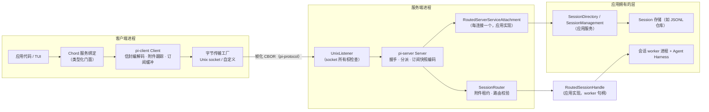
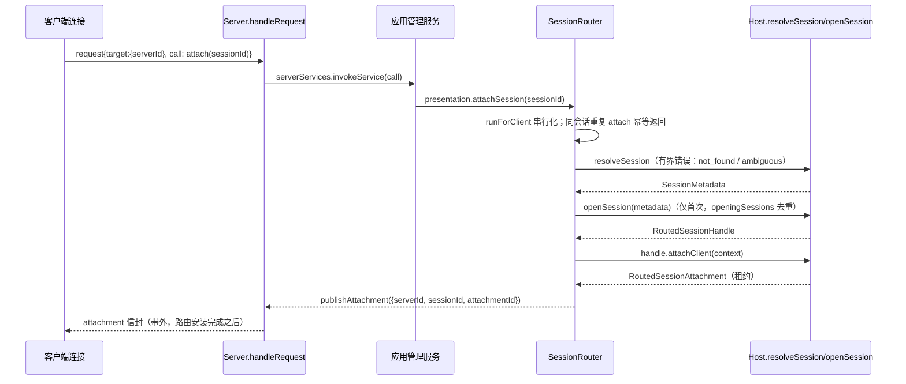
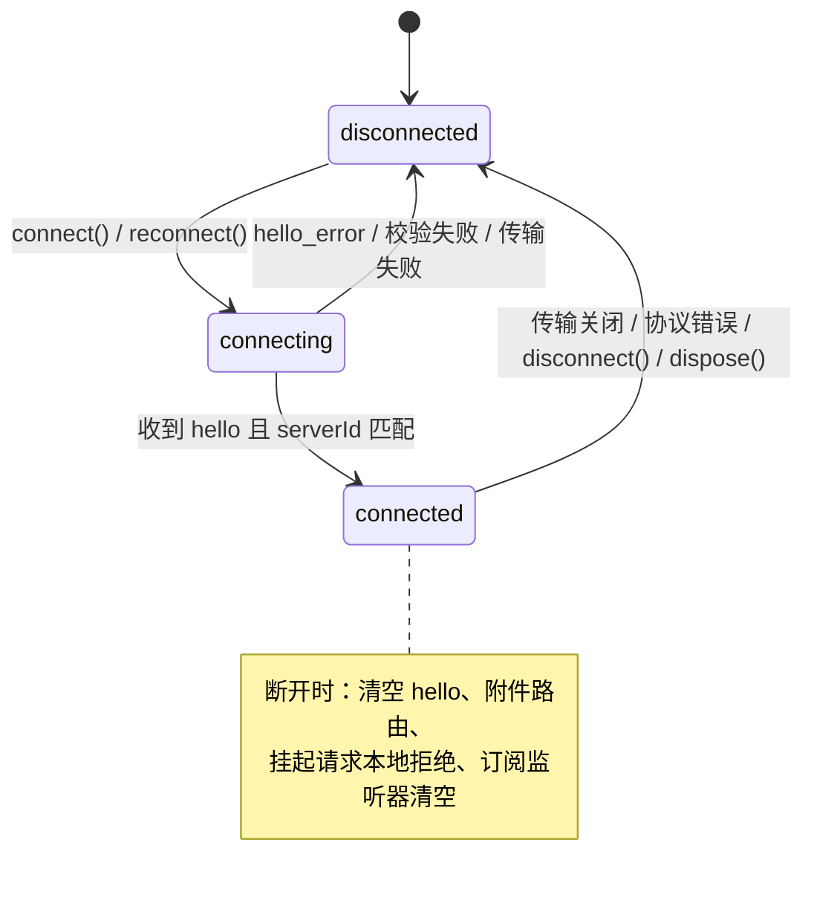
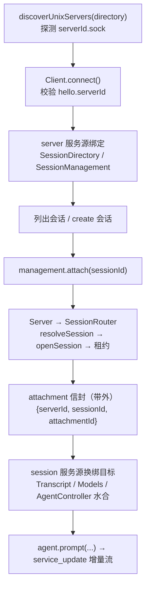

本页是"实验性分布式架构"三部曲的第三篇：前两篇分别讲清了 [chord 的服务、复制状态与增量追踪](22-chord-cha-jian-fu-wu-fu-zhi-zhuang-tai-yu-zeng-liang-zhui-zong) 与 [pi-protocol 的 CBOR 帧编码和路由信封](23-pi-protocol-cbor-zheng-bian-ma-yu-lu-you-xin-feng)，本篇则聚焦在这两个契约之上构建的**两端运行时**——`@earendil-works/pi-server`（本地协议服务端）与 `@earendil-works/pi-client`（传输无关客户端）。两者共同解决一个核心问题：让多个"演示端"（presentation，例如 TUI、脚本、IDE 面板）安全地附加到由服务端 worker 进程长期持有的智能体会话上，同时把"会话存在哪里、由谁管理"这个问题完全留给应用层。以下内容基于 v0.85.0 源码逐行核对。

## 一、定位：给"活着的会话"配一套路由层

要理解这两个包的边界，首先要接受一条设计公理：**协议服务端不做业务**。`pi-server` 的 README 开宗明义——它是一个"为新的持久化 Session 与 Agent Harness 接口准备的实验性本地服务端"，当前切片只支持 server 级与会话级的服务路由、多演示端附件（multi-presentation attachment），而会话的发现、管理、存储与 Harness 生命周期全部由应用方拥有。协议服务端只在"路由一个附件"时才向应用注入的解析器询问会话元数据，除此之外它对业务一无所知 [README](packages/server/README.md#L1-L23)。`pi-client` 则是它的镜像：一个传输无关的客户端，只负责信封编解码、请求关联、附件路由跟踪与订阅状态解码，"不构造类型化服务代理、不解释应用契约" [README](packages/client/README.md#L1-L37)。

两个包都刻意依赖前两篇的主角：帧化 CBOR 与信封校验来自 `pi-protocol`，服务控制调用解析、错误码、快照与增量的每订阅状态编码器来自 `chord` [README](packages/server/README.md#L64-L79)。这意味着 `Server` 与 `Client` 都是"薄"的——它们的全部价值集中在**路由安全**上：跨服务端、跨会话、跨附件的错投必须在协议边界被拒绝。

两个包的分工与依赖关系可以汇总为下表（版本号取自各自 package.json）。

| 包 | 职责 | 关键导出 | 运行时依赖 |
| --- | --- | --- | --- |
| `@earendil-works/pi-server` | 本地协议服务端：握手、请求分派、多附件路由 | `Server`、`createUnixServer`、`createUnixListener`、`getUnixSocketPath`、`ServerHost` 等 Routed\* 类型、`testing` 子路径 | `chord`、`pi-agent-core`、`pi-protocol` |
| `@earendil-works/pi-client` | 传输无关客户端：请求关联、附件跟踪、订阅缓冲 | `Client`、`createClientServiceTransport`、`ServerError`、`createUnixTransportFactory`、`discoverUnixServers` | `chord`、`pi-protocol` |

Sources: [package.json](packages/server/package.json#L2-L34)、[package.json](packages/client/package.json#L2-L30)、[index.ts](packages/server/src/index.ts#L1-L5)、[index.ts](packages/client/src/index.ts#L1-L13)

## 二、协议面：两类目标与五种路由语义

在进入两端实现之前，先复习协议层给路由定的规矩（编码细节见 [pi-protocol：CBOR 帧编码与路由信封](23-pi-protocol-cbor-zheng-bian-ma-yu-lu-you-xin-feng)）。当前协议版本为 `PROTOCOL_VERSION = 8`，信封经 TypeBox 严格校验后以长度前缀帧承载 CBOR 载荷，默认单帧上限 `DEFAULT_MAX_FRAME_LENGTH = 16 MiB` [protocol.ts](packages/protocol/src/protocol.ts#L5)、[framing.ts](packages/protocol/src/framing.ts#L4-L6)。路由目标 `RpcTarget` 是一个二选一的联合：server 级调用只携带 `{ serverId }`；会话级调用必须携带完整三元组 `{ serverId, sessionId, attachmentId }`——注释原文强调这是"fenced to one logical server, durable session, and live attachment"的组合持久地址，用于杜绝跨服务端或跨会话的错投 [protocol.ts](packages/protocol/src/protocol.ts#L36-L47)。

客户端可发送三种信封：首帧 `hello`（仅版本号）、`request`（`id + target + call`）、`cancel`（`id + target`）；服务端可回五种：`hello`（回显版本与 `serverId`）、`hello_error`、`response`、`service_update`、以及最特殊的 `attachment`——它被定义为"对本演示端当前所选会话路由的**带外**更新"，载荷要么是完整的 `SessionTarget`，要么是 `null` 表示清除路由 [protocol.ts](packages/protocol/src/protocol.ts#L29-L62)、[protocol.ts](packages/protocol/src/protocol.ts#L65-L109)。`attachment` 信封是本页标题中"多附件路由"的协议落点：附件 ID 由服务端生成、只作为路由控制数据传递，永远不会出现在业务结果里。

| 方向 | 信封 | 关键字段 | 语义 |
| --- | --- | --- | --- |
| 客户端 → 服务端 | `hello` | `version` | 必须是首帧；协议版本协商 |
| 客户端 → 服务端 | `request` | `id`、`target`、`call` | 一次服务调用（chord `ServiceCall` 的 JSON 值） |
| 客户端 → 服务端 | `cancel` | `id`、`target` | 取消与 target 完全匹配的活动请求 |
| 服务端 → 客户端 | `hello` / `hello_error` | `version`+`serverId` / `error` | 握手成功身份声明 / 失败原因 |
| 服务端 → 客户端 | `response` | `id`、`ok`、`result?`/`error` | 请求应答（成功可无结果） |
| 服务端 → 客户端 | `service_update` | `subscriptionId`、`update` | 已按订阅编码的复制状态增量 |
| 服务端 → 客户端 | `attachment` | `attachment: SessionTarget \| null` | 带外路由变更（安装/清除） |

Sources: [protocol.ts](packages/protocol/src/protocol.ts#L29-L109)

两类目标的差异决定了两套完全不同的校验路径，值得单独对比。

| 维度 | ServerTarget `{serverId}` | SessionTarget `{serverId, sessionId, attachmentId}` |
| --- | --- | --- |
| 路由对象 | 连接级 server 服务端点 | 该连接持有的会话附件租约 |
| 服务端校验 | 仅要求 `serverId` 与本进程相等 | 三元组**全等**，且必须是该连接当前持有的租约 |
| 失效时机 | 连接断开 | 切换会话、detach、会话删除、worker 终止 |
| 典型服务 | `pi.session-management`、`pi.session-directory` | `Transcript`、`Models`、`AgentController` |
| 典型错误 | `wrong_server` | `session_not_attached` |

Sources: [server.ts](packages/server/src/server.ts#L348-L358)、[session-router.ts](packages/server/src/session-router.ts#L224-L232)

## 三、pi-server：连接状态机与请求分派

`Server` 是 `pi-server` 的核心类，构造时要求显式注入监听器数组与逻辑身份，并对选项做严格类型检查——`serverId` 必须是规范的小写 UUIDv4，`maxFrameLength` 必须是 1 到 2³²-1 之间的安全整数，握手超时默认 5 秒且不得超过 Node 计时器上限 [server.ts](packages/server/src/server.ts#L29-L33)、[server.ts](packages/server/src/server.ts#L531-L576)。

| `ServerOptions` 选项 | 必填 | 默认值 | 说明 |
| --- | --- | --- | --- |
| `listeners` | 是 | — | `ServerListener` 数组；Unix 预设会注入一个 |
| `serverId` | 是 | — | 规范小写 UUIDv4，由启动器给定的**逻辑**身份 |
| `maxFrameLength` | 否 | 16 MiB | 单帧上限，需与对端一致 |
| `handshakeTimeoutMs` | 否 | 5000 | 握手超时，超时发 `hello_error` 后关连接 |
| `onConnectionCountChanged` | 否 | — | 连接数变化回调 |
| `onError` | 否 | — | 观测性错误回调，不得影响服务端状态 |

Sources: [types.ts](packages/server/src/types.ts#L5-L13)、[server.ts](packages/server/src/server.ts#L531-L576)

每条连接经历五个阶段：`awaitingHello → handshaking → ready`，失败或关闭时进入 `closing → closed` [connection.ts](packages/server/src/connection.ts#L22-L28)。状态机的第一条铁律是**首帧必须是 hello**，否则以 `invalid_request` 断开；已完成握手后再收到 hello 同样是协议错误 [server.ts](packages/server/src/server.ts#L223-L243)。握手期间到达的请求不会被丢弃，而是在握手完成后按原序补派 [server.ts](packages/server/src/server.ts#L246-L260)。握手本身分三步：校验协议版本 → 调用 `host.serverServices.attachClient(presentation)` 换取本连接的 server 服务端点 → 回发携带 `serverId` 的 `ServerHello` [server.ts](packages/server/src/server.ts#L262-L296)。注意 `attachClient` 的入参 `RoutedServerPresentation` 恰好只暴露三个窄能力——`attachSession`、`detachSession`、`prepareSessionRemoval`——这就是 README 说的"narrow attachment-management capabilities"：应用服务想管理附件，只能通过这三个门 [types.ts](packages/server/src/types.ts#L28-L48)。

进入 `ready` 后，`handleRequest` 承担全部分派：重复的活动请求 ID 立即回错；`call` 先经 chord 的 `parseServiceCall` 做语义校验；随后按 target 分流——带 `sessionId` 的走 `SessionRouter.executeServiceCall`，否则走本连接的 `serverServices.invokeService`；`target.serverId` 不匹配则直接抛 `WrongServerError` [server.ts](packages/server/src/server.ts#L306-L362)。对订阅类控制调用，`Server` 还负责三件 choreography：拒绝同一连接上的重复订阅 ID、用 chord 的 `createServiceStateEncoder` 把首个快照编码后缓存、并把"快照响应发出前到达的更新"缓冲到响应之后**按序补发**，保证客户端看到的状态序列无缝 [server.ts](packages/server/src/server.ts#L331-L386)。

`cancel` 的匹配是严格相等：`CancelEnvelope` 的 target 必须与活动请求注册时的 target 一致（对会话调用而言，连 `attachmentId` 都要比对），才会触发对应 `AbortController` [server.ts](packages/server/src/server.ts#L298-L304)、[server.ts](packages/server/src/server.ts#L562-L571)。被中止或断连时，服务端把错误统一收敛为 `cancelled` 响应码 [server.ts](packages/server/src/server.ts#L393-L404)。

连接消失时的清理顺序值得留意：先中止所有活动请求、清空订阅编码器，再并行执行 `sessions.disconnect` 与 `serverServices.release`，所有拒绝都以 `reportError` 上报而不影响其他连接 [server.ts](packages/server/src/server.ts#L417-L436)。整个 `Server.close()` 则先关监听器、再关所有连接、最后 `sessions.close(BACKGROUND_CONTEXT)`，任何阶段的失败都会聚合进 `closed` Promise 的拒绝理由 [server.ts](packages/server/src/server.ts#L182-L200)、[server.ts](packages/server/src/server.ts#L489-L510)。

跨协议边界暴露的错误码是**封闭集合**，这是"有界错误"设计的关键：应用层的任意异常都不会原样外泄，未知错误统一折叠为 `internal_error` 与固定文案 [errors.ts](packages/server/src/errors.ts#L1-L13)、[server.ts](packages/server/src/server.ts#L517-L526)。

| 错误码 | 触发条件 | 服务端异常类型 |
| --- | --- | --- |
| `wrong_server` | `target.serverId` 与本进程不符 | `WrongServerError` |
| `session_not_found` | `resolveSession` 未命中任何会话 | `SessionNotFoundError`（由 host 抛出） |
| `session_ambiguous` | 会话 ID 命中多个元数据 | `SessionAmbiguousError` |
| `session_not_attached` | 目标三元组与连接持有的附件不符 | `SessionNotAttachedError` |
| `server_draining` | 服务端关闭中仍试图 attach/open | `ServerDrainingError` |
| `invalid_request` | 信封/调用语义非法、重复请求 ID、重复订阅 ID | `ProtocolValidationError` |
| `cancelled` | 请求被 `cancel` 或断连中止 | AbortController 信号 |
| `version` | 协议版本不匹配 | `hello_error` 载荷 |
| `internal_error` | 一切未知异常的兜底 | 统一文案，不泄露细节 |

Sources: [errors.ts](packages/server/src/errors.ts#L8-L58)

## 四、SessionRouter：多附件路由的内核

`SessionRouter` 是"一个会话、多个演示端"的全部实现。它的数据模型只有两个内部结构：`HostedSession { id, handle, attachments }` 承载一个已被打开的会话及其全部附件；`ClientAttachment { id, client, session, operations }` 承载一条连接对某会话的**单个**附件 [session-router.ts](packages/server/src/session-router.ts#L10-L25)。两个索引决定了基数约束：`attachmentsByClient` 是"每连接至多一个附件"（`Map<object, ClientAttachment>`），而 `HostedSession.attachments` 是"每会话任意多个附件"（`Set<ClientAttachment>`）——一致性测试明确验证了"两个客户端可同时附加同一会话"以及"同一连接重复 attach 同一会话幂等" [conformance.test.ts](packages/server/test/conformance.test.ts#L182-L201)。

附件的安装流程是一个精心编排的六步序列，任何一步失败都会回滚：

Sources: [session-router.ts](packages/server/src/session-router.ts#L160-L197)

几个关键规则藏在这段实现里。第一，**串行化**：对同一客户端的所有路由操作经 `runForClient` 链式排队，杜绝并发 attach/detach 的交错 [session-router.ts](packages/server/src/session-router.ts#L146-L158)。第二，**切换即重置**：attach 到不同会话时，旧附件先释放（且不发布清除信封，避免抖动），新附件拿到全新 `randomUUID()` 生成的 `attachmentId`，随后才发布新路由；因此切换后旧三元组立即失效，测试验证了"stale attachment route"会被 `session_not_attached` 拒绝 [session-router.ts](packages/server/src/session-router.ts#L161-L166)、[conformance.test.ts](packages/server/test/conformance.test.ts#L246-L263)。第三，**租约先行**：只有当 `handle.attachClient()` 成功返回租约、且此时服务端未在 draining、连接未断开，路由才真正写入映射并发布；中途任何条件变化都会释放附件并抛 `server_draining` [session-router.ts](packages/server/src/session-router.ts#L175-L197)。

请求执行侧的防线在 `requireAttachment`：它要求 `target` 携带 `sessionId`，且该连接当前持有的附件必须同时匹配 `sessionId` 与 `attachmentId`，否则一律 `session_not_attached` [session-router.ts](packages/server/src/session-router.ts#L224-L232)。这意味着 `attachmentId` 实际上是一个**连接持有的能力凭证**：即便两个客户端附加同一会话，彼此也无法伪造对方的路由。同时每个进行中的 `invokeService` 都会被 `trackOperation` 记入 `attachment.operations`，释放附件前会等待它们全部落定——测试确认了"断连后，已受理的服务调用结算完成前，附件需求一直保留" [session-router.ts](packages/server/src/session-router.ts#L206-L222)、[conformance.test.ts](packages/server/test/conformance.test.ts#L302-L320)。

释放路径 `releaseAttachment` 用 `releasing` 单飞（memoized promise）保证幂等：先等待在途操作，再 `lease.release(context)`，最后从双向映射中摘除并发布 `attachment: null`（切换会话场景传 `publish=false` 抑制抖动）[session-router.ts](packages/server/src/session-router.ts#L234-L260)。即便释放失败，`clearAttachment` 也会在 `finally` 中执行——测试确认"附件释放失败时连接所有权仍被清除"，服务端会继续接受新的 attach [conformance.test.ts](packages/server/test/conformance.test.ts#L202-L222)。

会话级生命周期由三个入口共同保障。`removeSession` 先释放全部附件、再 `handle.close`、最后从映射删除，任何一步失败都聚合抛出 [session-router.ts](packages/server/src/session-router.ts#L72-L89)。`RoutedSessionHandle.terminated` 的存在让"worker 意外死亡"成为一等公民：`open()` 挂上监听，一旦触发 `invalidate` 立即删除托管会话并后台释放所有附件，之后客户端重新 attach 会触发全新一轮 `openSession`——测试验证了"terminated Harness 失效后允许后续 attach" [session-router.ts](packages/server/src/session-router.ts#L276-L312)、[conformance.test.ts](packages/server/test/conformance.test.ts#L366-L382)。并发首次打开由 `openingSessions` 去重，两个客户端同时附加同一会话只会触发一次 `openSession` [session-router.ts](packages/server/src/session-router.ts#L262-L274)。而 `Server` 关闭时的 `closeInternal` 会先等待所有客户端操作与打开中的会话落定，再释放全部附件、关闭全部句柄，错误聚合进 AggregateError [session-router.ts](packages/server/src/session-router.ts#L102-L145)。

Sources: [session-router.ts](packages/server/src/session-router.ts#L47-L158)

## 五、ServerHost：应用拥有的三块拼图

`ServerHost` 接口把服务端需要的能力压缩到最小三件套：`serverServices`（每连接一个的 server 服务宿主）、`resolveSession`（有界的会话元数据解析器）、`openSession`（RoutedSessionHandle 工厂）[types.ts](packages/server/src/types.ts#L58-L64)。这个接口的注释本身就是设计文档："Resolve one durable Session ID or throw a bounded routing error"——解析器只做一件事，把持久会话 ID 翻译成 `SessionMetadata`，错误必须是 `session_not_found` / `session_ambiguous` 这样的封闭集合，否则服务端无法保证协议边界的错误纪律。

`RoutedSessionHandle` 是"持久会话"概念的接口化：它由应用实现，包装了 worker 进程中的实际 Harness，`attachClient()` 每次返回一个新的 `RoutedSessionAttachment` 租约，`terminated` Promise 把意外终止通知给路由器，`close()` 承担受控关闭 [types.ts](packages/server/src/types.ts#L50-L56)。README 特意强调"开放的 JavaScript Session 与 Harness 都不跨进程边界"——host 负责在 worker 内部获取它们，失败也在 worker 内部清理 [README](packages/server/README.md#L60-L69)。

仓库内有两份实现样本。`testing` 子路径导出的 `TestServerHost` 用 `MemorySessionRepo` 演示了最小实现：`resolveSession` 在元数据列表上过滤并区分 not_found/ambiguous，`openSession` 打开仓库会话后创建带计数器的测试 Harness，失败路径会回滚关闭会话 [host.ts](packages/server/src/testing/host.ts#L94-L160)。生产样本是 coding-agent 的实验栈：`resolveSession` 读 JSONL 会话仓库，`openSession` 转发给 worker 管理器，最后用 `createUnixServer(host, { serverId, path, mode: 0o600, onConnectionCountChanged })` 启动 [server.ts](packages/coding-agent/src/experimental/server.ts#L458-L481)。它的 `RoutedSessionHandle` 实现把附件生命周期翻译成 worker 的"需求更新"（demand updates）：`attachClient` 生成附件 ID 并向 worker 下发 demand-on，`release` 下发 demand-off，`terminated` 直接暴露 worker 的终止 Promise [session-worker-manager.ts](packages/coding-agent/src/experimental/session-worker-manager.ts#L182-L240)。

server 服务侧同样有标准范式。应用的 `RoutedServerServiceHost.attachClient` 每连接构建一个 chord `RemoteServiceProvider`，注入 `SessionDirectory`（复制状态的会话目录）、`SessionManagement`（create/remove/attach/detach）、`PresentationPlugins` 三个服务，再包一层 `createRemoteServiceEndpoint` 适配成 `RoutedServerServiceAttachment` [services/server.ts](packages/coding-agent/src/experimental/services/server.ts#L40-L110)。注意 `SessionManagement.attach` 的实现只是转调 `presentation.attachSession(sessionId)`——**业务 API 不返回任何路由 ID**，路由三元组由路由器在带外信封中单独交付，这正是 README 强调的"application-owned `SessionManagement` … without exposing route IDs in business results" [README](packages/server/README.md#L5-L23)。

| 服务 | 服务 ID | 角色 | 放置层 |
| --- | --- | --- | --- |
| `SessionDirectory` | `pi.session-directory` | 把私有目录投影为可复制的演示安全状态 | server 级（连接端点） |
| `SessionManagement` | `pi.session-management` | create / remove / attach / detach | server 级（连接端点） |
| `Transcript` 等 | — | 转写、模型、控制等业务观察面 | 会话级（附件租约） |

Sources: [sessions.ts](packages/coding-agent/src/experimental/services/sessions.ts#L26-L36)、[services/server.ts](packages/coding-agent/src/experimental/services/server.ts#L42-L56)

## 六、Unix 传输：带所有权检查的本地路由

`pi-server/unix` 子路径提供两层封装：`createUnixListener()` 产出实现 `ServerListener` 的监听器，`createUnixServer()` 则是"`Server` + 一个 Unix 监听器"的预设组合 [preset.ts](packages/server/src/transports/unix/preset.ts#L12-L29)。地址规则刻意简单：`getUnixSocketPath(serverId, dir)` 把规范 UUIDv4 拼成 `<dir>/<serverId>.sock`，也就是说**物理路由由文件名声明逻辑身份** [address.ts](packages/server/src/transports/unix/address.ts#L1-L10)。

Unix 监听器的绑定流程是一个教科书级的"安全接管"序列：先以 0o700 递归创建父目录；移除真正的陈旧 socket；先绑定到一个隐藏的私有路径，再 `lstat` 记下它的 `dev/ino` 身份；然后用 `link()` 硬链接到公开路径、`chmod` 收紧权限（默认 0o600，仅属主可读写）、最后删除私有路径 [listener.ts](packages/server/src/transports/unix/listener.ts#L48-L96)。这套"先绑定后发布"的设计让客户端永远只能看到一个已经就绪、权限收紧的 socket。

清理逻辑同样谨慎：`cleanupOwnedSocket` 用 `dev/ino` 身份比对确认公开路径仍是自己绑定的那个 inode，才通过"改名→验证→删除"三步移除；如果发现路径已被别的 inode 占据（例如新进程已接管），它**保留替代者**并把旧 socket 移到 `cleanup-*` 临时名，绝不误删他人文件 [listener.ts](packages/server/src/transports/unix/listener.ts#L171-L212)。测试逐条固化了这些语义：活跃监听器不被 unlink、普通文件永不删除、替换 inode 不被误删、真正的陈旧 socket 会被清除 [unix.test.ts](packages/server/test/unix.test.ts#L68-L133)。

每个连接还有独立背压：`maxPendingBytes` 限制排队中的写出字节，超限即判定对端过慢并断开；服务端默认值为 `maxFrameLength * 4` 且不得小于一帧，优雅关闭超时默认 5 秒 [listener.ts](packages/server/src/transports/unix/listener.ts#L392-L406)、[types.ts](packages/server/src/transports/unix/types.ts#L3-L16)。需要清醒认识的一点是：README 明言"peer authentication remains application policy"——实验性 Unix 传输**不做对端认证**，依赖 0o600 权限位提供的基础隔离 [README](packages/server/README.md#L71-L79)。

| Unix 选项（服务端） | 默认值 | 说明 |
| --- | --- | --- |
| `path` | 必填 | 物理 socket 路径（逻辑身份在文件名中声明） |
| `mode` | 0o600 | socket 文件系统权限 |
| `maxPendingBytes` | `maxFrameLength × 4` | 每连接排队写出上限，慢对端被断开 |
| `gracefulCloseTimeoutMs` | 5000 | 关闭时写尽余量与最终帧的宽限 |

Sources: [types.ts](packages/server/src/transports/unix/types.ts#L3-L16)、[preset.ts](packages/server/src/transports/unix/preset.ts#L12-L29)

## 七、pi-client：Client 门面与连接状态机

`Client` 是 `pi-client` 对外的唯一门面，构造即校验 `serverId` 必须为规范 UUIDv4；`transportFactory` 每次尝试都应创建一条**全新的已认证连接** [client.ts](packages/client/src/client.ts#L62-L110)、[transport.ts](packages/client/src/transport.ts#L1-L19)。

| `ClientOptions` 选项 | 必填 | 默认值 | 说明 |
| --- | --- | --- | --- |
| `transportFactory` | 是 | — | 每次连接尝试新建传输，实现 `ByteTransport` 三回调契约 |
| `serverId` | 是 | — | 期望在物理端点遇到的逻辑身份 |
| `maxFrameLength` | 否 | 16 MiB | 单帧上限，需与服务端一致 |
| `onListenerError` | 否 | — | 订阅监听器失败的观测出口，不污染客户端状态 |

Sources: [types.ts](packages/client/src/types.ts#L21-L33)

底层 `Connection` 是一个带**代际编号**的状态机：每次 `connect()` 生成新 `id`，传输回调只有与当前代匹配才会被处理，迟到的旧连接事件被静默丢弃 [connection.ts](packages/client/src/connection.ts#L13-L36)。客户端先发 `hello`，若在发出前就收到服务端数据立即判为协议错误 [connection.ts](packages/client/src/connection.ts#L143-L147)。握手应答的校验链是本页主题的客户端侧防线：`hello_error` → 包装为 `ServerError`；非 hello 首包 → 协议错误；**`hello.serverId` 与期望不符 → `ProtocolValidationError` 断开**——测试确认了"只连接预期的逻辑服务端" [connection.ts](packages/client/src/connection.ts#L166-L199)、[client.test.ts](packages/client/test/client.test.ts#L51-L60)。

Sources: [connection.ts](packages/client/src/connection.ts#L41-L103)、[client.ts](packages/client/src/client.ts#L332-L345)

请求路径上，`Client` 用 `request-N` 序列号关联响应；`AbortSignal` 中止时先本地拒绝、再补发 `cancel` 信封（且已预先中止的请求根本不会发出）[client.ts](packages/client/src/client.ts#L238-L290)、[client.test.ts](packages/client/test/client.test.ts#L195-L240)。收到无主响应（id 对不上任何挂起请求）会直接判定协议破裂并断开，而不是静默丢弃 [client.ts](packages/client/src/client.ts#L332-L341)。失败语义是"本地拒绝、远端可能已完成"：断开或销毁时所有挂起请求以 `DisconnectedError` 拒绝，但**不会自动重连、不会重放**；客户端清空自己的附件路由，重连后必须通过应用的管理服务重新 attach，并且只显式重复"已知安全"的操作 [README](packages/client/README.md#L43-L57)、[client.ts](packages/client/src/client.ts#L332-L345)。

`attachment` 信封的处理是客户端最重要的一条状态线：`#handleMessage` 收到后先验证 `attachment.serverId` 与期望一致（否则整个连接判失败），再去重后更新 `#attachment` 并通知 `onAttachmentChange` 监听器 [client.ts](packages/client/src/client.ts#L304-L314)、[client.ts](packages/client/src/client.ts#L398-L413)。测试展示了完整闭环：attach 成功后 `client.attachment` 变成 `{sessionId, attachmentId}`，服务端下发 `attachment: null` 后归位 `undefined` [client.test.ts](packages/client/test/client.test.ts#L61-L80)。

订阅路径 `subscribeService` 实现了一个两阶段缓冲的水合协议：快照响应到达前收到的 `service_update` 进入 `queuedWireUpdates`；快照解码完成（`hydrated = true`）后，更新进入 `queued`；直到调用方安装完快照并显式调用 `subscription.start()`，积压的更新才按序交付（`ready = true`）[client.ts](packages/client/src/client.ts#L172-L234)。这保证了消费方**先看到完整状态、再看到增量**，且序列无缝——测试逐帧验证了缓冲、激活与按序增量 [client.test.ts](packages/client/test/client.test.ts#L81-L166)。`dispose()` 时只有"连接仍存活且 target 仍是当前路由"才补发 unsubscribe，避免对旧路由发无用请求 [client.ts](packages/client/src/client.ts#L217-L229)、[client.ts](packages/client/src/client.ts#L421-L431)。

Sources: [client.ts](packages/client/src/client.ts#L155-L234)

## 八、createClientServiceTransport：接上 Chord 的类型化服务

`Client` 保持底层，类型化门面由 chord 的服务绑定承担——两者之间唯一的桥梁是 `createClientServiceTransport(client, getTarget)`：它把"惰性解析的路由目标"适配成 chord 的 `RemoteServiceTransport`，`invoke` 直通 `client.request(target, call, context.abortSignal)`，`subscribe` 则把 `ServiceSubscription` 的 `start()/close()` 映射到 chord 期望的激活/关闭语义 [client.ts](packages/client/src/client.ts#L448-L473)。chord 端对该契约的定义是：实现者自选传输、帧、路由与信封编码，跨边界值必须是严格 JSON [types.ts](packages/chord/src/types.ts#L175-L190)。

coding-agent 的实验栈是标准用法：server 级源用 `getTarget = () => ({ serverId: client.serverId })`，会话级源用 `getTarget = () => client.attachment`——后者天然实现"绑定永远指向当前活附件"，附件一变，下一次调用自动携带新三元组 [connection.ts](packages/coding-agent/src/experimental/services/connection.ts#L120-L122)、[connection.ts](packages/coding-agent/src/experimental/services/connection.ts#L186-L230)。`README` 把这条边界总结得很清楚：Chord 拥有服务控制解析与每订阅状态解码器，`pi-protocol` 只验证路由信封与严格 JSON 边界，`Client` 应用有序的带外附件变更但不解释业务契约 [README](packages/client/README.md#L37-L43)。

Sources: [types.ts](packages/chord/src/types.ts#L175-L190)

## 九、Unix 客户端：工厂与发现

客户端 Unix 子路径提供两件工具。`createUnixTransportFactory({ path, maxPendingBytes })` 返回按调用新建 socket 连接的工厂；实现里维护写尾序（`writeTail`）与 `drain` 事件，保证"按调用顺序交付、尊重背压"，队列默认上限为 `4 × maxFrameLength` 字节 [unix.ts](packages/client/src/unix.ts#L88-L121)、[unix.ts](packages/client/src/unix.ts#L228-L298)。

`discoverUnixServers({ directory, timeoutMs })` 则实现了"扫目录、验身份"的只读发现：列目录后只保留 `<UUIDv4>.sock` 命名的候选；逐个 `lstat` 确认是 socket；然后用一个**真实的 `Client` 握手**去探测，超时默认 1 秒；探测并发上限 16，结果按 `serverId` 排序 [unix.ts](packages/client/src/unix.ts#L14-L86)。探测的容错清单体现"发现必须无害"：ENOENT、ECONNREFUSED、ECONNRESET、EPIPE、ETIMEDOUT、探测超时、协议校验失败、版本不匹配都视为"陈旧或正在关闭"而跳过；其他意外错误才让发现整体 reject，绝不删除任何文件 [unix.ts](packages/client/src/unix.ts#L266-L298)。测试覆盖了目录缺失、乱序探测、畸形条目、陈旧 socket、超时、16 并发上限与文件系统错误传播等场景 [unix.test.ts](packages/client/test/unix.test.ts#L94-L184)。

| 发现行为 | 规则 |
| --- | --- |
| 候选筛选 | 文件名必须恰为规范 UUIDv4 + `.sock` 后缀 |
| 存活探测 | 真实 Client 握手，默认 `timeoutMs` 1000ms |
| 并发 | 最多 16 路探测（`MAX_CONCURRENT_DISCOVERY_PROBES`） |
| 静默忽略 | 非 socket、握手超时、serverId 不符、连接类错误 |
| 副作用 | 零——只读，不删除任何条目 |
| 结果排序 | 按 `serverId` 字典序 |

Sources: [unix.ts](packages/client/src/unix.ts#L37-L86)

## 十、端到端旅程：coding-agent 实验栈里的完整闭环

把所有零件拼起来看一次真实调用链。coding-agent 的实验客户端运行时先通过 `discoverUnixServers` 找到目录下的服务端路由（目录默认 `PI_SERVER_DIR` 或 `~/.pi/server`），对每个路由 `Client.connect` 并打开 server/会话两级服务源；若一条路由都没找到，还可以自动"激活"一个新服务端 [client-runtime.ts](packages/coding-agent/src/experimental/client-runtime.ts#L62-L118)。随后 `SessionManagement.attach(sessionId)` 触发完整的多附件路由序列，最终 `Transcript`、`Models`、`AgentController` 等绑定在活附件上完成水合，可以发起 prompt 并消费增量流 [client.ts](packages/coding-agent/src/experimental/client.ts#L28-L125)。

Sources: [client-runtime.ts](packages/coding-agent/src/experimental/client-runtime.ts#L24-L118)

值得强调的是这套栈的进程拓扑：协调器（coordinator）只提供稳定端点与流量中继，"可替换的应用服务端"才通过 `createUnixServer` 拥有会话与 worker 的完整生命周期，worker 把"代际标记的需求"与"权威的 Harness 活动"合流 [README](packages/server/README.md#L71-L79)、[server.ts](packages/coding-agent/src/experimental/server.ts#L473-L499)。也就是说，**演示端可以频繁地来去，而会话活在工作进程里**——这就是"持久会话"在架构上的含义：附件（attachment）是易逝的，租约（lease）是易逝的，只有会话本体与它的 JSONL 记录是持久的（后者详见 [会话 JSONL 格式与 SessionManager](21-hui-hua-jsonl-ge-shi-yu-sessionmanager)）。

Sources: [coordinator.ts](packages/coding-agent/src/experimental/coordinator.ts#L1-L10)

## 十一、边界、限制与下一步

作为实验性组件（两个包均处 0.85.0），当前切片有明确的边界清单：Unix 传输不含对端认证（应用策略）；客户端不自动重连或重放请求；服务端与 worker 生命周期在公开协议之外管理（demand 更新、代际合流）；错误面是有界封闭集合；`maxFrameLength`/`maxPendingBytes` 需两端显式配对 [README](packages/server/README.md#L60-L79)、[README](packages/client/README.md#L59-L73)。理解了这些边界，就理解了为什么 `ServerHost`/`RoutedSessionHandle` 是接口而非类——这套架构把"会话属于谁"的决定权留给每一个嵌入者。

如果想继续深入这条分布式栈，建议的阅读顺序是：先回到服务语义的地基 [chord：插件、服务、复制状态与增量追踪](22-chord-cha-jian-fu-wu-fu-zhi-zhuang-tai-yu-zeng-liang-zhui-zong)，再补上帧编码细节 [pi-protocol：CBOR 帧编码与路由信封](23-pi-protocol-cbor-zheng-bian-ma-yu-lu-you-xin-feng)；若关注单机嵌入式用法，对比 [AgentSession 与 SDK：将智能体嵌入自有应用](16-agentsession-yu-sdk-jiang-zhi-neng-ti-qian-ru-zi-you-ying-yong) 与本页可以看清"进程内 SDK"与"跨进程路由"两种形态的取舍；而 [RPC 模式：stdin/stdout 上的 JSON 协议与帧规则](17-rpc-mo-shi-stdin-stdout-shang-de-json-xie-yi-yu-zheng-gui-ze) 则展示了同一仓库中另一种更简单的 RPC 协议设计，适合作参照。