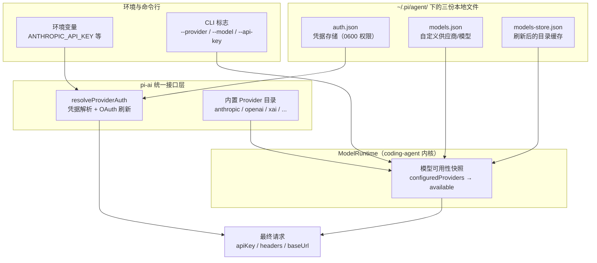
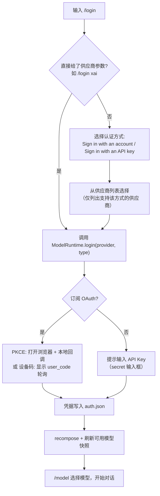
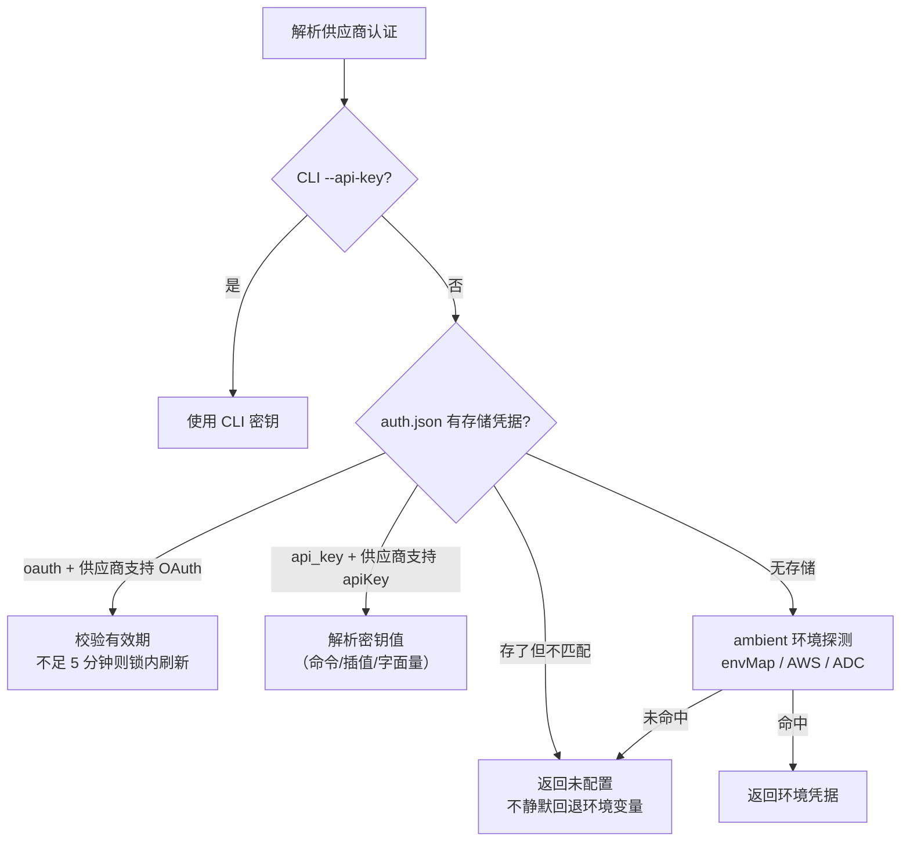

pi 是一个"模型无关"的终端编码智能体：它不内置任何账号体系，而是通过**统一的认证层**接入各家模型供应商。你可以用**订阅登录**（Claude Pro/Max、ChatGPT Plus/Pro、GitHub Copilot 等，走 OAuth），也可以用 **API Key**（环境变量、`auth.json` 文件或命令行参数）。本页面向初学者，完整讲清：pi 支持哪些接入方式、凭据存在哪里、多个凭据来源之间如何取舍优先级、以及如何用 `models.json` 添加自定义供应商。读完本页，你应当能独立完成从零到第一次成功调用模型的全过程。

## 先看全局：供应商、凭据与模型目录如何协作

在动手之前，先建立一个架构心智模型。pi 中"供应商"由三层信息构成：**模型目录**（有哪些模型、上下文窗口多大、价格几何）、**认证方式**（`apiKey` 或 `oauth` 二者至少其一）、**API 实现**（openai-completions、anthropic-messages 等）。认证层被设计为"凭据盲"（credential-blind）——`models.json` 的解析只关心模型定义，不掺和密钥；真正的凭据解析发生在独立的 CredentialStore 与 pi-ai 的 `Models` 集合中。



三份本地文件各司其职，初学者最容易混淆，先用表格锚定：

| 文件 | 作用 | 谁来写入 |
|------|------|----------|
| `auth.json` | 每个供应商一条凭据（API Key 或 OAuth 令牌），`0600` 权限 | `/login`、`/logout`、你手动编辑 |
| `models.json` | 自定义供应商与模型、内置供应商覆盖（baseUrl/headers/compat 等） | 你手动编辑，打开 `/model` 时重新加载 |
| `models-store.json` | 已配置供应商刷新到的较新模型目录的离线缓存 | pi 自动维护 |

Sources: [providers.md](packages/coding-agent/docs/providers.md#L1-L13), [config.ts](packages/coding-agent/src/config.ts#L527-L548), [model-config.ts](packages/coding-agent/src/core/model-config.ts#L1-L10), [models-store.ts](packages/coding-agent/src/core/models-store.ts#L41-L47)

## 两种接入方式速览

| 维度 | 订阅登录 | API Key |
|------|----------|---------|
| 入口 | 交互模式内 `/login` → 选择供应商 → "Sign in with an account" | 环境变量、`/login` 存入 `auth.json`、或 CLI `--api-key` |
| 凭据形态 | OAuth 令牌（access/refresh，自动刷新） | 静态密钥字符串 |
| 覆盖供应商 | Claude Pro/Max、ChatGPT Plus/Pro、GitHub Copilot、xAI、OpenRouter、Radius 等 | Anthropic、OpenAI、DeepSeek、Gemini、Groq、Bedrock、Vertex 等全部内置供应商 |
| 存储位置 | `~/.pi/agent/auth.json` | `auth.json` 或进程环境变量 |
| 适合谁 | 已有订阅、不想管密钥的个人用户 | CI/脚本、企业网关、按量计费用户 |

Sources: [providers.md](packages/coding-agent/docs/providers.md#L15-L26), [quickstart.md](packages/coding-agent/docs/quickstart.md#L36-L50)

## 方式一：订阅登录（/login，OAuth）

### 支持的订阅供应商

在交互模式输入 `/login`，pi 会先让你选择认证方式（订阅或 API Key），再列出对应供应商。内置的**订阅登录**目标包括：

- **ChatGPT Plus/Pro（openai-codex）**：需要 ChatGPT 订阅，OpenAI 官方认可的开源接入方式
- **Claude Pro/Max（anthropic）**：第三方工具的用量从 "extra usage" 中按 token 计费，不占用 Claude 套餐内额度
- **GitHub Copilot**：回车选 github.com，也可输入 GitHub Enterprise Server 域名
- **xAI（Grok/X 订阅）**：`/login xai` 后选择 "Use a subscription"
- **OpenRouter**：授权后生成一把由你控制的 API Key（不自动过期），费用从 OpenRouter 余额扣除
- **Radius**：动态 `pi-messages` 网关，令牌存入 `auth.json`，网关目录独立刷新并缓存

Sources: [providers.md](packages/coding-agent/docs/providers.md#L15-L56)

各供应商底层使用两种标准 OAuth 流程，初学者只需知道它们的差别在于"要不要开浏览器"：

| 供应商 | OAuth 流程 | 浏览器角色 |
|--------|-----------|-----------|
| Claude Pro/Max | PKCE + 本地回环回调服务器 | 打开浏览器完成授权，回调落在 `127.0.0.1:53692` |
| ChatGPT Plus/Pro (Codex) | PKCE 优先，支持设备码回退 | 同上，本地回调端口 1455 |
| GitHub Copilot | RFC 8628 设备码 | 输入设备码即可，无需本地回调 |
| xAI | RFC 8628 设备码 | 同上 |
| Kimi Code | RFC 8628 设备码 | 同上 |
| OpenRouter | PKCE | 打开浏览器；远程机器粘贴重定向 URL |

Sources: [oauth/anthropic.ts](packages/ai/src/auth/oauth/anthropic.ts#L29-L37), [oauth/openai-codex.ts](packages/ai/src/auth/oauth/openai-codex.ts#L28-L37), [oauth/xai.ts](packages/ai/src/auth/oauth/xai.ts#L2-L10), [oauth/kimi-coding.ts](packages/ai/src/auth/oauth/kimi-coding.ts#L4-L12), [oauth/github-copilot.ts](packages/ai/src/auth/oauth/github-copilot.ts#L206-L226)

### /login 的完整旅程



源码层面的几个关键锚点：`/login` 命令处理会先按认证类型分类（OAuth 还是 API Key），只有一种可选时直接跳转；登录成功后由 `ModelRuntime` 序列化执行——先调用 pi-ai 的 `models.login`，再 `synchronizeCredentialState` 重建供应商组合并刷新可用模型。整个过程用每供应商一把的异步队列排队，避免并发登录/登出互相踩踏。

Sources: [interactive-mode.ts](packages/coding-agent/src/modes/interactive/interactive-mode.ts#L5480-L5568), [model-runtime.ts](packages/coding-agent/src/core/model-runtime.ts#L676-L698), [slash-commands.ts](packages/coding-agent/src/core/slash-commands.ts#L36)

### OAuth 凭据的存储与自动刷新

`/login` 拿到的令牌以一条 `type: "oauth"` 凭据写入 `~/.pi/agent/auth.json`，文件以 `0600` 权限创建（仅当前用户可读写），所有写入都经过文件锁串行化。刷新机制值得注意：解析请求认证时，若令牌剩余有效期不足五分钟，pi 会在**存储锁内**做"双重检查"——先乐观判断过期，再在 `modify` 回调里重新确认（防止另一进程刚刷新完），刷新成功后先落盘再释放锁，保证多进程/多请求不会重复刷新已轮换的令牌。

Sources: [auth-storage.ts](packages/coding-agent/src/core/auth-storage.ts#L33-L34), [resolve.ts](packages/ai/src/auth/resolve.ts#L113-L152), [types.ts](packages/ai/src/auth/types.ts#L65-L105)

### 无头/远程机器怎么办

通过 SSH 使用远程机器时，浏览器无法访问本机回环回调。pi 为此内置了 `manual_code` 兜底：授权页面会同时提示"如果浏览器在另一台机器上，把最终重定向 URL 粘贴到这里"，登录对话框一边等本地回调，一边等你手动粘贴授权码/重定向 URL，谁先到用谁。OpenRouter 的文档也明确建议这种用法。

Sources: [oauth/anthropic.ts](packages/ai/src/auth/oauth/anthropic.ts#L255-L290), [providers.md](packages/coding-agent/docs/providers.md#L47-L52)

### /logout 只清登录凭据

`/logout` 会列出 `auth.json` 中已存储的凭据供你移除；它**只删除 `/login` 写入的凭据**，环境变量和 `models.json` 中的配置不受影响——这对"临时换号但保留 CI 密钥"的场景很重要。

Sources: [interactive-mode.ts](packages/coding-agent/src/modes/interactive/interactive-mode.ts#L5613-L5671)

## 方式二：API Key（环境变量、auth.json 与命令行）

### 环境变量：最省事的方式

启动前导出环境变量即可，pi 会自动发现并显示为可用模型：

```bash
export ANTHROPIC_API_KEY=sk-ant-...
pi
```

常用供应商的环境变量与 `auth.json` 键名对照（完整清单见仓库内 providers 文档，约 40 个供应商）：

| 供应商 | 环境变量 | `auth.json` 键 |
|--------|----------|----------------|
| Anthropic | `ANTHROPIC_API_KEY` | `anthropic` |
| OpenAI | `OPENAI_API_KEY` | `openai` |
| Google Gemini | `GEMINI_API_KEY` | `google` |
| DeepSeek | `DEEPSEEK_API_KEY` | `deepseek` |
| xAI | `XAI_API_KEY` | `xai` |
| OpenRouter | `OPENROUTER_API_KEY` | `openrouter` |
| Amazon Bedrock | `AWS_BEARER_TOKEN_BEDROCK` | `amazon-bedrock` |
| Kimi For Coding | `KIMI_API_KEY` | `kimi-coding` |

环境变量映射的唯一权威来源是 pi-ai 中的 `envMap` 表；Anthropic 是特例——除 API Key 外还识别 `ANTHROPIC_AUTH_TOKEN`（以 `Authorization: Bearer` 头发送）和 `ANTHROPIC_OAUTH_TOKEN`，且请求时必须跳过 AUTH_TOKEN 不当作 apiKey 使用。

Sources: [providers.md](packages/coding-agent/docs/providers.md#L58-L107), [env-api-keys.ts](packages/ai/src/env-api-keys.ts#L68-L120), [env-api-keys.ts](packages/ai/src/env-api-keys.ts#L139-L151), [providers/anthropic.ts](packages/ai/src/providers/anthropic.ts#L19-L46)

### ambient 凭据：Bedrock 与 Vertex 不需要"密钥字符串"

Amazon Bedrock 支持整套 AWS 环境（`AWS_PROFILE`、IAM 密钥对、Bearer Token、ECS 任务角色、IRSA），任一存在即视为已认证；Google Vertex 走 Application Default Credentials（`gcloud auth application-default login` + 项目/区域环境变量）。这类"环境型"供应商在环境变量表中显示为 `<authenticated>` 占位而非真实密钥。

Sources: [env-api-keys.ts](packages/ai/src/env-api-keys.ts#L153-L188), [providers.md](packages/coding-agent/docs/providers.md#L205-L224), [providers.md](packages/coding-agent/docs/providers.md#L286-L296)

### auth.json：持久化你的密钥

不想每次 export，就用 `/login` 选 API Key 方式存一次，或直接手写 `~/.pi/agent/auth.json`：

```json
{
  "anthropic": { "type": "api_key", "key": "sk-ant-..." },
  "openai": { "type": "api_key", "key": "sk-..." },
  "google": { "type": "api_key", "key": "..." }
}
```

三条铁律：**auth.json 里的凭据优先于环境变量**；文件以 `0600` 权限创建；每个供应商只存一条凭据（键名即供应商 id）。解析时若发现 `type`/`key`/`env` 字段不符合规范会直接报错拒绝加载，而不是静默忽略。

Sources: [providers.md](packages/coding-agent/docs/providers.md#L109-L139), [auth-storage.ts](packages/coding-agent/src/core/auth-storage.ts#L203-L267)

### 密钥值不只是字符串：命令、环境插值与字面量

`auth.json` 与 `models.json` 中所有密钥/头字段都支持三种"值解析"语法，这是 pi 凭据体系最实用的特性：

| 语法 | 行为 | 示例 |
|------|------|------|
| `!command` 开头 | 执行整条 shell 命令取 stdout（进程内缓存，超时 10 秒） | `"key": "!security find-generic-password -ws 'anthropic'"` |
| `$VAR` / `${VAR}` | 环境变量插值，可嵌入更大字面量 | `"key": "${KEY_PREFIX}_${KEY_SUFFIX}"` |
| `$$` / `$!` | 转义为字面量 `"$"` / `"!"` | `"key": "$$literal-dollar-prefix"` |
| 其他 | 原样字面量 | `"key": "sk-ant-..."` |

注意两个易踩的坑：`$FOO_BAR` 解析为变量 `FOO_BAR`，若想把 `BAR` 当字面量要写 `${FOO}_BAR`；`models.json` 中命令**在请求时**执行且 pi 不做 TTL/缓存兜底，慢命令请自行包一层带缓存的脚本。

Sources: [providers.md](packages/coding-agent/docs/providers.md#L159-L190), [resolve-config-value.ts](packages/coding-agent/src/core/resolve-config-value.ts#L138-L183)

### 供应商级环境覆盖

API Key 凭据还可以携带一个 `env` 对象，作为"该供应商专属"的环境值，解析顺序优先于进程环境变量。典型场景是让 pi 用与 shell 不同的 Cloudflare 账户/网关配置：

```json
{
  "cloudflare-ai-gateway": {
    "type": "api_key",
    "key": "$CLOUDFLARE_API_KEY",
    "env": {
      "CLOUDFLARE_ACCOUNT_ID": "account-id",
      "CLOUDFLARE_GATEWAY_ID": "gateway-id"
    }
  }
}
```

Sources: [providers.md](packages/coding-agent/docs/providers.md#L141-L157), [types.ts](packages/ai/src/auth/types.ts#L13-L17)

### CLI 一把梭：--provider / --model / --api-key

```bash
pi --provider openai --model gpt-4o-mini "帮我重构这段代码"
pi --model openai/gpt-4o "..."          # provider/id 形式可省略 --provider
pi --model sonnet:high "..."            # :后缀直接指定思考等级
pi --api-key sk-... --model claude-sonnet-4  # 临时密钥，不落盘
```

`--api-key` 注入的是**运行时凭据覆盖**：它叠加在 CredentialStore 之上，读凭据时优先返回覆盖值，但不写入 `auth.json`，进程结束即消失——适合脚本与一次性会话。

Sources: [args.ts](packages/coding-agent/src/cli/args.ts#L104-L109), [runtime-credentials.ts](packages/coding-agent/src/core/runtime-credentials.ts#L1-L53), [args.ts](packages/coding-agent/src/cli/args.ts#L356-L372)

## 凭据解析顺序：pi 如何决定用哪个凭据

把前面的内容串起来，pi 解析某供应商凭据时的完整决策链如下：



官方文档将顺序概括为四层：① CLI `--api-key`；② `auth.json` 条目（API Key 或 OAuth 令牌）；③ 环境变量；④ `models.json` 自定义密钥。实现上有一条重要的设计约束：**存储的凭据"拥有"该供应商**——一旦 `auth.json` 有条目，环境变量只在条目缺失或类型不匹配时才被考虑，失败的 OAuth 刷新之后也不会静默回退到环境变量。这避免了"以为在用订阅、实际在用旧密钥"的隐性错配。

另外，`models.json` 供应商配置里的 `apiKey` 字段与 `auth.json` 是并列的凭据来源（source 标记为 `models_json_key`/`models_json_command`），但文档建议：若凭据已由 `/login`/`auth.json`/CLI 提供，配置中就省略 `apiKey`。

Sources: [providers.md](packages/coding-agent/docs/providers.md#L310-L318), [resolve.ts](packages/ai/src/auth/resolve.ts#L62-L107), [provider-composer.ts](packages/coding-agent/src/core/provider-composer.ts#L73-L77), [models.md](packages/coding-agent/docs/models.md#L132-L150)

## 模型何时可见：/model、--list-models 与已认证快照

pi 的模型选择器不会列出所有内置模型，而是只展示**所属供应商已配置认证**的模型。实现上，`ModelRuntime` 会为每个供应商做一次无副作用的 `checkAuth`，得到 `configuredProviders` 集合，再从全量模型中过滤出 `available` 快照；`/model` 打开时、登录/登出后都会刷新这个快照。所以如果你在 `/model` 里找不到某家模型，第一反应应该是"这个供应商的凭据还没配"，而不是模型不存在。

未配置任何模型/凭据时，pi 的报错信息会直接引导你：提示中包含"用 `/login` 登录供应商，详见 providers.md 与 models.md"，然后 `/model` 选模型。

Sources: [model-runtime.ts](packages/coding-agent/src/core/model-runtime.ts#L276-L314), [model-runtime.ts](packages/coding-agent/src/core/model-runtime.ts#L466-L468), [auth-guidance.ts](packages/coding-agent/src/core/auth-guidance.ts#L1-L26)

## 用 models.json 添加自定义供应商与模型

Ollama、LM Studio、vLLM 或任何兼容 OpenAI/Anthropic/Google API 的代理，都可以通过 `~/.pi/agent/models.json` 接入（支持 JSONC 注释）。最小配置只需每模型一个 `id`：

```json
{
  "providers": {
    "ollama": {
      "baseUrl": "http://localhost:11434/v1",
      "api": "openai-completions",
      "apiKey": "ollama",
      "models": [
        { "id": "llama3.1:8b" },
        { "id": "qwen2.5-coder:7b" }
      ]
    }
  }
}
```

`apiKey` 填占位符即可（Ollama 会忽略它），但**不能省**——pi 要求模型先有认证才出现在 `/model` 里，无密钥本地服务器请保留哑值、用 `/login` 存一把、或选模型时传 `--api-key`。

Sources: [models.md](packages/coding-agent/docs/models.md#L1-L31), [model-config.ts](packages/coding-agent/src/core/model-config.ts#L267-L267)

`api` 字段决定走哪条协议实现，可在供应商级统一设置、也可按模型覆盖：

| API 值 | 说明 |
|--------|------|
| `openai-completions` | OpenAI Chat Completions（兼容性最好） |
| `openai-responses` | OpenAI Responses API |
| `anthropic-messages` | Anthropic Messages API |
| `google-generative-ai` | Google Generative AI（自定义 baseUrl 必填） |

Sources: [models.md](packages/coding-agent/docs/models.md#L121-L128)

供应商级完整字段如下（schema 即文档，由 TypeBox 校验，写错会精确报错到路径）：

| 字段 | 作用 |
|------|------|
| `baseUrl` | API 端点 |
| `api` | 协议类型（上表） |
| `apiKey` | 密钥配置（支持值解析语法；已用 `/login`/auth.json/CLI 时可省略） |
| `oauth` | 动态 OAuth 类型，目前支持 `"radius"`（需网关 baseUrl） |
| `headers` | 自定义请求头（同样支持值解析） |
| `authHeader` | `true` 时自动附加 `Authorization: Bearer <apiKey>` |
| `models` | 模型定义数组（id/name/reasoning/input/contextWindow/maxTokens/cost/compat 等） |
| `modelOverrides` | 对内置或扩展注册模型的按模型覆盖 |

Sources: [model-config.ts](packages/coding-agent/src/core/model-config.ts#L199-L214), [models.md](packages/coding-agent/docs/models.md#L132-L150)

### 覆盖内置供应商：改走代理而无需重写模型

只想把 Anthropic 流量导向公司代理？用同名键覆盖 `baseUrl` 即可，全部内置模型与既有认证原样保留：

```json
{
  "providers": {
    "anthropic": { "baseUrl": "https://my-proxy.example.com/v1" }
  }
}
```

合并语义：内置模型保留；自定义模型按 `id` **upsert**——`id` 相同则替换内置模型，`id` 是新的则并入列表。若只想微调个别内置模型（如改上下文窗口、加路由约束），用 `modelOverrides` 更轻量，无需重写整个模型数组。

Sources: [models.md](packages/coding-agent/docs/models.md#L302-L337), [models.md](packages/coding-agent/docs/models.md#L339-L387)

## pi auth 命令行：在 pi 之外取用凭据

pi 提供三个子命令，让你在外部脚本、编辑器插件或其他客户端中复用 pi 管理的凭据：

| 命令 | 用途 |
|------|------|
| `pi auth check --provider <p> [--json] [--credentials] [--no-refresh]` | 检查供应商就绪状态（ready/not_ready/invalid），默认会刷新过期 OAuth |
| `pi auth print-api-key --provider <p> [--model <m>]` | 打印解析后的 API Key |
| `pi auth print-bearer-token --provider <p> [--min-expiry 30m]` | 打印 Bearer 令牌（如 Codex OAuth），可要求最短剩余有效期 |

`--min-expiry` 支持 `ms/s/m/h` 单位；`check` 模式下 `--credentials` 会把凭据一并输出到 JSON。注意：OAuth 刷新若返回的有效期仍不满足显式要求，会直接抛错而非返回短命令牌。

Sources: [auth-command.ts](packages/coding-agent/src/cli/auth-command.ts#L19-L27), [auth-command.ts](packages/coding-agent/src/cli/auth-command.ts#L76-L104), [auth-check.ts](packages/coding-agent/src/cli/auth-check.ts#L22-L53), [resolve.ts](packages/ai/src/auth/resolve.ts#L141-L145)

## 常见问题排查

| 症状 | 原因 | 解法 |
|------|------|------|
| `/model` 里找不到某供应商的模型 | 该供应商未配置任何凭据 | `/login` 存凭据，或 export 环境变量，或 `--api-key` |
| 提示 "No API key found for ..." | 解析链全部未命中 | 按 CLI → auth.json → 环境变量顺序逐层检查 |
| 本地 Ollama 模型不出现 | 无认证不进选择器 | `apiKey` 保留哑值 + `/login` 存一把，或 `--api-key` |
| SSH 远程机上 OAuth 卡住 | 浏览器无法访问回环回调 | 粘贴最终重定向 URL 或授权码到 `manual_code` 提示 |
| Copilot 报 "model not supported" | 模型未在 VS Code 侧启用 | Copilot Chat 模型选择器中启用该模型 |
| `models.json` 校验失败 | 字段不符合 schema | 按报错路径修正（TypeBox 精确定位） |
| 命令密钥太慢/失败 | `!command` 请求时执行且无缓存 | 自行包一层带 TTL 的脚本 |

Sources: [auth-guidance.ts](packages/coding-agent/src/core/auth-guidance.ts#L10-L26), [models.md](packages/coding-agent/docs/models.md#L33-L47), [providers.md](packages/coding-agent/docs/providers.md#L37-L52), [resolve-config-value.ts](packages/coding-agent/src/core/resolve-config-value.ts#L138-L151)

## 小结与下一步

接入一张新模型只需三步：**选认证方式**（订阅 `/login` 或 API Key）→ **确认凭据落点**（auth.json 优先于环境变量）→ **`/model` 验证可见性**。自定义供应商统一收敛到 `models.json`，密钥语法（`!cmd`/`$ENV`/字面量）在 auth.json 与 models.json 间完全一致。掌握这三张表（订阅清单、环境变量表、值解析语法）后，绝大多数接入场景都能对号入座。

建议的后续阅读路径：

- 想了解统一接口层如何抹平各家 API 差异与跨模型切换：[pi-ai：统一多供应商 API 与跨模型切换](10-pi-ai-tong-duo-gong-ying-shang-api-yu-kua-mo-xing-qie-huan)
- 想深挖 OAuth 刷新锁、CredentialStore 契约与凭据存储实现：[认证解析、OAuth 与凭据存储](12-ren-zheng-jie-xi-oauth-yu-ping-ju-cun-chu)
- 想知道模型目录从哪来、如何自动刷新：[模型目录：生成脚本与自动刷新机制](13-mo-xing-mu-lu-sheng-cheng-jiao-ben-yu-zi-dong-shua-xin-ji-zhi)
- 接好模型后学习交互操作：[交互模式使用指南：编辑器、命令与快捷键](4-jiao-hu-mo-shi-shi-yong-zhi-nan-bian-ji-qi-ming-ling-yu-kuai-jie-jian)
- 若尚未安装，先回到：[快速上手：安装、认证与首次运行](2-kuai-su-shang-shou-an-zhuang-ren-zheng-yu-shou-ci-yun-xing)