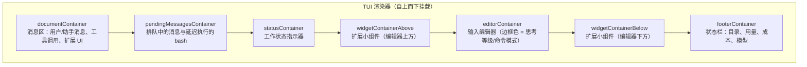
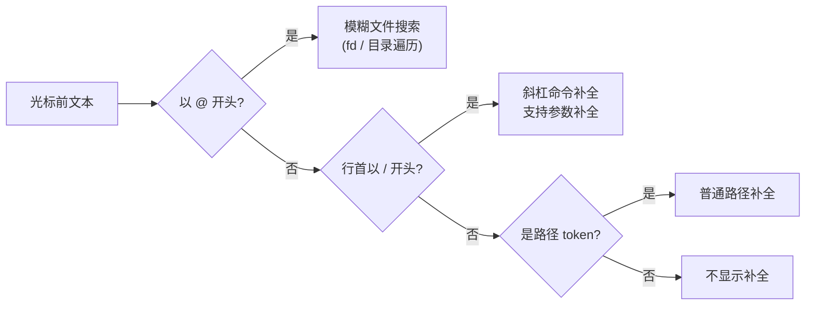
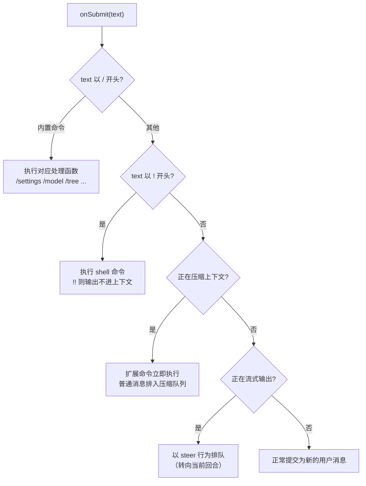
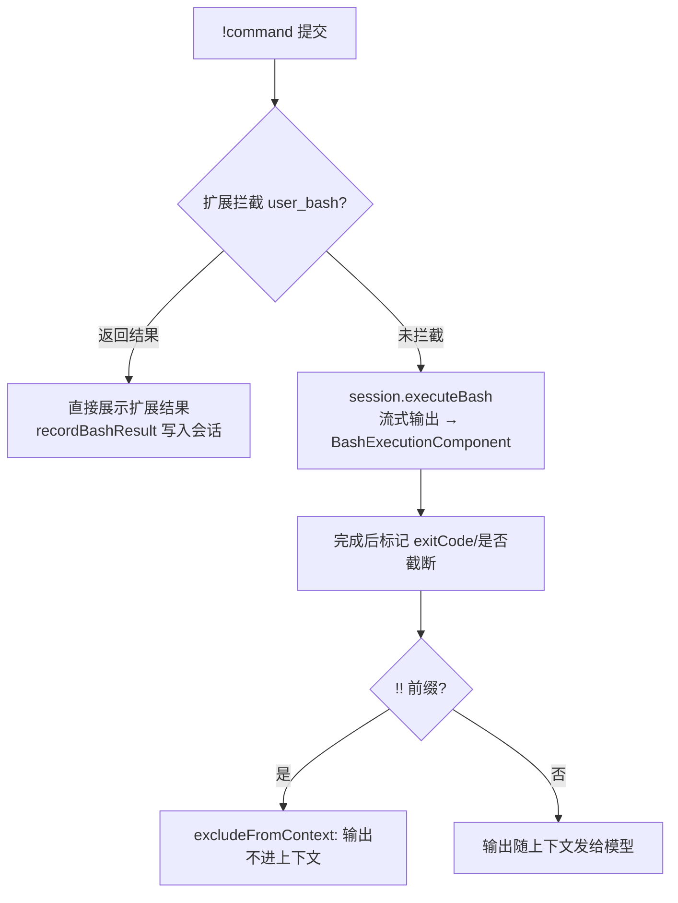
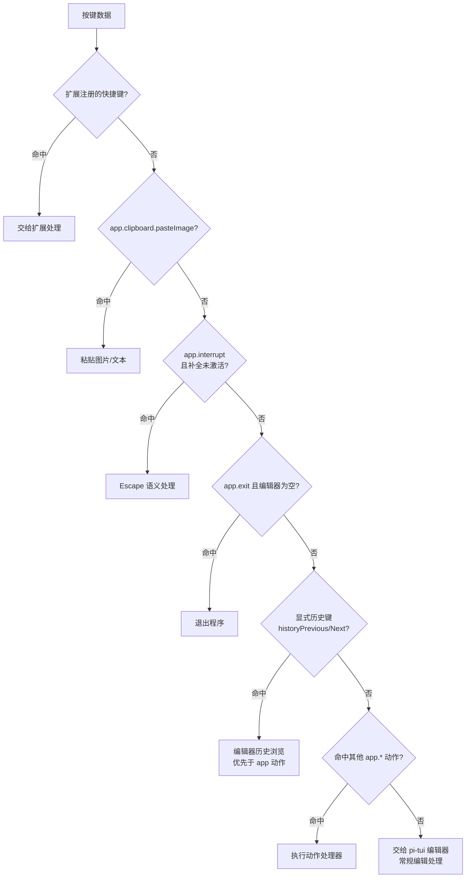

当你在终端直接运行 `pi` 时，就进入了**交互模式**——这是 pi 最主要的日常使用方式。与 `-p` 打印模式"发一条、答一条、退出"不同，交互模式提供了一个常驻终端的完整界面：一个支持补全与历史记录的输入编辑器、一组以 `/` 触发的斜杠命令、一套可深度自定义的快捷键体系，以及消息队列、外部编辑器、图片粘贴等提升效率的细节能力。

本页面向初次接触 pi 的开发者，聚焦三件事：**编辑器怎么用、有哪些命令、快捷键如何工作**。所有描述均直接来自仓库源码与官方文档，并给出精确的代码出处，供你按图索骥深入源码。

Sources: [interactive-mode.ts](packages/coding-agent/src/modes/interactive/interactive-mode.ts#L1-L4)
Sources: [usage.md](packages/coding-agent/docs/usage.md#L5-L16)

## 界面布局：从上到下的组件栈

交互模式的界面由 `InteractiveMode` 类组装，核心逻辑在 `packages/coding-agent/src/modes/interactive/interactive-mode.ts` 中，它负责 TUI 渲染与用户交互，而业务逻辑全部委托给 `AgentSession`。界面分为四个主要区域：**启动头部**（快捷键提示、已加载的上下文文件、提示模板、技能与扩展）、**消息区**（用户消息、助手回复、工具调用与结果、通知、错误和扩展 UI）、**编辑器**（你打字的地方）、**底部状态栏**（工作目录、会话名、token/缓存用量、花费与当前模型）。

组件按固定顺序挂载到渲染器上，这个顺序决定了屏幕上从上到下的视觉层级：消息区在上，排队消息、状态指示器与扩展小组件夹在中间，编辑器与状态栏固定在底部。



编辑器在界面上不仅是一个文本框：它带有边框，**边框颜色直接映射当前思考等级**（off/minimal/low/medium/high/xhigh/max 各有专属颜色），而当你输入以 `!` 开头的内容时，边框会切换为"bash 模式"专属颜色——颜色本身就是一种状态反馈。底部状态栏则由 `FooterComponent` 持续渲染：左侧是 token 用量（输入 `↑`、输出 `↓`、缓存读 `R`、缓存写 `W`、缓存命中率 `CH%`）、花费与上下文占用百分比（超过 70% 变警告色、超过 90% 变错误色），右侧是当前模型名与思考等级，多供应商环境下还会标注 `(provider)`。

Sources: [interactive-mode.ts](packages/coding-agent/src/modes/interactive/interactive-mode.ts#L890-L908)
Sources: [usage.md](packages/coding-agent/docs/usage.md#L9-L16)
Sources: [theme.ts](packages/coding-agent/src/modes/interactive/theme/theme.ts#L371-L394)
Sources: [footer.ts](packages/coding-agent/src/modes/interactive/components/footer.ts#L112-L246)

## 编辑器：输入效率的全部细节

编辑器由 `CustomEditor` 实现（继承自 pi-tui 的 `Editor`），它在通用编辑器之上叠加了 coding-agent 专属的快捷键路由。下表汇总了官方文档列出的编辑器功能及其触发方式：

| 功能 | 操作方式 |
|------|---------|
| 文件引用 | 输入 `@` 模糊搜索项目文件 |
| 路径补全 | 按 `Tab` 补全路径 |
| 多行输入 | `Shift+Enter`（Windows Terminal 下为 `Ctrl+Enter`），默认还绑定了 `ctrl+j` |
| 复制回复 | `Ctrl+X`：`/tree` 中复制选中消息；否则复制最后一条助手消息 |
| 图片 | `Ctrl+V` 粘贴（Windows 下 `Alt+V`），或将文件拖入终端 |
| Shell 命令 | `!command` 执行并把输出发给模型 |
| 隐藏 Shell 命令 | `!!command` 执行但**不**把输出发给模型 |
| 外部编辑器 | `Ctrl+G` 打开 `externalEditor`/`$VISUAL`/`$EDITOR` 配置的编辑器 |

Sources: [usage.md](packages/coding-agent/docs/usage.md#L18-L31)
Sources: [custom-editor.ts](packages/coding-agent/src/modes/interactive/components/custom-editor.ts#L1-L40)

**`@` 文件引用与 Tab 补全**由 `CombinedAutocompleteProvider` 统一调度。它会依次判断：当前 token 是否以 `@` 开头（含 `@"` 带引号形式，用于路径含空格的场景）→ 触发模糊文件搜索（优先使用 `fd` 工具加速）；当前行是否以 `/` 开头 → 触发命令补全；其余情况 → 触发普通路径补全。补全确认时还有巧妙的细节：目录补全后不追加空格，方便你继续向下补全子路径；含空格的路径会自动加引号包裹。



Sources: [autocomplete.ts](packages/tui/src/autocomplete.ts#L277-L465)
Sources: [autocomplete.ts](packages/tui/src/autocomplete.ts#L86-L117)

**编辑器的提交逻辑**（按下 `Enter` 后发生什么）是一个清晰的决策链，理解它能帮你预测 pi 的行为：



Sources: [interactive-mode.ts](packages/coding-agent/src/modes/interactive/interactive-mode.ts#L2964-L3157)

**外部编辑器**的实现在 `external-editor.ts`：pi 把当前草稿写入临时目录中的 `prompt.md`，用 `spawn` 启动你配置的编辑器并等待其退出（继承标准输入输出，支持 vim/nano 等全屏编辑器），然后读回内容、去除 BOM 与末尾换行。编辑器的选择顺序是：设置项 `externalEditor` → `$VISUAL` → `$EDITOR` → Windows 上用 Notepad，其他平台用 `nano`。

Sources: [external-editor.ts](packages/coding-agent/src/modes/interactive/external-editor.ts#L1-L47)
Sources: [usage.md](packages/coding-agent/docs/usage.md#L29-L30)

**图片粘贴**通过 `readClipboardImage` 检测系统剪贴板中的图像数据：若有图像，pi 将其写入临时文件（如 `pi-clipboard-<uuid>.png`）并在光标处插入该文件路径，随后按消息中的 `@路径` 规则作为附件发送；若无图像则回退为粘贴纯文本。

Sources: [interactive-mode.ts](packages/coding-agent/src/modes/interactive/interactive-mode.ts#L2934-L2957)

## 斜杠命令：以 `/` 开头的完整指令体系

在编辑器中输入 `/` 即可打开命令补全。命令分为三个来源：**内置命令**、**扩展注册的命令**（`pi.registerCommand`）、以及**技能**（以 `/skill:名称` 形式出现）。提示模板（prompt templates）也会出现在补全列表中，输入 `/模板名 参数` 时模板内容会展开后发送。

补全列表的组装逻辑在 `createBaseAutocompleteProvider` 中：先收集内置斜杠命令，再合并扩展命令（过滤掉与内置重名的），最后把技能以 `skill:name` 命名追加，全部交给 `CombinedAutocompleteProvider`。

| 命令 | 作用 |
|------|------|
| `/login <provider>`、`/logout` | 管理供应商 OAuth / API Key 凭据 |
| `/model` | 切换模型；选择器内按 `Ctrl+S` 保存启动默认 |
| `/thinking <level>` | 切换思考等级；选择器内按 `Ctrl+S` 保存启动默认 |
| `/scoped-models` | 启用/禁用参与 `Ctrl+P` 轮换的模型集合 |
| `/settings` | 主题、消息投递、传输等偏好设置 |
| `/resume`、`/new` | 选择恢复历史会话 / 开启新会话 |
| `/name <name>` | 设置会话显示名称 |
| `/session` | 显示会话文件、ID、消息数、token 与花费 |
| `/tree` | 跳转到会话树中的任意位置并从那里继续 |
| `/fork` | 从某条历史用户消息派生新会话 |
| `/clone` | 把当前活动分支复制为新会话 |
| `/compact [prompt]` | 手动压缩上下文，可附加自定义指令 |
| `/copy` | 复制最后一条助手消息到剪贴板 |
| `/export [file]`、`/import <file>` | 导出 HTML/JSONL / 从 JSONL 导入恢复 |
| `/share` | 上传为私有 GitHub gist 并生成分享链接 |
| `/trust` | 保存项目信任决策供后续会话使用 |
| `/reload` | 不重启就重新加载键位、扩展、技能、模板、主题与上下文文件 |
| `/hotkeys` | 在会话中显示全部快捷键 |
| `/changelog`、`/quit` | 版本历史 / 退出 pi |

Sources: [usage.md](packages/coding-agent/docs/usage.md#L33-L61)
Sources: [slash-commands.ts](packages/coding-agent/src/core/slash-commands.ts#L18-L44)
Sources: [interactive-mode.ts](packages/coding-agent/src/modes/interactive/interactive-mode.ts#L700-L731)

需要注意命令处理的优先级：`/settings`、`/model`、`/thinking` 等**交互模式内置命令**在编辑器的 `onSubmit` 里被逐字面量匹配并直接处理；未被内置分支接住的 `/xxx` 请求会进入 `AgentSession.prompt()`，在那里先尝试扩展命令（立即执行，扩展自己管理 LLM 调用），再展开技能命令与提示模板，最后作为普通提示词发送。

Sources: [interactive-mode.ts](packages/coding-agent/src/modes/interactive/interactive-mode.ts#L2969-L3103)
Sources: [agent-session.ts](packages/coding-agent/src/core/agent-session.ts#L1159-L1223)

## Shell 命令透传：`!` 与 `!!`

`!` 前缀让编辑器进入"bash 模式"（边框变色作为提示，逻辑在 `onChange` 回调中检测文本是否以 `!` 开头）。提交时，`!!` 前缀会被识别为 `excludeFromContext = true`——命令仍然执行、输出仍然显示在界面上，但不会写入会话上下文，因此不消耗模型的注意力。

执行流程中有一个扩展拦截点：pi 先向扩展系统发出 `user_bash` 事件，任何扩展都可以拦截这次命令并返回自定义结果；若没有扩展接手，命令交给 `session.executeBash` 执行，输出以流式回调实时渲染到 `BashExecutionComponent`。若模型正在流式输出中，bash 组件会先挂在"待发消息区"，等回合结束后再移入消息区。同一时刻只允许一条 bash 命令运行，重复提交会得到警告，可按 `Esc` 取消当前命令。



Sources: [interactive-mode.ts](packages/coding-agent/src/modes/interactive/interactive-mode.ts#L2905-L2911)
Sources: [interactive-mode.ts](packages/coding-agent/src/modes/interactive/interactive-mode.ts#L3105-L3121)
Sources: [interactive-mode.ts](packages/coding-agent/src/modes/interactive/interactive-mode.ts#L6476-L6560)

## 消息队列：Agent 工作时也能输入

这是交互模式最"顺手"的设计之一：**模型正在工作时你不需要等待**。直接按 `Enter` 会把输入作为**转向消息**排队——它会在当前助手回合执行完工具调用后立即插入对话，用于中途纠偏（"顺便把那个文件也改了"）。按 `Alt+Enter` 则是**追发消息**，会等智能体完成全部工作后才投递，适合安排下一阶段任务。

| 操作 | 队列行为 | 何时投递 | 典型用途 |
|------|---------|---------|---------|
| `Enter` | 转向 | 当前回合的工具调用执行完毕后 | 中途修正方向 |
| `Alt+Enter` | 追发 | 智能体完成所有工作后 | 预约下一个任务 |
| `Alt+Up` | 取回 | 立即把已排队消息还原到编辑器 | 反悔了，想改措辞 |
| `Esc` | 取消 | 中断流式输出，已排队消息还原到编辑器 | 紧急刹车 |

底层对应 `AgentSession.prompt()` 的 `streamingBehavior` 选项：`"steer"` 走 `_queueSteer`，`"followUp"` 走 `_queueFollowUp`；正在压缩上下文时，普通消息也会被挂起到压缩完成之后，而扩展命令依旧立即执行。`steeringMode` 与 `followUpMode` 的投递细节可在 `/settings` 中调整。

Sources: [usage.md](packages/coding-agent/docs/usage.md#L63-L74)
Sources: [agent-session.ts](packages/coding-agent/src/core/agent-session.ts#L1209-L1223)
Sources: [interactive-mode.ts](packages/coding-agent/src/modes/interactive/interactive-mode.ts#L3123-L3144)
Sources: [interactive-mode.ts](packages/coding-agent/src/modes/interactive/interactive-mode.ts#L4126-L4164)

## Escape 键的多重职责

`Escape`（绑定 id `app.interrupt`）是交互模式中"语义最多"的一个键，按当前状态依次判断：

1. **流式输出中**：中断智能体，并把所有已排队消息还原到编辑器（`restoreQueuedMessagesToEditor({ abort: true })`），不丢失任何你排过的队；
2. **bash 命令运行中**：取消该命令；
3. **bash 模式输入中**（边框为命令色）：清空 `!` 草稿并退出命令模式；
4. **编辑器为空时连按两次**（500ms 内）：触发 `/tree` 或 `/fork`，具体行为由设置项 `doubleEscapeAction` 控制，设为 `none` 则关闭。

Sources: [interactive-mode.ts](packages/coding-agent/src/modes/interactive/interactive-mode.ts#L2852-L2878)
Sources: [interactive-mode.ts](packages/coding-agent/src/modes/interactive/interactive-mode.ts#L4389-L4389)

## 快捷键体系：`tui.*` 与 `app.*` 双命名空间

pi 的所有快捷键都通过 **KeybindingsManager** 管理，默认定义合并自两个来源：pi-tui 框架的 `TUI_KEYBINDINGS`（编辑器光标移动、删除、kill ring 等 `tui.*` 前缀）与 coding-agent 追加的应用级动作（`app.*` 前缀，如模型切换、消息复制、图片粘贴）。命名空间就是关注点的边界：`tui.*` 关注"文本编辑"，`app.*` 关注"应用行为"。

`CustomEditor.handleInput` 按固定顺序路由每一次按键——理解这个顺序，你就能理解"为什么我的绑定没生效"：



Sources: [keybindings.ts](packages/coding-agent/src/core/keybindings.ts#L60-L107)
Sources: [custom-editor.ts](packages/coding-agent/src/modes/interactive/components/custom-editor.ts#L115-L149)

### 常用默认快捷键速查

以下是初学者最高频的键位（完整清单可在 pi 中运行 `/hotkeys` 随时查看，它直接根据当前生效的键位配置动态生成 Markdown 表格）：

| 类别 | 按键 | 动作 |
|------|------|------|
| 导航 | `↑` `↓`（历史）、`←` `→` / `Ctrl+B` `Ctrl+F`、`Alt+←` `Alt+→` | 光标移动（方向键上下兼作提示历史浏览） |
| 导航 | `Home` / `Ctrl+A`、`End` / `Ctrl+E` | 行首 / 行尾 |
| 删除 | `Ctrl+W`、`Ctrl+U`、`Ctrl+K` | 按词删 / 删到行首 / 删到行尾 |
| 剪切环 | `Ctrl+Y`、`Alt+Y`、`Ctrl+-` | 粘贴最近删除文本 / 轮换剪切内容 / 撤销 |
| 应用 | `Esc` | 取消 / 中断 |
| 应用 | `Ctrl+C` | 清空编辑器；连按两次退出 |
| 应用 | `Ctrl+D` | 编辑器为空时退出 |
| 应用 | `Ctrl+Z` | 挂起到后台（Windows 无默认绑定） |
| 模型 | `Ctrl+P` / `Shift+Ctrl+P` | 下一个 / 上一个模型 |
| 模型 | `Ctrl+L` | 打开模型选择器 |
| 思考 | `Shift+Tab` | 循环思考等级（边框颜色随之变化） |
| 思考 | `Ctrl+T` | 折叠/展开思考块 |
| 显示 | `Ctrl+O` | 折叠/展开工具输出 |
| 消息 | `Ctrl+X`、`Alt+Enter`、`Alt+Up` | 复制 / 追发排队 / 取回排队 |
| 输入 | `Ctrl+V` | 粘贴图片或文本 |
| 输入 | `Ctrl+G` | 外部编辑器 |

Sources: [interactive-mode.ts](packages/coding-agent/src/modes/interactive/interactive-mode.ts#L911-L938)
Sources: [interactive-mode.ts](packages/coding-agent/src/modes/interactive/interactive-mode.ts#L6300-L6425)
Sources: [keybindings.md](packages/coding-agent/docs/keybindings.md#L121-L166)

### Windows 与 WSL 的差异映射

pi 内部通过 `useWindowsKeybindings()`（`win32` 平台，或 Linux 下检测到 `WSL_DISTRO_NAME`/`WSL_INTEROP` 环境变量）自动切换默认键位，避开 Windows Terminal 的保留快捷键：

| 动作 | macOS / Linux 默认 | Windows / WSL 默认 |
|------|-------------------|-------------------|
| 追发消息 | `Alt+Enter` | `Ctrl+Q` |
| 取回排队 | `Alt+Up` | `Alt+Q` |
| 粘贴图片 | `Ctrl+V` | `Alt+V` |
| 撤销 | `Ctrl+-` | `Ctrl+z`（WSL 下 `Alt+z`） |
| 模型回退 | `Shift+Ctrl+P` | `Alt+P` |
| 全屏搜索 | `Ctrl+Shift+F` | `Ctrl+F` |
| 挂起 | `Ctrl+Z` | 无（Windows 不支持 Unix 作业控制） |

Sources: [keybindings.ts](packages/coding-agent/src/core/keybindings.ts#L56-L59)
Sources: [keybindings.ts](packages/coding-agent/src/core/keybindings.ts#L72-L180)

### 自定义键位

创建 `~/.pi/agent/keybindings.json` 即可覆盖任何默认绑定，值为单个键或键数组；`super`（Kitty 键盘协议）修饰键在支持的终端中可用。配置项使用与内部一致的命名空间 id，旧版非命名空间 id（如 `cursorUp`、`expandTools`）会在启动时**自动迁移**到新 id，无需手动改写。修改后运行 `/reload` 即时生效，不必重启会话。官方文档还提供了 Emacs 与 Vim 风格的完整示例配置。

```json
{
  "tui.editor.historyPrevious": "ctrl+p",
  "tui.editor.historyNext": "ctrl+n",
  "tui.editor.deleteWordBackward": ["ctrl+w", "alt+backspace"]
}
```

Sources: [keybindings.md](packages/coding-agent/docs/keybindings.md#L5-L23)
Sources: [keybindings.md](packages/coding-agent/docs/keybindings.md#L196-L240)
Sources: [keybindings.ts](packages/coding-agent/src/core/keybindings.ts#L312-L379)

## 故障排查

| 现象 | 原因与解决 |
|------|-----------|
| Windows 上按 `Alt+Enter` 触发了终端全屏 | Windows Terminal 默认占用该组合键；按官方文档在终端设置中重新映射，或改用默认的 `Ctrl+Q` |
| 给 `Ctrl+P` 绑定了 `historyPrevious` 后模型轮换"失效" | 这不是 bug：显式历史绑定在编辑器聚焦时**优先于** app 动作，属于刻意设计，供 Emacs/Vim 习惯用户定制 |
| `super+K` 之类的绑定不生效 | `super` 需要终端支持独立上报修饰键（Kitty 键盘协议），普通终端收不到 |
| 按 `Ctrl+D` 没退出 | 该键仅在**编辑器为空**时退出；有草稿时它是"向前删除字符" |
| 想看所有当前生效的快捷键 | 运行 `/hotkeys`，表格按当前键位配置动态生成 |
| 改了 `keybindings.json` 没反应 | 运行 `/reload`（它会重载键位、扩展、技能、模板、主题与上下文文件） |

Sources: [keybindings.md](packages/coding-agent/docs/keybindings.md#L21-L23)
Sources: [keybindings.md](packages/coding-agent/docs/keybindings.md#L43-L44)
Sources: [interactive-mode.ts](packages/coding-agent/src/modes/interactive/interactive-mode.ts#L6300-L6425)

## 下一步阅读

掌握交互模式后，建议按以下路径继续深入：

- [会话管理：树形分支、上下文压缩与导出](5-hui-hua-guan-li-shu-xing-fen-zhi-shang-xia-wen-ya-suo-yu-dao-chu)——`/tree`、`/fork`、`/compact` 背后的会话树模型；
- [四种运行模式：交互、打印、JSON、RPC 与 SDK](6-si-chong-yun-xing-mo-shi-jiao-hu-da-yin-json-rpc-yu-sdk)——交互模式与其他三种模式的对照；
- [内置组件体系：编辑器、选择列表与布局栈](15-nei-zhi-zu-jian-ti-xi-bian-ji-qi-xuan-ze-lie-biao-yu-bu-ju-zhan)——`Editor`、选择列表等组件的框架级实现；
- [扩展系统：事件拦截、自定义工具与自定义 UI](19-kuo-zhan-xi-tong-shi-jie-lan-zi-ding-yi-gong-ju-yu-zi-ding-yi-ui)——扩展如何注册命令、拦截 `user_bash` 与注入快捷键。