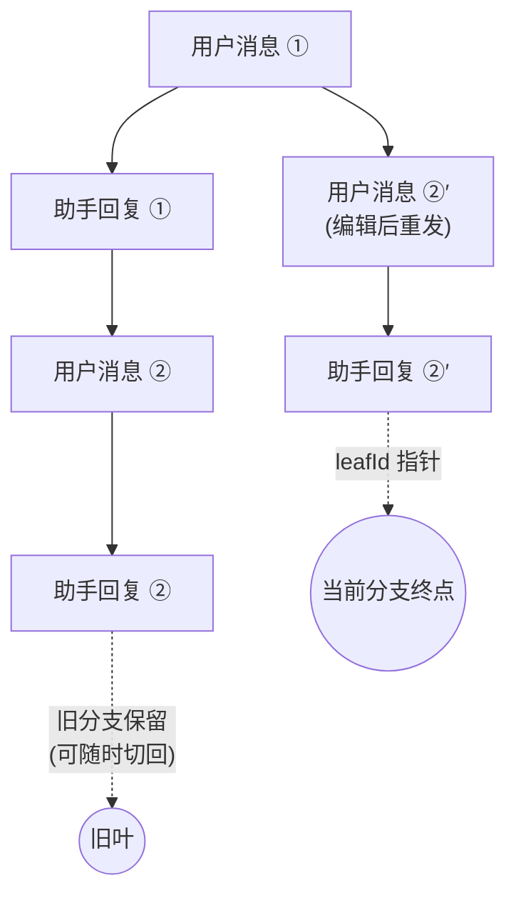
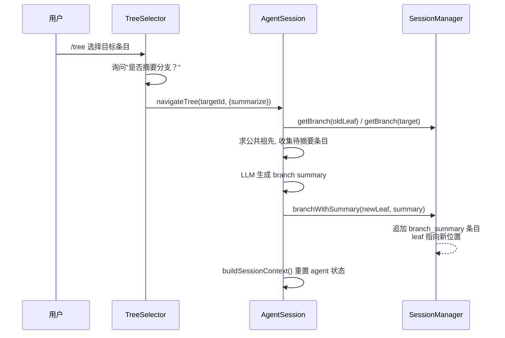
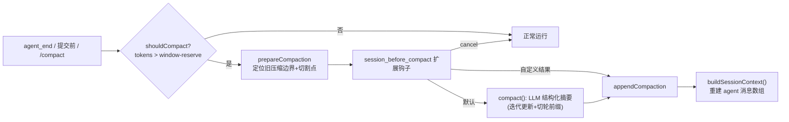
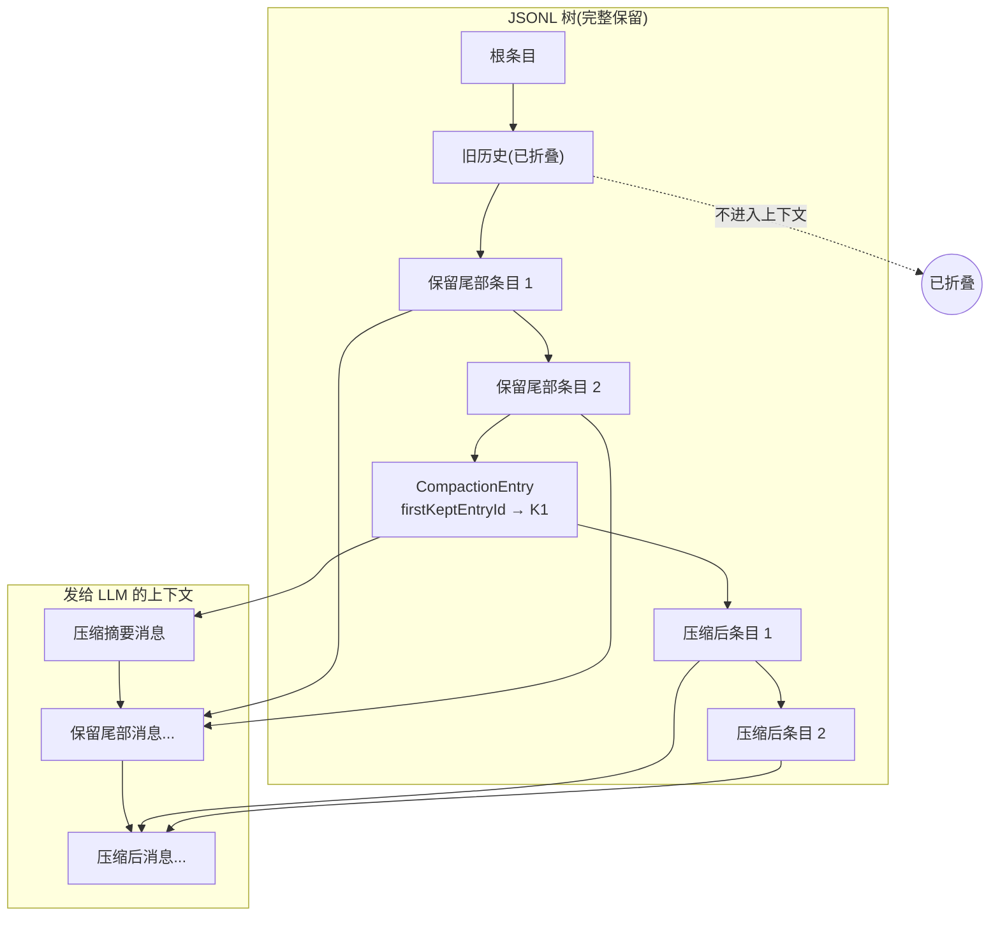
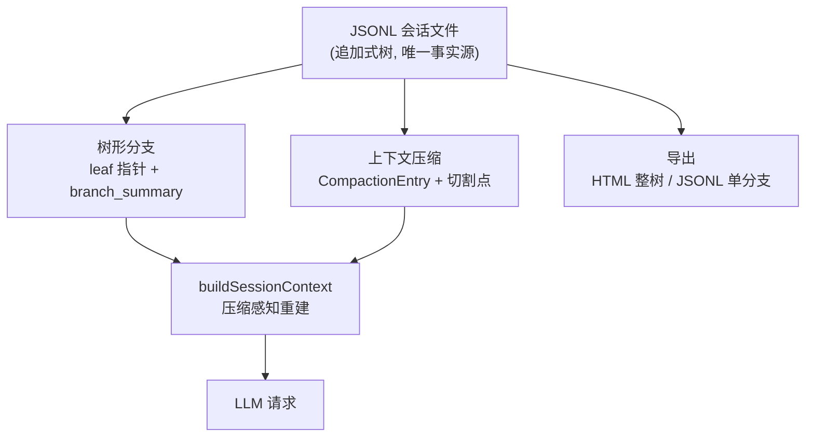

pi 的会话不是一条平铺的消息列表，而是一棵**追加式（append-only）消息树**。任何一次「重新编辑用户消息」「切换分支」「压缩上下文」都不会破坏历史数据，而是通过移动一个叶指针（leaf pointer）或追加一条新条目来实现。本文从架构视角拆解这套机制的三根支柱：**树形分支**如何在 JSONL 文件中建模与导航，**上下文压缩**如何在不丢弃树的前提下重建 LLM 上下文，以及**会话导出**如何把整棵树或单个分支交付给用户。

## 会话存储：追加式 JSONL 与树形数据模型

会话文件默认存放在 `~/.pi/agent/sessions/<编码后的 cwd>/` 目录下，目录名由工作目录路径经过字符替换生成（如 `--Users-xmon-Code-IdeaProjects-pi--`），保证跨项目隔离。每个文件是一个 JSONL 文档，首行为会话头（`SessionHeader`，含 `id`、`cwd`、`parentSession` 等元数据），后续每行一条会话条目。条目通过 `id` 与 `parentId` 构成树：根条目的 `parentId` 为 `null`，其余条目指向其父条目。

Sources: [session-manager.ts](packages/coding-agent/src/core/session-manager.ts#L32-L39), [session-manager.ts](packages/coding-agent/src/core/session-manager.ts#L476-L481)

条目类型覆盖了会话演化的全部侧面：`message`（用户/助手/工具结果消息）、`compaction`（压缩摘要）、`branch_summary`（分支导航摘要）、`custom`/`custom_message`（扩展数据，后者可参与 LLM 上下文），以及 `thinking_level_change`、`model_change`、`label`、`session_info` 等状态标记。每个条目都携带 `id` 与 `parentId`，这正是树结构得以成立的唯一约束——文件本身不存储任何「当前分支」的概念。

Sources: [session-manager.ts](packages/coding-agent/src/core/session-manager.ts#L143-L156), [session-manager.ts](packages/coding-agent/src/core/session-manager.ts#L69-L92)

「当前分支」完全由内存中的 `leafId` 指针定义：`appendMessage`、`appendCompaction` 等方法都以 `parentId: this.leafId` 写入新条目，然后自动把叶指针推进到新条目。文件是追加的，树只能生长；切换分支只是移动指针，从不删除或修改既有条目。这种设计让「撤销」「重试」「重新提问」变成零成本的指针操作。

Sources: [session-manager.ts](packages/coding-agent/src/core/session-manager.ts#L1060-L1081), [session-manager.ts](packages/coding-agent/src/core/session-manager.ts#L1310-L1317)

在更底层的 `pi-agent` 包中，新一代（format 4）会话存储同样以 JSONL 持久化，但把「分支」提升为显式一等概念：分支末端记录在命名空间值 `pi.branch.tip:<branch>` 中，并配有 lane 配置与 lane 状态（`pi.lane.config` / `pi.lane.state`），支持会话内多分支并行演化。`JsonlSessionRepo` 负责文件的创建、打开与列举生命周期。

Sources: [values.ts](packages/agent/src/harness/session/values.ts#L158-L161), [repo.ts](packages/agent/src/harness/session/jsonl/repo.ts#L40-L67)

## 树形分支：leaf 指针与导航

`SessionManager` 提供了树操作的核心原语：`getBranch(fromId?)` 沿 `parentId` 链从指定条目（默认当前叶）回溯到根，返回一条线性路径；`getTree()` 把全部条目组织成 `SessionTreeNode` 树（按时间排序子节点，孤立条目作为根返回），供 UI 渲染。而 `branch(branchFromId)` 只做一件事——把叶指针移到指定条目；`resetLeaf()` 则把指针归零，下一条追加的条目将成为新的根。

Sources: [session-manager.ts](packages/coding-agent/src/core/session-manager.ts#L1274-L1284), [session-manager.ts](packages/coding-agent/src/core/session-manager.ts#L1324-L1362), [session-manager.ts](packages/coding-agent/src/core/session-manager.ts#L1374-L1388)

交互层的入口是 `/tree` 命令（或空编辑器下双击 Escape，具体触发 `/tree` 还是 `/fork` 取决于 `doubleEscapeAction` 设置）。`/tree` 打开 `TreeSelectorComponent`：一个带缩进连接线（`├─`/`└─`）与水平视口裁剪的 ASCII 树视图，支持过滤模式（默认隐藏设置类条目、`no-tools`、仅用户消息、仅打标签条目、全部）与搜索，并高亮当前活跃路径。

Sources: [interactive-mode.ts](packages/coding-agent/src/modes/interactive/interactive-mode.ts#L3042-L3046), [interactive-mode.ts](packages/coding-agent/src/modes/interactive/interactive-mode.ts#L2861-L2877), [tree-selector.ts](packages/coding-agent/src/modes/interactive/components/tree-selector.ts#L27-L39), [tree-selector.ts](packages/coding-agent/src/modes/interactive/components/tree-selector.ts#L95)

选中树中的某个节点后，`AgentSession.navigateTree` 接管流程，其语义按目标条目类型区分：若目标是**用户消息**（或 `custom_message`），叶指针移到它的父节点，原文本回填到编辑器——即「重新编辑这句话」；若是其他条目，叶指针直接落在该条目上。这一区别把「改写历史」与「从历史某点继续」统一成了同一个导航动作。

Sources: [agent-session.ts](packages/coding-agent/src/core/agent-session.ts#L3113-L3130), [agent-session.ts](packages/coding-agent/src/core/agent-session.ts#L3236-L3251)

`/fork` 命令（用户消息选择器）与 `/clone` 命令则走向另一个方向——**派生新会话文件**。两者都经由 `AgentSessionRuntime.fork()`：`position: "before"` 表示从用户消息的父节点重新开始（原文本回填编辑器），`position: "at"`（clone）表示复制到当前叶。持久化会话会调用 `createBranchedSession(leafId)`，生成一个只包含「根到目标叶」路径的新 JSONL 文件，其头部的 `parentSession` 字段指回源会话，形成会话级谱系。若目标是根节点之前，则创建全新空会话。扩展可通过 `session_before_fork` 钩子拦截。

Sources: [interactive-mode.ts](packages/coding-agent/src/modes/interactive/interactive-mode.ts#L3032-L3036), [agent-session-runtime.ts](packages/coding-agent/src/core/agent-session-runtime.ts#L262-L332), [session-manager.ts](packages/coding-agent/src/core/session-manager.ts#L1427-L1475)

`createBranchedSession` 有一个值得注意的细节：路径中的 `label` 条目会被摘除并重新链接父子关系，压缩条目的 `firstKeptEntryId` 也会映射到重链后的新 ID——因为标签是真实的树节点，直接删除会产生孤儿子树。此外 `SessionManager.forkFrom` 静态方法提供了「整树复制 + 新 cwd」的会话克隆能力，用于把会话搬到另一个工作目录。

Sources: [session-manager.ts](packages/coding-agent/src/core/session-manager.ts#L1427-L1460), [session-manager.ts](packages/coding-agent/src/core/session-manager.ts#L1611-L1662)

## 分支摘要：跨越分叉点保留上下文

在树间跳转意味着放弃旧路径上的上下文。为缓解这一断裂，`navigateTree` 支持 `summarize` 选项：导航前把旧叶到目标的**公共祖先**之间的条目交给 LLM 生成一份摘要，以 `branch_summary` 条目的形式附加在新叶位置。公共祖先的求法很直白：取旧叶路径的 ID 集合，沿目标路径从深到浅找第一个同时出现在两条路径上的节点。

Sources: [agent-session.ts](packages/coding-agent/src/core/agent-session.ts#L3138-L3143), [branch-summarization.ts](packages/coding-agent/src/core/compaction/branch-summarization.ts#L108-L146)

摘要生成的输入由 `prepareBranchEntries` 从**最新向最旧**累积消息，直到触及 token 预算（`reserveTokens`，默认 16384），保证长分支时代码保真的是近期上下文；文件操作追踪（读取过、修改过的文件清单）会从摘要条目的 `details` 中累积传递。UI 侧，树选择器会先询问「是否摘要」（No summary / Summarize / Summarize with custom prompt），摘要期间显示状态指示器，Escape 可中止。扩展可通过 `session_before_tree` 钩子取消导航或提供自定义摘要。

Sources: [branch-summarization.ts](packages/coding-agent/src/core/compaction/branch-summarization.ts#L182-L195), [interactive-mode.ts](packages/coding-agent/src/modes/interactive/interactive-mode.ts#L5230-L5285), [agent-session.ts](packages/coding-agent/src/core/agent-session.ts#L3169-L3234)

关键细节：摘要条目附加在**导航目标位置**（`newLeafId`），而非旧分支末端——这样摘要会成为新分支上下文的一部分。摘要生成完成后，`buildSessionContext()` 从新叶重建消息数组并整体替换 agent 状态，会话树事件（`session_tree`）随后通知扩展。

Sources: [agent-session.ts](packages/coding-agent/src/core/agent-session.ts#L3253-L3286), [session-manager.ts](packages/coding-agent/src/core/session-manager.ts#L1395-L1420)

## 上下文压缩：三种触发路径

当上下文逼近模型窗口上限时，pi 通过「压缩（compaction）」把旧历史折叠成一份结构化摘要。触发路径有三条，全部汇聚到同一个底层 `compact()` 函数：

| 触发方式 | 入口 | 时机 | 是否重试当前轮 |
|---|---|---|---|
| 手动 | `/compact [自定义指令]` | 用户主动调用 | 否 |
| 阈值自动 | `_checkCompaction`（`agent_end` 后 / 提交前） | `contextTokens > contextWindow - reserveTokens` | 否 |
| 溢出自动 | `_checkCompaction` 的 overflow 分支 | API 报上下文溢出错误，或响应因长度被截断 | 溢出且未完成时压缩后重试一次 |

Sources: [agent-session.ts](packages/coding-agent/src/core/agent-session.ts#L2111-L2135), [agent-session.ts](packages/coding-agent/src/core/agent-session.ts#L2158-L2202), [agent-session.ts](packages/coding-agent/src/core/agent-session.ts#L2204-L2236)

判断是否需要压缩依赖两套 token 估算的配合。`calculateContextTokens` 优先取 provider 返回的真实 usage（`totalTokens` 或四项之和）；`estimateContextTokens` 则以最后一次有效助手消息的 usage 为基线，对其后的尾部消息用 **chars/4 启发式**（图片按 4800 字符估算）补充估算，兼顾准确性与及时性。压缩设置默认为 `enabled: true`、`reserveTokens: 16384`（预留空间）、`keepRecentTokens: 20000`（保留近期上下文），可在 `settings.json` 中覆盖。

Sources: [compaction.ts](packages/coding-agent/src/core/compaction/compaction.ts#L146-L148), [compaction.ts](packages/coding-agent/src/core/compaction/compaction.ts#L202-L230), [compaction.ts](packages/coding-agent/src/core/compaction/compaction.ts#L126-L136), [compaction.ts](packages/coding-agent/src/core/compaction/compaction.ts#L235-L238)

自动触发还有两道防误伤护栏：其一，usage 时间戳早于最近压缩条目的助手消息会被跳过——压缩后保留的旧 usage 反映的是更大的旧上下文，若不排除会在压缩完成后立即误触发第二次压缩；其二，助手消息来自与当前不同的模型时跳过溢出检查——从小窗口模型切到大窗口模型后，旧模型的溢出错误不应触发新模型的压缩。

Sources: [agent-session.ts](packages/coding-agent/src/core/agent-session.ts#L2139-L2156), [agent-session.ts](packages/coding-agent/src/core/agent-session.ts#L2215-L2227)

## 压缩执行：切割点算法与摘要生成

压缩的第一步是**找到切割点**。`findCutPoint` 从最新条目向前累积估算 token，累积到 `keepRecentTokens` 预算时停下，并在有效切割点集合中选取——切割点可以是用户消息或助手消息，但**绝不能是工具结果**（切在带工具调用的助手消息处时，其工具结果会保留在保留段中）。若切点落在一条对话轮次中间（`isSplitTurn`），还会回溯定位到该轮的用户消息起点，把「轮次前缀」单独摘出来。

Sources: [compaction.ts](packages/coding-agent/src/core/compaction/compaction.ts#L403-L461)

`prepareCompaction` 把切割点转化为执行计划：先定位上一个压缩条目确立边界（`boundaryStart`），提取其旧摘要用于**迭代式更新**；然后划分出 `messagesToSummarize`（将被折叠的历史）与 `turnPrefixMessages`（切轮时的前缀）。若路径末尾已是压缩条目，或无可摘要内容，则返回 `undefined`，`AgentSession.compact()` 会据此报「Already compacted」或「Nothing to compact」。

Sources: [compaction.ts](packages/coding-agent/src/core/compaction/compaction.ts#L750-L829), [agent-session.ts](packages/coding-agent/src/core/agent-session.ts#L1962-L1970)

第二步是用 LLM 生成摘要。pi 强制使用一份**结构化检查点格式**：`## Goal`（目标）、`## Constraints & Preferences`（约束偏好）、`## Progress`（Done/In Progress/Blocked 进度清单）、`## Key Decisions`（关键决策）、`## Next Steps`（后续步骤）、`## Critical Context`（关键上下文），并要求精确保留文件路径、函数名与错误信息。若存在上一次压缩的摘要，改用「增量更新」提示——保留旧信息、合并新进展、推进进度状态。切轮场景会额外生成一份轮次前缀摘要，与历史摘要用分隔线拼接。

Sources: [compaction.ts](packages/coding-agent/src/core/compaction/compaction.ts#L467-L539), [compaction.ts](packages/coding-agent/src/core/compaction/compaction.ts#L835-L848), [compaction.ts](packages/coding-agent/src/core/compaction/compaction.ts#L887-L926)

摘要安全落盘前还有一道校验：`getSummarizationFailure` 会拒绝以 length 为 stop reason 的响应——半截摘要不能成为会话检查点。生成成功后，`appendCompaction` 写入 `CompactionEntry`（含 `summary`、`firstKeptEntryId`、`tokensBefore`、文件操作 `details` 与 usage），`buildSessionContext()` 随即重建 agent 消息数组。扩展可通过 `session_before_compact` 钩子取消压缩或提供完整替代结果。

Sources: [compaction.ts](packages/coding-agent/src/core/compaction/compaction.ts#L541-L545), [session-manager.ts](packages/coding-agent/src/core/session-manager.ts#L1111-L1133), [agent-session.ts](packages/coding-agent/src/core/agent-session.ts#L1974-L2031)

## 压缩感知的上下文重建

压缩条目是树中的一个普通节点，但上下文重建会赋予它特殊语义。`buildContextEntries` 沿当前叶路径找到**最近**的压缩条目后，重建的活跃条目列表变为三段式：压缩条目本身（代表摘要）→ 从 `firstKeptEntryId` 到压缩条目之间的保留尾部（这些条目在树路径上位于压缩条目**之前**）→ 压缩条目之后的全部新条目。`sessionEntryToContextMessages` 把压缩条目投影为一条摘要消息，被折叠的旧历史则完全不进入 LLM。

Sources: [session-manager.ts](packages/coding-agent/src/core/session-manager.ts#L410-L454), [session-manager.ts](packages/coding-agent/src/core/session-manager.ts#L383-L408)

这种「条目即边界」的设计让压缩与树形分支天然兼容：分支切换只是换了一条叶路径，新路径上的压缩条目会按同样规则重建上下文；树选择器跳转回压缩点之前的节点时，看到的仍是完整的原始历史，因为**树中什么也没被删除**。

`pi-agent` 包中的 format-4 会话则演进出另一种建模：`CompactionEntry` 直接携带 `retainedTail: AgentMessage[]`——保留尾部内嵌在压缩条目里，重建时 `sessionEntryToContextMessages` 返回「摘要消息 + retainedTail」。做增量压缩时，上一次的 `retainedTail` 会被映射为一串**虚拟条目**（合成 ID 形如 `<compactionId>:retained:<n>`）参与新的切割点计算。两条实现路径共享同一套切割点与摘要算法，区别只在保留尾部的存储位置。

Sources: [context.ts](packages/agent/src/harness/session/context.ts#L31-L45), [compaction.ts](packages/agent/src/harness/compaction/compaction.ts#L650-L689), [types.ts](packages/agent/src/harness/session/types.ts#L33-L41)

## 会话导出：HTML、JSONL 与分享

导出能力围绕 `/export` 命令展开，按扩展名自动分派，三种形态各有用途：

| 导出形态 | 实现 | 范围 | 典型用途 |
|---|---|---|---|
| `/export <path>.html` | `exportSessionToHtml` | **整棵树**（含全部条目与 leafId） | 浏览器查看、归档、分享链接 |
| `/export <path>.jsonl` | `exportSessionToJsonl` | **仅当前分支** | 供 pi 重新打开（`--resume`）或管线处理 |
| `/share` | `shareSession` | 当前分支 JSONL / HTML | 上传 Radius 工件或 GitHub 私有 Gist |

Sources: [interactive-mode.ts](packages/coding-agent/src/modes/interactive/interactive-mode.ts#L6032-L6048), [export-html/index.ts](packages/coding-agent/src/core/export-html/index.ts#L236-L282), [session-export.ts](packages/coding-agent/src/core/session-export.ts#L7-L42)

HTML 导出的关键取舍是**自包含**：`template.html`、`template.css`（约 1066 行）、`template.js`（约 1864 行）在构建时被内联进单个 HTML 文件，无外部依赖即可离线打开。页面内置一个可交互的树形侧栏——搜索框与五种过滤模式（与 TUI 树选择器同款语义），当前活跃分支高亮显示。主题方面，导出时读取当前主题色并按亮度推导背景色阶（`getLuminance`/`adjustBrightness`），深浅色主题都得到可读的导出效果。扩展注册的自定义工具可通过 `ToolHtmlRenderer`（`renderCall`/`renderResult`）预渲染成专属 HTML。

Sources: [template.html](packages/coding-agent/src/core/export-html/template.html#L1-L30), [export-html/index.ts](packages/coding-agent/src/core/export-html/index.ts#L15-L40), [export-html/index.ts](packages/coding-agent/src/core/export-html/index.ts#L80-L100)

值得注意的是 HTML 与 JSONL 导出的范围差异：HTML 嵌入全部条目并附带 leafId，让查看者能在浏览器里自由切换分支；JSONL 则只取 `getBranch()` 的线性路径，并将每条目的 `parentId` 重新串链为一条直线——导出物是一个结构合法的单分支会话，可直接被 pi 打开继续对话。`exportSessionToJsonl` 还接受一个尾随条目回调，`/share` 用它附加 `pi.share` 自定义条目（内嵌系统提示词与工具定义），供 Radius 查看器还原完整呈现。

Sources: [session-export.ts](packages/coding-agent/src/core/session-export.ts#L31-L42), [session-share.ts](packages/coding-agent/src/modes/interactive/session-share.ts#L25-L43)

`/share` 的上传策略是两级回退：优先走 Radius 平台（OAuth 凭据 + `/v1/artifacts` 端点，组织可见性），失败则回退到 GitHub 私有 Gist（要求本地 `gh` 已登录），并返回一个官方查看器 URL。此外 `exportFromFile` 让 CLI 可以不经运行会话直接把任意 JSONL 转成 HTML；CLI 的 `--resume` 标志则通过 `selectSession` 的 TUI 选择器完成会话恢复闭环。

Sources: [session-share.ts](packages/coding-agent/src/modes/interactive/session-share.ts#L87-L146), [session-share.ts](packages/coding-agent/src/modes/interactive/session-share.ts#L148-L199), [export-html/index.ts](packages/coding-agent/src/core/export-html/index.ts#L288-L316), [session-picker.ts](packages/coding-agent/src/cli/session-picker.ts#L15-L55)

## 结语：一套机制，三个视角

把三根支柱放在一起看，pi 会话管理的哲学是**不可变历史 + 可变视角**：JSONL 树是唯一事实源，分支、压缩、导出都是从这棵树上推导出的不同投影。分支改变「从哪里继续」，压缩改变「LLM 看到什么」，导出改变「人看到什么」——三者互不破坏底层数据。

若要继续深入，建议按以下路径阅读：想了解 JSONL 每行的确切字段与版本迁移，请看 [会话 JSONL 格式与 SessionManager](21-hui-hua-jsonl-ge-shi-yu-sessionmanager)；想了解上下文消息最终如何转换为 LLM 请求格式，请看 [AgentMessage 与上下文转换管线](8-agentmessage-yu-shang-xia-wen-zhuan-huan-guan-xian-transformcontext-converttollm)；想在自有应用中程序化驱动这套会话机制，请看 [AgentSession 与 SDK：将智能体嵌入自有应用](16-agentsession-yu-sdk-jiang-zhi-neng-ti-qian-ru-zi-you-ying-yong)；日常操作层面的命令与快捷键回顾，见 [交互模式使用指南：编辑器、命令与快捷键](4-jiao-hu-mo-shi-shi-yong-zhi-nan-bian-ji-qi-ming-ling-yu-kuai-jie-jian)。