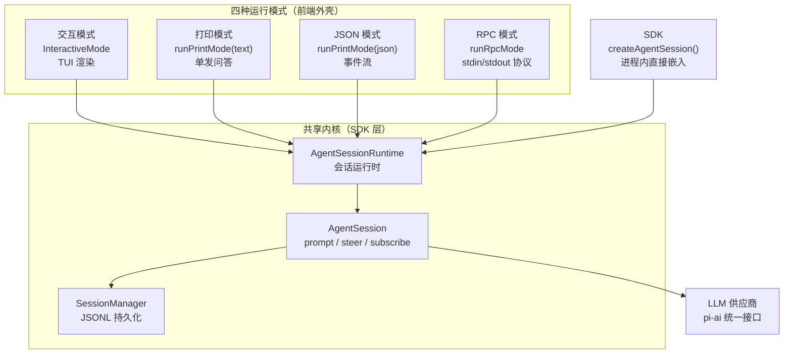
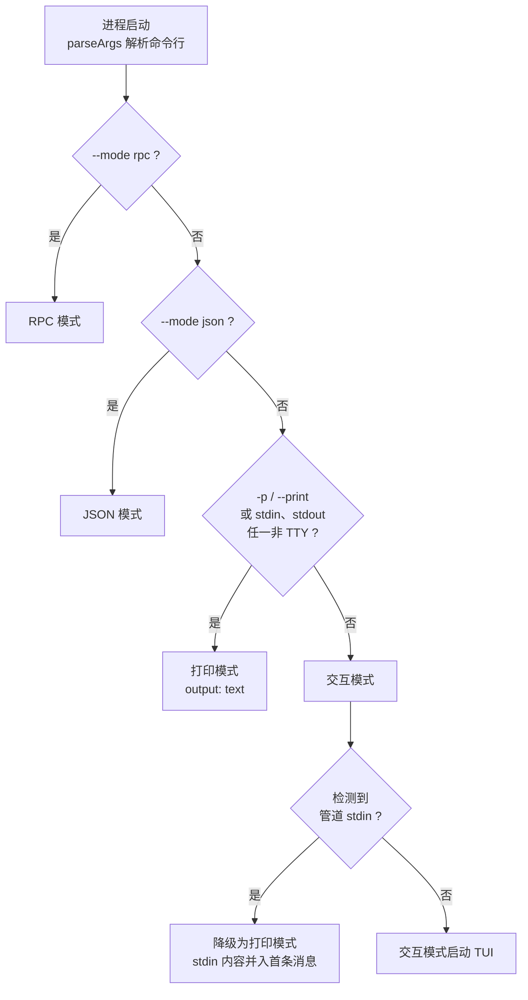
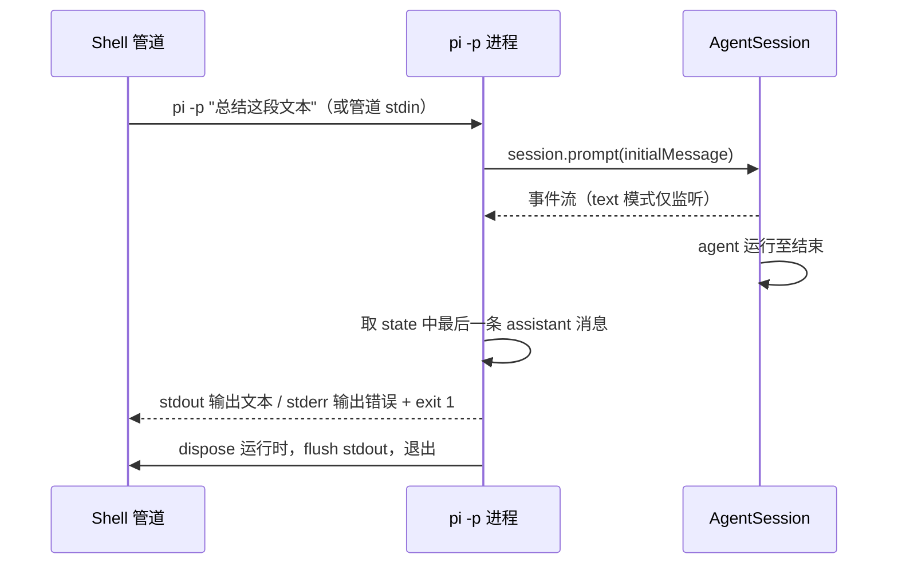
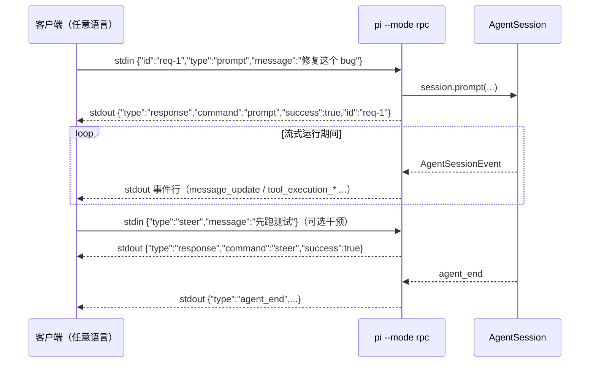

pi 是一个"一套内核、多种外壳"的终端编码智能体套件：无论你在终端里对话、在 shell 管道中单发提问、用脚本消费事件流，还是把智能体嵌入自己的应用，底层驱动的都是同一个 `AgentSession` 会话内核。本页面向中级开发者，讲清 pi 的四种运行模式（交互、打印、JSON、RPC）如何被选择、各自的数据流形态，以及当这四种形态都不够用时，如何直接使用 SDK 在进程内嵌入智能体。读完本页，你将能根据集成场景（人机交互、shell 管道、脚本消费、跨语言子进程、进程内库调用）正确选择运行模式。

## 一套内核，四种外壳

pi 的架构分层非常清晰：`main.ts` 只负责解析 CLI 参数并把它们翻译成 `createAgentSession()` 的选项，"重活全部交给 SDK"。在 [main.ts](packages/coding-agent/src/main.ts#L1-L6) 的文件头注释中，作者明确写道：*"Main entry point for the coding agent CLI... This file handles CLI argument parsing and translates them into createAgentSession() options. The SDK does the heavy lifting."* 这意味着交互 TUI、打印输出、JSON 事件流和 RPC 协议都只是同一个会话对象的不同前端。

从代码结构上也能看出这种分层：所有运行模式实现都集中在 [modes/](packages/coding-agent/src/modes/index.ts#L1-L17) 目录，由 `index.ts` 统一导出 `InteractiveMode`、`runPrintMode`、`runRpcMode` 三类入口，以及 RPC 类型化客户端 `RpcClient`。它们全部构建在 `AgentSessionRuntime` 之上——这正是 SDK 层的会话运行时抽象。



这张图的关键信息是：SDK 并不是"第五种模式"，而是其他所有模式的地基。事实上，`InteractiveMode`、`runPrintMode`、`runRpcMode` 本身也作为 SDK 导出，供你构建自定义界面时复用。

Sources: [main.ts](packages/coding-agent/src/main.ts#L1-L6), [modes/index.ts](packages/coding-agent/src/modes/index.ts#L1-L17)

## 模式解析：一段函数决定四种去向

模式选择发生在 CLI 启动早期，核心是一个仅十几行的 `resolveAppMode` 函数。它的优先级链是：显式 `--mode rpc` 最高，其次 `--mode json`，然后是 `--print`/`-p` 标志或"stdin/stdout 任一不是 TTY"的自动检测，最后兜底交互模式。值得注意的是，pi 会**主动检测管道环境**：如果你的 stdout 被重定向（例如 `pi "总结" > out.txt`），即使没有传 `-p`，也会自动进入打印模式。类型定义上，CLI 层的 `Mode` 是 `"text" | "json" | "rpc"`（`--mode text` 也是合法值，等价于显式打印模式），而应用层归一化后的 `AppMode` 是 `"interactive" | "print" | "json" | "rpc"` 四值。



两个实现细节值得注意。其一，模式确定后，非交互模式会调用 `takeOverStdout()` 接管标准输出——把 TUI 框架可能污染 stdout 的写入改道到 stderr，保证管道消费方拿到的 stdout 是纯净数据流。其二，交互模式还有一个**事后降级**路径：如果用户在交互启动后才检测到管道 stdin（例如 `cat log.txt | pi`），模式会改判为打印，并把管道内容并入初始消息——这与 RPC 模式形成互补，因为 RPC 模式的 stdin 被协议独占，管道检测被明确跳过。

| 触发条件 | 结果模式 | 说明 |
|---------|---------|------|
| `--mode rpc` | RPC | stdin/stdout 双向 JSON 协议 |
| `--mode json` | JSON | 事件流逐行输出 |
| `--mode text` / `-p` / `--print` | 打印 | 仅输出最终文本回复 |
| stdout 非 TTY（如重定向） | 打印（自动） | 无需显式 `-p` |
| 交互启动后检测到管道 stdin | 打印（降级） | 管道内容并入初始消息 |
| 以上都不满足 | 交互 | 默认 TUI |

Sources: [main.ts](packages/coding-agent/src/main.ts#L104-L119), [args.ts](packages/coding-agent/src/cli/args.ts#L8), [project-trust.ts](packages/coding-agent/src/core/project-trust.ts#L12), [main.ts](packages/coding-agent/src/main.ts#L633-L638), [main.ts](packages/coding-agent/src/main.ts#L866-L876)

## 交互模式：默认的 TUI 前端

不带任何模式标志启动 `pi` 时，你得到的是交互模式。`InteractiveMode` 类的职责边界在源码头部写得非常直白：*"Handles TUI rendering and user interaction, delegating business logic to AgentSession"*——TUI 层只管渲染与交互，全部业务逻辑委托给 `AgentSession`。这意味着交互模式没有自己的一套"智能体逻辑"，你在终端里看到的消息流、工具调用展示、会话树导航，都是对共享内核事件的呈现。

交互模式的完整能力（编辑器、斜杠命令、消息队列、主题）由目录下的另一页专门覆盖，本页不展开。这里只需记住它在模式谱系中的定位：它是唯一需要独占终端的双向人机界面，也是唯一会弹出项目信任提示的模式——非交互模式（`-p`、`--mode json`、`--mode rpc`）不显示信任提示，而是依据全局设置中的 `defaultProjectTrust` 决定是否加载项目资源，或用 `--approve`/`--no-approve` 显式覆盖。

Sources: [interactive-mode.ts](packages/coding-agent/src/modes/interactive/interactive-mode.ts#L1-L3), [usage.md](packages/coding-agent/docs/usage.md#L126-L126)

## 打印模式：单次问答的管道友好形态

打印模式是"运行一次、回答一个问题、退出"的单发形态，用 `-p` 或 `--print` 触发（stdout 被重定向时也会自动进入）。它的实现文件开头就说明了双重身份：*"Print mode (single-shot): Send prompts, output result, exit. Used for: `pi -p "prompt"` - text output; `pi --mode json "prompt"` - JSON event stream"*。也就是说，**JSON 模式在代码层面就是打印模式的一个变体**——`main.ts` 中的 `toPrintOutputMode` 把应用模式映射为打印函数的输出格式参数：`json` 返回 `"json"`，其余返回 `"text"`。

打印模式的执行流程非常线性：订阅会话事件（text 模式下仅用于感知生命周期）→ 逐条发送初始消息和后续消息并 `await` 完成 → 从会话状态中取出最后一条助手消息，把其中的文本内容写到 stdout。错误处理遵循 Unix 惯例：若最后一条消息的 `stopReason` 是 `error` 或 `aborted`，错误信息写入 stderr 并返回退出码 1，让 shell 脚本可以可靠地判断成败。



管道友好是打印模式的招牌能力：pi 会读取管道进来的 stdin 并合并进初始提示。官方示例 `cat README.md | pi -p "Summarize this text"` 就是把文件内容作为上下文喂给模型。此外打印模式注册了 `SIGTERM`/`SIGHUP` 处理器，收到信号时会先清理分离的子进程、释放运行时，再以约定退出码退出，保证在 CI 或脚本编排中不留孤儿进程。

Sources: [print-mode.ts](packages/coding-agent/src/modes/print-mode.ts#L1-L8), [print-mode.ts](packages/coding-agent/src/modes/print-mode.ts#L15-L27), [main.ts](packages/coding-agent/src/main.ts#L124-L126), [print-mode.ts](packages/coding-agent/src/modes/print-mode.ts#L139-L157), [usage.md](packages/coding-agent/docs/usage.md#L176-L180), [print-mode.ts](packages/coding-agent/src/modes/print-mode.ts#L29-L56)

## JSON 模式：可机读的事件流

当 `text` 输出不够用——你想在自己的工具里重建进度条、实时渲染或统计信息时——`--mode json` 把整条会话事件流以 JSON Lines 形式倾泻到 stdout。输出结构有明确约定：**第一行是会话头** `{"type":"session","version":3,"id":"uuid","timestamp":"...","cwd":"/path"}`，之后每个事件占一行，如 `agent_start`、`turn_start`、`message_start`、`message_update`、`tool_execution_end`、`agent_end` 等。

JSON 模式最精妙的设计是**增量瘦身上游协议**。原始 `AgentSessionEvent` 中的 `message_update` 事件携带完整消息快照，若直接透传会让流体积随消息长度平方增长；`toJsonEvent` 函数专门把它改写为"delta-only"形态——剥掉累积的 `message` 字段和 `assistantMessageEvent.partial`，只保留 `contentIndex`、`delta` 等增量字段，外加一个常量尺寸的顶层 `usage`。消费端用 `contentIndex + delta` 自行拼装实时文本，`message_end` 则提供最终权威版本。`toolcall_start` 事件额外附带 `id` 和 `toolName` 两个字段，方便消费方尽早知道是哪个工具被调用。

实现层面，打印函数在 `mode === "json"` 分支里做了三件定制：先输出会话头，再把订阅到的事件经 `toJsonEvent` 转换后逐行写入，并且向 agent 内核额外订阅以执行**背压等待**（`waitForRawStdoutBackpressure`）——当 stdout 缓冲未排空时暂停产出，防止消费方处理速度慢时内存膨胀。配合 `jq` 可以一行命令筛选感兴趣的事件，例如官方示例 `pi --mode json "List files" 2>/dev/null | jq -c 'select(.type == "message_end")'` 只提取每条消息的完结时刻。

Sources: [print-mode.ts](packages/coding-agent/src/modes/print-mode.ts#L106-L115), [json-event.ts](packages/coding-agent/src/modes/json-event.ts#L28-L48), [json.md](packages/coding-agent/docs/json.md#L67-L87), [json.md](packages/coding-agent/docs/json.md#L1-L10), [print-mode.ts](packages/coding-agent/src/modes/print-mode.ts#L116-L122)

## RPC 模式：stdin/stdout 上的双向协议

JSON 模式是"只读直播"——pi 说什么你听什么；RPC 模式则是"全双工遥控"——你可以随时发命令干预。启动方式为 `pi --mode rpc`（或等价地用包内提供的 `rpc-entry` 入口，它把进程标题设为 `pi-rpc` 并强制注入 `--mode rpc` 参数）。协议形态在实现文件头部有权威描述：*"Commands: JSON objects with `type` field, optional `id` for correlation; Responses: JSON objects with `type: "response"`...; Events: AgentSessionEvent objects streamed as they occur"*——stdin 收命令，stdout 吐响应与事件两类消息。

**帧规则**是 RPC 模式最需要小心的一点：严格 JSONL 语义，仅以 LF（`\n`）为记录分隔符，允许输入端带 `\r\n` 但必须剥离尾部 `\r`。文档特别警告 Node 的 `readline` 模块不合规，因为它还会在 `U+2028`/`U+2029`（合法存在于 JSON 字符串中）处断行——所以官方提供了专门的 `attachJsonlLineReader` 帮助函数，跨语言客户端应遵循同样的分帧逻辑。

命令面覆盖了交互模式的绝大多数能力，且所有命令都支持可选 `id` 字段做请求/响应关联：

| 类别 | 命令 | 用途 |
|------|------|------|
| 提示 | `prompt` / `steer` / `follow_up` / `abort` / `clear_queue` / `new_session` | 发送与排队消息、中止、开新会话 |
| 状态 | `get_state` / `get_messages` | 查询模型、流式状态、会话文件与消息历史 |
| 模型 | `set_model` / `cycle_model` / `get_available_models` | 切换与枚举模型 |
| 思考 | `set_thinking_level` / `cycle_thinking_level` / `get_available_thinking_levels` | 控制思考等级 |
| 压缩/重试 | `compact` / `set_auto_compaction` / `set_auto_retry` / `abort_retry` | 上下文压缩与自动重试 |
| Bash | `bash` / `abort_bash` | 直接执行 shell 命令 |
| 会话 | `switch_session` / `fork` / `clone` / `get_tree` / `get_entries` / `export_html` 等 | 会话树导航与导出 |

两个进阶机制让 RPC 模式可以承载完整的扩展生态。一是 `prompt` 命令在智能体正在流式输出时要求显式声明 `streamingBehavior`（`"steer"` 在当前轮工具调用结束后、下次 LLM 调用前插入；`"followUp"` 等智能体完全收工后投递），这与交互模式里 Enter/Alt+Enter 的语义一一对应。二是**扩展 UI 协议**：扩展弹出的 `select`/`confirm`/`input` 等对话框会被序列化为 stdout 上的 `extension_ui_request`，客户端回以 `extension_ui_response`——也就是说，你的自定义 UI 可以替终端渲染扩展的交互组件。官方还提供了一个类型化客户端 `RpcClient`，以 `spawn` 子进程的方式封装了请求关联、事件监听与进程生命周期管理，省去手写协议的功夫。



跨语言接入是 RPC 模式的设计初衷。文档给出了一个约 20 行的 Python 基础客户端：`subprocess.Popen` 拉起 `pi --mode rpc --no-session`，逐行读 stdout，遇 `text_delta` 就打印、遇 `agent_end` 就收工。任何能读写管道的语言都能以同样模式接入。

Sources: [rpc-mode.ts](packages/coding-agent/src/modes/rpc/rpc-mode.ts#L1-L15), [rpc.md](packages/coding-agent/docs/rpc.md#L20-L37), [rpc.md](packages/coding-agent/docs/rpc.md#L43-L56), [rpc.md](packages/coding-agent/docs/rpc.md#L183-L236), [rpc-entry.ts](packages/coding-agent/src/rpc-entry.ts#L1-L14), [rpc-client.ts](packages/coding-agent/src/modes/rpc/rpc-client.ts#L1-L6), [rpc.md](packages/coding-agent/docs/rpc.md#L1526-L1552), [rpc.md](packages/coding-agent/docs/rpc.md#L61-L78)

## SDK：进程内直接嵌入

前三种模式都以独立进程运行；当你就在 Node.js/TypeScript 应用里，SDK 允许跳过进程边界直接持有会话对象。最小用法只需三步：`createAgentSession()` 创建会话、`session.subscribe()` 订阅事件流、`session.prompt()` 发送提示并等待完成。官方快速上手示例同时演示了流式打印（监听 `text_delta` 逐字输出）：

```typescript
import { createAgentSession, ModelRuntime, SessionManager } from "@earendil-works/pi-coding-agent";

const modelRuntime = await ModelRuntime.create();
const { session } = await createAgentSession({
  sessionManager: SessionManager.inMemory(),
  modelRuntime,
});

session.subscribe((event) => {
  if (event.type === "message_update" && event.assistantMessageEvent.type === "text_delta") {
    process.stdout.write(event.assistantMessageEvent.delta);
  }
});

await session.prompt("What files are in the current directory?");
```

SDK 的可配置面非常宽：`createAgentSession()` 的选项涵盖工作目录、模型、思考等级、工具白名单/黑名单、自定义工具、资源加载器（扩展、技能、提示模板、主题）和会话管理器。官方 [examples/sdk/](packages/coding-agent/examples/sdk) 目录用 13 个编号示例展示了从"全默认"（01-minimal）到"全接管"（12-full-control：自建 `ModelRuntime`、内存态 `SettingsManager`、手写 `ResourceLoader` 只留 `read`/`bash` 两个工具）的完整光谱。

SDK 还导出了三种运行模式本身作为"积木"。如果你在构建自定义宿主（比如一个变体 TUI 或服务端），可以先用 `createAgentSessionRuntime()` 建立会话运行时，再把运行时递给 `new InteractiveMode(runtime, ...)`、`runPrintMode(runtime, ...)` 或 `runRpcMode(runtime)`——这正是 pi 自己 CLI 的组装方式。需要注意的语义细节：`session.replaceSession` 类操作（新会话、切换、fork）位于 `AgentSessionRuntime` 而非 `AgentSession`，且会话被替换后事件订阅会失效，必须对新的 `runtime.session` 重新订阅。

Sources: [sdk.md](packages/coding-agent/docs/sdk.md#L16-L34), [sdk.md](packages/coding-agent/docs/sdk.md#L44-L64), [01-minimal.ts](packages/coding-agent/examples/sdk/01-minimal.ts#L7-L27), [12-full-control.ts](packages/coding-agent/examples/sdk/12-full-control.ts#L10-L69), [sdk.md](packages/coding-agent/docs/sdk.md#L1035-L1148), [sdk.md](packages/coding-agent/docs/sdk.md#L116-L141)

## SDK 与 RPC 的取舍

SDK 和 RPC 都能"把 pi 嵌进别的应用"，官方文档给出了明确的分界线：**同进程、同语言、要类型安全，选 SDK；跨语言、要进程隔离、要语言无关客户端，选 RPC**。RPC 文档甚至对 Node.js 用户特别提示：如果你在写 Node 应用，优先考虑直接使用 `AgentSession` 而不是拉起子进程。

| 维度 | SDK（进程内） | RPC（子进程） |
|------|-------------|--------------|
| 进程边界 | 无，同进程 | 有，spawn 子进程 |
| 类型安全 | 完整 TypeScript 类型 | 依赖 `RpcClient` 封装或手写协议 |
| 语言 | 仅 Node.js/TypeScript | 任意语言（Python/Go/Rust…） |
| 隔离性 | 共享进程，崩溃互相影响 | 进程隔离，stdin/stdout 解耦 |
| 状态访问 | 直接读 `session.state`、调用任意方法 | 需通过命令请求 |
| 工具/扩展定制 | 程序化注册 | 通过 CLI 参数与扩展文件 |

Sources: [sdk.md](packages/coding-agent/docs/sdk.md#L1150-L1169), [rpc.md](packages/coding-agent/docs/rpc.md#L1-L5)

## 四种模式速查

最后用一张表收束全文，帮助你在实际场景中快速决策：

| 模式 | 启动方式 | 数据流形态 | 会话持久化 | 典型场景 |
|------|---------|-----------|-----------|---------|
| 交互 | `pi` | 双向 TUI 渲染 | 默认保存，可 `-c` 续接 | 日常开发对话 |
| 打印 | `pi -p "..."` / 管道自动触发 | stdout 仅最终文本 | 同交互 | shell 管道、单发问答、CI |
| JSON | `pi --mode json "..."` | stdout 单向 JSONL 事件流 | 同交互 | 自建 UI、事件统计、脚本消费 |
| RPC | `pi --mode rpc` | stdin 命令 + stdout 事件/响应 | 可 `--no-session` 关闭 | IDE 集成、跨语言子进程、遥控 |
| SDK | `import { createAgentSession }` | 进程内对象与事件 | `SessionManager` 自选 | Node 应用嵌入、自研宿主、子智能体 |

一个实用的心智模型：交互/打印/JSON/RPC 四种模式是同一个内核面向不同消费者的"协议适配层"，而 SDK 是内核本身。当你发现自己需要的能力恰好是"改一下某种模式的输出格式"时，通常意味着应该下沉到 SDK 层直接订阅事件——因为那三种模式的输出，本身就是 SDK 事件流的投影。

Sources: [usage.md](packages/coding-agent/docs/usage.md#L169-L177), [main.ts](packages/coding-agent/src/main.ts#L930-L971)

## 下一步阅读

- 想精通交互模式的编辑器、命令与快捷键，请继续 [交互模式使用指南：编辑器、命令与快捷键](4-jiao-hu-mo-shi-shi-yong-zhi-nan-bian-ji-qi-ming-ling-yu-kuai-jie-jian)；
- 想深入 `AgentSession` 事件流的类型定义与订阅细节，请阅读 [AgentSession 与 SDK：将智能体嵌入自有应用](16-agentsession-yu-sdk-jiang-zhi-neng-ti-qian-ru-zi-you-ying-yong)；
- 想逐条掌握 RPC 命令、帧规则与扩展 UI 协议，请阅读 [RPC 模式：stdin/stdout 上的 JSON 协议与帧规则](17-rpc-mo-shi-stdin-stdout-shang-de-json-xie-yi-yu-zheng-gui-ze)；
- 想理解四种模式共同依赖的事件流与工具调用机制，请阅读 [Agent 运行时：事件流、工具调用与状态管理](7-agent-yun-xing-shi-shi-jian-liu-gong-ju-diao-yong-yu-zhuang-tai-guan-li)。