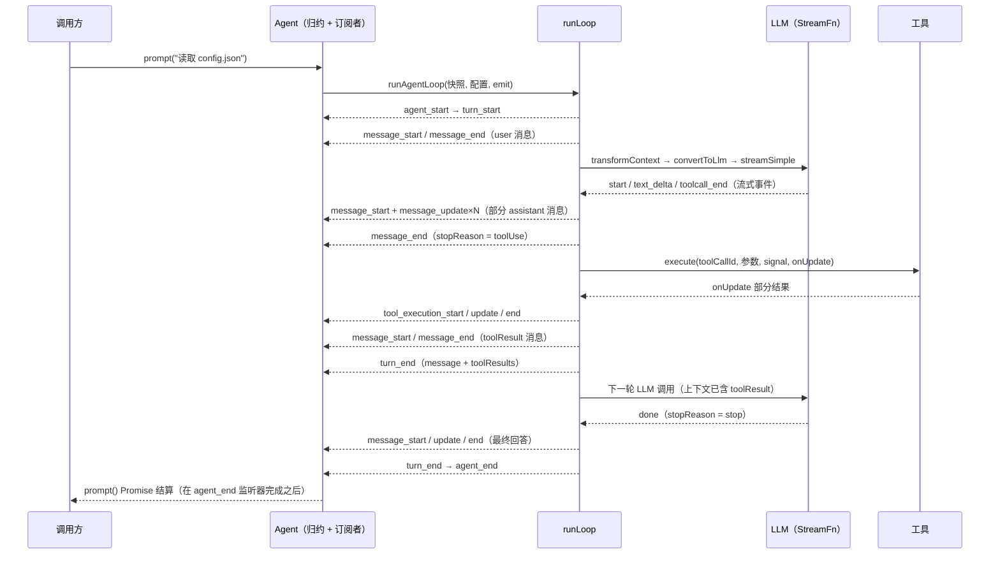
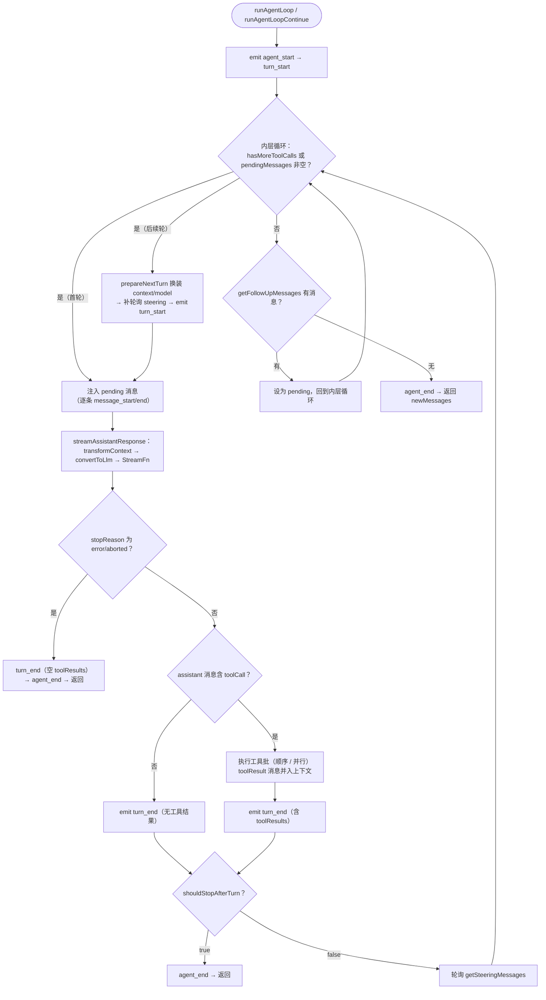
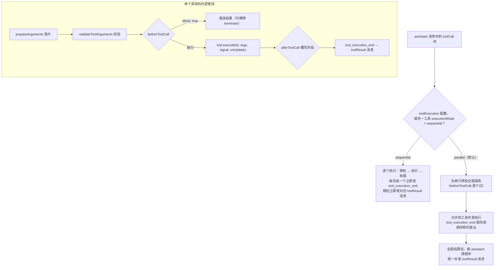

`packages/agent`（npm 包名 `@earendil-works/pi-agent-core`）是整个 pi 套件的智能体内核：它在 `@earendil-works/pi-ai` 提供的流式 LLM 接口之上，实现了一个**带工具执行能力的有状态智能体**。本页聚焦它的三个核心机制——事件流（`AgentEvent`）、工具调用管线（`agent-loop`）与状态管理（`AgentState` + 事件归约）。理解这三者，就掌握了 pi 中所有上层设施（Harness、coding-agent、SDK）共同依赖的运行时地基。

## 运行时全景：有状态外壳与无状态循环

运行时采用明确的两层架构。**`Agent` 类是有状态包装器**：它持有当前对话转录本、管理订阅者、暴露 `steer()`/`followUp()` 队列，并把生命周期事件归约为可读状态；**`agent-loop` 模块是无状态主循环**：`runAgentLoop()` 接收一个上下文快照、一个配置对象和一个事件发射器（`emit` 回调），跑完整个"流式响应 → 工具执行 → 下一轮"过程后返回新增消息列表，不保留任何实例状态。这种分离使得低层循环可以被 Harness 等宿主直接复用，而不必背负 `Agent` 的实例语义。

Sources: [agent.ts](packages/agent/src/agent.ts#L167-L173) · [agent-loop.ts](packages/agent/src/agent-loop.ts#L1-L4)

两条入口路径对应两种事件消费方式：`Agent.prompt()` 直接调用 `runAgentLoop()` 并把事件送入内部归约器；而低层 API `agentLoop()` 则把同一循环包装成一个 `EventStream<AgentEvent, AgentMessage[]>`——以 `agent_end` 事件作为完成信号、以其 `messages` 字段作为最终结果。`EventStream` 是 `pi-ai` 中的通用异步迭代原语，实现了"推入事件 + 最终结果 Promise"的语义，`Agent` 类走的则是更严格的同步归约路径（详见下文"事件即屏障"）。

Sources: [agent-loop.ts](packages/agent/src/agent-loop.ts#L32-L55) · [agent-loop.ts](packages/agent/src/agent-loop.ts#L146-L151) · [event-stream.ts](packages/ai/src/utils/event-stream.ts#L4-L89)

LLM 交互本身被抽象为一个 `StreamFn` 函数签名，`Models.streamSimple` 天然满足该形状。运行时对它有一条关键契约：**StreamFn 不允许抛错**——所有请求失败、模型错误或中止都必须编码进返回的事件流，最终以 `stopReason` 为 `"error"` 或 `"aborted"` 的 `AssistantMessage` 收尾。这条契约让主循环可以用统一的"消费事件流"方式处理成功与失败，无需 try/catch 分叉控制流。

Sources: [types.ts](packages/agent/src/types.ts#L18-L32) · [stream-fn.ts](packages/agent/src/stream-fn.ts#L5-L21)

```mermaid
flowchart TB
    subgraph Host["宿主应用（UI / SDK / Harness）"]
        UI["调用方"]
    end
    subgraph Core["pi-agent-core 运行时"]
        Agent["Agent 类（有状态外壳）"]
        Loop["agent-loop（无状态主循环）"]
        Reducer["processEvents（事件归约）"]
        State["AgentState（可变状态）"]
        Queue["steering / followUp 队列"]
    end
    subgraph Ai["pi-ai"]
        SF["StreamFn（Models.streamSimple）"]
        ES["EventStream 原语"]
    end
    UI --> "prompt / steer / subscribe / abort" --> Agent
    Agent --> "runAgentLoop(prompts, 快照, 配置)" --> Loop
    Agent --> Queue
    Loop --> "流式请求" --> SF
    Loop -. "低层 API agentLoop() 返回" .-> ES
    Loop --> "AgentEvent（emit 回调）" --> Reducer
    Reducer --> State
    State -. "上下文快照" .-> Loop
```

## 事件流：四层生命周期与订阅语义

`AgentEvent` 是一个判别联合类型，事件分为四个嵌套层级：**Agent 生命周期**（`agent_start`/`agent_end`）、**Turn 生命周期**（`turn_start`/`turn_end`，一个 turn = 一次助手响应 + 其工具调用与结果）、**Message 生命周期**（`message_start`/`message_update`/`message_end`，覆盖 user、assistant、toolResult 三类消息）、**Tool 执行生命周期**（`tool_execution_start`/`tool_execution_update`/`tool_execution_end`）。只有 assistant 消息会产生 `message_update`，且事件内嵌了原始的 `assistantMessageEvent`（text_delta、thinking_delta、toolcall_delta 等），UI 据此实现逐 token 渲染。

Sources: [types.ts](packages/agent/src/types.ts#L424-L446)

| 事件 | 作用 | 关键载荷 |
|---|---|---|
| `agent_start` / `agent_end` | 一次运行（prompt 或 continue）的起止 | `agent_end` 携带本次运行新增的全部消息 |
| `turn_start` / `turn_end` | 单轮 LLM 调用 + 工具执行的起止 | `turn_end` 携带 assistant 消息与 `toolResults` 数组 |
| `message_start` / `message_end` | 任意消息（user/assistant/toolResult）的起止 | 完整消息对象 |
| `message_update` | 仅 assistant 流式期间的增量 | 消息快照 + 原始 `assistantMessageEvent` |
| `tool_execution_start` / `update` / `end` | 单个工具调用的执行进度 | toolCallId、toolName、参数、部分/最终结果、`isError` |

Sources: [types.ts](packages/agent/src/types.ts#L431-L446) · [README.md](packages/agent/README.md#L163-L190)

订阅语义有两个精确边界值得注意。其一，`Agent.subscribe()` 的监听器**按注册顺序逐个 await**，每个监听器还会收到当前运行的 `AbortSignal`；其二，`agent_end` 只是"不会再有循环事件"的信号，而 `isStreaming` 归为 false、`waitForIdle()` 结算，都要等到该事件的全部被 await 监听器执行完毕之后。因此 `agent_end` 监听器常被用作运行收尾的同步屏障（例如刷新会话持久化）。

Sources: [agent.ts](packages/agent/src/agent.ts#L240-L253) · [agent.ts](packages/agent/src/agent.ts#L584-L591) · [README.md](packages/agent/README.md#L329-L339)

更关键的架构性质是：**对 `Agent` 类而言，事件即屏障**。主循环在每一步都 `await emit(...)`，监听器的异步处理完成后循环才继续。这意味着 assistant 的 `message_end` 处理完成后，工具预检才开始执行——`beforeToolCall` 钩子看到的 Agent 状态必然已包含发起工具调用的那条 assistant 消息。与之相反，低层 `agentLoop()` 返回的流是**纯观察性的**：它保持事件顺序，但不等待你的异步处理，需要屏障语义时必须使用 `Agent` 类。

Sources: [README.md](packages/agent/README.md#L150-L150) · [README.md](packages/agent/README.md#L513-L513)

一次带工具调用的 `prompt()` 完整事件时序如下：



Sources: [README.md](packages/agent/README.md#L69-L115) · [agent-loop.ts](packages/agent/src/agent-loop.ts#L96-L119)

## 主循环：双层 while 与消息注入点

`runLoop()` 的结构是一个**外层循环套内层循环**。内层循环的条件是 `hasMoreToolCalls || pendingMessages.length > 0`——每轮迭代做一次 LLM 调用、执行其工具批；只要助手还在发工具调用、或队列里还有待注入的 steering 消息，循环就继续。外层循环则处理"本该停止了，但 followUp 队列里还有消息"的情况：内层退出后轮询 `getFollowUpMessages()`，若取到消息就把它设为 pending 并回到内层，否则跳出并发射 `agent_end`。

Sources: [agent-loop.ts](packages/agent/src/agent-loop.ts#L153-L273)

每次 LLM 调用前有一个固定的转换边界：先执行可选的 `transformContext`（在 `AgentMessage` 层面做裁剪、压缩、注入），再执行必需的 `convertToLlm`（把任意 `AgentMessage[]` 过滤/转换为 LLM 能理解的 `Message[]`），最后组装 `Context{systemPrompt, messages, tools}` 并附上动态解析的 `getApiKey()` 结果。转换后循环进入 `streamAssistantResponse()`，逐个消费 provider 事件流：`start` 时把部分消息**就地推入循环的上下文数组**，每个增量事件替换数组末尾元素并发射 `message_update`，`done`/`error` 时以最终消息替换并发射 `message_end`。（这条管线的完整语义由下一页专门展开。）

Sources: [agent-loop.ts](packages/agent/src/agent-loop.ts#L275-L310)

turn 之间有四个精确的钩子时序：工具批执行完 → 发射 `turn_end` → `shouldStopAfterTurn` 有机会请求优雅停止（返回 true 则直接 `agent_end` 退出，不再轮询任何队列）→ 轮询 steering 队列 → 若循环继续，进入下一迭代时先执行 `prepareNextTurn`（可整体替换下一轮的 context/model/thinkingLevel，例如触发上下文压缩），随后再次补一次 steering 轮询并发射 `turn_start`。`prepareNextTurn` 可能长时间运行（如压缩），所以之后特意补一次轮询，避免"准备期间"到达的 steering 消息被延迟到下一轮。

Sources: [types.ts](packages/agent/src/types.ts#L202-L232) · [agent-loop.ts](packages/agent/src/agent-loop.ts#L176-L257)



Sources: [agent-loop.ts](packages/agent/src/agent-loop.ts#L171-L273)

steering 与 followUp 的区别在于**注入时机**：steering 消息在 turn 边界（工具全部执行完之后）被注入，用于"智能体还在工作时改方向"；followUp 消息只在智能体即将自然停止时被检查并注入，用于"排队下一件任务"。两种队列都支持 `QueueMode`——`"all"` 在注入点一次性倾倒全部积压消息，`"one-at-a-time"`（默认）每次只取最旧的一条。

Sources: [types.ts](packages/agent/src/types.ts#L234-L258) · [agent.ts](packages/agent/src/agent.ts#L125-L159) · [README.md](packages/agent/README.md#L341-L378)

## 工具调用管线：从 toolCall 到 toolResult

assistant 消息中的每个 `toolCall` 内容块都要经过一条固定管线。**预检阶段**（`prepareToolCall`）按序执行：查找工具（找不到立即产出错误结果）→ 可选的 `prepareArguments` 兼容垫片（在 schema 校验前修复原始参数）→ `validateToolArguments` 严格校验 → `beforeToolCall` 钩子（返回 `{block: true}` 即阻止执行并产出错误结果，可选携带 `reason` 与 `terminate`）。预检通过后进入**执行阶段**：`tool.execute(toolCallId, args, signal, onUpdate)`，工具通过 `onUpdate` 回调流式上报部分结果（回调被排队等待全部发出后才返回，且工具结算后迟到的更新会被安全忽略）。最后是**收尾阶段**：`afterToolCall` 钩子可逐字段覆写结果（content/details/isError/usage/terminate，无深合并），随后发射 `tool_execution_end` 并把结果物化为 `toolResult` 消息（content 为空时归一化为空数组，避免 null 进入会话历史）。

Sources: [agent-loop.ts](packages/agent/src/agent-loop.ts#L593-L675) · [agent-loop.ts](packages/agent/src/agent-loop.ts#L677-L718) · [agent-loop.ts](packages/agent/src/agent-loop.ts#L720-L803) · [types.ts](packages/agent/src/types.ts#L386-L412) · [test/agent.test.ts](packages/agent/test/agent.test.ts#L301-L364)

两个防护分支值得单独说明。其一，当 assistant 消息因输出 token 上限被截断（`stopReason === "length"`）时，**该消息内的所有工具调用一律不执行**：流式工具参数经过容错 JSON 修复后可能"恰好能解析但实际不完整"，贸然执行有风险，因此每个调用都收到一条"参数可能被截断，请重新发起"的错误结果，让模型自行重发。其二，中止信号在预检、执行前、执行中多处检查，被中止的工具调用产出 `"Operation aborted"` 错误结果并终止整批。

Sources: [agent-loop.ts](packages/agent/src/agent-loop.ts#L372-L404) · [agent-loop.ts](packages/agent/src/agent-loop.ts#L497-L545)



Sources: [agent-loop.ts](packages/agent/src/agent-loop.ts#L406-L424)

| 维度 | `sequential` | `parallel`（默认） |
|---|---|---|
| 执行方式 | 每个调用准备好、执行完、收尾后才轮到下一个 | 预检串行，允许的工具并发执行 |
| `tool_execution_end` 发出顺序 | 逐个按 assistant 源顺序 | **按工具完成顺序** |
| `toolResult` 消息顺序 | 逐个按源顺序 | 全部结算后**按 assistant 源顺序**统一补发 |
| 切换为 sequential 的条件 | 全局 `toolExecution: "sequential"`，或批内**任一**工具声明 `executionMode: "sequential"` | 默认 |

并行模式的"事件按完成序、消息按源序"是刻意设计：UI 能尽早呈现先完成的工具结果，而持久化到转录本的消息顺序始终与 assistant 发起调用的顺序一致。测试精确验证了这一排序契约：两个并发工具中先发起者后完成，事件 ID 顺序为 `[tool-2, tool-1]`，而 toolResult 消息与 `turn_end.toolResults` 均保持 `[tool-1, tool-2]`。

Sources: [agent-loop.ts](packages/agent/src/agent-loop.ts#L431-L561) · [test/agent-loop.test.ts](packages/agent/test/agent-loop.test.ts#L586-L679)

**早停规则（terminate）**是工具批与循环的接口：工具结果、被阻止的 `beforeToolCall`、`afterToolCall` 覆写均可声明 `terminate: true`，但它只有"整批一致"才生效——`shouldTerminateToolBatch()` 要求该批**每个**已收尾结果都为 true，内层循环才会把 `hasMoreToolCalls` 置为 false；混合批次继续正常执行。设计意图是：终止提示只是运行时提示（不写入转录本），且单点意愿不足以截断整批工作。

Sources: [types.ts](packages/agent/src/types.ts#L61-L95) · [agent-loop.ts](packages/agent/src/agent-loop.ts#L589-L591) · [README.md](packages/agent/README.md#L117-L133)

## 状态管理：事件归约与单一事实源

公开状态 `AgentState` 由两部分组成：**可写配置**（`systemPrompt`、`model`、`thinkingLevel`、`tools`、`messages`——后两者的 setter 会对顶层数组做防御性拷贝）和**只读运行时指示器**（`isStreaming`、`streamingMessage`、`pendingToolCalls`、`errorMessage`）。运行时指示器不允许外部赋值，它们完全由事件归约驱动。

Sources: [types.ts](packages/agent/src/types.ts#L328-L359) · [agent.ts](packages/agent/src/agent.ts#L61-L96)

| 字段 | 类型 | 归约来源 / 语义 |
|---|---|---|
| `systemPrompt` / `model` / `thinkingLevel` | 可写 | 随每次请求发送；`thinkingLevel` 为 off 时不下发 reasoning 参数 |
| `tools` / `messages` | 可写（顶层拷贝） | 对话转录本与可用工具 |
| `isStreaming` | 只读 | `runWithLifecycle` 置 true，直到 `agent_end` 监听器全部结算 |
| `streamingMessage` | 只读 | `message_start`/`message_update` 写入，`message_end`/`agent_end` 清空 |
| `pendingToolCalls` | 只读 | `tool_execution_start` 加入、`tool_execution_end` 移除的工具 id 集合 |
| `errorMessage` | 只读 | `turn_end` 中 assistant 消息携带 `errorMessage` 时记录 |

Sources: [agent.ts](packages/agent/src/agent.ts#L537-L591)

这里有一个值得注意的架构细节：运行时内部存在**两份并行演进的转录本**。`Agent` 在启动运行前通过 `createContextSnapshot()` 把 `state.messages` 拷贝一份交给低层循环，循环在自己的 `currentContext` 上直接 push（包括流式过程中的部分 assistant 消息，保证下次 LLM 调用可见）；而 `Agent` 的公开 `state.messages` 则完全由 `processEvents` 在 `message_end` 事件上追加。两份转录本由同一事件序列保持一致——公开状态是事件流的**确定性归约**，而非循环内部数组的直接暴露。

Sources: [agent.ts](packages/agent/src/agent.ts#L437-L443) · [agent-loop.ts](packages/agent/src/agent-loop.ts#L315-L335)

运行生命周期由 `runWithLifecycle` 独占管理：启动时创建 `AbortController` 与一个结算 Promise（`ActiveRun`），置 `isStreaming` 并清空临时状态；运行中再次调用 `prompt()`/`continue()`/`reset()` 都会被拒绝并提示改用 `steer()`/`followUp()`；结束时 `finishRun()` 清理运行时指示器并 resolve 结算 Promise——`waitForIdle()` 正是等待这个 Promise。`agent.abort()` 通过 AbortController 把取消信号同时传给 StreamFn、工具执行与循环内的多处检查点。

Sources: [agent.ts](packages/agent/src/agent.ts#L313-L345) · [agent.ts](packages/agent/src/agent.ts#L486-L535)

## 失败、中止与 continue

由于 StreamFn 契约保证"错误编码进流"，主循环的正常失败路径非常线性：最终消息的 `stopReason` 为 `error` 或 `aborted` 时，循环发射带空 `toolResults` 的 `turn_end`，紧接着发射 `agent_end` 后直接返回——不会尝试重试，也不会把错误向上抛。`errorMessage` 随后由 `turn_end` 归约进 `state.errorMessage`，调用方可在运行结束后检查。

Sources: [agent-loop.ts](packages/agent/src/agent-loop.ts#L215-L219) · [agent-loop.ts](packages/agent/src/agent-loop.ts#L344-L357)

针对契约违规（循环自身抛出异常）还有一道兜底：`handleRunFailure()` 会**合成一套完整的事件序列**——一条携带空文本与错误信息的 assistant 消息依次经历 `message_start`/`message_end`/`turn_end`/`agent_end`。这保证订阅者无论循环如何失败，都能观察到完整生命周期的四类终态事件，UI 状态机不会悬挂在半途。

Sources: [agent.ts](packages/agent/src/agent.ts#L511-L527)

`continue()` 提供了从既有转录本恢复执行的能力，其约束是转录本最后一条消息必须能转换为 `user` 或 `toolResult`（否则 provider 会拒绝请求）。它还有一个微妙分支：当最后一条消息是 assistant 时，`continue()` 不抛错而是先尝试消费 steering 队列（带 `skipInitialSteeringPoll` 防止双重注入）、再尝试 followUp 队列，两者皆空才抛出异常。这与 `agentLoopContinue()` 在低层 API 中"最后消息为 assistant 即抛错"的严格检查形成对照——`Agent` 类把这一情形转化为队列语义，低层 API 则把判断责任留给调用方。

Sources: [agent.ts](packages/agent/src/agent.ts#L360-L388) · [agent-loop.ts](packages/agent/src/agent-loop.ts#L57-L94)

## 延伸阅读

至此你已掌握运行时的骨架：`AgentEvent` 四层生命周期、双层主循环的注入点、工具管线的预检-执行-收尾三段式，以及"公开状态 = 事件归约"的设计。建议按以下顺序继续深入：

- **上下文如何变成 LLM 请求**：[AgentMessage 与上下文转换管线（transformContext / convertToLlm）](8-agentmessage-yu-shang-xia-wen-zhuan-huan-guan-xian-transformcontext-converttollm) —— 本页只触及转换边界的调用时机，下一页展开转换语义本身。
- **运行时之上的完整执行引擎**：[Agent Harness：系统提示词、钩子与执行引擎](9-agent-harness-xi-tong-ti-shi-ci-gou-zi-yu-zhi-xing-yin-qing) —— Harness 在同一循环之上叠加会话持久化与结构化驱动。
- **工具定义与参数校验的细节**：[工具定义、流式工具调用与参数校验](11-gong-ju-ding-yi-liu-shi-gong-ju-diao-yong-yu-can-shu-xiao-yan) —— `validateToolArguments` 与 typebox schema 在 pi-ai 侧的实现。
- **把运行时嵌入自有应用**：[AgentSession 与 SDK：将智能体嵌入自有应用](16-agentsession-yu-sdk-jiang-zhi-neng-ti-qian-ru-zi-you-ying-yong) —— coding-agent 如何包装 `Agent` 并把事件流映射到会话文件与 RPC。
- 也可以回看运行时的消费侧视角：[四种运行模式：交互、打印、JSON、RPC 与 SDK](6-si-chong-yun-xing-mo-shi-jiao-hu-da-yin-json-rpc-yu-sdk)。