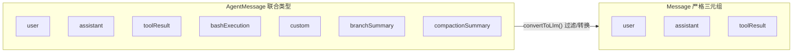
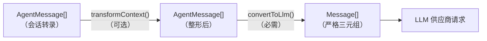
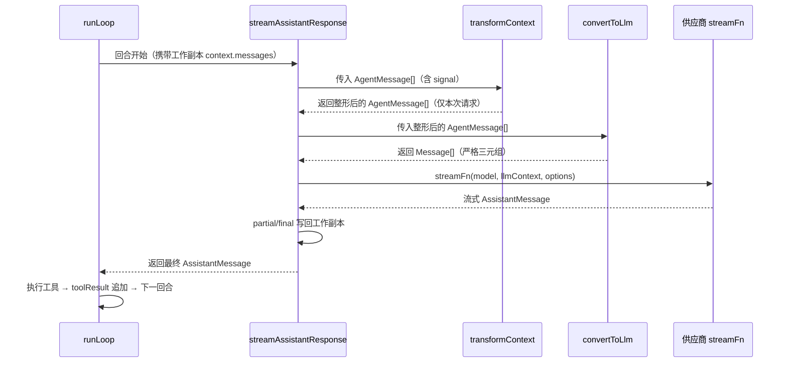

在 pi 的智能体内核中，存在两个"消息世界"：一个是应用层自由流淌的 `AgentMessage` 流——它可以携带终端 UI 记录、扩展注入内容、压缩摘要等任意业务状态；另一个是 LLM 供应商强制要求的严格三元组 `Message`（`user` / `assistant` / `toolResult`）。本页聚焦连接这两个世界的转换管线：`transformContext`（AgentMessage 级整形）与 `convertToLlm`（LLM 级投影）。你将理解这条管线的设计动机、执行时序、真实实现，以及如何扩展自己的消息类型。

## 一、为什么需要 AgentMessage：两层消息模型

LLM 供应商的接口只认三种角色：`user`、`assistant`、`toolResult`——这是 pi-ai 中 `Message` 类型的定义，也是任何一次供应商请求的硬性边界。`UserMessage` 承载文本或图文内容，`AssistantMessage` 承载模型的思考/文本/工具调用块以及 usage、stopReason 等运行元数据，`ToolResultMessage` 承载工具回执。

Sources: [types.ts](packages/ai/src/types.ts#L422-L470)

但终端编码智能体的需求远不止于此：`!` 前缀的 bash 执行记录要进入对话历史、扩展要通过 `sendMessage()` 注入消息、上下文压缩后要留下摘要占位、分支回退需要分支摘要——这些消息永远不该以"原始形态"发给模型。为此内核定义了 `AgentMessage = Message | CustomAgentMessages[keyof CustomAgentMessages]`，其中 `CustomAgentMessages` 是一个默认为空的接口，应用通过 TypeScript 的**声明合并**（declaration merging）向其中登记自己的消息类型。这样联合类型在编译期自动扩展，类型安全与灵活性兼得。

Sources: [types.ts](packages/agent/src/types.ts#L303-L326)

pi 自身就使用了这套扩展点。agent 包在 `harness/messages.ts` 中登记了四种内置自定义消息：`bashExecution`（bash 执行记录，支持 `excludeFromContext` 排除标记）、`custom`（扩展注入的通用消息）、`branchSummary`（分支摘要）与 `compactionSummary`（压缩摘要）。它们都是普通接口，仅通过 `declare module` 合并进 `CustomAgentMessages`，不侵入内核代码。

Sources: [messages.ts](packages/agent/src/harness/messages.ts#L19-L61)



上图中左侧是应用层可自由组合的消息集合，右侧是模型实际"看得见"的世界；中间唯一的通道就是 `convertToLlm`。理解了这一点，管线的存在意义就清楚了：**它不是可有可无的适配器，而是两个类型体系之间唯一的桥**。

Sources: [README.md](packages/agent/README.md#L51-L57)

## 二、管线总览：只在 LLM 调用边界转换

`agent-loop.ts` 文件头的第一行注释就是设计原则的陈述："Agent loop that works with AgentMessage throughout. Transforms to Message[] only at the LLM call boundary."（循环全程使用 AgentMessage，仅在 LLM 调用边界转换）。这意味着工具执行、事件分发、状态维护全部发生在 `AgentMessage` 层面，`Message[]` 只是发给供应商前的瞬时投影。

Sources: [agent-loop.ts](packages/agent/src/agent-loop.ts#L1-L4)

整条管线可以用一张图概括（前置说明：`transformContext` 是可选的、工作在 AgentMessage 层的整形步骤；`convertToLlm` 是必需的、输出严格三元组的投影步骤；箭头表示数据流向）：



Sources: [README.md](packages/agent/README.md#L59-L67)

两层转换有明确的分工：`transformContext` 解决"哪些消息、以什么形态进入上下文窗口"（剪枝旧消息、注入外部上下文），输入输出都是 `AgentMessage[]`；`convertToLlm` 解决"自定义消息如何翻译成模型能理解的三元组"（过滤 UI 专用消息、将 bash 记录转成 user 文本）。下面这张表总结了两者的契约差异：

| 维度 | transformContext | convertToLlm |
|---|---|---|
| 是否必需 | 可选 | 必需（`Agent` 提供默认实现） |
| 输入/输出 | `AgentMessage[]` → `Promise<AgentMessage[]>` | `AgentMessage[]` → `Message[]`（可异步） |
| 层级 | AgentMessage 层 | LLM 消息层 |
| 典型用途 | 上下文窗口管理、注入外部上下文 | 过滤 UI 消息、翻译自定义类型 |
| 额外参数 | 接收 `AbortSignal`，可被中断 | 无 signal，须幂等且不抛错 |
| 错误契约 | 不得 throw/reject，返回原消息或安全回退 | 不得 throw/reject，抛错会绕过正常事件序列 |

Sources: [types.ts](packages/agent/src/types.ts#L149-L200)

一个容易被忽略但至关重要的语义：**管线是"每请求投影"，不回写主转录**。在循环内部，`streamAssistantResponse` 把 `context.messages` 赋给局部变量、依次经过两个变换函数后构建 `llmContext`；`transformContext` 的返回值只用于本次供应商请求，永远不会写回循环的工作副本，更不会写回 `Agent` 的持久转录。会话"真相源"由事件流增量维护——`message_end` 事件到达时才把消息 push 进 `Agent` 的状态数组。这意味着扩展在 `transformContext` 中做的剪枝是"视图级"的，压缩摘要等持久化变更则必须走会话层（详见[会话 JSONL 格式与 SessionManager](21-hui-hua-jsonl-ge-shi-yu-sessionmanager)）。

Sources: [agent-loop.ts](packages/agent/src/agent-loop.ts#L286-L310), [agent.ts](packages/agent/src/agent.ts#L544-L557)

## 三、convertToLlm：从联合类型到严格三元组

`AgentLoopConfig.convertToLlm` 是必需项，其文档注释明确了三条契约：每条 `AgentMessage` 必须被转换为 `UserMessage`、`AssistantMessage` 或 `ToolResultMessage`；无法转换的消息（如 UI 通知、状态消息）应被过滤掉；函数不得抛错或拒绝，抛错会中断底层循环且不产生正常事件序列。

Sources: [types.ts](packages/agent/src/types.ts#L152-L178)

`Agent` 类的默认实现是纯过滤——只保留三种标准 role 的消息，自定义消息一律丢弃：

```typescript
function defaultConvertToLlm(messages: AgentMessage[]): Message[] {
	return messages.filter(
		(message) => message.role === "user" || message.role === "assistant" || message.role === "toolResult",
	);
}
```

一旦你引入了自定义消息类型且希望模型"看到"它，就必须提供自己的 `convertToLlm`。构造 `Agent` 时，选项 `convertToLlm ?? defaultConvertToLlm` 的回退逻辑保证了这个字段永远有值，而 `transformContext` 则保持为可选的 `undefined`。

Sources: [agent.ts](packages/agent/src/agent.ts#L33-L37), [agent.ts](packages/agent/src/agent.ts#L216-L238)

还有一条隐式契约写在 `agentLoopContinue` 的注释里：**转换每回合只发生一次**，因此续跑时上下文的最后一条消息必须能经 `convertToLlm` 变成 `user` 或 `toolResult`，否则供应商会直接拒绝请求——循环层无法提前校验这一点，因为它看不到转换后的结果。重试/续跑场景（最后一条是 assistant 时不可 continue）正是围绕这个约束设计的。

Sources: [agent-loop.ts](packages/agent/src/agent-loop.ts#L57-L63)

coding-agent 提供了最完整的参考实现。它的 `convertToLlm` 用穷尽 switch 处理每种 role，并利用 TypeScript 的 never 检查保证新增自定义类型时忘记处理会编译报错。下表列出每种消息的翻译规则：

| 源消息 role | 转换规则 | 结果 role |
|---|---|---|
| `bashExecution` | `excludeFromContext` 为真则剔除；否则用 `bashExecutionToText()` 渲染为含命令、输出、退出码、截断标记的文本 | `user` |
| `custom` | 字符串内容包成 `[TextContent]`，或直接透传内容数组 | `user` |
| `branchSummary` | 包裹 `BRANCH_SUMMARY_PREFIX`/`SUFFIX` 标签文本 | `user` |
| `compactionSummary` | 包裹 `COMPACTION_SUMMARY_PREFIX`/`SUFFIX` 标签文本 | `user` |
| `user` / `assistant` / `toolResult` | 原样直通 | 同名 role |
| 其他未知 role | 穷尽检查兜底，返回 `undefined` 被过滤 | （无） |

Sources: [messages.ts](packages/coding-agent/src/core/messages.ts#L140-L195)

生产环境中 `convertToLlm` 还常被用作**防御性过滤的最后闸口**。coding-agent 的 SDK 用 `convertToLlmWithBlockImages` 包装基础转换：先执行标准 `convertToLlm`，再在 `blockImages` 设置开启时把所有 user/toolResult 消息里的图片内容替换为"图片读取已禁用"的占位文本，并去重连续占位符。注释明确说明这是纵深防御（defense-in-depth），且设置是动态读取的，会话中途改设置立即生效。

Sources: [sdk.ts](packages/coding-agent/src/core/sdk.ts#L267-L313)

`convertToLlm` 的价值不止于供应商请求：压缩流程用它把混合了自定义类型的转录序列化为纯文本喂给总结模型，保证"模型看到的上下文"与"总结器看到的上下文"是同一份翻译结果，避免两套转换逻辑漂移。

Sources: [compaction.ts](packages/coding-agent/src/core/compaction/compaction.ts#L683-L686)

## 四、transformContext：AgentMessage 级的上下文整形

`transformContext` 是可选钩子，签名 `(messages: AgentMessage[], signal?: AbortSignal) => Promise<AgentMessage[]>`，文档注释给出的定位是：工作在 AgentMessage 层、执行于 `convertToLlm` 之前，典型用途是上下文窗口管理（剪枝旧消息）与注入外部来源的上下文。同样适用"不抛错"契约——异常时应返回原始消息或其他安全回退值。

Sources: [types.ts](packages/agent/src/types.ts#L180-L200)

执行顺序由测试固定："should apply transformContext before convertToLlm" 这个用例构造了 4 条历史消息加 1 条新提示，`transformContext` 只保留最后 2 条，随后断言 `convertToLlm` 恰好收到了这 2 条——证明前者先裁剪、后者再投影，二者是串联而非并行。

Sources: [agent-loop.test.ts](packages/agent/test/agent-loop.test.ts#L221-L272)

coding-agent 中这条管线还承担着**扩展系统与内核的接口**职责：`transformContext` 被实现为对 `ExtensionRunner.emitContext(messages)` 的委托。`emitContext` 先对消息做 `structuredClone` 深拷贝（确保扩展无法篡改真实转录），然后按注册顺序依次调用每个扩展的 `context` 事件处理器，任一处理器返回带 `messages` 的结果就替换当前列表，形成链式变换；扩展抛出的异常被捕获并转为错误上报，不中断管线。这正是[扩展系统](19-kuo-zhan-xi-tong-shi-jian-lan-jie-zi-ding-yi-gong-ju-yu-zi-ding-yi-ui)页面中"事件拦截"能力在上下文维度的落点。

Sources: [sdk.ts](packages/coding-agent/src/core/sdk.ts#L362-L366), [runner.ts](packages/coding-agent/src/core/extensions/runner.ts#L1034-L1064)

需要区分 `transformContext` 与另外两个上下文操控点的语义边界，三者都发生在回合之间但持久性完全不同：

| 操控点 | 持久性 | 作用时机 | 典型用途 |
|---|---|---|---|
| `transformContext` | 投影级：仅本次请求，不回写转录 | 每次供应商请求前 | 视图级剪枝、临时注入 |
| `prepareNextTurn` | 会话级：可整体替换 `context`/`model`/`thinkingLevel` | `turn_end` 之后、下一回合之前 | 跨回合的持久上下文替换（如压缩） |
| `shouldStopAfterTurn` | 无：只决定是否提前停止 | `turn_end` 之后 | "上下文快满前优雅停机" |

Sources: [agent-loop.ts](packages/agent/src/agent-loop.ts#L176-L198), [types.ts](packages/agent/src/types.ts#L212-L232)

在 coding-agent 的真实语境里，持久性的上下文替换由会话层完成：压缩完成后，`SessionManager.buildContextEntries()` 会把 compaction 条目投影成 `CompactionSummaryMessage` 并省略已被摘要的旧条目——重建出的就是一份"已经压缩过"的 `AgentMessage[]`，它随后作为普通转录流经 `transformContext` 与 `convertToLlm`，最终以带标签的 user 文本形态抵达模型。压缩算法本身不在本页展开，详见[会话管理：树形分支、上下文压缩与导出](5-hui-hua-guan-li-shu-xing-fen-zhi-shang-xia-wen-ya-suo-yu-dao-chu)。

Sources: [session-manager.ts](packages/coding-agent/src/core/session-manager.ts#L380-L407)

## 五、执行时序：管线在循环中的调用点

前置说明：`runLoop` 是内外双层循环——外循环处理 follow-up 队列，内循环处理工具调用与 steering 消息；`streamAssistantResponse` 是每次供应商请求的入口。下面的时序图展示一次带工具调用的完整回合中管线的触发位置：



Sources: [agent-loop.ts](packages/agent/src/agent-loop.ts#L156-L273)

几个值得注意的细节。第一，`transformContext` 接收 abort signal，这意味着耗时变换（如扩展同步外部索引）可以被用户中断；第二，`convertToLlm` 不接收 signal，契约上要求它足够快且不阻塞；第三，供应商返回的流式 assistant 消息是增量写入循环工作副本的（`context.messages[context.messages.length - 1] = partialMessage`），每回合一次替换，最终落定的才是转录内容——这保证了管线的输入永远是"已完成的干净转录"。

Sources: [agent-loop.ts](packages/agent/src/agent-loop.ts#L275-L310), [agent-loop.ts](packages/agent/src/agent-loop.ts#L312-L321)

`Agent` 类对管线的持有方式也体现了它的公共 API 属性：`convertToLlm` 与 `transformContext` 是公开字段，由构造函数从 `AgentOptions` 装配，再经 `createLoopConfig()` 原样传递给底层 `runAgentLoop`。快照同样在此处构造——`createContextSnapshot()` 对 messages 和 tools 做 `slice()` 拷贝，让循环在独立的数组上工作。

Sources: [agent.ts](packages/agent/src/agent.ts#L179-L181), [agent.ts](packages/agent/src/agent.ts#L437-L484)

## 六、新 Harness 中的对应物（演进视角）

仓库正在向实验性的 `AgentHarness` 架构迁移（详见[Agent Harness：系统提示词、钩子与执行引擎](9-agent-harness-xi-tong-ti-shi-ci-gou-zi-yu-zhi-xing-yin-qing)），同一条管线在那里以新名字出现。`AgentHarnessOptions` 提供 `toProviderMessages?: (messages: AgentMessage[], context: Context) => Message[] | Promise<Message[]>`，其默认值正是复用 agent 包的 `convertToLlm(messages)`——语义等价的翻译函数换了个更准确的名字。

Sources: [agent-harness.ts](packages/agent/src/harness/agent-harness.ts#L530-L535), [harness.ts](packages/agent/src/harness/runtime/harness.ts#L59-L74)

Harness 的请求流程 `streamHarnessAssistant` 保持了相同的两步顺序：先对请求上下文应用 `transformContext`，再调用 `toProviderMessages` 得到供应商消息，最后组装 `AiContext`（即 pi-ai 的 `Context`）发起请求。区别在于 harness 版本的每一步都接入了自己的钩子体系（`transform_context`、`before_request`、`before_payload` 等），可观测性与重放控制更强：

| AgentLoop（现行） | AgentHarness（实验） | 说明 |
|---|---|---|
| `convertToLlm` | `toProviderMessages` | 重命名，默认实现直接复用旧函数 |
| `transformContext` | `transformContext` + `transform_context` 钩子 | 钩子按请求尝试执行，含重试与重放 |
| 直接调用 `streamFn` | `Models` 网关 + `drive.gate.admit` | 供应商访问被集中管控 |
| 事件流 `AgentEvent` | HarnessEventBus + telemetry 集成 | 全链路遥测 |

Sources: [assistant.ts](packages/agent/src/harness/execution/assistant.ts#L136-L151)

## 七、扩展自定义消息类型的标准姿势

最后把本页内容收敛为可操作的步骤。假设你的应用需要一种模型可以理解的 `artifact` 消息：

1. **定义接口**：为你的消息定义带唯一 `role` 的接口（内置示例：`CustomMessage` 的 `role: "custom"` + `customType` 区分具体种类）。
2. **声明合并**：在应用入口处 `declare module "@earendil-works/pi-agent-core" { interface CustomAgentMessages { artifact: ArtifactMessage } }`，让 `AgentMessage` 联合类型自动纳入新成员。
3. **提供转换器**：把处理全部自定义 role 的 `convertToLlm` 传给 `Agent` 构造函数；用穷尽 switch（never 断言）防止未来新增类型时遗漏。
4. **按需加 transformContext**：需要窗口管理或外部上下文注入时才提供，并遵守"不抛错、不回写"契约。

测试中的自定义 `notification` 消息展示了最小可行路径：定义消息、在 `convertToLlm` 中按 role 过滤，模型最终只看到一条 user 消息。同样的模式已被自定义消息测试与穷尽 switch 实现双重验证。

Sources: [agent-loop.test.ts](packages/agent/test/agent-loop.test.ts#L166-L219), [messages.ts](packages/coding-agent/src/core/messages.ts#L140-L195)

---

理解了 `AgentMessage` 与这条两段式转换管线，你就掌握了 pi 内核"应用自由度"与"供应商约束"的和解之道：转录层永远保持类型丰富、可序列化、可分支，而模型层永远只看到严格三元组。下一步建议沿目录继续阅读：向上看[Agent 运行时：事件流、工具调用与状态管理](7-agent-yun-xing-shi-shi-jian-liu-gong-ju-diao-yong-yu-zhuang-tai-guan-li)了解管线外层的事件与状态循环，向下看[Agent Harness：系统提示词、钩子与执行引擎](9-agent-harness-xi-tong-ti-shi-ci-gou-zi-yu-zhi-xing-yin-qing)了解管线的演进形态，或跳转[扩展系统：事件拦截、自定义工具与自定义 UI](19-kuo-zhan-xi-tong-shi-jian-lan-jie-zi-ding-yi-gong-ju-yu-zi-ding-yi-ui)学习如何通过 `context` 事件参与 `transformContext` 阶段。