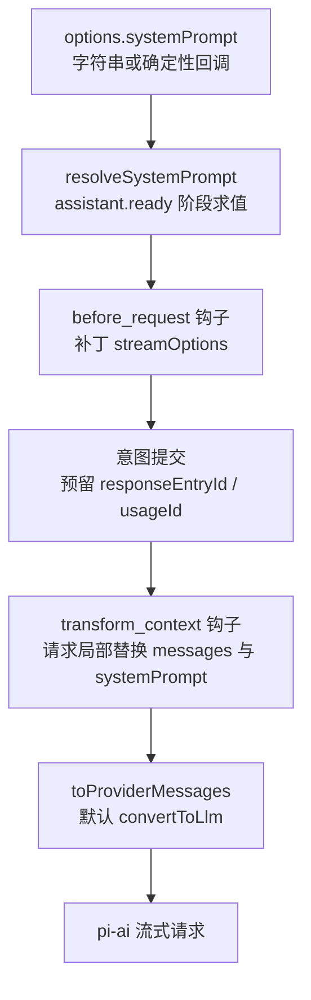
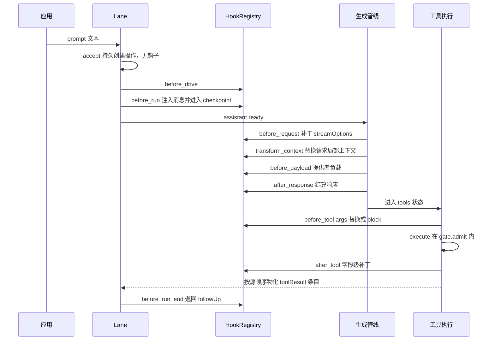
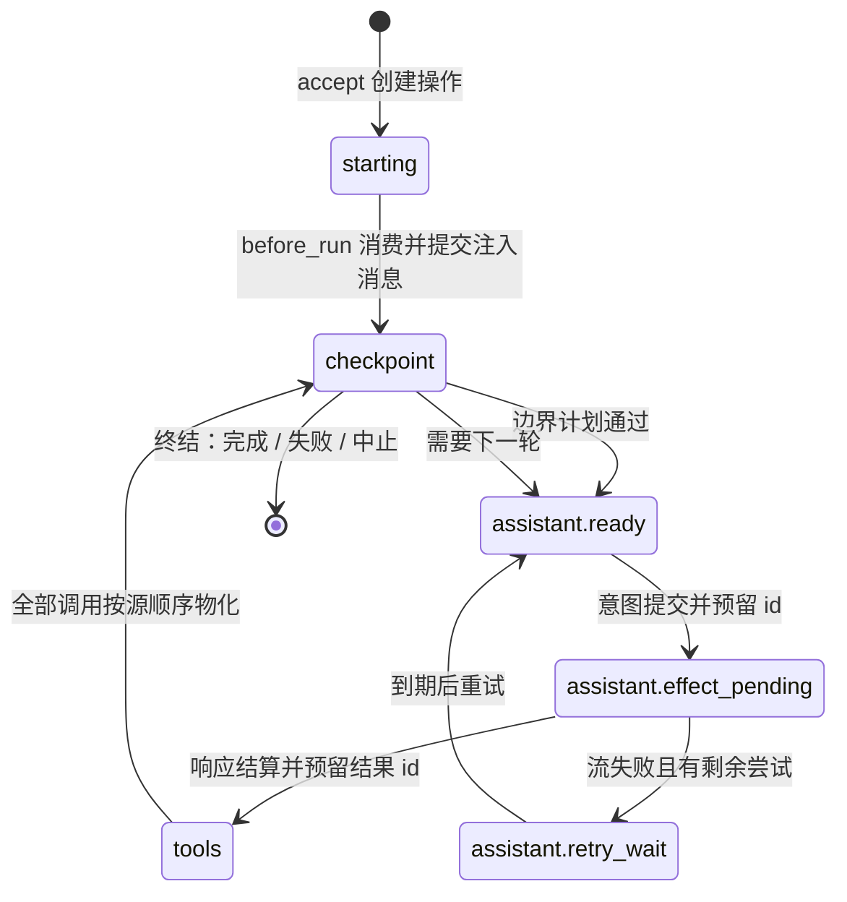

在 pi 的智能体内核三层结构中，`packages/agent` 包同时提供了两套运行时：一套是轻量的进程内循环（属"Agent 运行时"一篇的范围），另一套则是本文的主角——**Agent Harness**，一个面向持久化与崩溃恢复的完整执行引擎。它位于 `packages/agent/src/harness/` 目录，约 5600 行 TypeScript，并附有一份长达 1469 行的规范性实现规格（`docs/harness.md`，以 §N.M 编号供交叉引用）。本文面向高级开发者，从第一性原理出发拆解该引擎的三大支柱：**系统提示词的求值管线**、**钩子系统的扩展点语义**，以及**以"接受/驱动"两段式为核心的状态机执行引擎**。

## 一、Harness 的定位：为什么需要"持久化运行时"

规格文档将 Harness 定义为"智能体对话的持久化运行时：它持久化对话与操作状态，使中断的工作能够恢复而无需重复已结算的效果"。系统模型把一个**会话（Session）**拆为四部分：不可变的**条目树**（消息、压缩、分支摘要或应用自定义条目）、绑定类型地址的**可变值与列表**、追加式的**用量账本**，以及由 Harness 驱动的**操作（Operation）**。核心不变量是"三个存储、一个不变量"：每个载荷要么在条目里，要么在绑定值/列表里，要么在账本里，不存在第四个地方。

这一模型的理论根基是**意图-结算两段提交**：提供者请求与真实工具调用被包裹在两次提交之间——先提交意图（"即将做 X；输出将使用 id R 和 U"），再执行不确定的效果，最后提交结算（完整输出 + 下一状态）。进程在任意两次事务之间被杀死后重启，Harness 读取 lane 的必需值即可判断哪个提交已落盘，并从该点继续，绝不重放已结算的效果。

Sources: [harness.md](packages/agent/docs/harness.md#L13-L18)
Sources: [harness.md](packages/agent/docs/harness.md#L33-L42)

## 二、架构总览：组件关系

Harness 的实现分为四层：公共类型面（`agent-harness.ts`）、运行时单例（`runtime/harness.ts`）、每分支一条的 Lane（`runtime/lane.ts`），以及无状态的过程模块（`runtime/drive/` 与 `execution/`）。宿主应用通过 `AgentHarness.create` 工厂（如 coding-agent 的 session worker 所做的那样）把 Harness 附着到一个已打开的 Session 上。

```mermaid
flowchart TB
    App["宿主应用：CLI / SDK / 扩展"] -->|"AgentHarness.create"|" H
    subgraph RUNTIME["Harness 运行时"]
        H["Harness 类<br/>持有配置快照 Config"]
        HR["HookRegistry<br/>钩子注册表"]
        EB["HarnessEventBus<br/>事件总线"]
    end
    H --> L
    subgraph LANE["Lane 层：每分支一条"]
        L["Lane<br/>accept / drive / requestAbort"]
        D["Drive 驱动循环<br/>driveOperation"]
        G["Effect Gate<br/>效果闸门"]
    end
    D --> GEN
    D --> TOOLS
    subgraph EXEC["执行过程模块"]
        GEN["streamHarnessAssistant<br/>生成管线"]
        TOOLS["工具两阶段流水线"]
    end
    L -->|"事务读写"| SES["Session / Storage<br/>三存储 + 原子事务"]
    GEN -->|"流式请求"| AI["pi-ai 模型接口"]
```

配置以**快照 + 替换**的方式管理：`Harness` 构造函数把 `AgentHarnessOptions` 中的工具、资源、流选项、重试策略、压缩设置、转向模式等一次性装入 `Config`，此后所有 setter（`setModel`、`setTools`、`setStreamOptions`……）都是整体替换并广播 `config_update` 事件。Lane 在每次"接受"操作时读取当前配置作为该操作的接受快照，实现**配置与执行的时序解耦**。

Sources: [agent-harness.ts](packages/agent/src/harness/agent-harness.ts#L518-L536)
Sources: [harness.ts](packages/agent/src/harness/runtime/harness.ts#L29-L68)
Sources: [session-worker.ts](packages/coding-agent/src/experimental/session-worker.ts#L830-L840)

## 三、系统提示词管线：从选项到提供者请求

Harness 不内置任何提示词文案，而是把系统提示词定义为 `AgentHarnessOptions.systemPrompt`——既可以是静态字符串，也可以是 `(toolContext, context) => string | Promise<string>` 形式的回调。这条管线的关键设计是**求值时机的精确控制**：

- `systemPrompt`、`toolContext`、`toProviderMessages`、`entryProjectors` 被规格标记为**确定性/幂等回调**：它们接收当前调用的 Context，崩溃后允许重复执行；有副作用的拦截属于钩子的职责。
- `systemPrompt` 在**每次提供者请求时**求值（`resolveSystemPrompt`），而 `transform_context` 钩子随后可在**请求局部**同时替换消息列表与提示词——但持久的、run 级的消息注入必须走 `before_run`，请求局部的变换不允许污染持久历史。



工具上下文 `toolContext` 的解析时机与提示词不同：它在**每个活跃工具批次**解析一次（而非每次调用），同一个上下文实例传递给该批次的所有工具调用。这为 read/write/edit/bash 这类共享文件系统状态的工具提供了稳定的上下文窗口。

Skills 与提示模板最终也汇入这条管线：`formatSkillsForSystemPrompt` 把可见的 Skill 列表渲染为 `<available_skills>` XML 块（含转义后的 name/description/location），宿主应用（如 coding-agent）把这个块拼进 `systemPrompt` 回调的返回值。规格明确要求：`disableModelInvocation` 的 skill 仍然可以通过 `lane.skill(name)` 显式调用，只是不出现在模型可见清单中。

Sources: [agent-harness.ts](packages/agent/src/harness/agent-harness.ts#L518-L536)
Sources: [generation.ts](packages/agent/src/harness/runtime/drive/generation.ts#L56-L66)
Sources: [harness.md](packages/agent/docs/harness.md#L1094-L1094)
Sources: [system-prompt.ts](packages/agent/src/harness/system-prompt.ts#L3-L27)
Sources: [types.ts](packages/agent/src/harness/types.ts#L49-L58)

## 四、钩子系统：十一个扩展点与聚合语义

钩子是 Harness 唯一的"有副作用拦截通道"。`HookMap` 在类型层枚举了全部十一个钩子，每个条目声明 `event`（入参）与 `result`（聚合返回）两个成员；`HookInvocation` 在此之上追加 `lane` 与 `runId` 两个标识字段，`HookHandler` 的第二个参数是显式的 `Context`。

| 钩子 | 事件负载 | 聚合返回值 | 作用域 |
|---|---|---|---|
| `before_drive` | `{ operation }` | void（**fail-closed**） | 每个新安装的驱动 pass |
| `before_run` | `{ prompt, resources }` | `{ messages? }` | run 持久处于 `starting` 时 |
| `before_run_end` | `{ runId, messages }` | `{ followUp? }` | 正常结束边界（中止/失败不触发） |
| `transform_context` | `{ messages, systemPrompt }` | `{ messages?, systemPrompt? }` | 每次请求尝试，AgentMessage 层 |
| `before_request` | `{ model, step, attempt, streamOptions }` | `{ streamOptions? }` | 每次请求尝试（含重试与重放） |
| `before_payload` | `{ model, payload }` | `{ payload }` | 提供者线上负载序列化前 |
| `after_response` | `{ status?, headers?, message }` | `{ message? }`（须保留 role） | 每个已结算响应 |
| `before_tool` | `{ toolCallId, toolName, args }` | `{ args?, block? }`（**fail-closed**） | 参数验证之后、执行之前 |
| `after_tool` | `{ …, content, isError, usage? }` | 字段级补丁 `{ content?, details?, isError?, usage?, terminate? }` | 执行之后、结算之前 |
| `before_compaction` | `{ reason, preparation }` | `{ decline?, compaction? }` | 压缩决策点 |
| `before_navigation` | `{ targetId, preparation }` | `{ decline?, summary? }` | 仅摘要式导航 |

Sources: [agent-harness.ts](packages/agent/src/harness/agent-harness.ts#L430-L514)
Sources: [harness.md](packages/agent/docs/harness.md#L1174-L1195)

### 聚合与失败语义

`HookRegistry` 按注册顺序串联所有 handler，每个 handler 都能看到前序聚合输出。失败语义被明确分为两类：**默认 fail-open**——handler 抛错时上报一条 `handler_error` 事件、跳过该 handler、其余继续执行；**fail-closed 例外**——`before_drive` 失败会拒绝整个驱动 pass（不产生持久进度），`before_tool` 失败会直接把错误 reason 变成对工具调用的阻止。聚合规则也各有差异：`before_run` 累积注入消息且每个后续 handler 都能看到先前注入；`before_tool` 的参数替换链式叠加且**重新校验**，首个 block 是终态（后续 handler 不再运行）；`before_compaction`/`before_navigation` 在第一个 decline 或结果处停止；`before_run_end` 取最新定义的 followUp。

与效果闸门的集成方式值得注意：**一次钩子聚合调用 = 一次 `drive.gate.admit(...)`**，包裹的是整条注册管线而非单个 handler。这意味着取消信号在整个聚合期间生效，而 handler 之间不会出现"部分已过闸门"的不一致状态。工具类钩子（`before_tool`/`after_tool`）走 `runToolWithGate`，为每个注册的 handler 单独打遥测 span。

Sources: [hooks.ts](packages/agent/src/harness/hooks.ts#L15-L63)
Sources: [hooks.ts](packages/agent/src/harness/hooks.ts#L89-L188)
Sources: [harness.md](packages/agent/docs/harness.md#L1201-L1204)

### 一次 prompt 的钩子轨迹



`before_request` 的返回不是替换而是**补丁**：`applyStreamOptionsPatch` 对 headers 与 metadata 采用"undefined 值删除键、显式 `headers: undefined` 清空全部"的差量语义，其余字段按存在性覆盖。钩子返回值与声明类型不符被规格归为"扩展缺陷"而非运行时校验错误——这是受信任的内部契约。

Sources: [checkpoint.ts](packages/agent/src/harness/runtime/drive/checkpoint.ts#L25-L58)
Sources: [generation.ts](packages/agent/src/harness/runtime/drive/generation.ts#L90-L135)
Sources: [generation.ts](packages/agent/src/harness/runtime/drive/generation.ts#L174-L206)
Sources: [hooks.ts](packages/agent/src/harness/hooks.ts#L446-L490)

## 五、执行引擎：accept/drive 状态机与效果闸门

Harness 驱动 lane 的公共原语只有四个：`accept`（持久创建操作，不启动任务或效果）、`drive`（推进一个已接受的操作）、`requestAbort`（持久请求取消）、`inspectExecution`（原子报告当前与最近操作）。**接受与执行所有权是分离的**：`accept` 是纯持久事务——校验输入、预留操作 id、写 `pi.op.meta` 与初始状态，失败时（lane 忙、消息非法、未知 skill/模板等）不写任何内容；真正的执行由 `drive` 的调用方拥有，没有 drive，操作只是躺在存储里的一个状态记录。

驱动循环 `driveOperation` 是一个**无记忆的过程循环**：每轮读取 lane 的当前操作状态，按 `state.at` 字段分发到对应过程，过程要么结算（返回终态结果）、要么等待（返回带 `notBefore`/deferred 句柄的等待结果）、要么提交进度后继续。状态机的关键节点包括 `starting`（消费 before_run）、`checkpoint`（入队计划与边界）、`assistant.ready` → `assistant.effect_pending`（生成意图与流）、`tools`（工具批次）、`summary.*`（压缩/导航摘要）、`navigation.ready_to_commit`。规格要求每个过程**必须取得进展**——循环内检测到"状态未变且未请求取消"会直接抛出 `SessionInvariantError`，这是防止静默死循环的自检。



Sources: [agent-harness.ts](packages/agent/src/harness/agent-harness.ts#L538-L585)
Sources: [lane.ts](packages/agent/src/harness/runtime/lane.ts#L480-L560)
Sources: [drive.ts](packages/agent/src/harness/runtime/drive.ts#L29-L106)
Sources: [harness.md](packages/agent/docs/harness.md#L736-L740)

### 效果闸门与中止

每个驱动 pass 配有一把**效果闸门**，由 `createGate()` 创建出两个视图：过程侧的 `Gate`（`admit(invoke)` 同步检查 + `signal`）与所有者侧的 `GateControl`（`beginAbort`/`signalAbort`/`close`）。闸门三态：open → aborting → closed。进入"取消中"状态后，任何 `admit` 调用抛出携带 cancellation promise 的 `AbortRequested`；驱动循环捕获它后 `await error.cancellation` 再继续，从而把"取消"转化为**可预期的内部控制流**而非异常逃逸。`requestAbort` 本身也是持久事务——请求落盘后，正在运行的 pass 与崩溃恢复后的新 pass 都会看到同一份取消意图。

Sources: [effect-gate.ts](packages/agent/src/harness/execution/effect-gate.ts#L1-L65)
Sources: [drive.ts](packages/agent/src/harness/runtime/drive.ts#L78-L92)
Sources: [agent-harness.ts](packages/agent/src/harness/agent-harness.ts#L128-L135)

### 工具执行两阶段流水线

工具执行的编排分布在三层：`execution/tools.ts` 提供无状态的纯函数阶段，`drive/tools.ts` 负责持久化与恢复决策，`lane.ts` 提供序列化的命令行。一次工具调用经过六个阶段：

| 阶段 | 实现函数 | 职责 |
|---|---|---|
| 1 准备 | `prepareToolCall` | 解析工具、执行 `prepareArguments`、`validateToolArguments` 校验 |
| 2 拦截 | `applyBeforeToolDecision` | block → 立即合成错误结果；args 替换 → 重新校验 |
| 3 意图 | `publishToolIntent` | 持久化有效参数（`pi.op.tool_args`），标记 `effect_pending` + replay 策略 |
| 4 执行 | `executeToolCall` | `gate.admit` 内执行；`onUpdate` 进度与 `checkpoint: true` 恢复点 |
| 5 修补 | `finalizeToolCall` | `after_tool` 字段级补丁合并 |
| 6 结算 | staging + 物化 | 暂存完整结果 → `outcome_ready` → 按助手**源顺序**物化为条目 |

被阻止、非法或工具缺失的调用**跳过意图/执行但仍暂存合成结果**（`isError: true` 的 `ToolResultMessage`），批次继续、对话不中断。一个精细的细节是顺序约定：**效果按完成顺序结算，条目按助手源顺序物化**——较早源位置的调用未就绪时，已就绪的调用只暂存不插树，保证最终树中 toolResult 与 toolCall 的排列与模型发出调用时一致。

工具恢复点（checkpoint）契约同样值得记录：`onUpdate(partial, { checkpoint: true })` 请求替换该调用的有界持久进度快照；工具自行控制节奏与去重，Harness 保证不丢弃、不合并每次请求，且结算前会等待最新的更新投递与检查点写入 promise 各自完成。工具还通过 `AgentHarnessToolInvocation` 获得调用级稳定的 `invocationId` 与 `getMemo`/`setMemo` 持久备忘录能力——这是 `replay: "safe"` 工具实现幂等性的官方通道。

Sources: [tools.ts](packages/agent/src/harness/execution/tools.ts#L78-L180)
Sources: [tools.ts](packages/agent/src/harness/runtime/drive/tools.ts#L86-L135)
Sources: [tools.ts](packages/agent/src/harness/runtime/drive/tools.ts#L436-L490)
Sources: [types.ts](packages/agent/src/harness/types.ts#L96-L116)
Sources: [harness.md](packages/agent/docs/harness.md#L473-L473)

### 崩溃恢复与 replay 契约

崩溃后新 pass 从 `pi.op.state` 读取完整状态恢复，工具调用的处置取决于**存储的 replay 声明**：

| 存储声明 | 恢复行为 |
|---|---|
| `safe`（存储与当前声明均为 safe） | 删除旧进度检查点，用持久化参数与相同 memo 重执行 |
| `never`，或当前声明不再 safe，或实现缺失 | 合成中断结果：保留检查点内容/详情/用量 + 明确的"最新持久快照、较新输出可能缺失、外部结果未知"警告，**不**重执行、不运行 after_tool |
| 无检查点 | 结果只含警告文本 |

提供者流的恢复遵循"永不重连"原则：已提交的帧（`pi.pending.assistant_frame/O:n2`）经 `reduceAssistantMessageFrames` 还原为部分响应，以零用量的合成 error 消息落盘——部分 toolCall 永不执行，`after_response` 因无可信完整结果而不运行。规格同时声明了非目标：**不追求外部效果的恰好一次**（带副作用的钩子必须按操作 id 幂等）、**不恢复提供者流**、**不允许多个可写所有者**。

Sources: [harness.md](packages/agent/docs/harness.md#L971-L977)
Sources: [harness.md](packages/agent/docs/harness.md#L46-L49)

## 六、资源系统：Skills 与提示模板

`Resources`（`promptTemplates` + `skills`）是 Harness 的一等配置项，与工具、模型平级，支持运行时通过 `setResources` 整体替换。两类资源的加载器都遵循同一模式：接受抽象的 `ExecutionEnv`（后端无关的文件系统接口）、递归/非递归遍历目录、YAML frontmatter 解析、失败只产出口径稳定的**诊断警告**而不中断加载。

显式调用走 lane 方法而非钩子：`lane.skill(name, additionalInstructions)` 用 `formatSkillInvocation` 把 skill 内容包进 `<skill name="…" location="…">` 块（相对路径解析基准是 skill 文件所在目录）作为用户消息注入；`lane.promptFromTemplate(name, args)` 用 `formatPromptTemplateInvocation` 做 shell 风格的参数替换——支持 `$1`、`$@`、`$ARGUMENTS`、`${@:N}`、`${@:N:L}` 五类占位符。资源不存在时分别返回 `UnknownSkill` / `UnknownTemplate` 类型化错误。

Sources: [agent-harness.ts](packages/agent/src/harness/agent-harness.ts#L84-L91)
Sources: [skills.ts](packages/agent/src/harness/skills.ts#L39-L51)
Sources: [prompt-templates.ts](packages/agent/src/harness/prompt-templates.ts#L31-L60)
Sources: [prompt-templates.ts](packages/agent/src/harness/prompt-templates.ts#L228-L269)

## 七、观察面：事件总线、快照与重试策略

`HarnessEventBus` 是**被动的**事件分发器：`emitBatch` 绑定当前收件人并把整批事件追加到全局投递尾（串行保序），handler 失败被隔离并转化为 `handler_error` 事件，绝不影响提交路径。事件类型面覆盖完整生命周期——`run_start`/`turn_start`/`message_update`/`tool_start`/`tool_update`/`tool_end`/`compaction_*`/`navigation_*`/`retry_scheduled`/`config_update`/`fault` 等约 30 类，且带 `recovery: true` 标记的事件表明该事件由恢复路径重放。除事件流外，`lane.watch()` 提供 `LaneSnapshot`（转录、队列、运行中工具、流式消息等全量快照）的差分观察。

重试是配置驱动的：默认策略 `{ enabled: true, maxRetries: 3, baseDelayMs: 1000 }`，重试等待本身是持久状态（`assistant.retry_wait`）——`drive` 调用方可以用 `waitForRetry: false` 选择立即返回等待结果而非阻塞自旋。这使重试决策与等待所有权分离，是执行引擎"过程无记忆"设计在时间维度上的延伸。

Sources: [events.ts](packages/agent/src/harness/events.ts#L8-L62)
Sources: [agent-harness.ts](packages/agent/src/harness/agent-harness.ts#L255-L386)
Sources: [config.ts](packages/agent/src/harness/config.ts#L4-L4)
Sources: [generation.ts](packages/agent/src/harness/runtime/drive/generation.ts#L208-L247)

## 八、Context：贯穿一切的调用上下文

所有异步公共方法（harness/lane/Session/Branch/repository/storage）都接受一个显式的尾参 `Context`，同步注册（`hooks.on()`、`events.on()`）无 context 但 handler 被调用时会收到一个。Context 携带取消信号（`withAbortSignal`）、遥测父 span（`withTelemetryContext`）与并发隔离所需的独立作用域，其实现来自实验性分布式包 `@earendil-works/chord`——这也解释了 Harness 为何能以近乎不变的结构支撑单机与分布式两种宿主。

Sources: [context.ts](packages/agent/src/harness/context.ts#L1-L38)
Sources: [harness.md](packages/agent/docs/harness.md#L27-L29)

## 九、工程实践：规格先行与测试分层

`docs/harness.md` 不是事后补写的说明书，而是**规范性规格**（normative specification）：Part 9 列出 38 条不变量、竞争目录与测试分层，§0.9 显式标注"已规格化但未实现"的部分。对应的测试配置 `vitest.harness.config.ts` 单独成层，测试目录按 `test/harness/*` 组织（如 `system-prompt.test.ts` 直接锁定 skills XML 块的精确输出）。对高级开发者而言，改造 Harness 的正确顺序是：先改规格、过不变量、再动实现——这个包把"规格即契约"执行得相当彻底。

Sources: [harness.md](packages/agent/docs/harness.md#L1-L9)
Sources: [system-prompt.test.ts](packages/agent/test/harness/system-prompt.test.ts#L26-L28)

## 十、延伸阅读

理解了 Harness 之后，建议沿以下路径继续深入：

- 上游输入：[AgentMessage 与上下文转换管线（transformContext / convertToLlm）](8-agentmessage-yu-shang-xia-wen-zhuan-huan-guan-xian-transformcontext-converttollm) 解释 `toProviderMessages` 默认实现的消息变换细节。
- 下游接口：[pi-ai：统一多供应商 API 与跨模型切换](10-pi-ai-tong-duo-gong-ying-shang-api-yu-kua-mo-xing-qie-huan) 与 [工具定义、流式工具调用与参数校验](11-gong-ju-ding-yi-liu-shi-gong-ju-diao-yong-yu-can-shu-xiao-yan) 覆盖生成管线底部调用的模型接口与工具 schema 校验。
- 宿主视角：[AgentSession 与 SDK：将智能体嵌入自有应用](16-agentsession-yu-sdk-jiang-zhi-neng-ti-qian-ru-zi-you-ying-yong) 展示 coding-agent 如何包装本引擎；[系统提示词组装与内置工具](18-xi-tong-ti-shi-ci-zu-zhuang-yu-nei-zhi-gong-ju-read-write-edit-bash) 展示 systemPrompt 回调在产品层的实际填法；[扩展系统：事件拦截、自定义工具与自定义 UI](19-kuo-zhan-xi-tong-shi-jian-lan-jie-zi-ding-yi-gong-ju-yu-zi-ding-yi-ui) 展示钩子之上的更高层扩展抽象。
- 基础设施：`Context` 的宿主 [chord：插件、服务、复制状态与增量追踪](22-chord-cha-jian-fu-wu-fu-zhi-zhuang-tai-yu-zeng-liang-zhui-zong)。